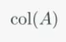
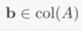
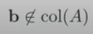
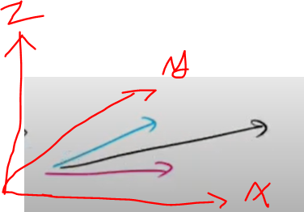
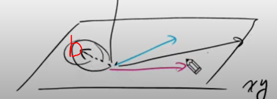

# 선형조합 (Linear Combination)
Ax는 A의 열벡터에 대한 선형조합  

## 행렬을 구조적으로 보기
행렬을 구조적으로 바라보는 가장 효과적인 방법은 **행렬을 열벡터의 리스트**로 보는 것이다.  
```
    | a11 a12 a13 |
A = |   .   .   . | = | a1 a2 a3 |
    | an1 an2 an3 |
```
ai는 행렬 A의 i번째 열벡터를 의미한다. 각 열벡터는 m-벡터이기 때문에, m x n 행렬은 m-벡터가 n개라고 해석하면 된다.  

## 행렬@벡터 연산을 구조적으로 보기
이제, Ax를 다음과 같이 구조적으로 볼 수 있다.  
Ax는 행렬 A가 가지고 있는 열벡터의 선형조합이다.  
```
     | a11 a12   . a1n | |x1|                   |x1|                                |a11|      |a12|           |a1n|
Ax = |   .   .   .   . | | .| = | a1 a2  . an | |  | = x1a1 + x2a2 + .. + xnan = x1 |  .| + x2 |  .| + .. + xn |  .|
     | am1 am2   . amn | |xn|                   |xn|                                |am1|      |am2|           |amn|
```
선형대수에서는 이처럼 벡터들에 대한 가중치 합을 선형조합이라고 부른다.  

## 선형시스템 Ax = b를 선형조합 관점에서 바라보기
```
linear system)
|-1  3  2| |x1|   | 1|
| 1  2 -3| |x2| = |-9|
| 2  1 -2| |x3|   |-3|

좌항 - 선형조합으로 해석한 Ax)
   |-1|      | 3|      | 2|
x1 | 1| + x2 | 2| + x3 |-3|
   | 2|      | 1|      |-2|
   
우항 - b)
| 1|
|-9|
|-3|

해 (solution) - consistent)
    | 2|
x = |-1|
    | 3|
```
행렬 A의 열벡터를 가중치합으로 선형조합할 때 벡터 b를 만들 수 있는 가중치 조합이 존재한다면
선형시스템 Ax = b의 해는 존재한다. 그 해는 가중치 xi들로 구성된 x이다.

```
|-1  3  2| |x1|   | 1|
| 1  2 -3| |x2| = |-9|
| 0  0  0| |x3|   |-3|

선형조합으로 해석)
   |-1|      | 3|      | 2|   | 1|
x1 | 1| + x2 | 2| + x3 |-3| = |-9|
   | 0|      | 0|      | 0|   |-3|
   
x1*0 + x2*0 + x3*0 = -3 을 만족할 수 없다.
```
다음과 같은 선형시스템은 해가 존재하지 않는다. (inconsistent)  

## 열 공간 (Column Space)
행렬 A의 열벡터들에 대한 가능한 모든 선형조합의 결과를 모아 집합으로 구성할 수 있을 것이다. 
이를 집합을 column space라 한다.  

-> 열 공간은 Ax = b 선형시스템에서 행렬 A로 b를 도출해낼 수 있는 행렬 A의 조합(경우)을 의미한다.

* 열 공간 표기  
    
  

* Consistent Linear System  
  선형시스템 Ax = b가 해를 가지면(consistent) 다음을 만족한다.  
  
  

* Inconsistent Linear System  
선형시스템 Ax = b가 해가 없으면(inconsistent) 다음을 만족한다.    
  
  
```
    |-1  3  2|
A = | 1  2 -3|
    | 2  1 -2|
    
위 행렬의 col(A)는 3차원 공간이다. 
세 개의 열벡터가 존재하기 때문에 3가지 방향으로 갈 수 있기 때문이다.
     |-1|      | 3|      | 2|
a1 = | 1| a2 = | 2| a3 = |-3|
     | 2|      | 1|      |-2|

따라서, 어떤 3-벡터 b를 이용해 선형시스템 Ax = b를 구성한다고 하더라도, 
해당 선형시스템의 해는 존재한다.
```

```
    |-1  3  2|
A = | 1  2 -3|
    | 0  0  0|
 
위 행렬의 col(A)는 xy-평면이다.
세 개의 열벡터가 z값이 0이기 때문에 xy-평면에 머물러 있기 때문이다.

     |-1|      | 3|      | 2|
a1 = | 1| a2 = | 2| a3 = |-3|
     | 0|      | 0|      | 0|
     
따라서 xy-평면을 벗어난 3-벡터 b를 이용해 선형시스템 Ax = b를 구성하면
해당 선형시스템의 해는 존재하지 않난다.
```
  
z값이 0인 열벡터 리스트

  
그림과 같이 3-벡터 b가 xy-평면상에 놓여있을 경우에만 해(x)가 존재한다.