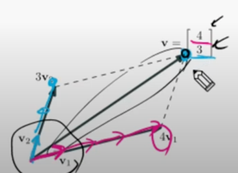
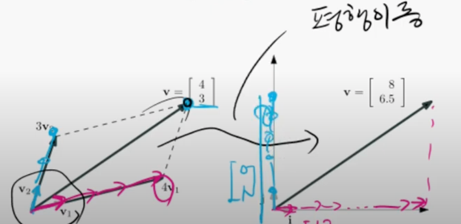
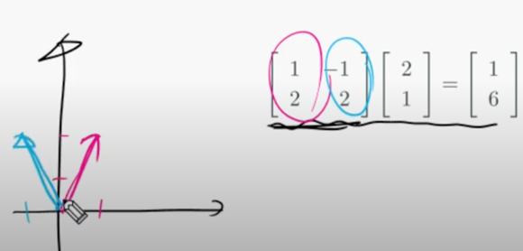
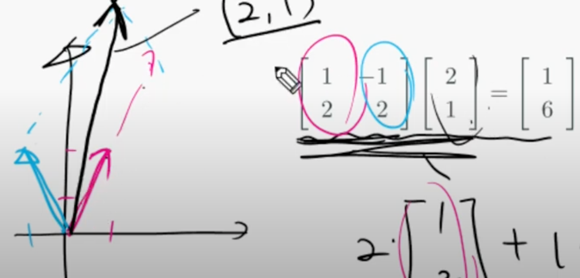
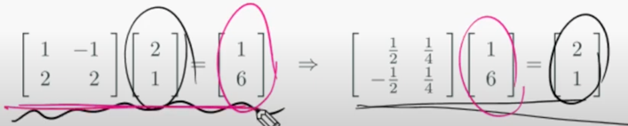
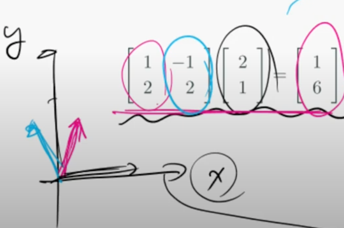
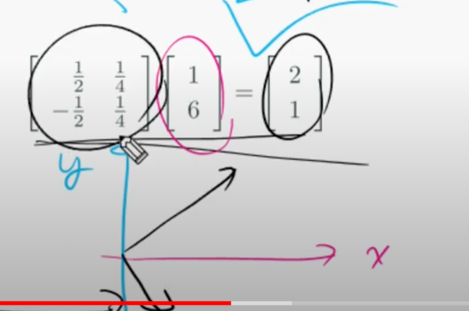

# 좌표계 변환 (Change of Basis) : 좌표계 :: 좌표값 = 행렬 :: 벡터
linear system은 Ax = b의 형태를 지니고 있다. 여기서 우리는 A를 좌표계로 해석할 것이고, x를 좌표값으로 해석하는 관점을 기를 것이다.  

## 벡터의 물리적, 수학적 표현
### 벡터의 물리적 표현
벡터는 **방향**과 **크기**(스칼라)를 동시에 지닌 개념으로 물리적으로는 화살표를 통해 그린다. 
이는 추상적으로써 이해하기에는 직관적이지만 programmable하지는 않다.  

### 벡터의 수학적 표현
물론 벡터의 덧셈같은 연산을 이해하기 위해 그림으로 표현하는 경우가 있지만 이러한 벡터들을 수치적으로 표현할 수 있어야 한다. 
그래서 **좌표계**를 먼저 도입한 뒤 **벡터의 시작점을 원점을 기준**으로 하고, 벡터의 **끝점의 좌표**를 벡터의 방향과 크기로써 정의한다.  
화살표의 길이 : 벡터의 크기  
화살표의 방향 : 벡터의 방향 (방향벡터)  

### 좌표계 (Coordinate System)
예를 들어 임의의 2-벡터가 주어져 있다고 가정하자. 이 벡터는 xy-평면상에 원점(0, 0)에서 (a, b)에 끝나느 벡터를 의미한다.
여기에는 실제로 좌표계가 숨겨져 있다. 단위행렬은 xy-직교좌표계를 의미한다.
```
    |a|   |1 0||a|    |1|    |0|
v = | | = |   || | = a| | + b| |
    |b|   |0 1||b|    |0|    |1|
```  

  
좌표계는 반드시 직교할 필요는 없다. 위 그림처럼 v1 방향벡터와 v2 방향벡터를 좌표계로써 설정할 수 있다.
이 좌표계에서 (4, 3) v 벡터는 v1 축(방향)으로 4번, v2 축(방향)으로 3번을 이동한 것이다.  
(**v = 4v1 + 3v2**)  

  
v 벡터를 직교좌표계로 평행이동 했다고 가정해보자. 해당 벡터를 직교 좌표계에 대입한 결과 i축 방향으로 8번, j축 방향으로 6.5번에 해당하는 좌표가 나왔다.
이로써 좌표계에 따라 해당 벡터는 다른 좌표값을 가지고 있다는 것을 알 수 있다.  
(**v = 8i + 6.5j**)  

사실은 v = 4v1 + 3v2는 linear combination(선형조합)의 형태를 띄고있다. (v1과 v2의 가중치 곱의 합)  
```
        |4|         |a|
|v1 v2| | | = |v| = | |    <--->       v = 4v1 + 3v2
        |3|         |b|
              
              행렬          <---->      선형조합
```

```
        |4|                                          |a|
|v1 v2| | |                            =     |e1 e2| | | 
        |3|                                          |b|

v1과 v2를 기저(basis)로 가지는 좌표계        =    e1(1, 0)과 e2(0, 1)을 기저(basis)로 가지는 좌표계
```

  
실제로 임의의 좌표계를 그려보면 다음과 같이 표현할 수 있다.
빨간색 열 벡터를 직교좌표계 기준으로 그려보면 (1, 2)의 벡터를 얻을 수 있다.
파란색 열 벡터를 직교좌표계 기준으로 그려보면 (-1, 2)의 벡터를 얻을 수 있다. 
두 열 벡터를 좌표계의 축으로 적용시킬 수 있다.
    

  
**역행렬을 통해 해를 구하는 것도 좌표계 변환으로 해석**할 수 있다.  

  
xy-직교좌표계 기준에서 임의의 좌표계를 바라보면 다음과 같이 보일 것이다. 하지만..  

  
역행렬을 통해 xy-직교좌표계에서의 해를 구한다고 가정할 때에 임의의 좌표계는 그림처럼 빨간색, 파란색 축이 직교좌표계처럼 보일 것이고, 
실제 x, y축은 역행렬에 의해 (1/2, -1/2), (1/4, 1/4) 벡터로 보일 것이다. (상대적인 개념)  

정리하자면, 해를 구하는 과정은 임의의 좌표계에서 **실제좌표계(xy-직교좌표계) 역행렬**을 **임의의 좌표계의 값**을 곱하면 나온다.  