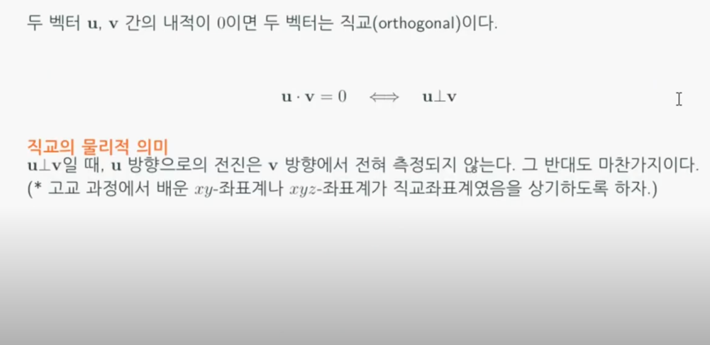
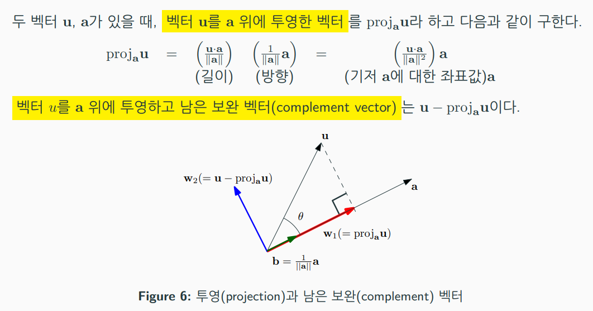
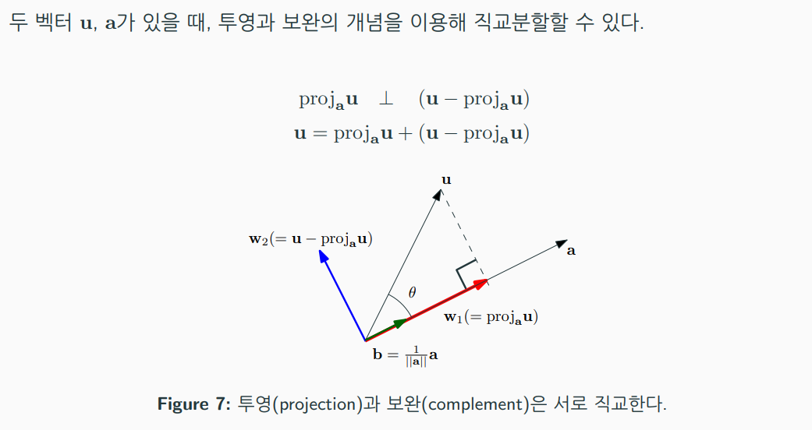
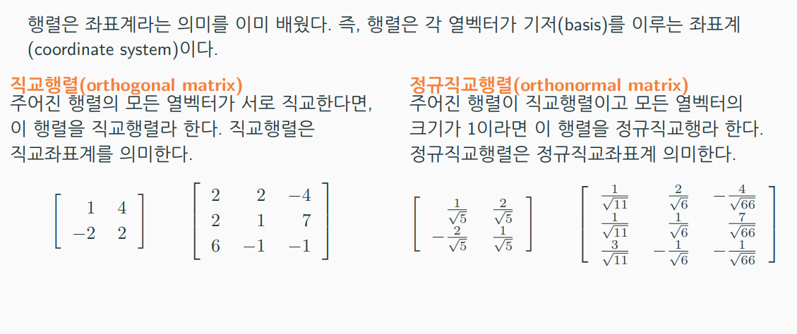
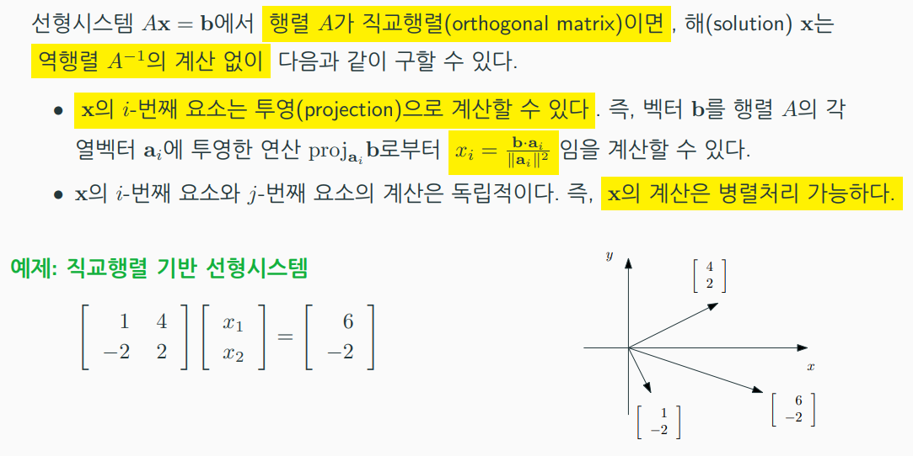
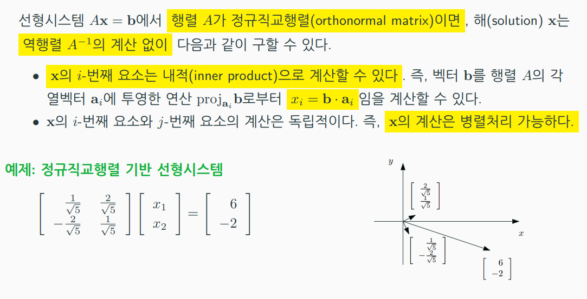
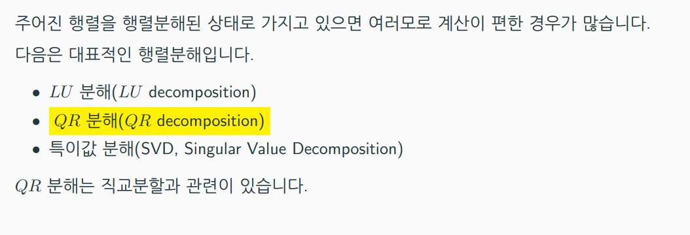
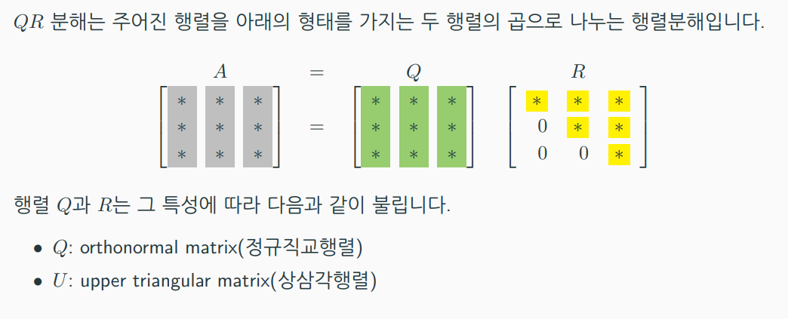
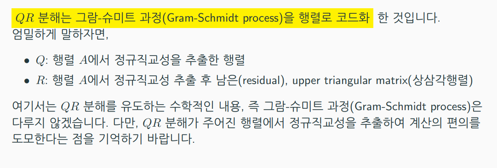
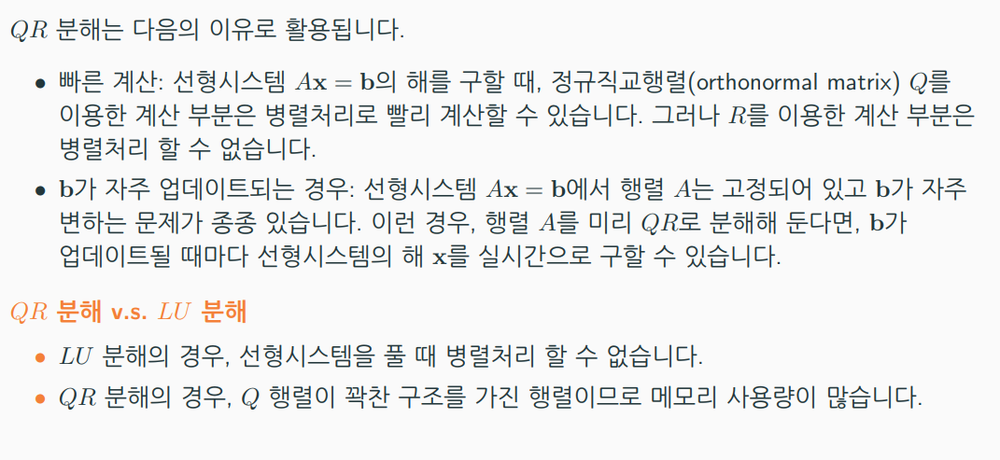

# 벡터
  
벡터는 크기(스칼라)와 방향을 지닌 물리량으로 정의된다.  
벡터의 크기는 각 요소의 제곱의 합, 방향은 해당 벡터 요소를 벡터의 크기로 나눈다(길이가 1인 방향을 지닌 단위벡터로써).  

## 벡터의 내적
  
두 벡터의 길이곱과 cos(theta)를 하게 되면 최종적으로 스칼라 형태의 산출물이 나온다. 내적은 코사인 법칙을 사용하여 유도할 수 있다.  

  
theta가 90도일 경우 코사인 값은 0을 띄기 때문이다.  

## 투영 (Projection)
  
벡터 u를 벡터 a에 투영(projection)하고, 두 벡터의 **차의 벡터는 투영벡터와 직교**하는 성질을 지닌다.  
|u| x |a| x cos(theta) / |a|

  
벡터 u를 **투영벡터와 보완벡터로 분리**하는 것을 QR 분해라고 한다.  

## 직교 행렬  
  
직교 행렬은 좌표계의 기저 벡터들이 서로 직교하는 경우를 의미한다. 
그리고, 정규직교행렬은 각 기저 벡터들의 크기가 1로 정규화된 좌표계를 의미한다.  

  
직교 행렬 좌표계일 경우 특정 벡터를 투영하여 해당 벡터의 좌표값을 파악할 수 있으므로, 좌표계에 대한 역행렬을 구할 필요가 없다.
해당 벡터를 직교하는 각 기저벡터에 병렬적으로 투영하면 좌표값을 더욱 빨리 계산할 수 있다.  

  
정규직교행렬의 경우 벡터 a의 크기는 1이기 때문에 분모로 나눌 필요도 없다.  

# QR Decomposition  
  
  
  
  
  
