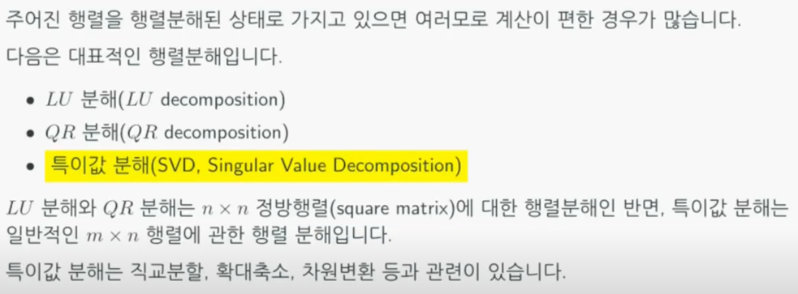
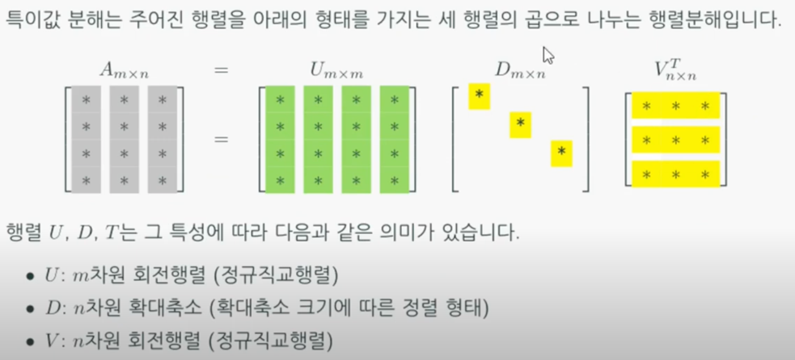
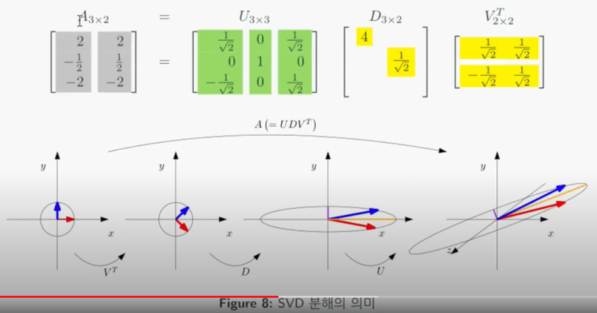
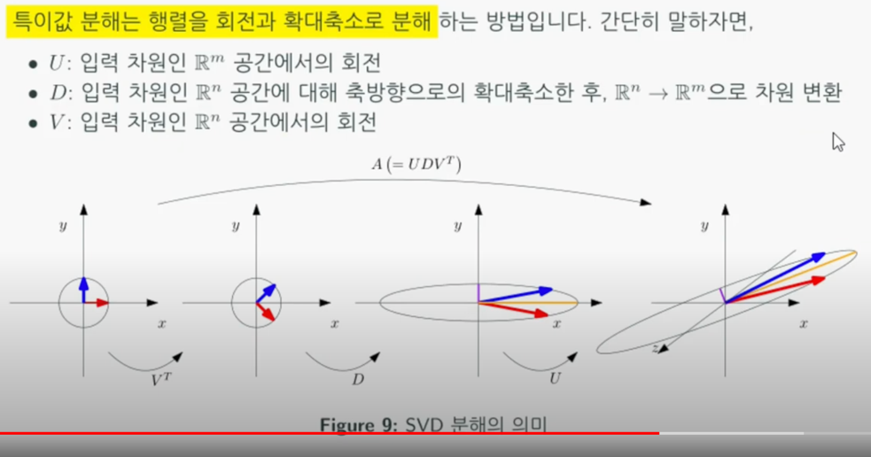
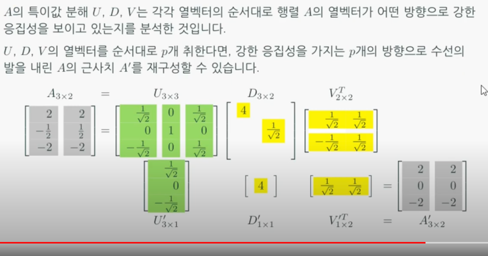
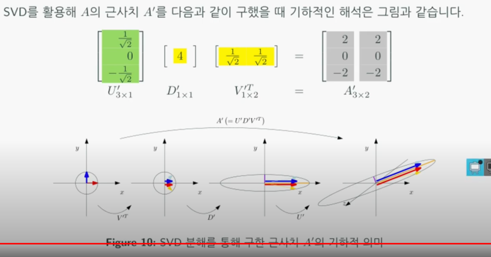

# SVD (Singular Value Decomposition)
## 행렬분해
  
확대축소 : 각 축에 대해 확대, 축소  
차원변환 : 선형시스템은 m x n 행렬 A와 n x 1 행렬 x가 곱해져 m x 1 행렬 b가 나온다.
즉, n x 1 행렬을 input으로 하여 m x 1 행렬이 output으로 나와 차원이 변하는 것을 의미한다.

## 특이값 분해
  
행렬은 오른쪽에서 왼쪽으로 읽어야한다. (연산되는 순서가 오른쪽에서 왼쪽)  
V : 직교행렬  
D : Diagonal 이외의 요소는 0, 각각의 축에대해 얼마나 확대 및 축소가 되는지 알려준다. 정렬되어 있는 상태 (대각선의 첫번째 요소가 가장 확대축소 범위가 크다. 내림차순)
n차원을 입력으로 받아 m차원을 출력으로 한다.  
U : 직교행렬  
정리 : n차원에서 회전 -> 확대/축소 -> m차원에서 회전  

## SVD 예제
  
  

## SVD 활용
  
D 행렬의 요소중 가장 큰 대각선의 요소와 U, V 행렬에서 그에 상응하는 벡터를 뽑아서 내적 연산을 수행하면
원래 행렬과 같은 모양의 행렬이 나오게된다. 이 행렬은 가장 강한 반응성 (가중치가 높은) 요소끼리의 연산을 수행한 결과이므로
가중치가 높은 특징을 걸러낼 수 있다.  

