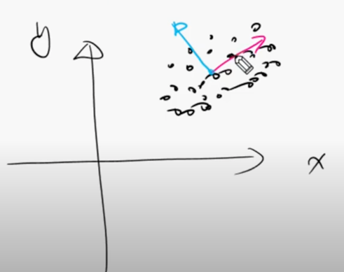
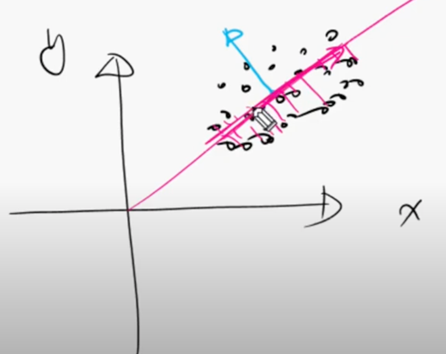
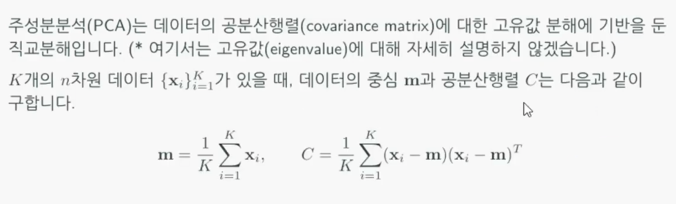
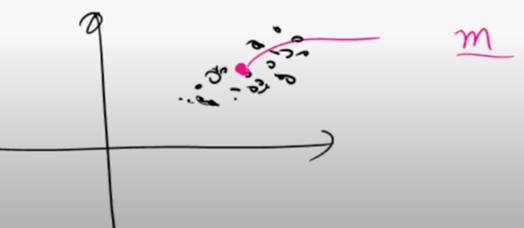
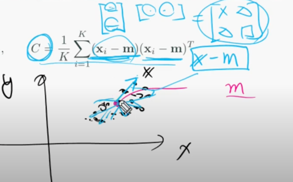
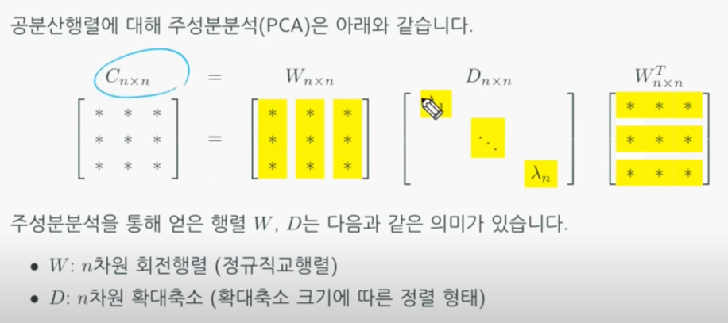
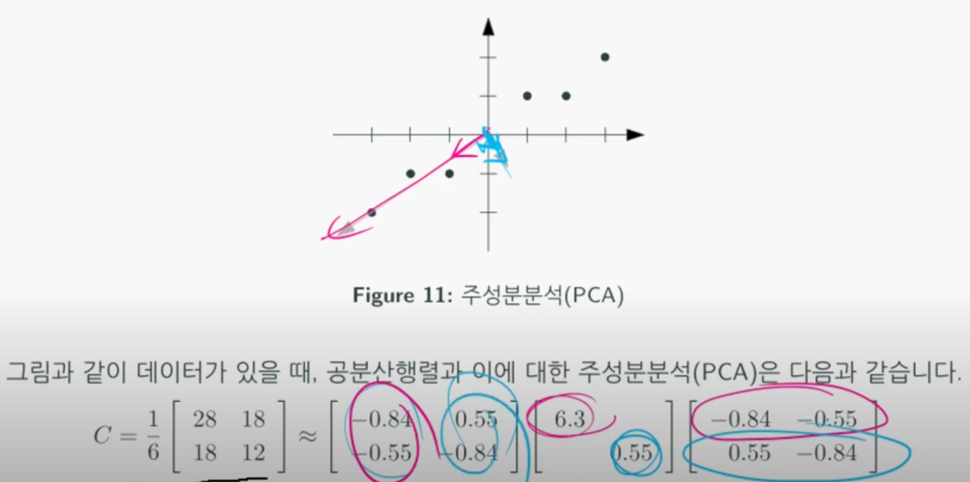

# PCA (주성분분석, Principal Component Analysis)
주성분분석은 다수의 n차원 데이터에 대해, 데이터의 중심으로부터 데이터의 응집력이 좋은
n개의 직교방향을 분석하는 방법이다.  
  
위와 같이 2차원 공간에 데이터가 있다고 가정해보자. x, y축으로써 데이터를 표현하는 것보다
데이터의 중심으로부터 원점을 지정하고, 빨간색 축의 방향으로 응집력이 강하고, 파란색 축은 상대적으로 약하지만
빨간색 축과 직교해있으면 데이터를 표현하기 쉬울 것이다.  

  
만약 파란색 축의 데이터가 중요하지 않고 빨간색 축의 데이터만 반영하고 싶을 때는 데이터들을
빨간색 축에 projection하면 된다.  

  
  
우선 데이터들의 평균 m을 구한다.  

  
파란색 벡터를 구한다. 특정 데이터 xi가 있다면 파란색 벡터는 (xi - m)이 된다.
그리고 파란색 벡터를 행렬화 하기 위해 해당 벡터의 transpose를 곱한다. 이렇게 나온 모든 파란색 행렬들의 평균을 **공분산 행렬**이라고 하며
공분산 행렬은 **데이터의 분산**(평균으로부터 퍼져있는 정도)을 의미한다.  

  
매커니즘은 SVD와 비슷하다. 하지만 다른점이 있다면 공분산 행렬은 자기 자신벡터(파란색 벡터)를 행렬화한 것이므로
정방행랼이 나온다.  
W : 정규직교행렬이기에 각 벡터들의 길이는 1, 내적하면 0이 나온다. 

## PCA 활용
  
여기서는 편의상 평균 m이 원점이라고 가정한다. 각 데이터로 향하는 벡터 xi와 평균 벡터(여기서는 (0, 0))의 차들의 합에 데이터 갯수를 나누면 공분산 행렬이 나온다.  
빨간색 열벡터와 파란색 열벡터는 서로 직교하는 길이가 1인 정규직교벡터이다.