# 벡터 공간 (Vector Space) & 최소제곱법 (Least Squares Method)
최소제곱법의 의미를 간단하게 설명하자면 inconsistent 한 linear system 는 많기 때문에
문제를 살짝 바꿔서라도 의미있게 답을 찾겠다는 의미이다.  
(행렬이 가지고 있는 표현공간에 제일 근접한 해를 찾음 - A가 표현할 수 있는 공간 (column space))  

## 집합 (set) 과 공간 (space)
### 집합 (set)
집합은 임의의 원소를 수집하여 만든 모듬이다.  
e.g) {수학, 3.14, (1, 2), 강아지}

### 연산에 닫혀있는 집합
'집합이 연산에 닫혀있다' 라는 개념이 있다. 어떤 연산을 생각한 다음, 집합에서 임의의 원소를 뽑아 연산을 수행한 결과가 여전히 집합의 원소로 있다면,
해당 집합은 연산에 닫혀있다. 즉, 집합내의 어떤 요소들끼리 특정 연산을 취해도 출력은 결국 그 집합의 원소일 때..  
e.g) 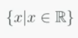 덧셈 연산에 닫혀있는 집합  
e.g) 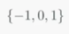 곱셈 연산에 닫혀있는 집합  

### 공간 (space)
공간은 다음의 두 연산에 닫혀있는 집합이다.
* 덧셈 연산 : 집합에서 임의의 두 원소 x, y를 뽑아 더해도 그 결과 x + y는 집합의 원소
* 스칼라 곱 : 집합에서 임의의 한 원소 x를 뽑아 임의의 스칼라 s배 한 결과 sx는 집합의 원소  

다음과 같이 n-벡터의 집합은 모두 공간이다.  
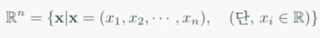  
모든 n-벡터 집합  은 n차원 벡터 공간 (vector space)라 부를 수 있다.  

### 열공간 (column space)
행렬 A의 열벡터들에 대한 가능한 모든 선형조합의 결과를 모아 집합으로 구성할 수 있을 것이다.
이들 집합을 column space라 하고 다음과 같이 표기한다.  
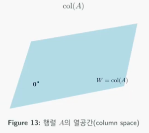  
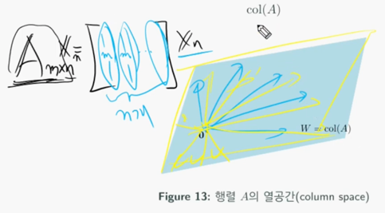  
행렬 A의 열 벡터들을 파란색 m-벡터 n개라고 가정하고, xn은 노락색 n-벡터라고 가정하자.
노란색 벡터가 내적 연산이 수행될 때 파란색 벡터 이룰 수 있는 공간이다.  

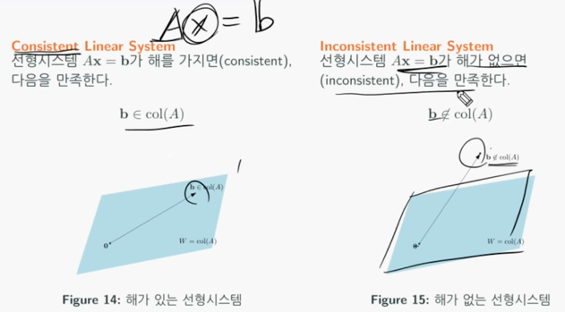  
Ax = b라는 선형시스템이 주어졌을 때, b 벡터가 열공간 내에 존재하면 임의의 xn을 행렬 A와 조합하여 해가 존재한다.
하지만, b 벡터가 열공간 밖에 존재하면 어떤 xn을 행렬 A와 조합하여도 해를 낼 수 없다. 이러한 상황에서도 해를 구하는 것이 최소제곱법이다.

## 최소제곱법 (least squares method)
선행시스템 Ax = b에 대한 해가 없음에도 불구하고, 우리가 할 수 있는 최선이 무엇인가를 생각해보자.  
행렬 A가 전의하는 열공간에서 우리의 목표 b와 가장 가까운 지점은 b를 열공간에 투영한 저점일 것이다. 즉, 달성가능한 최선의 목표 를 생각할 수 있다.  
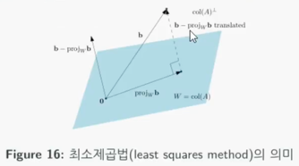  
그럼 어떻게 가장 근접한 벡터를 찾을 것인가?  
**실제 b 벡터와 투영된  벡터 사이의 거리의 제곱이 최소**가 되도록 해야한다.  

### 정리
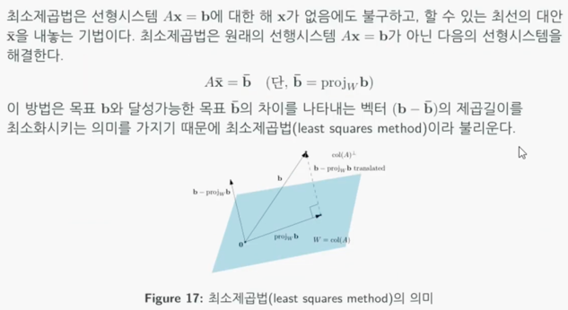

### 풀이법
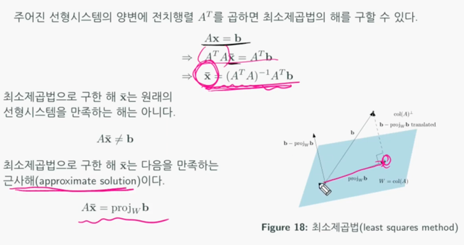  
결론부터 말하면 양변에 행렬 A의 전치행렬을 곱하면 에 도달할 수 있는 xn (근접해)를 구할 수 있다.

### 최소제곱법의 응용 : 선형회귀 (Linear Regression)
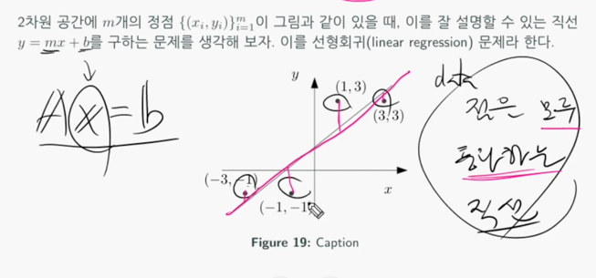  
위 그림에서 4개의 점을 모두 통과하는 선은 그릴 수 없다고 가정하고, 선형회귀는 가장 근접한 선을 긋는 것이 목적이다.

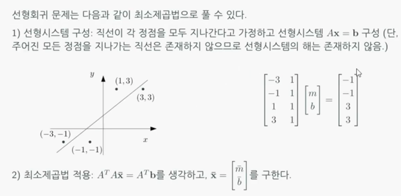  
우리는 직선을 그을 때 **y = mx + b**라고 표현한다. 그리고 각 점이 Ax = b 형의 linear system을 지난다고 가정하고 linear system을 구성한다.

### 최소제곱법 증명
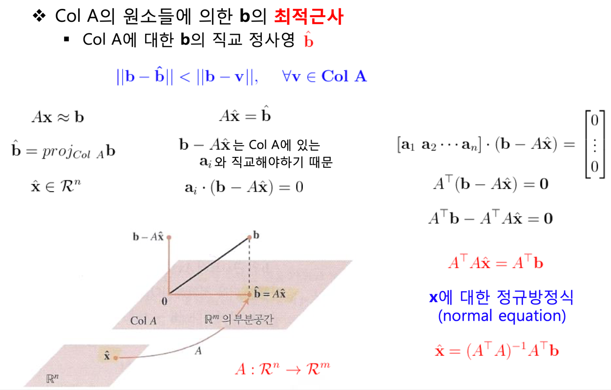