# 통계학의 기본 개념
## 통계학 (Statistics)
데이터의 수집(collect), 구성(organization), 분석(analysis), 해석(interpretation),
표현(presentation)에 관한 학문

## 통계학의 분류
* 기술 통계학 (descriptive statistics)  
  수집된 데이터를 설명하기 위한 통계학 (해석단계)
* 추측 통계학 (inferential statistics)  
  해석을 통한 데이터를 토대로 추론하는 통계학 (추론단계)

## 개념 정의
* 모집단 (population)  
  어떤 질문이나 실험을 위해 관심의 대상이 되는 개체나 사건의 집합  
  ex) 전교학생의 키
* 모수 (parameter)  
  (모집단을 하나로 표현하기 위한) 모집단의 수치적인 특성  
  ex) 키의 평균, 분산, 표준편차 ..
* 표본 (sample)  
  모집단에서 선택된 개체나 사건의 집합  
  ex) 전교 남학생
  
보통 모수를 파악하기 위해 모집단을 전부 분석하는 것이 아니라 모집단으로부터 **표본을 추출하여 모수를 추론**한다.  

## 도수 (Frequency)
어떤 사건이 실험이나 관찰로부터 발생한 횟수  
ex) 전교생의 키를 분석할 때 160~170 사이의 학생이 몇 명이 존재하는지  

### 표현방법
* 도수분포표 (Frequency Distribution Table) - 질적 데이터  
  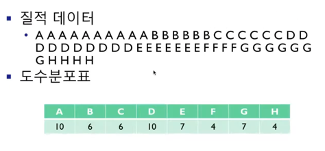  
  각 범주의 데이터가 몇번 발생했는지를 표시  
* 막대그래프 (Bar graph) - 질적 데이터  
  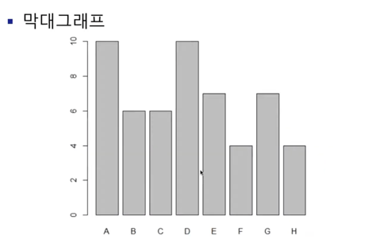  
  범주로 구분  
  ex) 남자와 여자, 소설책의 분류
* 히스토그램 (Histogram) - 양적 데이터  
  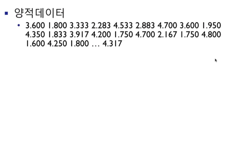  
    
  숫자의 **구간**으로 구분, 구간을 먼저 설정해야 한다.  
  ex) 남학생의 키
  
* 줄기-잎 그림 (Stem and Leaf Diagram) - 양적 데이터  
  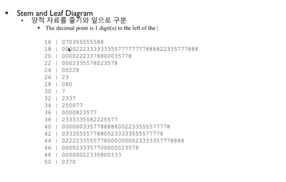  
  앞부분은 stem (구간의 역할을 하는 줄기), 뒷부분은 leaf (해당 구간의 세부데이터 역할을 하는 잎)  
  ex) 16이라는 구간은 18전까지를 의미한다. (1.6~1.7)

## 상대도수 (Relative Frequency)
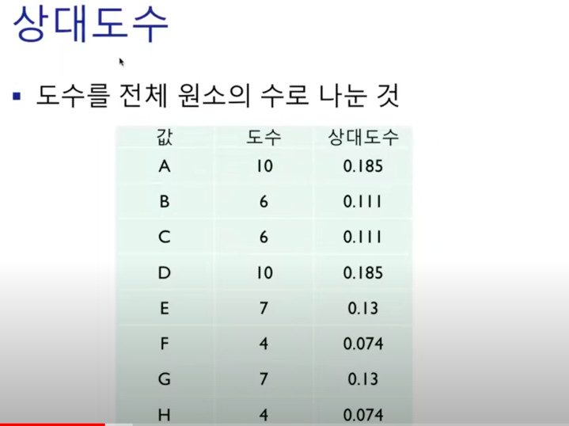  
위 그림에서 도수의 총합은 54이다. 도수를 상대도수로 표현하면 다른 도수와의 비율을 상대적으로 파악하기 쉽다.

## 평균 (Mean)
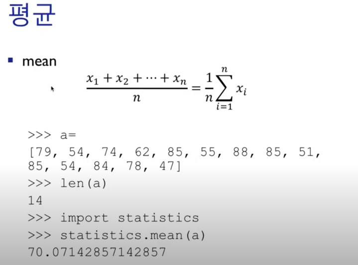  
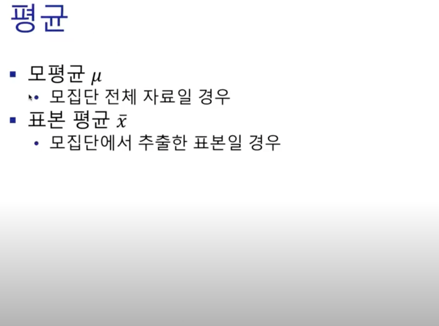  
평균은 **모평균**과 **표본평균**으로 나눌 수 있다. 
모평균은 모집단으로부터 추출한 평균값을 의미하고, 
표본평균은 모집단으로부터 추출한 표본집단의 평균값을 의미한다.

## 중앙값 (Median)
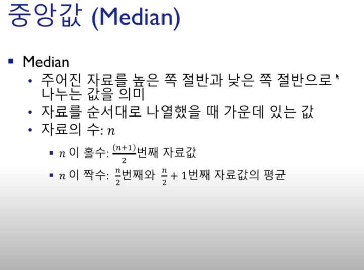  
평균값은 **극단적으로 크거나 작은 값에 영향을 많이 받는다.** 이러한 단점을 보완할 수 있는 개념이 중앙값이다.
데이터의 수가 짝수개일 경우 n/2번째 값과 n/2+1번째 값의 중앙값이 된다.  
데이터의 수가 홀수개일 경우 (n+1)/2번째 값이 된다.

## 분산 (Variance)
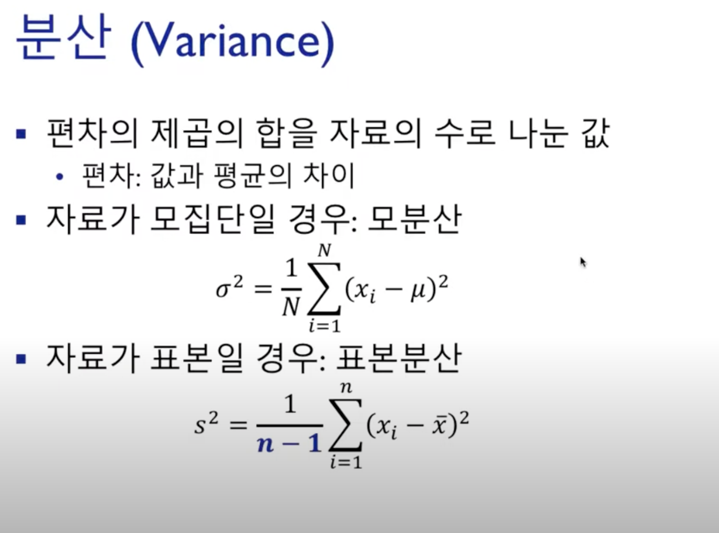
값이 어느정도 퍼저있는 지를 **산포**라고 표현한다. 산포를 정량적으로 표현할 수 있는 방법이 **분산**이다.  
표본분산에 n-1을 나누는 이유 : https://m.blog.naver.com/95khc/220282362093  

## 표준편차 (Standard Deviation)
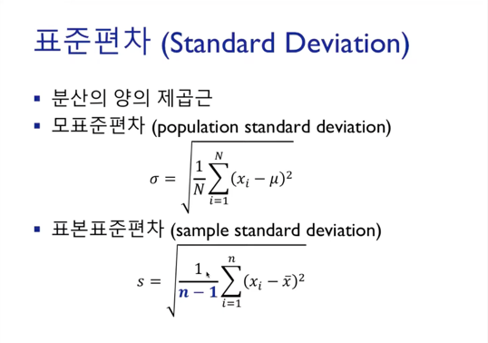  

## 범위 (Range)
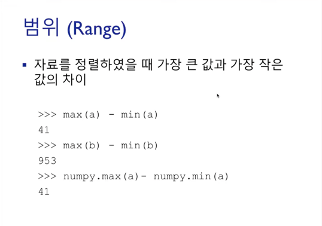  

## 사분위수 (Quartile)
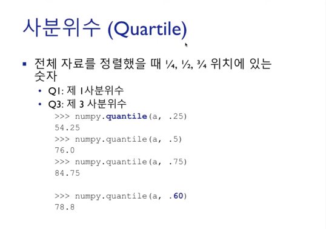  
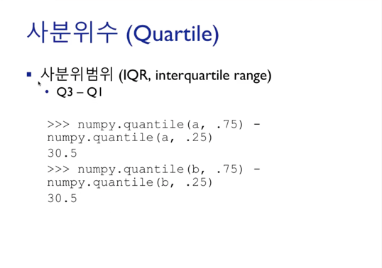  

## z-score
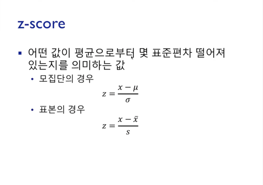