# 확률
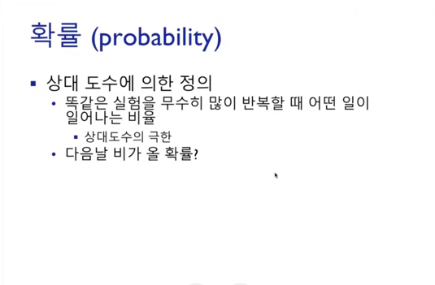  
데이터를 토대로 추론을 할 때 그 추론의 정확성을 파악하기 위함이다.  

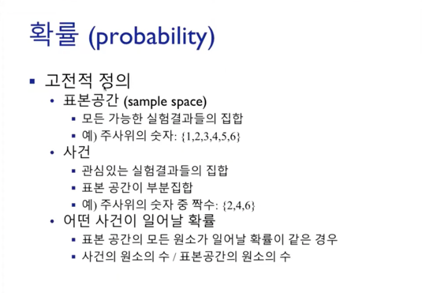  
사건은 표본 공간의 부분집합이다.  
(사건의 원소 수 / 표본공간의 원소 수) : **표본 공간의 모든 원소가 일어날 확률이 같은 경우**라는 전재가 깔려야 유의미한 공식이 된다.

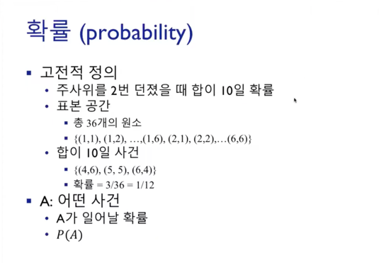  
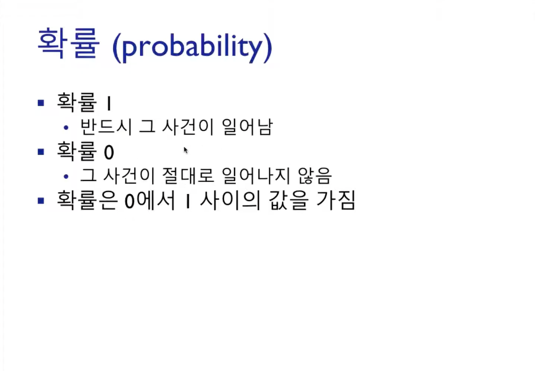

## 확률의 계산
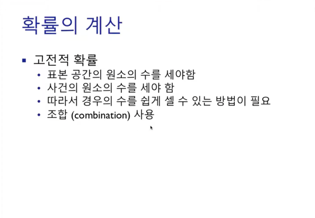  
**조합**을 사용하여 경우의 수 계산을 편하게 한다.  

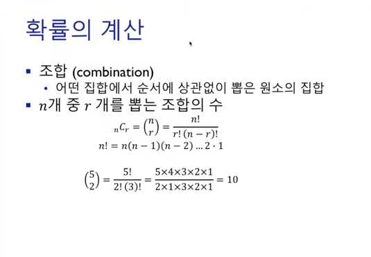  
ex) 1~10 까지의 공에서 두번을 뽑았을 때, 1과 3을 뽑을 확률 (1, 3으로 뽑든 3, 1로 뽑든 상관없음)
10C2

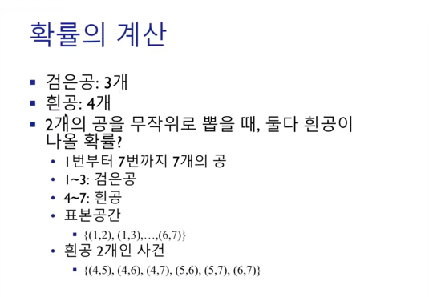  
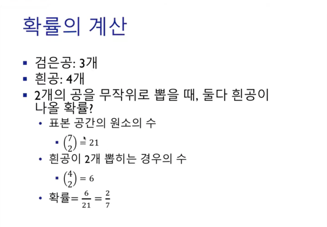

> 검은공 하나, 흰공 하나일 확률은?  
(3C1 * 4C1) / 7C2  
> (검은공에서 뽑는 경우의수 * 흰공에서 뽑는 경우의수) / (전체에서 2개 뽑는 경우의수)

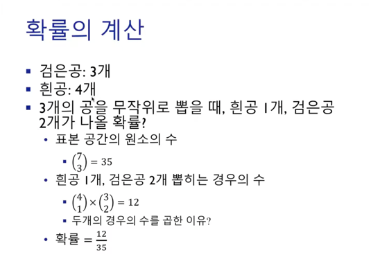  

## 덧셈법칙
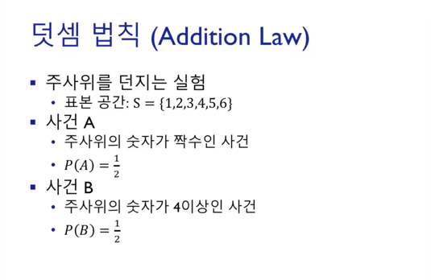  
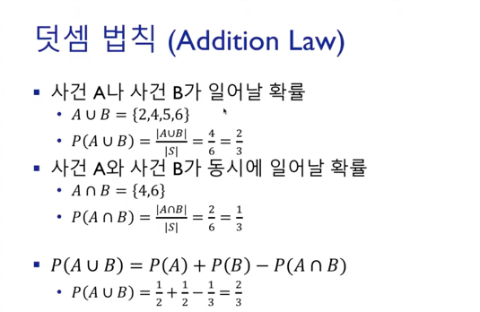  
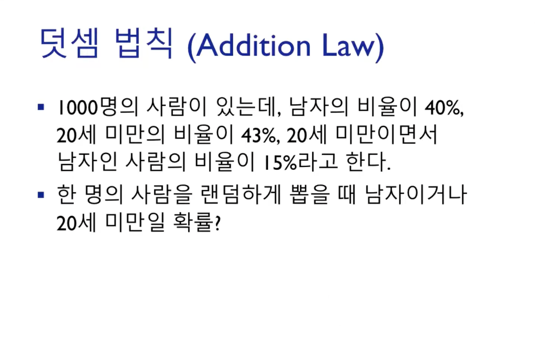  
P(남자) = 0.4 / P(20세 미만) = 0.43 / P(남자 and 20세 미만) = 0.15  
P(남자 or 20세 미만)  
= P(남자) + P(20세 미만) - P(남자 and 20세 미만)  
= 0.4 + 0.43 - 0.15  
= 0.68

## 서로 배반
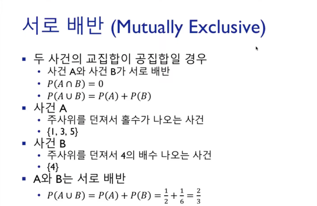  
집합 간에 겹치는 부분이 없는 경우 
**하나의 사건에 대해 공통분모가 없는 경우**

## 조건부 확률
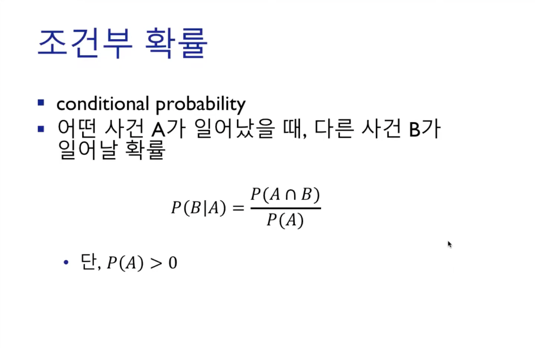  
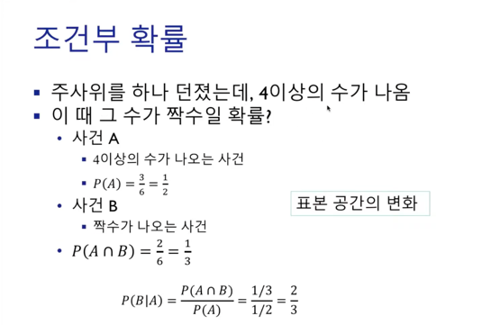  
표본공간의 변화 : 전체표본공간(1, 2, 3, 4, 5, 6) -> 4이상의표본공간(4, 5, 6)  
사건 A가 발생할 것을 전재로 깔기 때문에 분모에 P(A)가 온다.  
A와 B가 동시에 일어날 확률 / A가 일어날 확률

## 곱셈법칙
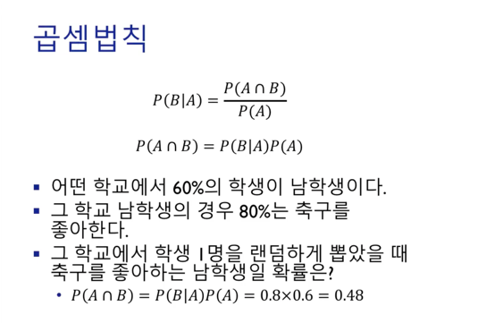  
P(남자) = 0.6 / P(남자 bar 축구) = 0.8  
P(남자 and 축구)  
= P(남자) * P(남자 bar 축구) = 0.8 * 0.6  
= 0.48

## 서로 독립
  
**A가 일어났을 때 B가 일어나는 확률**이랑 **A가 일어나는 안일어나든 B가 일어날 확률**이랑 같음을 의미.  
**하나의 사건이 다른 사건에 영향을 주지 않음.**  
P(B bar A) = P(A and B) / P(A) = P(B)  
P(A and B) = P(A) * P(B)

## 여사건
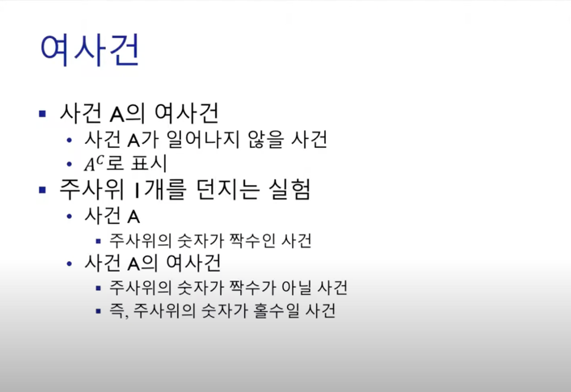  
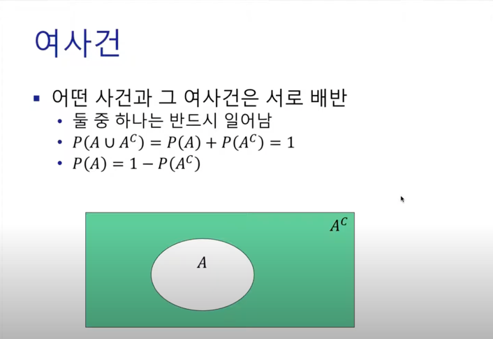  

## 확률의 분할법칙
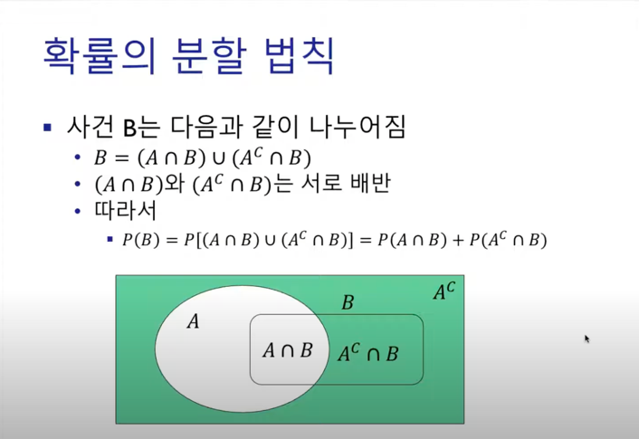  
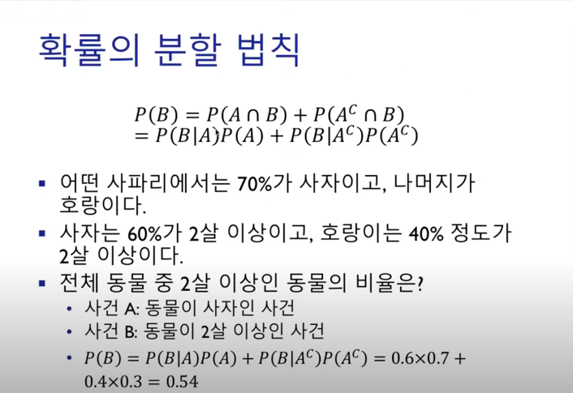  

## 베이즈 정리
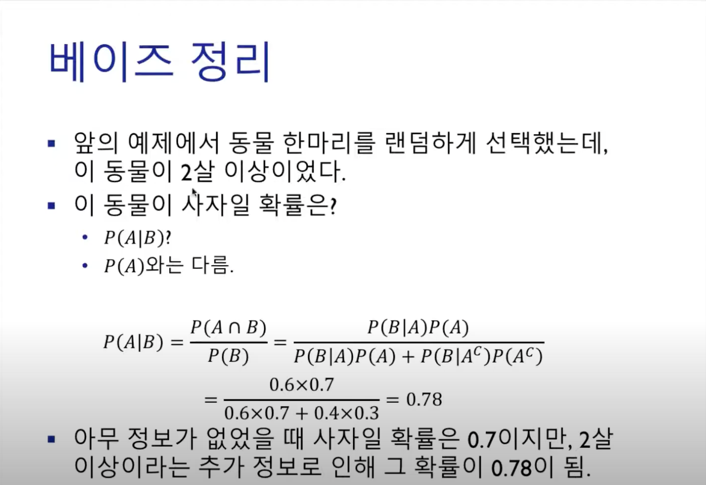  
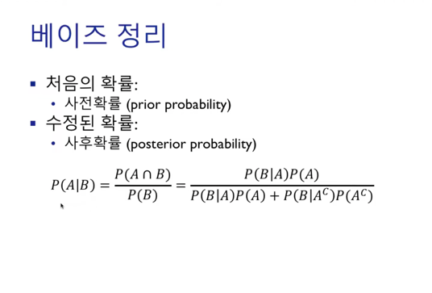  
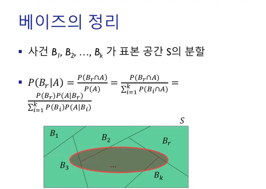  
2살 이상인 동물을 선택했을 때 그것이 사자일 조건부확률  
사전확률 : P(A)  
사후확률 : P(A|B)  
사후확률과 사전확률의 관계를 정의하기 위한 개념.  
사전확률에 증거(Evidence)가 추가되며 확률이 갱신됨.

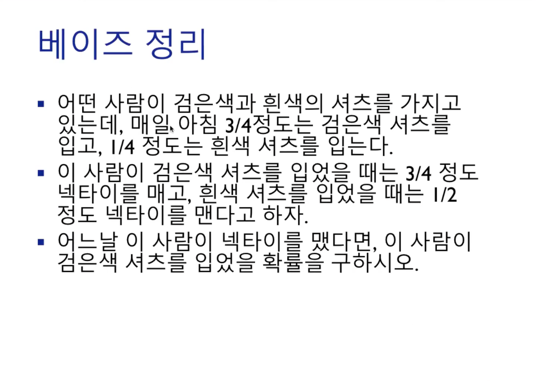  
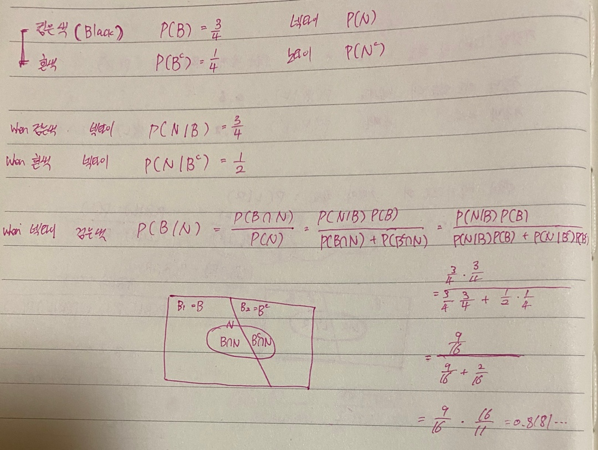

## 확률 변수 (random variable)
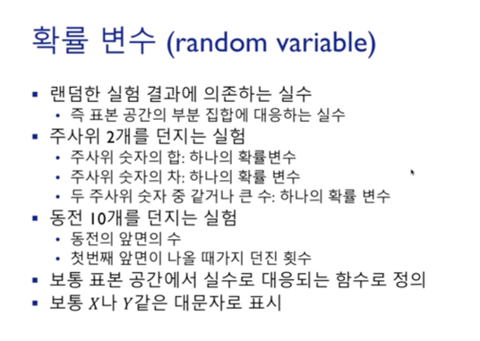  
확률변수는 표본공간에서 랜덤하게 추출한 요소중 특정 조건을 만족하는 것(관계)을 정의해두는 것을 의미한다.  
**확률변수는 실수다.**

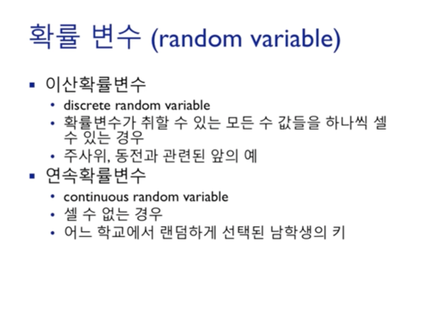  
이산확률변수 : 관계로 정의된 요소들의 값 범위(도메인)가 이산적으로 떨어져있는 경우 (불연속성)  
연속확률변수 : 관계로 정의된 요소들의 값 범위(도메인)가 연속적으로 구성되어 있는 경우

## 확률 분포 (Probability Distribution)
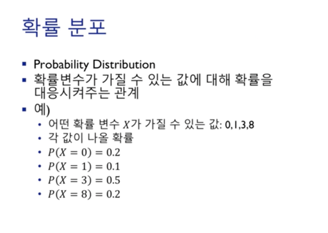  
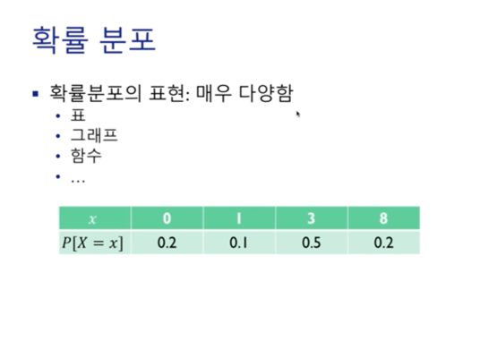  
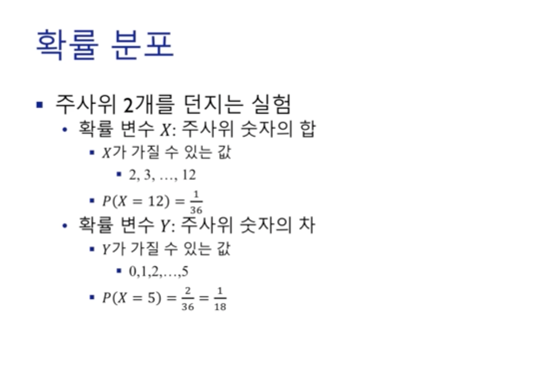  
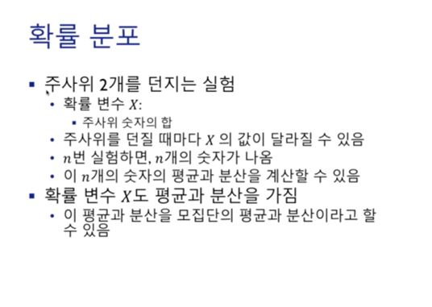  
표본평균과 표본분산이 모평균과 모분산에 대응.

## 이산확률변수
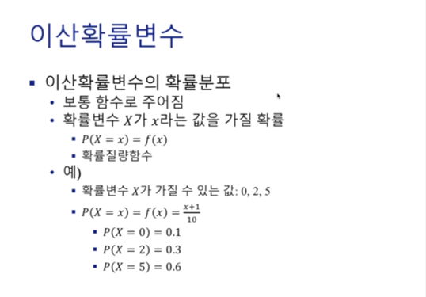  
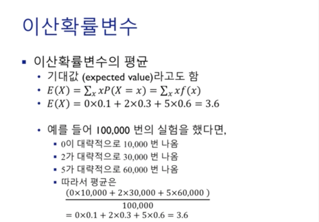  
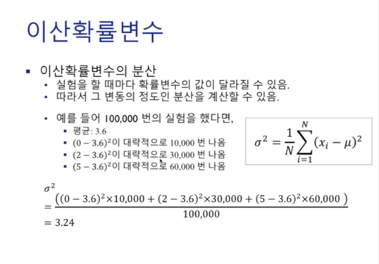  
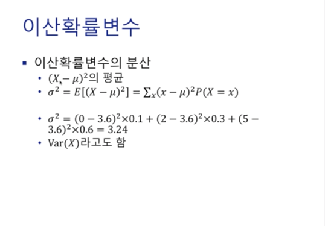  
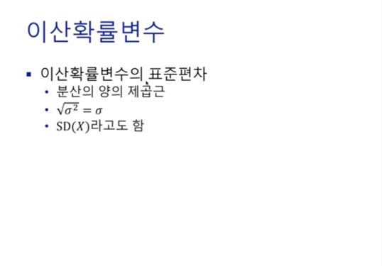  
  
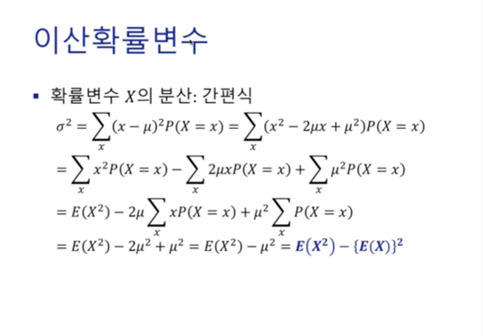

## 결합확률 분포
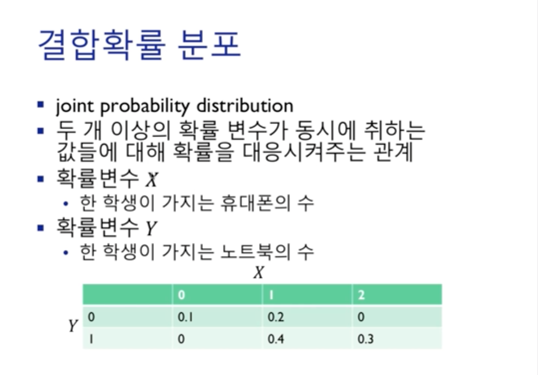  
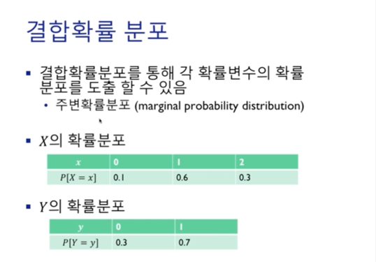  
주변확률 분포를 도출하려면 다른 확률변수를 무시하고 다 더하면 된다.  
예를 들어, X의 확률 분포를 구한다고 가정하면  
x = 0 : 0.1 + 0 = 0.1  
x = 1 : 0.2 + 0.4 = 0.6  
x = 2 : 0 + 0.3 = 0.3  

Y의 확률 분포를 구할 때는  
y = 0 : 0.1 + 0.2 + 0 = 0.3  
y = 1 : 0 + 0.4 + 0.3 = 0.7  

## 공분산
  
두 개의 확률분포가 어떤 관계를 가지고 있는지 확인할 수 있다.  
(X - E(X))(Y - E(Y))가 양일 가능성이 높은 이유는 키가 크면 몸무게가 그에 비례하기 높을 가능성이 크기 때문이다. (키가 평균보다 클 경우)  
반면, (X - E(X))(Z - E(Z))가 양과 음이 될 가능성이 반반인 이유는 키와 성적은 관련이 없기 때문이다.  

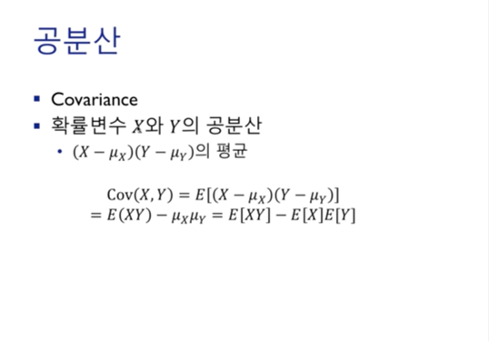  
공분산의 값이 0에 가까울수록 두 확률변수는 관련이 없다.  
관련없는 두 확률변수의 편차의 곱(X - E(X))(Z - E(Z))(X - E(X))(Z - E(Z))은 양과 음이 될 가능성이 반반이기 때문에 평균은 0이 되기 때문이다.  

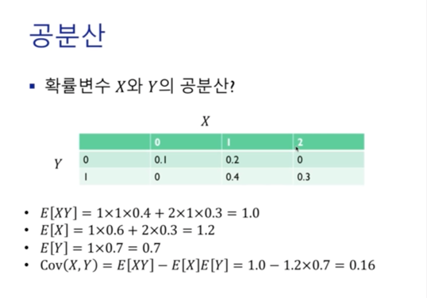  
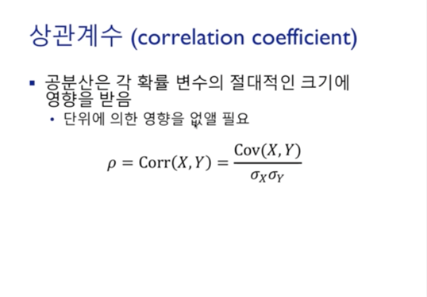  
공분산은 확률변수의 크기가 급격하게 커지면 영향을 받을 수 있다. 
예를 들면, 위에 표는 X의 확률 변수는 0, 1, 2지만 0, 100, 200일 경우 1x100x0.4 + 1x200x0.3 ..  
이러한 영향을 없애주기 위해 일종의 정규화과정을 거쳐야 한다. 확률변수가 크면 표준편차도 크게 나올것이기 때문에 이러한 영향을 상쇄시켜줄 수 있다.  

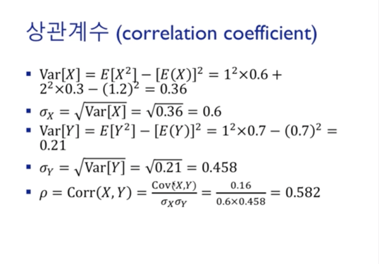