# 확률분포
## 이항분포
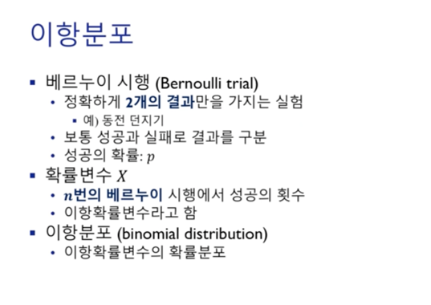  
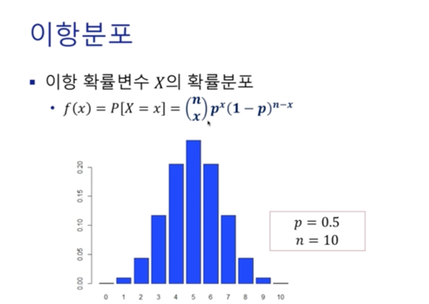  
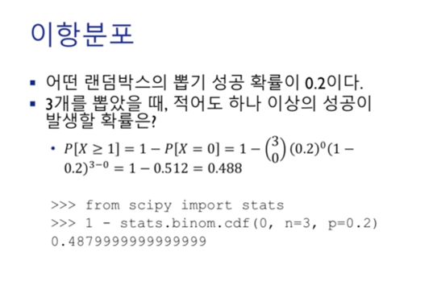  
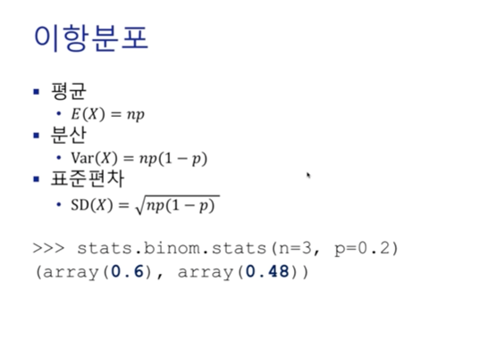

## 정규분포
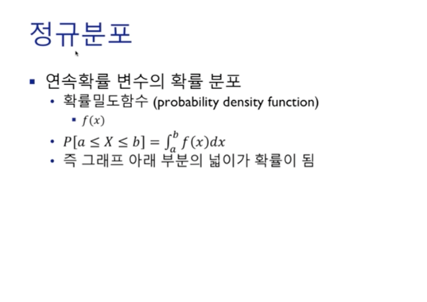  
연속확률분포는 셀 수 없기 때문에 적분을 통해 도출된 면적을 확률로 해석한다.
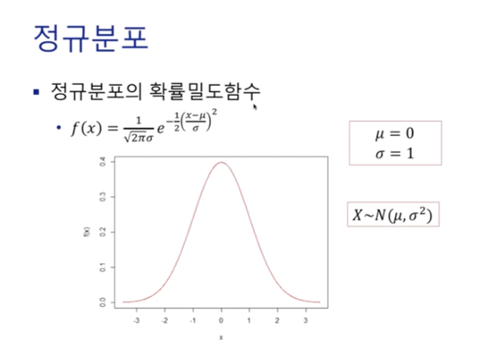  
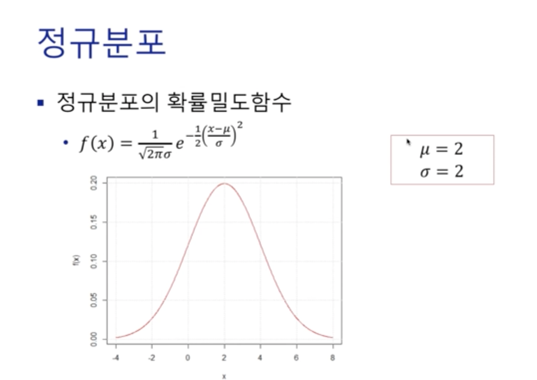  
확률밀도함수로써 가장 많이 사용되는 것이 정규분포이다. 해당 함수는 적분을 통해 확률을 계산하는것 보다는 표준정규분포표를 봐야한다.  
X~N(평균, 분산)  

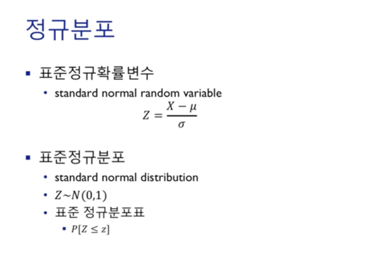  
Z 정규화, X는 정규확률분포를 따르는 확률변수를 의미한다. 뮤는 평균, 시그마는 표준편차이다. Z 정규화를 하게되면 **평균이 0, 분산이 1**인 확률밀도함수(표준정규분포)로 변형된다.  
확률을 확인하기 위해 표준정규분포표를 참고하면 된다.  
ex) 0.75는 0.75보다 작을 확률을 의미한다.  

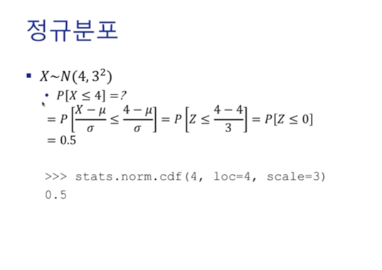  
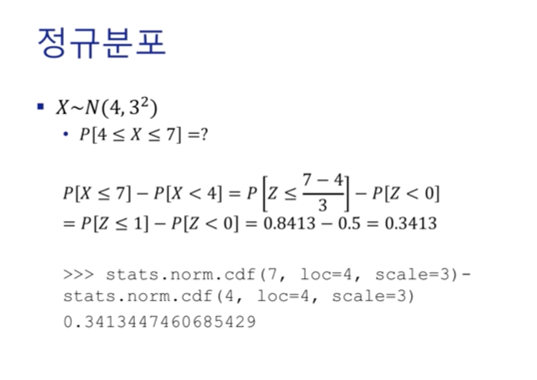  
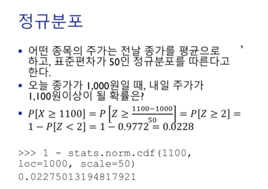  

## 이산확률분포 - 포아송(Poisson) 분포
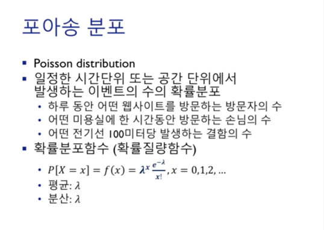  
임의의 시공간 표본공간에서 발생하는 이벤트의 확률분포 (이산확률분포)  
**포아송 분포는 평균과 분산이 동일하다.**  

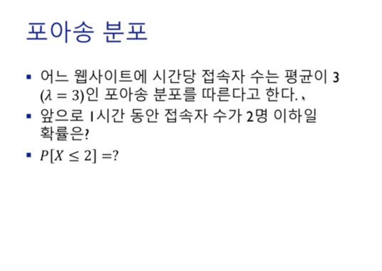  
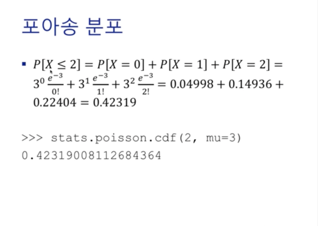

## 연속확률분포 - 지수분포
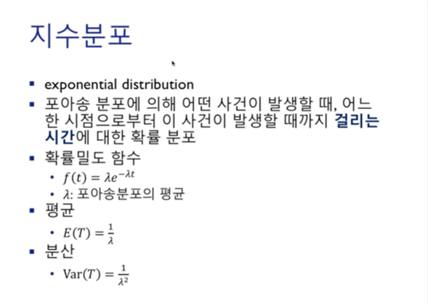  
웹 사이트를 열고 한 시간동안 평균 3명이 오는데 반드시 20분 간격으로 1명씩 오는 것은 아니다.
경우에 따라 5분, 30분간격으로 올 수도 있다.  
람다가 3일 때 20분마다 한명이 오는것이기 때문에 1/3이 평균이 된다. (일반적으로 20분 간격 꼭은 아님.)  

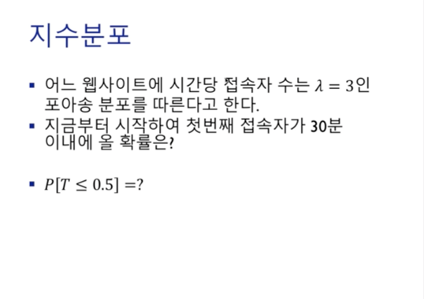  

# 표본분포
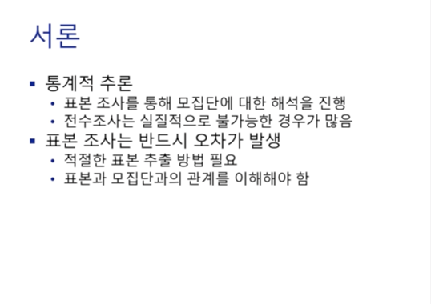  
표본분포는 표본을 모집단으로부터 무엇을 추출하느냐에 따라 달라지기 떄문에 표본조사에는 **오차가 반드시 발생한다.**  

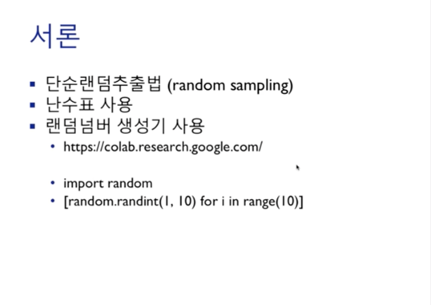  
표본을 추출하는 데에는 다음과 같은 방법들이 있다. 단순랜덤추출법은 말그대로 모집단중에서 임의의 원소를 난수표를 통해 선택하는 것이다.  

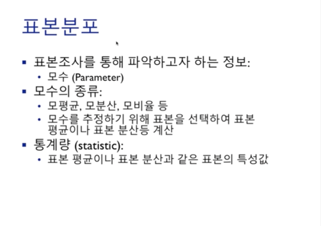  
표본을 추출하고 분석하여 모수(모평균, 모분산, 모비율 등)를 알아내야 한다. (표본조사를 통해 나온 통계량(평균과 분산)을 통해 모수(모평균과 모분산)을 예측)  

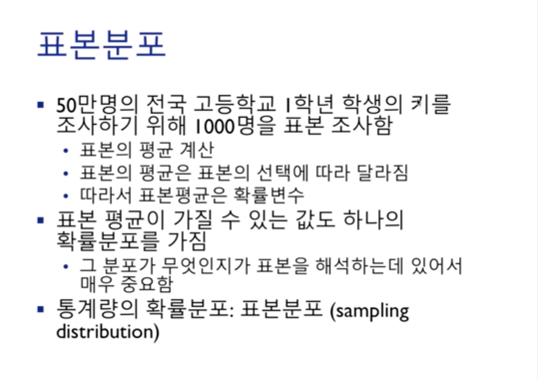  
표본조사를 통해 나온 통계량 또한 어떤 분포(**표본분포**)를 따른다.  

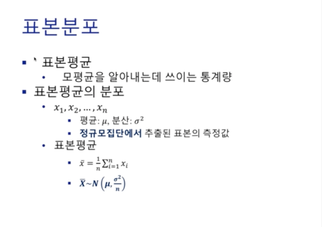  
**표본평균은 평균이 뮤(모집단의 평균)이고, 분산이 n분의 시그마 제곱(모집단의 분산)인 정규분포를 따른다.**  

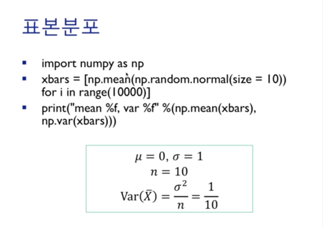  
np.random.normal : normal distribution (평균 0, 분산 1인 정규분포), size=10 : 표본의 원소 10개 (n이 10)  
원소가 10개인 표준정규분포의 평균을 1만번 측정한 것의 평균을 재봤을 때 0, 0.1에 근사한 값이 나온다.

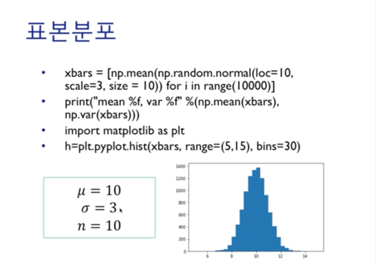  
이번에는 평균을 10, 분산을 3으로 한 경우이다. 표준정규분포의 평균은 10, 분산은 0.9 (3*3/10)  

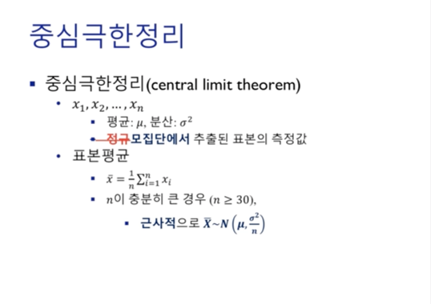  
모집단의 분포가 정규분포가 아닌 다른 분포일 수도 있다. 이럴 때 사용할 수 있는 정리가 **중심극한정리**이다.
**n이 충분히 큰 경우에는 표본분포는 근사적으로 정규분포를 따를 수 있다**는 내용이 중심극한정리이다.  

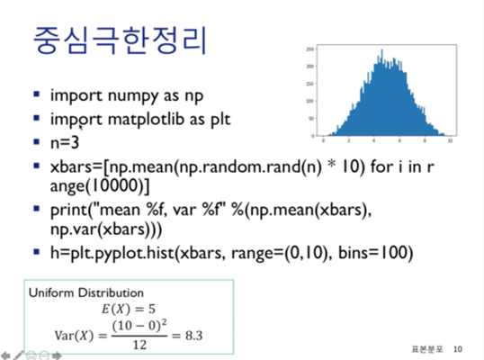  
np.random.normal이 아닌 np.random.rand일 경우 Uniform Distribution을 따르게 된다.
Uniform Distribution은 0~1 사이의 숫자를 리턴한다. np.random.rand(n)의 경우 0~1사이의 숫자 n개를 리턴한다.
np.random.rand의 리턴 타입은 numpy array이기 때문에 *10 을 하게 되면 리스트와는 다르게 브로드캐스팅 연산이 적용된다.
(0~10), bins는 몇개의 구간으로 쪼갤건지 나타내는 인자이다.  
uniform distribution의 분산값 : (b-a)^2 / 12
표본평균 : 5, 표본분산 : 8.3(시그마 제곱) / 3(n) = 2.7..  
현재는 n이 3이라 넓게 퍼져있지만 30이후로부터는 평균값에 값들이 일관되게 물린다.

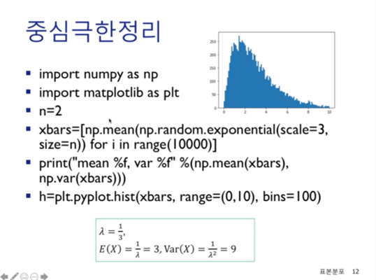  
uniform distribution처럼 가운데가 아닌 한쪽으로 기울어진 경우는 어떨까? (지수분포)  
포아송분포의 평균 : 1/3, 포아송본포의 분산 : 1/3  
지수분포의 평균 : 1/(포아송분포의 평균), 지수분포의 분산 : 1/(포아송분포의 평균)^2  

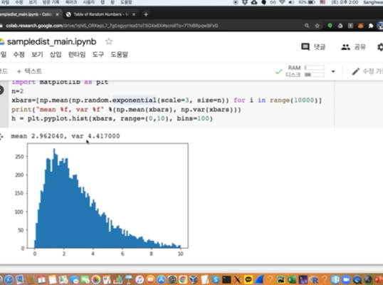  
모집단(지수분포)의 분산 : 9, 표본분산 : 9/n = 9/2 = 4.5  

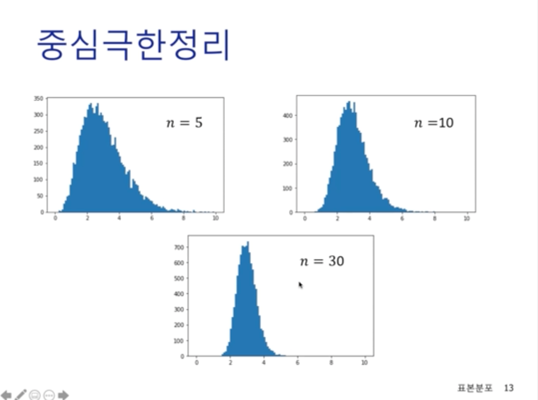  
n을 늘리면 다음과 같은 결과가 나온다.