# 추정
우리의 목적은 전수조사를 할 수 없기 때문에 표본의 특성을 통해 모집단의 특성 (모평균, 모분산 등..)을 파악하는 것이다.  

## 모평균의 추정
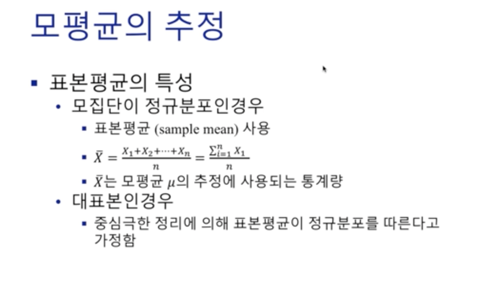  
정규분포를 따르는 경우, n개의 원소들의 평균을 내면 표본 평균을 구할 수 있다.
하지만, 여기서 고려해야 할 사항이 두 가지가 있다.  
첫 번째는 표본이기 때문에 정확한 모평균을 추정하는 것은 아니라는 점 (신뢰구간을 정의해야함)  
두 번째는 정규분포를 따르지 않는 경우 충분히 많은 표본(n>=30)을 통해 **중심극한정리**에 의해 정규분포에 근사시켜야 하는 것이다.  

추정에는 **점 추정**과 **구간 추정** 두 가지 종류가 있다.  

## 모평균 - 점 추정
  
표본을 어떻게 선택하느냐에 따라 다른 표본평균이 나오기 때문에 점 추정만 가지고 모평균을 추정하기에는 신빙성이 부족하다.

## 모평균 - 구간 추정
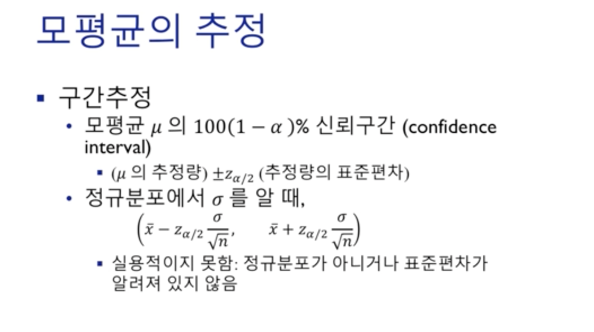  
우선 표본분포는  다음과 같은 평균과 분산을 따르는 것을 상기해야 한다.
점 추정만으로는 정확한 모평균을 측정하기 힘들기 때문에 구간 추정도 병행해야 한다.  

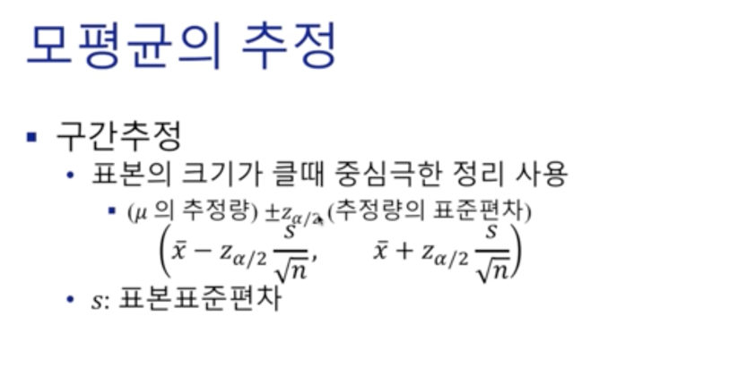
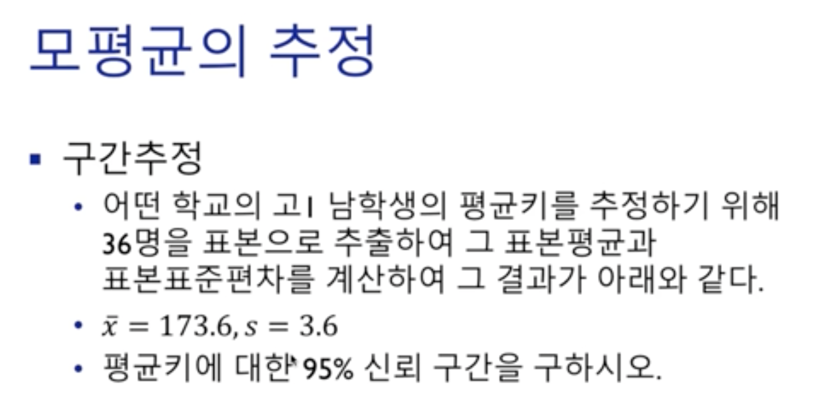
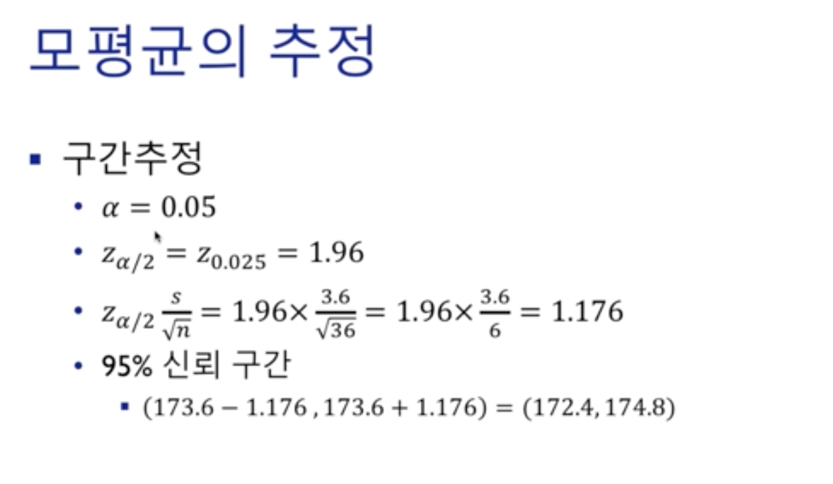
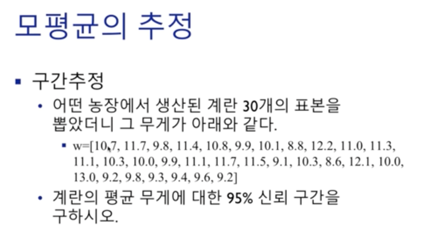
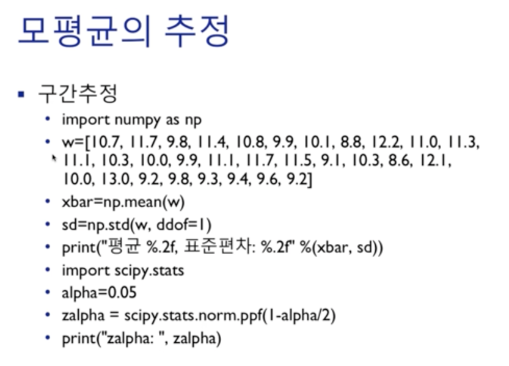  
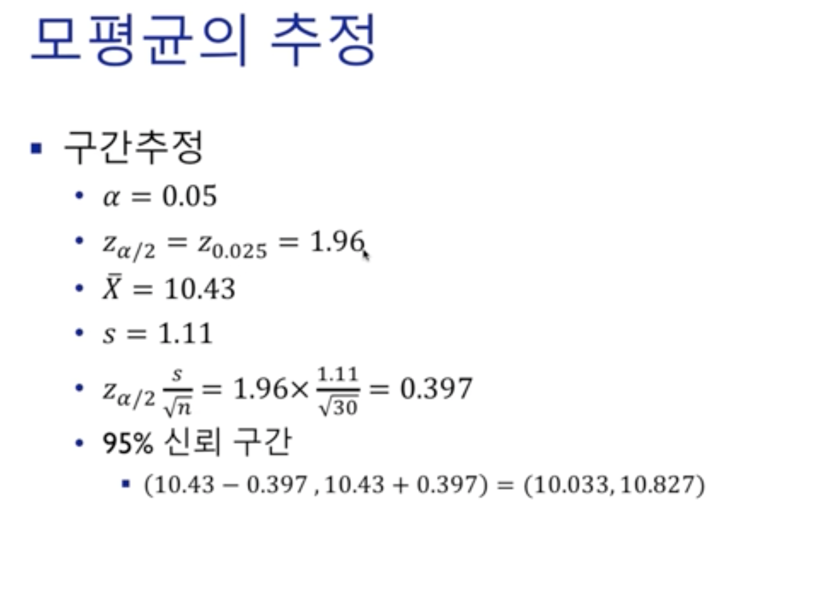

## 모비율 - 점 추정
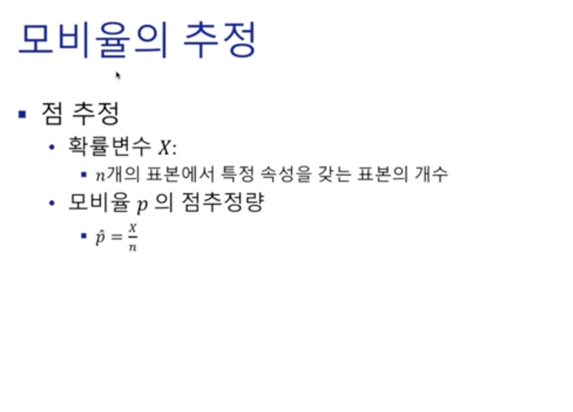  
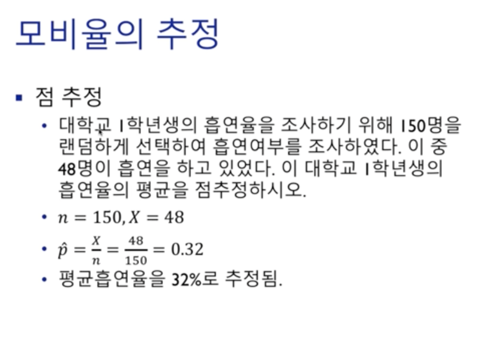  

## 모비율 - 구간 추정
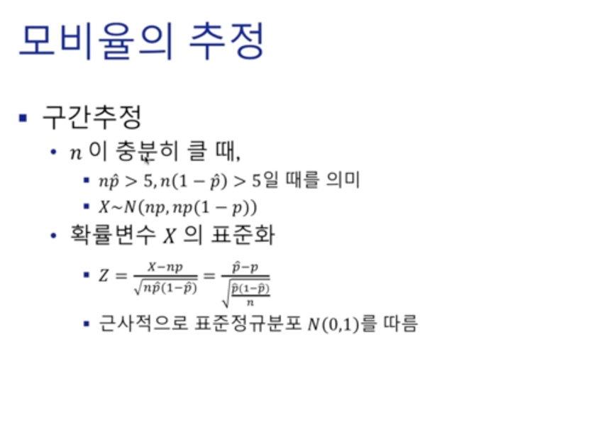  
모비율 같은 경우에는 특정 집단에 속하냐 안속하냐를 판단하기 때문에 **이항분포의 평균과 분산** 따르게 된다.
물론, **중심극한정리**에 의해 정규분포를 따른다.  

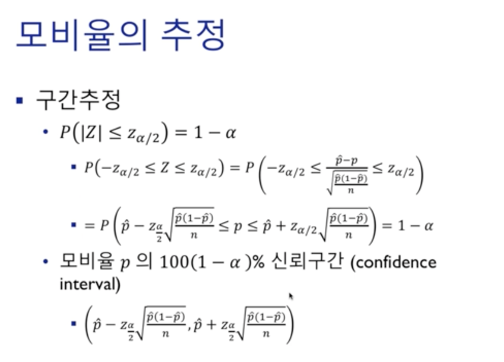  
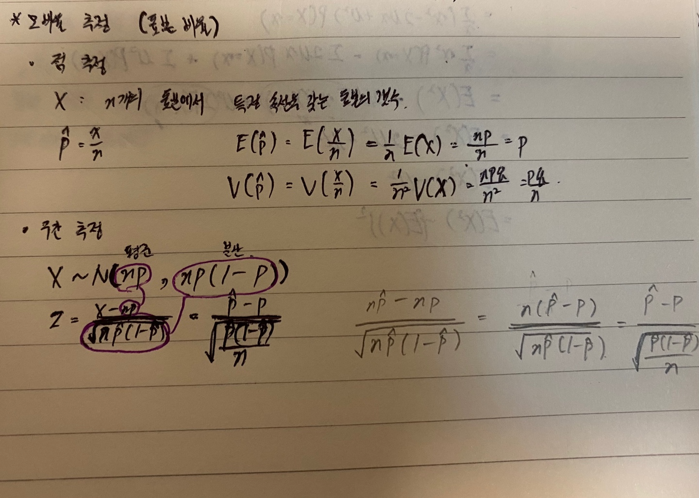

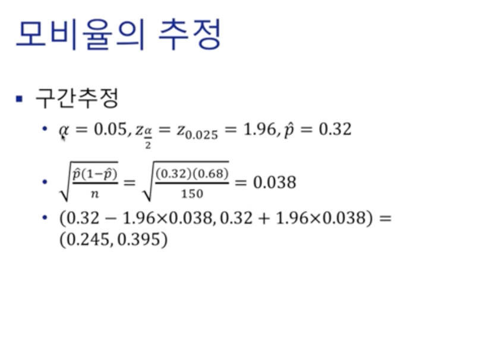
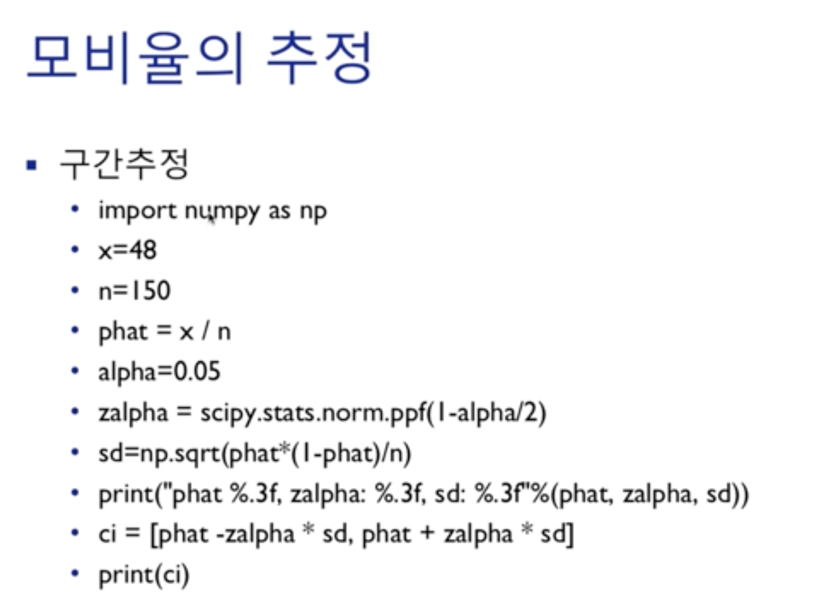