# 검정
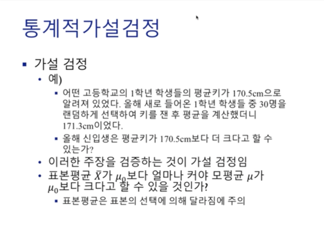  
특정 가설을 세운 후, 새로운 사실을 통해 가설이 맞는지를 검사하는 과정을 **가설 검정**이라고 한다.
mu0는 기존에 알려진 모평균을 의미하고, mu는 실제 모평균을 의미한다.  

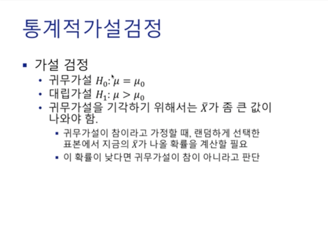  
귀무 가설(歸無假說, 영어: null hypothesis, 기호 H0) 또는 영 가설(零假說)은 통계학에서 **처음부터 버릴 것을 예상하는 가설**이다. 
**차이가 없거나 의미있는 차이가 없는 경우의 가설**이며 이것이 맞거나 맞지 않다는 통계학적 증거를 통해 증명하려는 가설이다. 
예를 들어 범죄 사건에서 용의자가 있을 때 형사는 이 용의자가 범죄를 저질렀다는 추정인 대립가설을 세우게 된다. 
이때 귀무가설은 용의자는 무죄라는 가설이다.
통계적인 방법으로 가설검정(hypothesis test)을 시도할 때 쓰인다. 로널드 피셔가 1966년에 정의하였다.  

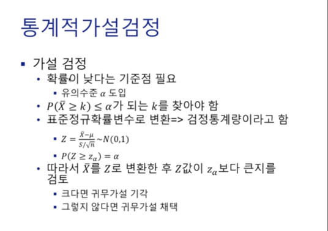  
귀무가설이 참이려면, 표본평균이 낮아야 하는데 이것이 낮은지 높은지를 정하는 기준점이 필요하다.
그래서 우리는 유의수준(alpha)이라는 개념을 도입하여 이보다 낮으면 낮다고 판단한다.  
P(Xbar >= k) : Xbar - 표본평균, k - 임계값 (Xbar가 mu0보다 얼마나 커야 모평균 mu가 mu0보다 크다고 할 수 있을 것인가? 라는 질문에서 Xbar의 임계값을 의미한다.)  
다시 한번 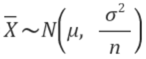 를 상기하자. Xbar에 대해 z 표준화를 거쳐 표준정규확률분포를 따르도록 변형한다. 그 후, alpha를 만족하는 zalpha를 찾으면 된다.  

  
* 귀무가설과 대립가설을 세운다.
* 임계점을 alpha 값을 통해 찾는다. 이때, 일반적으로 alpha는 0.05로 설정한다. 하지만, 표본이 적을경우 이보다 높은 수치로 행한다.
  (표본이 적으므로 신뢰구간을 넓힌다.)
  
  
대립가설을 세우기 위해서는 문제를 잘 파악해야 한다. 가설로 정해진 모평균이 실제 모평균보다 큰지, 작은지, 혹은 다른지..  

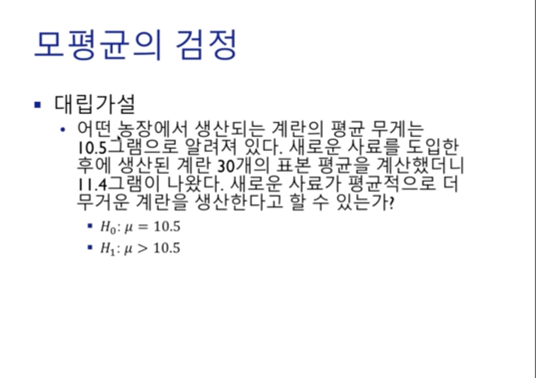  
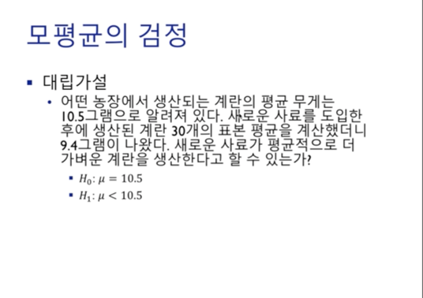  
  
s는 표본표준편차, sigma는 모표준편차  

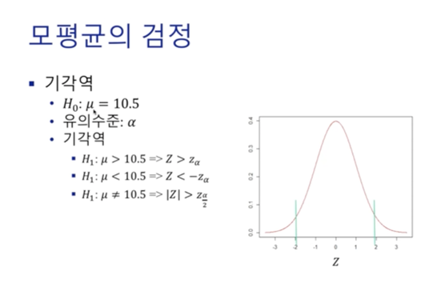  
첫 번째 기각역 : mu > 10.5 라는 대립가설이 맞기 위해서는 Z가 zalpha보다 커야한다.  
두 번째 기각역 : mu < 10.5 라는 대립가설이 맞기 위해서는 Z가 zalpha보다 작아야한다.  
세 번째 기각역 : mu != 10.5 라는 대립가설이 맞기 위해서는 Z가 0으로부터 멀어야한다.  

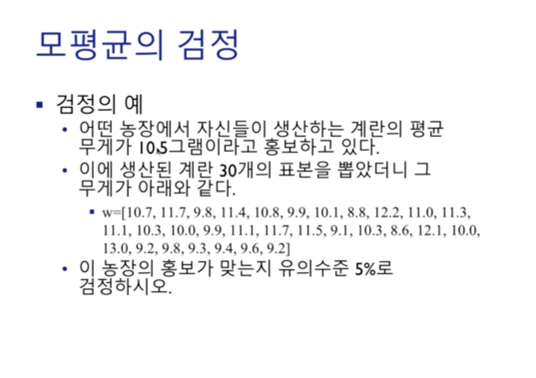  
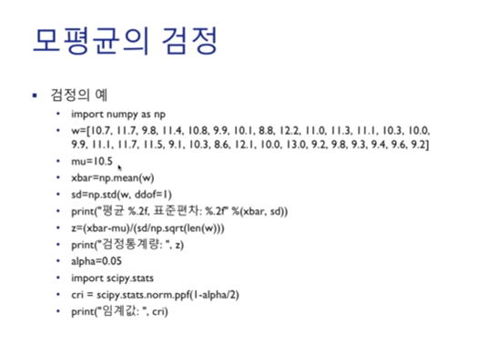  
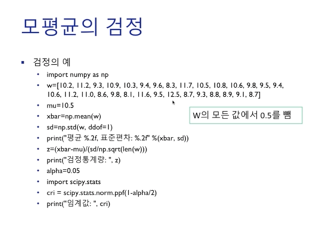  
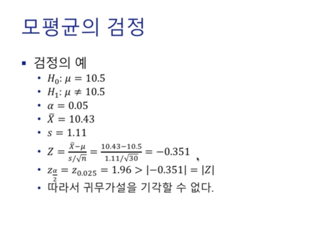