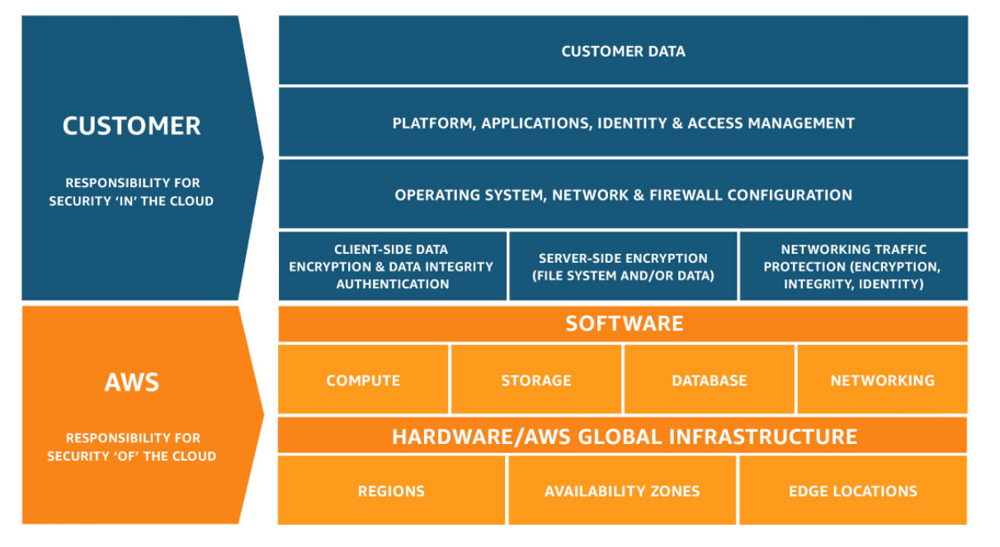

# AWS Practitionor 정리
## 공동책임모델
  
출처 : https://aws.amazon.com/ko/compliance/shared-responsibility-model/#:~:text=Shared%20Controls%20-%20Controls%20which%20apply,their%20use%20of%20AWS%20services.  
* 고객의 책임  
고객은 게스트 운영 체제(업데이트 및 보안 패치 포함) 및 다른 관련 애플리케이션 소프트웨어를 관리하고 AWS에서 제공한 보안 그룹 방화벽을 구성할 책임이 있습니다.  
  

* AWS의 책임  
AWS는 AWS 클라우드에서 제공되는 모든 서비스를 실행하는 인프라를 보호할 책임이 있습니다. 이 인프라는 AWS 클라우드 서비스를 실행하는 하드웨어, 소프트웨어, 네트워킹 및 시설로 구성됩니다.  
Amazon S3 및 Amazon DynamoDB와 같은 추상화 서비스의 경우, AWS는 인프라 계층, 운영 체제, 플랫폼을 운영하고 고객은 데이터를 저장하고 검색하기 위해 엔드포인트에 액세스합니다.  
  

* 공동 책임  
패치 관리 – AWS는 인프라와 관련된 결함 수정과 패치에 대한 책임이 있으며, 고객은 게스트 OS와 애플리케이션 패치에 대한 책임이 있습니다.  
구성 관리 – AWS는 인프라 디바이스의 구성을 유지 관리하고, 고객은 자체 게스트 운영 체제, 데이터베이스 및 애플리케이션의 구성에 대한 책임이 있습니다.  
인지 및 교육 – AWS는 AWS 직원을 교육하고, 고객은 자사의 직원을 교육해야 합니다.  

## Regions (리전)  
리전은 두 개 이상의 가용영역으로 구성되어 있다.

## Availability Zones (가용영역)
한 개 이상의 데이터 센터로 구성되어 있다.

## 클라우드 컴퓨팅의 6가지 이점
* 자본 비용을 가변 비용으로 대체
* 규모의 경제로 얻게되는 이점
* 용량 추정 불필요
* 속도 및 민첩성 개선
* 데이터 센터 운영 및 유지 관리에 비용 투자 불필요
* 몇분만에 전지역으로 확대됨

## 클라우드 컴퓨팅 유형
### 클라우드 컴퓨팅 모델
* IaaS (서비스로서의 인프라)
* PaaS (서비스로서의 플랫폼)
* SaaS (서비스로서의 소프트웨어)

### 클라우드 컴퓨팅 배포 모델
* 클라우드
* 하이브리드
* 온프레미스

### 보안 및 규정 준수
### Amazon Web Services 클라우드 플랫폼

## 서비스
### 컴퓨팅
#### Amazon EC2
클라우드에서 안전하고 규모 조정이 가능한 컴퓨팅 파워를 제공하는 웹서비스다.  
* 이점
1. 탄력적인 웹 규모 컴퓨팅
2. 완전 제어
3. 유연한 클라우드 호스팅 서비스
4. 통합
5. 안정성
6. 보안
7. 저렴한 비용  
7.1 온디맨드 인스턴스  
7.2 예약 인스턴스  
7.3 스팟 인스턴스
   
#### Amazon EC2 Container Service  
도커 컨테이너를 지원하는 **컨테이너 관리 서비스**.  

#### Amazon EC2 Container Registry  
개발자가 **도커 컨테이너 이미지를 손쉽게 저장, 관리 및 배포**할 수 있게 해주는 완전 관리형 도커 컨테이너 레지스트리.

#### Amazon Lightsail  
AWS에서 **가상 프라이빗 서버를 시작하고 관리**할 때 사용할 수 있는 가장 간편한 방법.

#### AWS Batch  
개발자, 과학자 및 엔지니어가 AWS에서 수많은 배치 컴퓨팅 작업을 효율적으로 실행할 수 있음.  

#### AWS Elastic Beanstalk  
Java, .NET, PHP, Node.js, Python, Ruby, Go, Docker를 사용하여 Apache, Nginx,
Passenger, IIS(인터넷 정보 서비스) 같은 **친숙한 서버에서 개발된 웹 애플리케이션 및 서비스를
배포하고 확장**하는 서비스.

#### AWS Lambda  
서버를 프로비저닝하거나 관리할 필요 없이 (Serverless) 코드를 실행할 수
있다.  

#### Auto Scaling  
애플리케이션 가용성을 유지하는 데 도움이 되고 정의한 조건에 따라
**Amazon EC2 용량을 자동으로 확장하거나 축소**할 수 있다.

### 스토리지
#### Amazon S3
#### Amazon Elastic Block Store
#### Amazon Elastic File System
#### Amazon Glacier
#### AWS Storage Gateway  
**온프레미스 스토리지 환경과 AWS 클라우드 양쪽을 넘나들며**
하이브리드 스토리지를 원활하게 사용할 수 있다.

### 데이터베이스
#### Amazon Aurora
#### Amazon RDS
#### Amazon DynamoDB
#### Amazon ElastiCache  
클라우드에서 인 메모리 캐시를 손쉽게 배포, 운영 및 조정할 수 있게 해주는
웹 서비스.  이 서비스는 더 느린 디스크 기반 데이터베이스에 전적으로 의존하기보다는,
신속하며 관리되는 인 메모리 캐시에서 정보를 검색할 수 있는 기능을 지원해 웹 애플리케이션의
성능을 향상시킨다.

### 마이그레이션
#### AWS Application Discovery Service
#### AWS Database Migration Service
#### AWS Server Migration Service
#### AWS Snowball  
페타바이트 규모의 데이터 전송 솔루션으로서 안전한 어플라이언스를 사용하여
AWS에서 대량의 데이터를 송수신.

#### AWS Snowball Edge
#### AWS Snowmobile

### 네트워킹, 콘텐츠 전송
#### Amazon VPC  
고객이 정의한 가상 네트워크에서 AWS
리소스를 시작할 수 있도록 AWS 클라우드에서 논리적으로 격리된 공간을 프로비저닝할 수
있다.
#### Amazon CloudFront
#### Amazon Route 53  
가용성과 확장성이 우수한 클라우드 **Domain Name System(DNS) 웹
서비스.** Amazon Route 53은 사용자 요청을 EC2 인스턴스, Elastic Load Balancing 로드 밸런서 또는 Amazon S3
버킷처럼 AWS에서 실행되는 인프라와 효과적으로 연결하며, 사용자를 AWS 외부의 인프라로
라우팅하는 데에도 사용할 수 있다.

#### Amazon Direct Connect  
**온프레미스에서 AWS로 전용 네트워크 연결**을 쉽게 설정할 수
있다. AWS와 사용자의 데이터 센터, 사무실 또는 코로케이션
환경 사이에 비공개 연결을 설정할 수 있다. 이러한 전용 연결은 산업 표준 802.1Q 가상 LAN(VLAN)을 사용하여
여러 개의 가상 인터페이스로 분할할 수 있다.

#### Elastic Load Balancing  
수신되는 애플리케이션 트래픽을 여러 EC2 인스턴스에 자동으로
배포한다.

### 개발자 도구
#### AWS CodeCommit
#### AWS CodeBuild
#### AWS CodeDeploy
#### AWS CodePipeline  
애플리케이션 및 인프라를 빠르고 안정적으로 **업데이트**할 수 있는 지속적
통합 및 지속적 전송 서비스.

#### AWS X-Ray

### 관리 도구
#### Amazon CloudWatch  
AWS 클라우드 **리소스** 및 AWS에서 실행하는 **애플리케이션을 모니터링**하는
서비스.

#### Amazon EC2 Systems Manager  
소프트웨어 인벤토리 수집, 운영 체제(OS) 패치 적용, 시스템
이미지 생성, Windows 및 Linux 운영 체제 구성을 자동화해주는 관리 서비스.  

#### AWS CloudFormation  
개발자와 시스템 관리자는 AWS CloudFormation을 통해 쉽게 관련 AWS 리소스 모음을 생성 및
관리하고 순서에 따라 예측 가능한 방식으로 프로비저닝하고 업데이트할 수 있다.

#### AWS CloudTrail  
계정에 대한 AWS API 호출을 기록하고 로그 파일을 사용자에게 전달하는 웹
서비스.  

#### AWS Config  
AWS 리소스 인벤토리, 구성 기록, 구성 변경 알림을 제공하여 보안 및 거버넌스를
실현하는 완전관리형 서비스. AWS Config에서는 기존 및 삭제된 AWS 리소스를 찾고, 규칙과 대조하여 전반적인 규정 준수 상태를
확인하며, 언제든 리소스의 구성 세부 정보를 자세히 살펴볼 수 있다. 이러한 기능을 바탕으로
규정 준수 감사, 보안 분석, 리소스 변경 추적, 문제 해결을 수행할 수 있다.

#### AWS OpsWorks  
구성 관리 서비스로서, 서버 구성을 코드로 취급하는 자동화 플랫폼인 Chef를
사용한다. OpsWorks는 Chef를 사용하여 EC2 인스턴스 또는 온프레미스 컴퓨팅 환경 전반에
걸쳐 서버를 구성, 배포, 관리하는 작업을 자동화한다. OpsWorks에는 AWS OpsWorks for Chef
Automate와 AWS OpsWorks Stacks라는 두 가지 제품이 있다.

#### AWS Service Catalog  
AWS에서 사용이 승인된 IT 서비스 카탈로그를 생성하고 관리할 수 있다. 
이때 IT 서비스란 다중 계층 애플리케이션 아키텍처를 완성하기 위한 가상 머신 이미지, 서버, 소프트웨어, 데이터베이스 등을 포괄한다. AWS Service Catalog를 사용하면
흔히 배포되는 IT 서비스를 중앙에서 관리할 수 있고 일관성 있는 거버넌스를 수립하는 데 도움이 될 뿐 아니라 규정 준수 요건을 충족할 수 있는 반면에 사용자는 
자신이 필요한 승인 IT 서비스만 신속하게 배포할 수 있다.

#### AWS Trusted Advisor  
AWS 환경을 최적화하여 비용을 줄여주고 성능을 향상시키며 보안을 개선하는 온라인 리소스다.
Trusted Advisor는 AWS 모범 사례에 따라 리소스를 프로비저닝하는 데 도움이 되는 실시간 지침을 제공한다.

#### AWS Personal Health Dashboard
#### AWS Managed Services

### 보안, 자격 증명 및 규정 준수
#### Amazon Cloud Directory
#### AWS Identity and Access Management (IAM)
#### Amazon Inspector
#### AWS Certification Manager
#### AWS CloudHSM
#### AWS Directory Service
#### AWS Key Management Service (KMS)
#### AWS Organizations
#### AWS Shield
#### AWS WAF

### 분석
#### Amazon Athena
#### Amazon EMR
#### Amazon CloudSearch
#### Amazon Elasticsearch Serivce
#### Amazon Kinesis
#### Amazon Redshift
#### Amazon QuickSight
#### AWS Data Pipeline
#### AWS Glue

### 인공지능
#### Amazon Lex
#### Amazon Polly
#### Amazon Rekognition
#### Amazon Machine Learning

### 모바일 서비스
#### AWS Mobile Hub
#### Amazon Cognito
#### Amazon Pinpoint
#### AWS Device Farm
#### AWS Mobile SDK
#### Amazon Mobile Analytics

### 애플리케이션 서비스
#### AWS Step Functions
#### Amazon API Gateway
#### Amazon Elastic Transcoder
#### Amazon SWF

### 메시징
#### Amazon SQS
#### Amazon SNS
#### Amazon SES

### 기업 생산성
#### Amazon WorkDocs
#### Amazon WorkMail
#### Amazon Chime

### 데스크톱 및 앱 스트리밍
#### Amazon WorkSpaces
#### amazon AppStream 2.0

### 사물 인터넷
#### AWS IoT Platform
#### AWS Greengrass
#### AWS IoT Button

### 게임 개발
#### Amazon GameLift