# AWS 공동 책임 모델
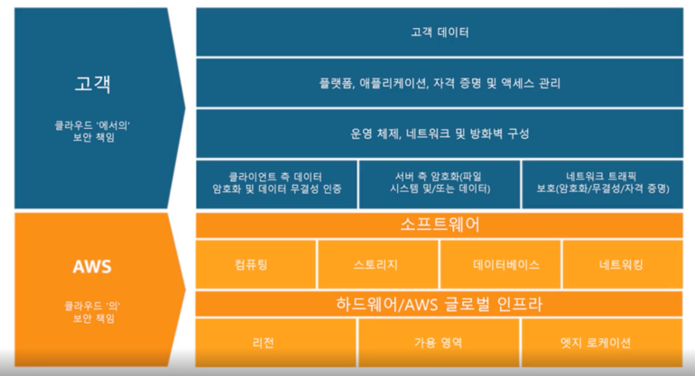  
보안과 규정 준수는 AWS와 고객의 공동 책임이다. 
클라우드 보안(인프라나 소프트웨어 서비스에 대한 책임)은 AWS에게 있지만, 
클라우드 내의 리소스나 데이터 애플리케이션(배포하는 항목) 보안에 대한 책임은 고객에게 있다.  

AWS는 애플리케이션과 데이터를 보호하기 위한 도구를 제공한다. 그러나 이러한 도구를 사용해서 보호할 책임은 고객에게 있다.

## AWS의 책임 : 클라우드의 보안
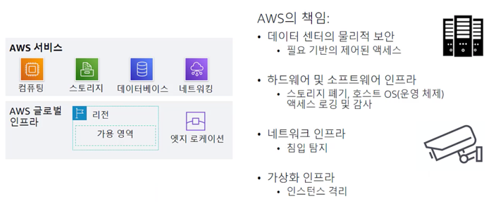  
AWS는 이중화와 침입탐지를 비롯한 리소스가 구축된 물리적 인프라의 보안에 대한 책임이 있다.
AWS가 이러한 인프라를 제공하므로 고객은 컴퓨팅, 스토리지, 데이터베이스, 네트워킹 등 다양한 서비스를 사용할 수 있다.  

AWS는 가상화 인프라가 고객 워크로드 간의 격리기능을 제공하도록 보장한다.  
ex) 한 고객의 EC2 인스턴스는 다른 고객의 컴퓨팅 환경으로부터 격리된다.

## 고객의 책임 : 클라우드에서의 보안
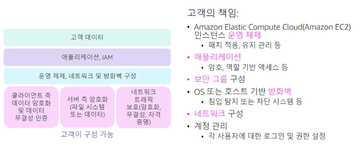  

AWS 클라우드에 저장하도록 선택하는 데이터, 해당 데이터를 사용해야 하는 서비스 그리고 데이터가 저장될 지리적 위치를 고려해야 한다.
고객은 전송중인 데이터와 저장된 데이터를 암호화 할 수 있다.  

## 서비스 특성 및 보안 책임
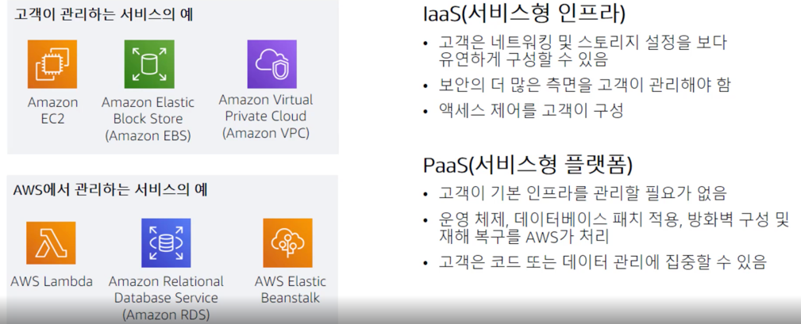  
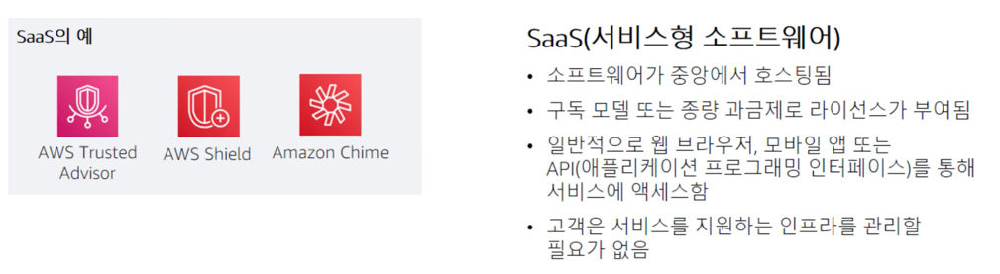  

Amazon EC2는 가상화된 서버가 제공되고 해당 가상 서버 관리를 완벽하게 제어할 수 있다는 점에서 서비스형 인프라로 분류된다.  
-> 서비스형 인프라를 사용할 경우 고객이 매우 높은 수준의 제어 권한을 가지므로 생성하고 관리하는 리소스의 보안에 대한 책임은 고객에게 있다.  

서비스형 플랫폼이란 인프라를 사용하는 서비스를 의미한다. 하지만 이런 인프라는 고객에게 표기되지 않고 클라우드 공급자가 관리한다.  
ex) Amazon Relational Database Service  
서버와 운영체제를 운영 및 업데이트하고 백업을 자동화한다는 점에서 서비스형 플랫폼으로 분류할 수 있다.  

서비스형 소프트웨어는 즉시 사용가능한 완전한 소프트웨어 솔루션을 제공하는 서비스를 말한다. 소프트웨어가 중앙에서 호스팅되므로 고객은 서비스를 지원하는 인프라를 관리할 필요가 없다.
서비스형 소프트웨어로 제공될 때 라이선스 모델은 보통 구독 또는 종량과금제이다. 

# AWS IAM (Identity and Access Management)
## IAM
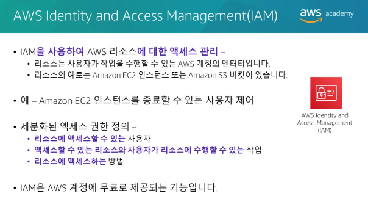  
AWS Identity and Access Management (IAM)을
사용하면 AWS 클라우드의컴퓨팅, 스토리지, 데이터베이스, 애플리케이션 서비스에 대한 액세스를 제어할 수 있습니다. 
IAM을 사용하여 인증을 처리하고, 권한 부여 정책을 지정 및 적용하여 **서비스에 액세스할 수 있는 사용자**를 지정할 수 있습니다.
**IAM은 AWS 계정의 리소스를 시작, 구성, 관리 및 종료하는데 필요한 액세스 권한을 중앙에서 관리하는 도구입니다.** 
각 서비스에서 사용자가 호출할 수 있는 API 호출을 정확히 지정하는 기능을 포함하여 리소스에 대한 액세스를 세부적으로 제어하는데 필요한 기능을 제공합니다. 
AWS Management Console, AWS CLI 또는 AWS SDK(소프트웨어개발키트) 중에서 어떤 방법을 사용하든 **AWS 서비스에 대한 모든 호출은 API 호출**입니다.
IAM을 사용하면 **리소스에 액세스할 수 있는 사용자와 이러한 리소스에 액세스하는 방법**을 관리할 수 있습니다. 
리소스에 따라 여러 사람에게 다양한 권한을 부여할 수 있습니다. 
예를 들어 어떤 사용자에게는 Amazon EC2, Amazon S3, Amazon DynamoDB, Amazon Redshift 및 기타 AWS 서비스에 대한 모든 액세스 권한을 허용하고, 
다른 사용자에게는 일부 S3 버킷에 대한 읽기 전용 액세스만 허용할 수 있습니다. 
마찬가지로, 또 다른 사용자에게는 특정 EC2 인스턴스만 관리할 수 있는 권한을 부여할 수 있습니다. 
일부 사용자에게 계정 결제정보에만 액세스할 수 있고 다른 항목에는 액세스할 수 없는 권한을 부여할 수도 있습니다.
IAM은 AWS 계정의 기능중 하나이며 추가 비용없이 제공되는 기능입니다.  

IAM은 사용자, 그룹, 역할 및 액세스 제어를 정의하는데 사용되며 요금이 부과되지 않는 글로벌 서비스(모든 리전에서 사용할 수 있음)이다.
IAM을 사용하면 정책을 사용하여 모든 AWS 서비스에 대한 액세스를 제어함으로써 시스템 관리자, 데이터베이스 관리자, 스토리지 관리자, 보안 관리자 등의 운영 그룹을 정의할 수 있다.
IAM은 사용자, 역할 또는 특정 리소스에 대한 액세스 인증과 확인을 처리한다.

## IAM 필수 구성요소
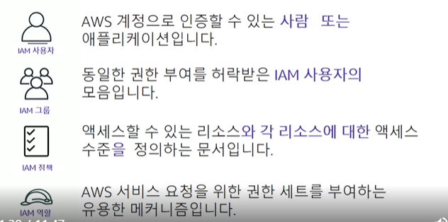  
1. IAM 사용자    
사용자는 일반적으로 AWS 계정에 액세스하도록 허용된 사람이다. 각 사용자에게는 공백이 없는 고유한 이름이 부여되어야 하며, 식별할 수 있는 수단(암호)이 할당되어야 한다.  
   **AWS 계정에 정의되어 있고 AWS 제품에 대한 API 호출을 수행해야 하는 사람 또는 애플리케이션입니다.**
   각 사용자에게는 AWS 계정 내에서 고유한 이름(공백이없어야함)과 다른 사용자와 공유되지 않는 **보안 자격 증명세트**가 있어야 합니다. 
   이러한 자격 증명은 AWS 계정 루트 사용자 보안 자격 증명과 다릅니다. 각 사용자는 하나의 AWS 계정에만정의됩니다. (aws 계정 : 사용자 = 1 : N) 
   
2. IAM 그룹  
기본적으로 고객이 그룹을 정의하고 액세스 정책을 적용한다. 그 다음 정책을 각 사용자에게 직접 연결할 필요 없이 그룹에 사용자를 추가하거나 제거할 수 있다.  
**IAM 사용자의 모음입니다.** IAM 그룹을 사용하면 여러 사용자의 권한을 지정하고 관리하는 작업을 간소화할 수 있습니다.
   * 한 사용자가 여러 그룹에 속할 수 있다.
   * 그룹은 중첩할 수 없다.
   
3. IAM 정책(policy)  
정책은 하나 이상의 서비스에 대한 액세스를 정의하는 문서이다. 정책은 사용자 및 그룹과 독립적으로 생성된다. 생성된 정책을 연결하면 해당 정책에서 정의하는 액세스 제어가 활성화된다.  
   **사용자가 AWS 계정에서 수행할 수 있는 작업을 결정하는 권한이 정의된 문서입니다.**
   정책은 일반적으로 특정 리소스에 대한 액세스 권한을 부여하고 사용자가 해당 리소스로 수행할 수 있는 작업을 지정합니다. 
   정책은 액세스를 명시적으로 거부할 수도 있습니다.
   
4. IAM 역할(role)  
IAM 역할은 특정 권한이 있는 계정에 생성할 수 있는 IAM 자격 증명이다.
역할은 AWS 서비스에 대한 임시 액세스 권한을 임시적으로 부여하는 매커니즘이다. (sudo와 비슷)
역힐은 리소스에 대한 액세스 권한을 선택한 사용자 또는 애플리케이션에만 임시적으로 부여한다.  
   ex) EC2 인스턴스에 다른 서비스(S3 버킷 ..)에 접근할 수 있는 권한을 부여하는 경우  
   ex) 다른 계정에 내 계정의 리소스를 접근할 수 있는 권한을 부여하는 경우
   * IAM 사용자와 유사한점
    1. 권한 정책을 연결할 수 있는 AWS 자격 증명 : 해당 권한은 자격 증명을 사용하여 AWS에서 수행할 수 있는 작업과 수행할 수 없는 작업을 결정
   * IAM 사용자와 다른점
    1. 한 사람에게 고유하게 연결되는 IAM 사용자와 달리 IAM 역할은 **필요한 모든 사람이 수임할 수 있다.**
    2. IAM 역할에는 암호 또는 액세스 키와 같은 **표준 장기 자격 증명이 연결되지 않는다.** 대신에 역할을 수임한 사람에게 역할 세션에 대한 **임시 보안 자격 증명**이 제공된다.    
   
## 액세스 유형
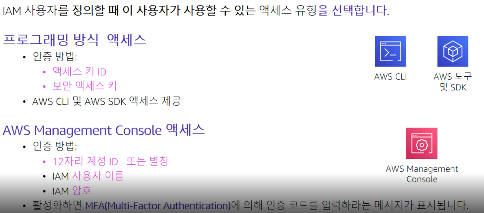  
1. 프로그래밍 방식 액세스  
사용자는 AWS CLI 또는 AWS SDK를 사용하여 AWS API를 호출할 때 액세스 ID와 보안 액세스 키(키 페어)를 제시해야한다.
   
2. Management Console 액세스  
일반적으로 사용자는 최소한 사용자 이름과 암호를 입력해야 한다. 만약 해당 사용자에 대해 멀티 팩터 인증이 활성화된 경우 MFA 코드(추가 인증 수단)를 입력해야 한다.
   
## MFA (Multi Factor Authentication)
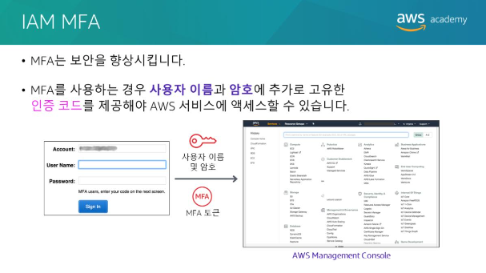  
AWS 서비스 및 리소스에는 AWS Management Console, AWS CLI 또는 SDK 및 API를 사용하여 액세스할 수 있습니다. 
보안 향상을 위해 MFA를 활성화 하는 것이 좋습니다.
MFA를 사용하는 경우 사용자 및 시스템은 일반 로그인 자격증명에 더해 MFA 토큰을 제공해야 AWS 서비스 및 리소스에 액세스할 수 있습니다.
MFA 인증 토큰 생성에 사용할 수 있는 옵션으로는 가상 MFA 호환 애플리케이션(예: Google Authenticator 또는Authy 2-Factor Authentication), 
U2F 보안 키 디바이스 및 하드웨어 MFA 디바이스가 있습니다.

## 권한부여  
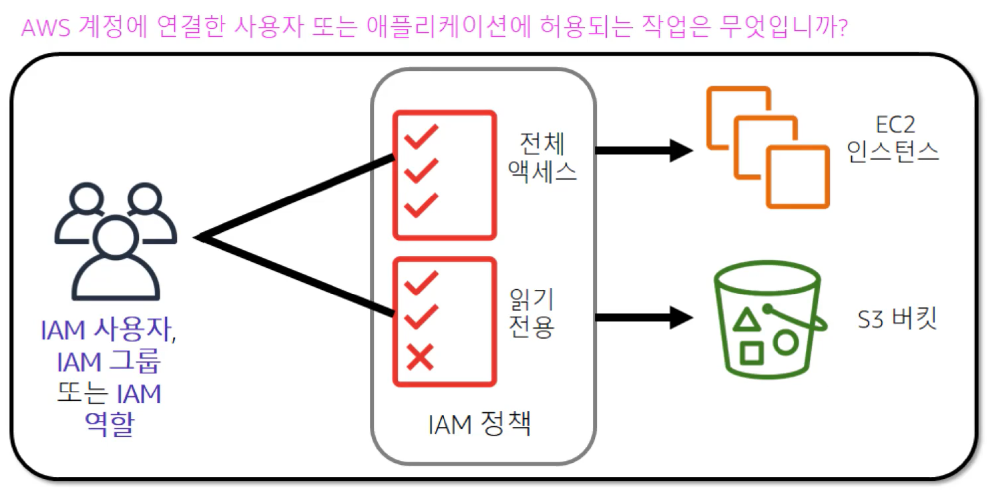  
권한부여는 사용자 또는 서비스에 부여할 권한을 결정하는 프로세스다. 사용자는 인증 후 서비스에 액세스할 수 있는 권한을 부여받아야 한다.  

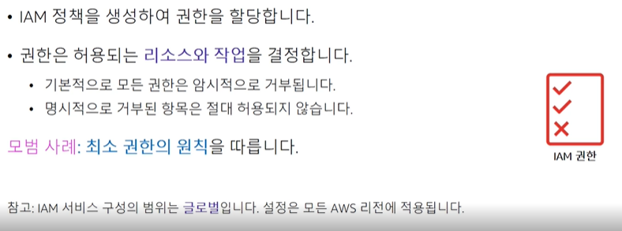  
**기본적으로 IAM 사용자에게는 액세스 권한이 없다.** 필요에 따라 정책을 적절하게 정의 및 연결하여 사용자에게 명시적으로 부여해야 한다.
필요 이상으로 권한을 부여하지 않는다. 사용자가 필요한 만큼만 권한을 부여한다. 이것을 **최소 권한의 원칙**이라고 한다.  
**IAM 서비스 구성의 범위는 글로벌입니다.** 설정은 AWS 리전 수준에서 정의되지않습니다. IAM 설정은 **모든 AWS 리전**에 적용됩니다

## IAM 정책  
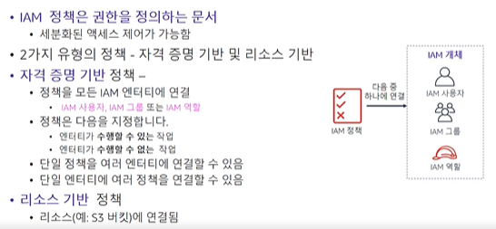  
IAM 정책은 JSON 형태의 문서이다. 정책은 AWS의 서비스에 대한 액세스를 허용하거나 거부하는 권한을 나열한다.
IAM 정책에는 두 가지 유형이 있다.  
1. 자격 증명 기반 정책  
IAM 사용자, 역할, 또는 그룹과 같은 **보안 주체 또는 자격 증명**에 연결할 수 있는 권한 정책이다.  
   
2. 리소스 기반 정책  
S3 버킷과 같은 **리소스**에 연결하는 권한 정책.  
   
AM 정책은 엔터티에 부여될 권한을 공식적으로 설명하는 것입니다. 
**정책은 모든 IAM 엔터티에 연결될 수 있습니다.** 
엔터티에는 **사용자, 그룹, 역할 또는 리소스**가 포함됩니다. 
예를 들어 승인된 IP(인터넷프로토콜) 주소 범위에서 수신된 요청이 아닌 모든 요청을 차단하는 정책을 AWS 리소스에 연결할 수 있습니다. 
정책은 허용되는 작업, 작업을 수행할 수 있는 리소스 및 사용자가 리소스에 대한 액세스를 요청할 때의 결과를 지정합니다.
정책이 평가되는 순서는 평가 결과에 영향을 주지 않습니다. 
모든 정책이 평가되며, 결과는 항상 요청을 허용하거나 거부하는것 입니다. 
**충돌이 있는 경우 가장 제한적인 정책이 적용됩니다.**
IAM 정책에는 2가지 유형이 있습니다.  
**자격 증명 기반 정책**은 IAM 사용자, 역할 또는 그룹과 같은 보안주체(또는 자격증명)에 연결할 수 있는 권한 정책입니다. 
이러한 정책은 자격증명으로 수행할 수 있는 작업, 대상 리소스 및 관련조건을 제어합니다. 
자격 증명 기반 정책은 추가로 다음과 같이 분류될 수 있습니다.
* 관리형정책  
  – AWS 계정의 여러 사용자, 그룹 및 역할에 연결할 수 있는 독립 실행형 자격 증명 기반 정책
  
* 인라인정책  
  – 사용자가 생성하고 관리하며, 단일 사용자 그룹 또는 역할에 직접 포함되는 정책  
  
**리소스 기반 정책**은 S3 버킷과 같은 리소스에 연결하는 JSON 정책문서 입니다. 
이러한 정책은 지정된 보안주체가 해당 리소스에 대해 수행할 수 있는 작업 및 관련조건을 제어합니다.

   
### 예제
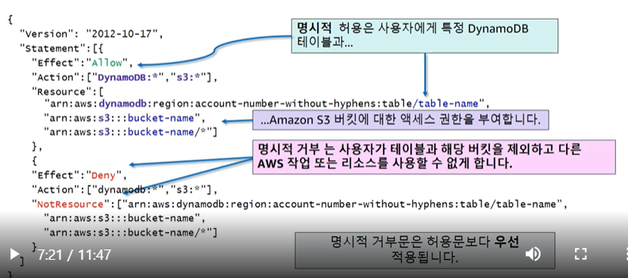  
- 명시적으로 허용하지 않은 모든 작업은 거부된다. (묵시적 거부)  
- 명시적으로 거부한 작업은 항상 거부된다.  
- 정책을 통해 명시적으로 허용해야 허가된다.  
- 허용문과 거부문이 상충하는 경우 거부문이 항상 우위를 점한다.

# 새 AWS 계정 보안
## AWS 계정 액세스 : 루트 사용자 vs IAM 사용자 
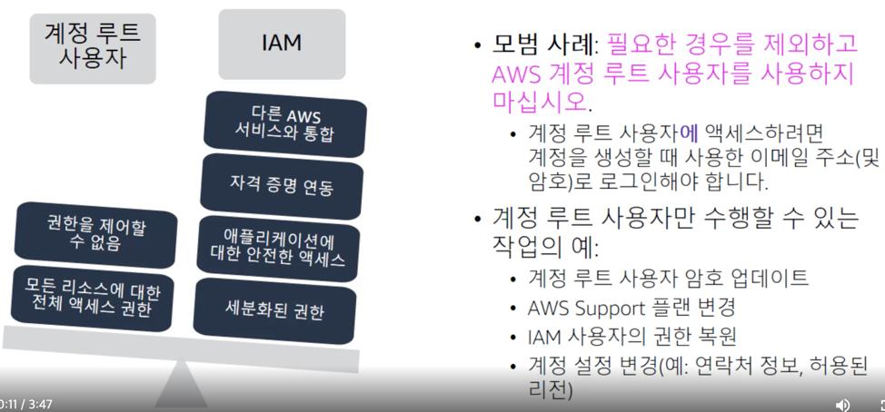  
**최초로 AWS 계정을 생성하는 경우 전체 서비스에 대한 완전한 액세스 권한을 가진 단일 로그인 자격 증명을 가지고  있다.**
이러한 자격증명을 **루트 계정**이라고 한다. 루트 계정은 모든 리소스에 대한 권한을 가지고 있기 때문에 일상적으로 사용하는 것을 추천하지 않는다.
대신 IAM 사용자를 생성하여 권한을 할당하고 **최소 권한의 원칙**을 따르는 것이 좋다.  

**1. 계정의 루트 사용자 사용을 가능한 빨리 중지한다.**
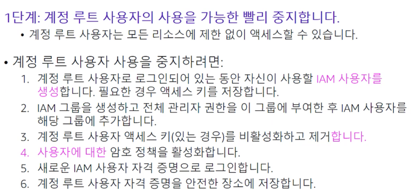
루트 계정의 사용을 중지하려면 AWS Management Console을 통해 **IAM 사용자를 생성**하고 모든 **사용자에 대한 권한 정책을 활성화**한다.
그리고 **루트 계정에 MFA** (Multi Factor Authentication)를 활성화 시킨다.  

다음으로 admin access와 같은 이름의 **관리자 그룹을 생성**하고 **관리자 권한을 활성화**한다. 그리고 해당 그룹에 **사용자를 추가**한다. 
새 사용자를 사용하기 전에 **루트 계정 액세스 키를 비활성화 하고 제거**한다.  

새 관리자 액세스 계정을 사용하려면 Identity and Access Management 콘솔 대시보드 페이지에서 링크를 복사하고 루트 사용자를 로그아웃 한다.  

마지막으로 복사한 로그인 링크로 이동한 후 새 사용자 자격증명을 사용하여 콘솔에 로그인한다.  
(루트 계정 사용자 자격 증명과 MFA 디바이스를 안전한 장소에 보관 필수)  

**2. MFA를 활성화한다.**
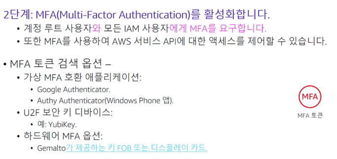  

**3. AWS CloudTrail을 사용한다.**
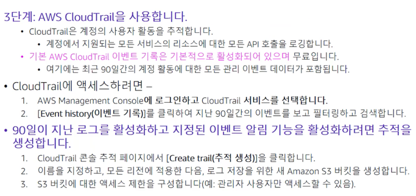  
AWS CloudTrail은 계정의 리소스에 대한 모든 API 요청을 로깅하는 서비스이다.  
AWS CloudTrail은 계정 생성시 기본적으로 활성화되어 있다.  

**4. 결제 보고서 활성화**
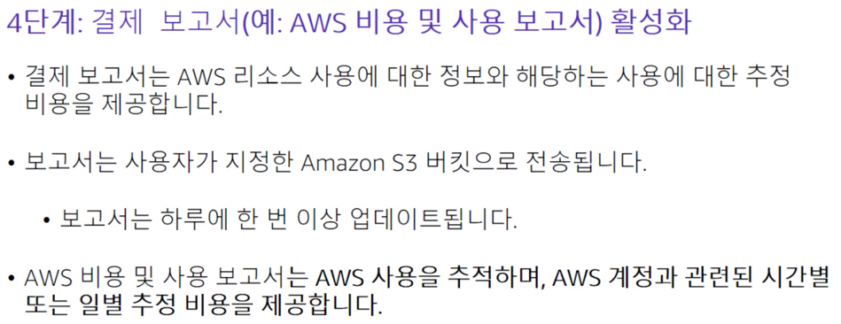  

# 계정 보안
AWS Organizations를 사용하여 여러 계정의 보안을 유지하는 방법에 대해서 다룬다.  

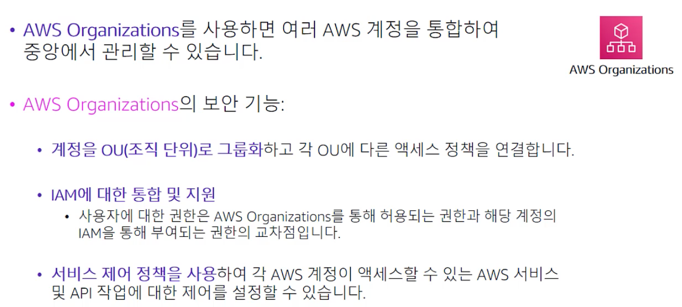  
여러 계정을 조직단위 (OU : Organization Unit)단위로 그룹화하고 서로 다른 액세스 정책을 각 OU에 연결할 수 있다.
이러한 AWS Organizations의 정책(Oraganizations의 멤버 계정이 가질 수 있는 최대 권한을 지정할 수 있는)을 **서비스 제어 정책**이라고 한다.  

## Service Control Policy
  
서비스 제어 정책을 사용하면 **조직 내의 모든 계정에 허용되는 최대 권한을 중앙에서 관리**하여 **각 계정이 조직의 액세스 제어 지침을 준수하는 지 확인**할 수 있다.
서비스 제어 정책은 **통합 기능이 포함된 모든 기능이 활성화된 조직에서만 사용가능**하다.  

서비스 제어 정책은 IAM과 유사하며 유사한 구문을 사용한다. **하지만 서비스 제어 정책은 권한을 부여하지는 않는다.** 
대신 서비스 제어 정책은 조직 또는 OU에 대한 최대 권한을 지정하는 JSON 구문 정책이다.  

서비스 제어 정책을 조직 루트 또는 조직 단위에 연결하는 것은 **해당 조직 또는 조직 단위 내의 계정이 실제로 수행할 수 있는 작업에 대한 보호장치를 정의**하는 것이다.
하지만 IAM 구성을 대체하는 것은 아니다.  

## AWS KMS (Key Management Service)
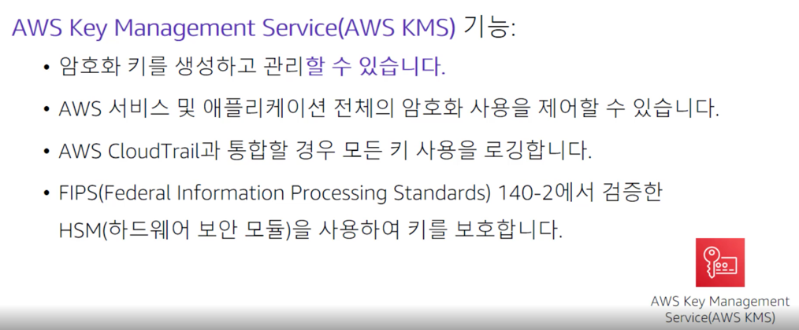  
AWS KMS는 하드웨어 보안 모듈을 사용하여 키를 보호하는 보안 서비스다.  
고객 마스터 키는 데이터의 복호화 및 암호화에 사용되는 다른 키에 대한 액세스를 제어하는데 사용된다.
새 **마스터키를 생성**할 수 있으며 이 **키에 액세스 할 수 있는 사용자 및 이 키로 사용할 수 있는 서비스를 관리**할 수 있다.
또한 자체 키 관리 인프라에서 AWS KMS 서비스로 키를 가져올 수 있다.
AWS KMS는 대부분의 AWS 서비스와 통합되므로 AWS KMS 마스터 키를 사용하여 대부분의 AWS 서비스에 저장된 데이터의 암호화를 제어할 수 있다.

## AWS Cognito
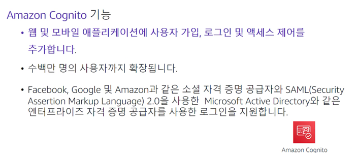  
Amazon Cognito는 **애플리케이션의 AWS 리소스에 대한 액세스를 제어**하는 솔루션을 제공한다.
역할(role)을 정의하고 사용자(IAM User)를 서로 다른 역할에 매핑하여 
애플리케이션에서 각 사용자에 대해 권한이 부여된 항목에만 액세스할 수 있도록 제어할 수 있다.

## AWS Shield
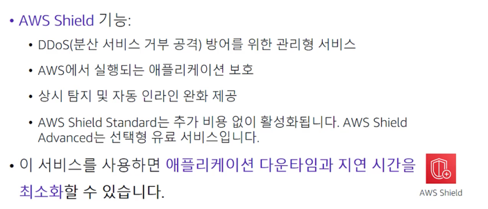  
AWS에서 **실행되는 애플리케이션을 보호하는 관리형 DDoS 공격 방어 서비스**이다.  
AWS Shield Standard는 추가 비용 없이 AWS 고객에게 자동으로 활성화된다.
AWS Shield Advanced는 **선택형 유료 서비스** 입니다. 
AWS Shield Advanced는 Amazon EC2, Elastic Load Balancing, Amazon CloudFront, AWS Global Accelerator 및 Amazon Route 53에서 실행되는 애플리케이션을 목표로 하는 더 정교하고 더 큰 규모의 공격에 대해 추가적인 보호를 제공합니다. 
AWS Shield Advanced는 모든 고객에게 제공됩니다. 그러나 **DDoS 대응팀의 지원을 받으려면 AWS Support의 Enterprise Support 또는 Business Support가 있어야 합니다.**

# AWS의 데이터 보안
  
AWS에서 암호화된 파일 시스템을 생성하면 모든 데이터 및 메타데이터가 
개방형 표준 고급 암호화 기술인 **AES-256** 암호화 알고리즘을 사용하여 저장시에 암호화된다.  

AWS KMS를 사용하면 암호화 및 복호화가 자동으로 투명하게 처리되므로 애플리케이션을 수정할 필요가 없다.
저장 데이터 및 메타데이터의 암호화를 요구하는 기업 또는 규제 정책이 적용되는 조직의 경우 데이터를 저장하는 
모든 서비스에서 암호화를 활성화하는 것이 좋다.

# 전송 중 데이터의 암호화
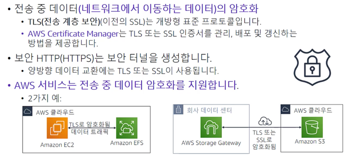
전송중인 데이터는 네트워크에서 이동하는 데이터를 나타낸다. **전송 중 데이터는 전송 계층 보안 즉 TLS 1.2를 사용하여 암호화된다.**
이 개방형 표준은 AES-256을 사용한다. TLS는 이전에 SSL이라는 명칭으로 불렸다.  

SSL 또는 TLS 인증서는 네트워크 통신을 보호하고 인터넷을 사용하는 웹 사이트의 자격증명을 설정하는 데 사용된다.
또한 프라이빗 네트워크에서 리소스의 자격증명을 설정할 수 있다.
**AWS Certificate Manager를 사용하면 인증서를 요청**한 후 로드 밸런서와 같은 AWS 리소스나 CloudFront 배포환경에 배포할 수 있다.
**AWS Certificate Manager에서 인증서 갱신도 처리할 수 있다.**  

HTTP를 통해서 실행되는 웹 트래픽은 안전하지 않다. 그러나 보안 HTTP 또는 HTTPS를 통해 실행되는 트래픽은 
TLS 또는 SSL을 통하여 암호화된다. HTTPS 트래픽은 양방향으로 암호화가 되므로 도청 및 중간자 공격으로부터 보호된다.  

* 첫 번째 예  
Amazon EFS 공유 파일 시스템을 탑재한 EC2 인스턴스의 예이다. 인스턴스와 EFS간의 모든 데이터 트래픽이 TLS 또는 SSL을 통해 암호화된다.  
  
* 두 번째 예  
AWS 클라우드 스토리지에 대한 온프레미스 액세스를 제공하는 
**하이브리드 클라우드 서비스인 AWS Storage Gateway를**(온프레미스 회사 데이터 센터 and AWS 클라우드의 S3) 사용하는 방법이다. 
이 예에서 Storage Gateway는 인터넷을 통해 Amazon S3에 연결되고 이 연결을 통해 전송중인 데이터가 암호화된다. 
  
# Amazon S3 버킷 및 객체 보안
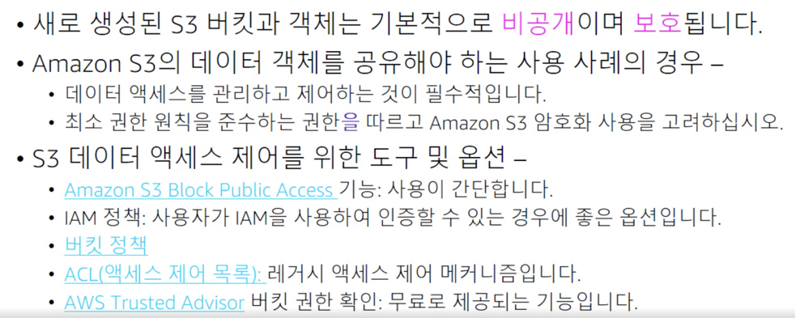  
기본적으로 Amazon S3 버킷은 비공개이며 명시적으로 액세스 권한이 부여된 사용자만 액세스 할 수 있다.
* Amazon S3 Block Public Access  
Amazon S3 퍼블릭 액세스 차단 기능을 사용하여 S3 버킷을 보호할 수 있다. 
이는 다른 정책 또는 객체 권한보다 우선하며 버킷을 생성할 때 기본적으로 활성화된다.
이 기능을 사용하면 Amazon S3 데이터의 의도치 않는 노출을 방지할 수 있다.

* IAM Policy  
특정 버킷 또는 객체에 액세스할 수 있는 사용자 또는 역할을 지정하는 IAM 정책을 작성할 수 있다. 이를 **리소스 정책**이라고도 한다.
일반적으로 리소스 정책 또는 버킷 정책은 사용자 또는 시스템이 Identity and Access Management를 사용하여 인증할 수 없을 때 사용된다.  

* Bucket Policy  
AWS 계정에 대한 액세스 권한을 부여하거나 Amazon S3 데이터에 대한 퍼블릭 또는 익명 액세스 권한을 부여하도록 버킷 정책을 구성할 수 있다.
버킷정책에서 거부문을 사용하여 액세스를 제한할 수 있다. 사용자에게 연결된 자격 증명 기반 정책에서 부여한 권한이 있는 사용자의 경우에도 액세스가 제한된다.  

* Bucket + ACL  
버킷에 액세스 제어 목록(Access Control List)을 설정하는 것도 버킷을 보호하는 방법이다. ACL을 사용하는 경우 개방적인 설정을 지양해야 한다.  

* AWS Trusted Advisor  
AWS Trust Adivisor는 계정의 버킷에 글로벌 액세스 부여 권한이 있는지 확인하는 데 유용한 도구인 **버킷 권한 확인 기능**을 제공한다.

# 규정 준수 보장 작업
이번 시간에는 규정 준수를 보장하는 방법을 다룬다.  

## 규정 준수 프로그램
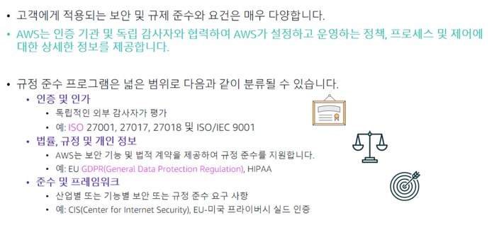  
규정 준수에는 정보 보안 관리 시스템의 설정, 구현, 유지 관리 및 지속적인 개선에 대한 요구사항을 명시한다.
인증을 지원하려면 엄격한 보안 프로그램을 개발하고 구현해야 한다.
정보 보안 관리 시스템에는 AWS가 전체적이고 종합적인 방법을 사용하여 보안을 관리히는 방법이 정의된다.
또한 AWS는 일반적인 규정 및 법률을 준수해야하는 고객을 지원하기 위해 만들어진 보안 기능 및 법적 계약도 제공한다.  
ex) Health Insurance and Probability Accountability Act : HIPAA  

## AWS Config
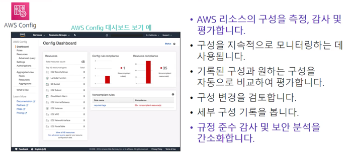  
AWS Config는 AWS 구성 기록을 유지하며 이를 통해 누가 무엇을 어디에서 변경하도록 허용할지 정의할 수 있다.
이를 위해 AWS Config는 **AWS 리소스 구성을 지속적으로 모니터링 하고 기록한다.**
AWS Config를 사용하면 **일련의 규칙을 기준으로 기록된 구성을 자동으로 평가**할 수 있다.
또한 AWS 리소스 간의 구성 및 관계 변경사항을 검토할 수 있다.  

대시보드에는 리소스들의 구성 규칙 여부를 보여준다. 규정을 미준수하는 리소스는 플래그가 지정된다.
AWS Config는 리전별 서비스이다. (글로벌 서비스가 아님) 여러 리전에 걸쳐 리소스를 추적하려면 사용할 모든 리전에서 해당 리소스를 활성화해야 한다.
AWS Config는 여러 리전 및 여러 계정의 리소스를 표시할 수 있는 집계 기능도 제공한다.

## AWS Artifact
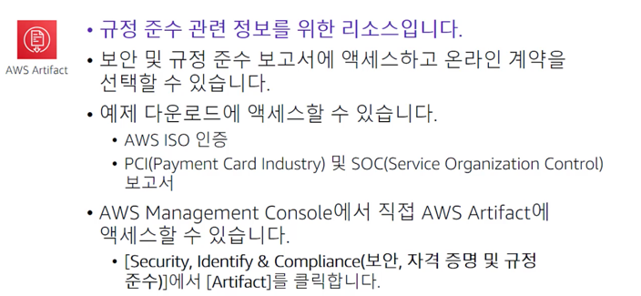  
AWS 보안 및 규정 준수 문서의 **온디맨드 다운로드를 제공**한다. 
보안 및 규정 준수 문서를 감사자에게 제출하여 AWS 인프라 및 서비스의 보안 및 규정 준수 상태를 입증할 수 있다.
이러한 문서를 자체 클라우드 아키텍처 및 회사 내부 제어의 유효성을 평가하기 위한 지침으로 사용할 수 있다. 
AWS Artifact은 AWS에 대한 문서만 제공한다. 애플리케이션의 보안과 규정 준수를 입증하는 문서를 작성하거나 갖추는 것은 AWS 고객의 책임이다.
AWS Artifact를 사용하여 Business Associate Agreement (BAA)와 같은 AWS 계약 및 검토를 수락하고 그 상태를 추적할 수 있다.
BAA는 보통 HIPAA에 따라 건강 정보를 보호해야하는 조직에 필요하다.  

AWS Artifact를 사용하면 AWS와의 계약을 수락하고 제한된 정보를 합법적으로 처리할 수 있는 AWS 계정을 지정할 수 있다.
여러 계정을 대신하여 계약을 수락할 수 있다. 여러 계정에 대한 계약을 수락하려면 AWS Organizations를 사용하여 조직을 생성해야한다.
