# 네트워킹 기본 개념
## 네트워크
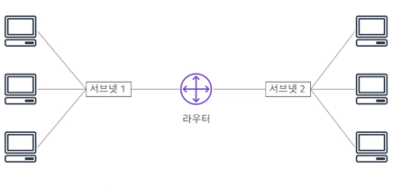  
컴퓨터 네트워크는 통신하기 위해 2대 이상의 머신이 함께 연결된 것이다.
네트워크는 **서브넷**이라는 논리적 분할을 할 수 있다.
네트워킹에는 **라우터 또는 스위치**와 같은 네트워킹 디바이스가 필요하다.

## IP Address
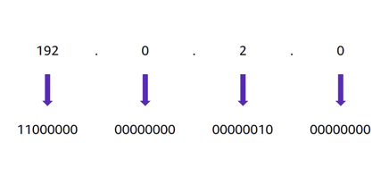  
네트워크의 각 머신에는 고유한 인터넷 프로토콜 주소가 할당된다.
즉, 머신을 **고유하게 식별**하기 위한 번호이다.
IP 주소는 10진수 체계의 A~D클래스 사이에 .(점)으로 구분되어 있고 이들을 **8비트 2진수 체계**(2^8=256가지의 10진수표현가능)로 변환한다.
즉, 각 클래스는 0~255까지의 수가 표현가능하고 IP주소는 총 32비트로 구성되어 있다.
32비트 IP주소를 IPv4주소라고 한다.  
IPv6는 128비트를 사용한다. 16비트 클래스(0~ffff)가 8개 존재한다.  

## CIDR (클래스 없는 도메인 간 라우팅)
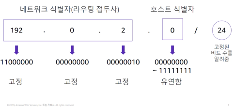  
네트워크를 설명하고 IP 주소를 그룹화하는 일반적인 방식은 클래스 없는 도메인 간 라우팅 (CIDR)이다.
CIDR 주소는 네트워크의 첫 번째 주소에 해당하는 IP 주소로 표현된다. 그다음에는 '/'문자가 온다.
'/'문자 뒤에는 네트워크 식별자에 대해 고정 또는 할당해야 하는 라우팅 접두사의 비트 수를 알려준다.
(24일경우 24비트가 네트워크 그룹임을 알려주므로, A, B, C클래스가 네트워크, D클래스는 호스트)  

## OSI (Open Systems Interconnection) 모델
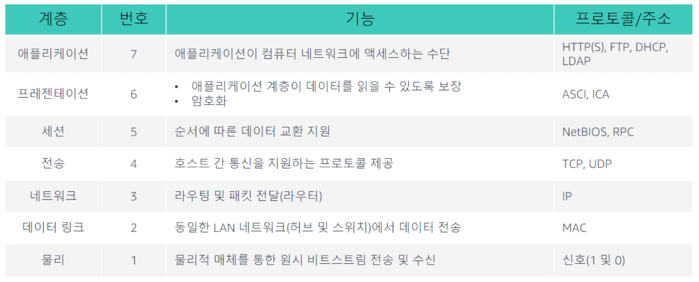  
OSI 모델은 네트워크를 통해 이동하는 데이터를 설명하는 데 사용되는 개념적 모델이다.
7계층으로 구성되며 각 계층에서 데이터를 전송하는 데 사용되는 공통 프로토콜 및 주소를 보여준다.
예를 들어 허브 및 스위치는 2계층 (데이터 링크 계층)에서 작동한다.
라우터는 3계층 (네트워크 계층)에서 작동한다.  

OSI 모델을 사용하면 클라우드와 기본 네트워킹 통신이 어떻게 이루어지는지 효과적으로 이해할 수 있다.

# Amazon VPC (Virtual Private Cloud)
물리적 네트워크의 개념은 대부분 클라우드 기반 네트워크에도 적용된다. 클라우드에서는 네트워크를 설정하는 데 있어서의 복잡성이 제어, 보안 및 사용성에 영향을 주지 않도록 추상화되어 있다.  
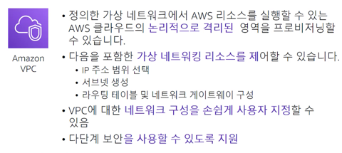  
* 논리적으로 격리된 공간 안에 가상 머신 및 기타 리소스를 배치할 수 있다.  
* VPC에서는 IPv4와 IPv6를 모두 사용하여 리소스와 애플리케이션에 안전하게 액세스할 수 있다.  
* 퍼블릭 인터넷에 액세스할 수 있는 웹 서버를 구축하기 위해 VPC를 서브넷으로 분할하고 퍼블릭 서브넷을 생성할 수 있다. 
  퍼블릭 인터넷 액세스가 전혀 없는 프라이빗 서브넷에 데이터베이스나 애플리케이션 서버 같은 백엔드 시스템을 배치할 수 있다. (네트워크 구성을 손쉽게 지정)
  
* 마지막으로 보안 그룹 및 네트워크 액세스 제어 목록을 비롯한 다중 보안 계층을 사용하여 각 서브넷에서 Amazon Elastic Compute Cloud (EC2) 인스턴스에 대한 액세스를 제어할 수 있다.

## VPC 및 서브넷
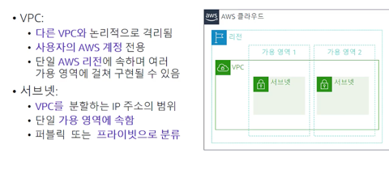  
VPC는 논리적으로 격리되어 고객전용 계정으로 구성된다. VPC는 **단일 리전**에 속하며 **여러 가용 영역**에 걸쳐 구현될 수 있다.
VPC를 생성한 후 하나 이상의 서브넷으로 분할할 수 있다. 서브넷은 자체 IP 주소 범위를 가진 VPC의 격리된 세그먼트를 나타낸다.  

**서브넷은 단일 가용 영역**에 속한다. 여러 가용 영역들 안에 서브넷을 생성하여 고가용성을 실현할 수 있다.
서브넷은 퍼블릭 또는 프라이빗일 수 있다. 퍼블릭 서브넷은 인터넷에 직접 액세스할 수 있지만, 프라이빗 서브넷은 인터넷에 직접 액세스할 수 없다.  

## IP 주소 지정
  
IP 주소는 VPC 내의 리소스가 서로 토인하고 인터넷을 통해 다른 리소스와도 통신할 수 있게 해준다. VPC를 생성할 때 VPC에 IPv4 CIDR 블록 즉, 프라이빗 IPv4 주소의 범위를 할당한다.
VPC를 생성한 후에는 주소 범위를 변경할 수 없으므로 신중해야 한다.  

32 - 16 = 16 : 2^16 = 65,536  
32 - 28 = 4 : 2^4 = 16  

실제로 활용할 수 있는 이 최대 및 최소 블록 수를 기억하는 것이 중요하다.  
IPv6 CIDR 블록을 VPC와 서브넷에 연결하고 그 블록에 속한 IPv6 주소를 VPC의 리소스에 할당할 수 있다.
서브넷의 CIDR 블록은 VPC의 CIDR 블록과 동일할 수 있다. 즉, 서브넷이 전체 VPC와 동일할 수 있다. 하지만 자체 CIDR 블록이 있는 서브넷을 사용하여 VPC를 세분화할 수도 있다.
이 같은 구조 덕분에 여러 개의 서브넷을 정의할 수 있다. VPC에 2개 이상의 서브넷을 만들 경우 서브넷의 CIDR 블록이 서로 중첩되지 않아야 한다. 동일한 VPC에 동일한 IP 주소가 존재해서는 안된다.  
VPC 가장 작은 서브넷 크기 : /28  
VPC에 구성할 수 있는 최대 IP 주소 범위 : /16

## 예약된 IP 주소
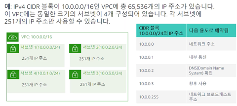  
서브넷을 생성할 때, 서브넷에는 자체 CIDR 블록이 필요하다. 
지정한 각 CIDR 블록에 대해 AWS는 해당 블록 내에 5개의 IP 주소를 예약하며 해당 주소는 사용할 수 없다.
서브넷에는 이론적으로 256개의 주소가 할당되지만, 5개의 예약된 주소로 인해 실질적으로 사용가능한 주소는 251개다.

## 퍼블릭 IP 주소 유형
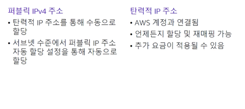  
VPC를 생성하면 해당 VPC의 모든 가상 머신에 자동으로 프라이빗 IP 주소가 할당된다.
또한 서브넷의 자동 할당 퍼블릭 IP 주소 속성을 수정하여 인스턴스를 생성할 때 가상 머신에 할당할 퍼블릭 IP 주소를 요청할 수도 있다.  

탄력적 IP 주소(Elastic IP)는 고정 퍼블릭 IPv4 주소이다. 계정의 어떤 VPC에 대해서든 탄력적 IP 주소를 인스턴스 또는 네트워크 인터페이스와 연결할 수 있다.
탄력적 IP 주소를 사용하면 주소를 VPC의 다른 인스턴스에 신속하게 다시 매핑하여 인스턴스의 장애를 감출 수 있다.
탄력적 IP 주소를 네트워크 인터페이스와 연결하면 인스턴스에 직접 연결하는 것보다 이점이 있다. 즉, 장애 발생 시 네트워킹 인터페이스의
모든 속성을 한 인스턴스에서 다른 인스턴스로 한 번에 옮길 수 있다.
탄력적 IP 주소를 사용할 경우 추가 요금이 발생할 수 있다. 따라서 더 이상 필요하지 않을 때 릴리스하는 것이 중요하다.  

## 탄력적 네트워크 인터페이스 
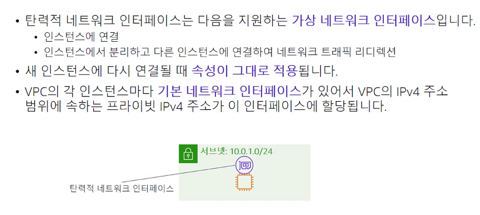  
탄력적 네트워크 인터페이스는 VPC의 인스턴스에 연결하거나 분리할 수 있는 가상 네트워크 인터페이스이다.
네트워크 인터페이스 속성은 다른 인스턴스에 다시 연결될 때 그대로 적용된다. 
네트워크 인터페이스를 인스턴스 간에 이동하면 네트워크 트래픽이 새 인스턴스로 리디렉션된다.
VPC의 각 인스턴스에는 주 네트워크 인터페이스라는 기본 네트워크 인터페이스가 있다. 이 인터페이스에는 파리이빗 IPv4 주소가 자동으로 할당되며 VPC의 IPv4 주소 범위내에 있다. 
기본 네트워크 인터페이스는 인스턴스에서 분리할 수 없다. 추가 네트워크 인터페이스를 생성하여 VPC의 모든 인스턴스에 연결할 수 있다.
연결 가능한 네트워크 인터페이스의 수는 사용중인 인스턴스 유형에 따라 달라진다.

## 라우팅 테이블 및 경로
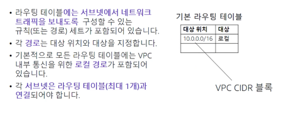  
라우팅 테이블에는 서브넷 안팎으로 네트워크 트래픽을 전달하는 경로라는 규칙 세트가 포함되어 있다.
각 경로는 대상 위치와 대상을 지정한다. 대상 위치는 서브넷에서 트래픽을 전달하려는 CIDR 블록이다. 대상은 트래픽이 전송되는 처리 리소스이다.
기본적으로 생성하는 모든 라우팅 테이블에는 로컬 경로가 포함되어 있다. 이는 VPC의 내부 통신용이다. 경로를 추가하여 라우팅 테이블을 사용자 지정할 수 있다.
로컬 경로 테이블 항목은 삭제할 수 없다. 이 항목은 내부 통신에 사용되며 고정되어 있고 변경되지 않는다.
VPC 내의 각 서브넷은 라우팅 테이블과 연결되어야 한다. 기본 라우팅 테이블은 VPC에 자동으로 할당되는 라우팅 테이블로, 사용자 지정 라우팅 테이블과 명시적으로 연결되지 않은 모든 서브넷의 라우팅을 제어한다.
서브넷은 한 번에 하나의 라우팅 테이블에만 연결할 수 있지만 여러 서브넷을 같은 라우팅 테이블에 연결할 수 있다. 즉, 라우팅 테이블을 여러 서브넷에 사용할 수 있지만, 서브넷과 라우팅 테이블 간의 매핑은 1대 1로 이루어진다.

# 데모
VPC 생성
1. 탄력적 IP 주소 생성  
   VPC 마법사는 NAT 게이트웨이를 시작하여 프라이빗 리소스에 대한 인터넷 액세스를 제공한다. 프라이빗 리소스는 실제로
   프라이빗 서브넷에 구축하는 리소스 유형이다. 이러한 프라이빗 리소스는 공용 인터넷에 액세스하기 위해 기본적으로 NAT 게이트웨이를 사용한다.
   NAT 게이트웨이에는 탄력적 IP 주소라는 고정 IP 주소가 할당된다. 탄력적 IP 주소는 NAT 게이트웨이 같은 VPC의 리소스 또는 EC2 인스턴스에 연결할 수 있다.
   탄력적 IP 주소는 AWS에 반환할 때까지 사용자가 제어할 수 있다.  
   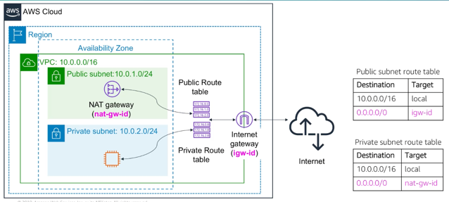  
   

2. VPC 생성
   VPC 대시보드에서 VPC Wizard(Launch VPC Wizard)를 시작한다.  
   * 단일 퍼블릭 서브넷으로 구성된 VPC (VPC with a Single Public Subnet)  
     이는 본질적으로 인터넷에 연결된 단일 퍼블릭 서브넷이다. 전적으로 AWS 클라우드에서 동작하는 애플리케이션에 이상적이다.
   * 퍼블릭 및 프라이빗 서브넷으로 구성된 VPC (VPC with Public and Private Subnets)  
     인터넷에 연결된 리소스를 위한 퍼블릭 서브넷과 백엔드 리소스용 프라이빗 서브넷으로 구성된 것이다. 
     또한 프라이빗 서브넷의 리소스에 대한 인터넷 액세스를 제공하기 위해 해당 게이트웨이는 시작된다.
     이는 프라이빗 리소스를 공용 인터넷으로부터 분리하는 데 적합하다.
   * 퍼블릭 및 프라이빗 서브넷과 하드웨어 VPN 액세스로 구성된 VPC (VPC with Public and Private Subnets and Hardware VPN access)  
     퍼블릭 서브넷과 프라이빗 서브넷이 생성되고 기존 기업 데이터 센터에 대한 가상 프라이빗 네트워크 연결이 생성된다.
     이는 데이터 센터에 네트워크로서 AWS 클라우드에 연결할 수 있는 레거시 인프라가 있는 경우에 이상적이다.
   * 프라이빗 서브넷과 하드웨어 VPN 액세스 (VPC with a Private Subnet Only and Hardware VPN access)  
     VPN 연결을 통해 기업 데이터 센터에 연결된 프라이빗 서브넷으로 구성된 VPC. 
     이는 AWS 클라우드로 버스팅하여 추가 리소스를 제공하는 동시에 인터넷 액세스로부터 완전히 안전한 상태로 유지하는 데 이상적이다.
     이 설계 방식은 실제 인터넷 액세스가 필요없는 개발 및 테스트에 주로 사용된다.

     
3. Internet gateways  
   게이트웨이는 하나의 VPC에 연결된다. 게이트웨이에 연결된 VPC는 공용 인터넷에 접근이 가능하다.

   
4. Subnets  
   서브넷은 VPC의 세그먼트 혹은 슬라이싱이다. 따라서 서브넷은 특정 VPC에 속하며 항상 단일 가용 영역에 존재한다. 반면 VPC는 여러 가용영역에 걸쳐 존재할 수 있다.
   하지만 가용영역과 서브넷 간의 관계는 1대 1 매핑이다. 서브넷에는 IP 주소 범위가 있다. 이는 일반적으로 상주하는 VPC에 할당된 전체 IP주소의 하위 집합이다.  
   
   퍼블릭 서브넷의 D클래스가 호스트의 집합이라면 (A, B, C 클래스는 네트워크) 256개의 IP 가 할당가능하며 이중 5개는 예약된 것이므로 251개가 남는다.
   그러나, NAT 게이트웨이에 할당된 IP가 하나 있으므로 사용가능한 IP주소의 갯수는 250개가 뜬다.  
   퍼블릭 서브넷의 Route Table을 클릭하면 해당 서브넷이 라우팅된 경로를 확인할 수 있다. 자기가 속한 VPC의 경로(local)과 공용 인터넷을 의미하는 0.0.0.0/0 (target : igw~~)이 있다.
   이 경로 항목은 인터넷 게이트웨이에서 모든 트래픽을 처리하도록 지시한다. 라우팅 규칙은 슬래시 다음의 숫자가 큰 가장 제한적인 항목부터, 가장 덜 제한적이고 전체 인터넷을 의미하는 0.0.0.0/0 순서로 평가된다.
   트래픽은 VPC내로 먼저 전송되고 VPC 범위 내에 있는 경우 인터넷으로 전송된다. 특정 네트워크 구성에 따라 규칙을 편집할 수 있다.    
   
   프라이빗 서브넷은 리소스가 할당되어 있지 않기 때문에 사용가능한 IP주소의 갯수는 251개이다. 게이트웨이에 할당된 IP가 없다.
   프라이빗 서브넷의 Route Table탭을 선택하면 local 경로가 있어 VPC 내부에서는 통신이 가능하지만 0.0.0.0/0 경로의 target을 보면 인스턴스(nat~~)에 의해 처리되고 있다.
   이는 **프라이빗 서브넷에서 공용 인터넷으로의 단방향 연결**을 의미한다.
   NAT 게이트웨이는 프라이빗 서브넷 내의 리소스에 대한 패치와 업데이트를 구현할 수 있도록 트래픽을 제공한다.

   
5. Network ACLs  
   네트워크 액세스 제어 목록은 서브넷 안팎으로 전송되는 트래픽을 제어하는 방화벽 역할을 하는 VPC에 대한 선택적 보안 계층이다.
   네트워크 ACL은 일반적으로 서브넷 안팎으로 전송되는 모든 트래픽을 허용하는 기본 설정으로 둔다.  
   Inbound Rules 탭을 보면 서브넷으로의 인바운드 트래픽 (들어오는 트래픽)을 허용 여부를 확인할 수 있다. Outbound Rules는 그 반대이다.
   트래픽이 번호가 매겨진 규칙 중 어느것과도 일치하지 않는 경우 Rule의 번호가 * (와일드 카드)인 규칙이 적용된다. 

6. Security Group  
   보안 그룹은 실제로 또 하나의 보호 계층으로서 방화벽 역할을 한다. 기본적으로 VPC와 같은 인프라를 프로비저닝할 때
   사전 제작된 네트워크 ACL은 개방되어 있다. 하지만 존재하는 실제 리소스의 안팎으로 전송되는 트래픽을 보호할 수 있도록 보안 그룹을 제공한다.
   
* 태그  
VPC의 Tags 탭에서 확인할 수 있다. 태그라는 개념은 이름을 key-value 페어와 관련하여 설정한 표시다.
  
* Flow logs  
VPC의 Flow logs 탭에서 확인할 수 있다. 기본적으로 VPC, 특정 서브넷 또는 특정 네트워크 인터페이스 안팎으로 이동하는 모든 관련 트래픽을 
  캡처하는 로깅 매커니즘이다.

# VPC 네트워킹
VPC 네트워킹 옵션에 대해 알아보자.  
## 인터넷 게이트웨이
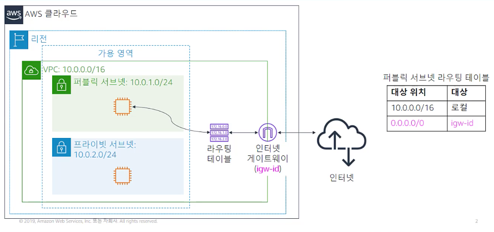  
인터넷 게이트웨이는 **확장 가능하며 이중화**를 지원하는 고가용성 VPC 구성 요소로서, 
VPC의 인스턴스와 퍼블릭 인터넷 간 통신이 가능한 이유도 인터넷 게이트웨이가 있기 때문이다.
인터넷 게이트웨이를 사용하는 목적은 두 가지다.  

1. 인터넷 트래픽에 대해 VPC 라우팅 테이블의 대상을 제공한다.
2. 퍼블릭 IPv4 주소가 할당된 인스턴스의 네트워크 주소 변환을 수행한다.  

서브넷을 퍼블릭으로 구성하려면 VPC에 인터넷 게이트웨이를 연결하고 서브넷과 연결된 라우팅 테이블에 라우팅 항목을 추가한다.  

## NAT (Network Address Translation) 게이트웨이
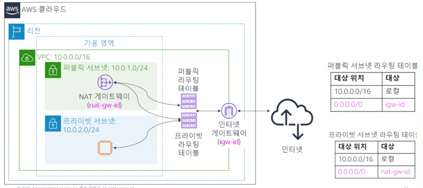  
네트워크 주소 변환, 즉 NAT 게이트웨이를 사용하면 프라이빗 서브넷의 인스턴스가 인터넷 또는 다른 AWS 서비스에 연결할 수 있다.
하지만 NAT 게이트웨이는 공용 인터넷이 프라이빗 서브넷 인스턴스와의 연결을 시작하지 못하게 한다. (아웃바운드 ok, 인바운드 x)  
NAT 게이트웨이를 생성하려면 NAT 게이트웨이가 상주할 퍼블릭 서브넷을 지정해야 한다. NAT 게이트웨이를 생성할 때 NAT 게이트웨이와 연결할 탄력적 IP 주소도 지정해야 한다.
NAT 게이트웨이를 생성한 후에는 인터넷 바운드 트래픽이 NAT 게이트웨이를 가리키도록 하나 이상의 프라이빗 서브넷과 연결된 라우팅 테이블을 업데이트 해야 한다.
그러면 프라이빗 서브넷의 인스턴스가 인터넷과 통신할 수 있다. NAT 게이트웨이 대신 VPC의 퍼블릭 서브넷에 NAT 인스턴스를 사용할 수도 있다.
하지만 NAT 게이트웨이는 향상된 가용성 더 높은 대역폭, 관리 부담이 더 적은 환경을 제공하는 관리형 서비스이므로 NAT 인스턴스 대신 NAT 게이트웨이를 사용하는 것이 좋다.  
**정리 : 프라이빗 서브넷 인스턴스 -> 프라이빗 라우팅 테이블 -> 퍼블릭 서브넷 NAT 게이트웨이 -> 퍼블릭 라우팅 테이블 -> 인터넷 게이트웨이 -> 공용 인터넷**

## VPC 공유 (Share)
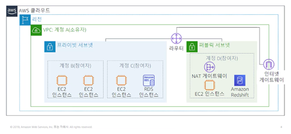  
VPC 공유를 통해 고객은 동일한 조직 내의 다른 AWS 계정과 서브넷을 공유할 수 있다.
VPC 공유를 사용하면 여러 AWS 계정에서 Amazon EC2 인스턴스, Amazon Relational Database Service, Amazon Redshift 클러스터 및 AWS Lambda 함수와 같은 애플리케이션 리소스를
중앙 관리형 공유 VPC로 생성할 수 있다. 이 모델에서 VPC를 소유하는 계정은 동일한 조직에 속한 참여자라는 다른 계정과 한 개 또는 여러 개의 서브넷을 공유한다.
서브넷을 공유한 후 참여자는 공유된 서브넷의 해당 애플리케이션 리소스를 보고, 생성, 수정, 삭제할 수 있다.

## VPC 피어링
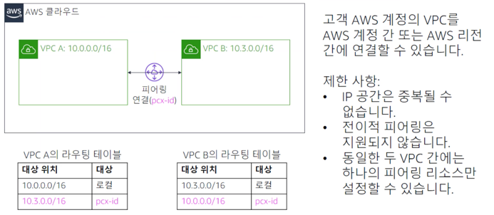  
VPC 피어링 연결을 사용하면 **두 VPC 간에 트래픽을 프라이빗으로 라우팅**할 수 있다.
양쪽 VPC의 인스턴스가 동일 네트워크에 있는 것처럼 서로 통신할 수 있다. 
**고객의 자체 VPC 간**에 VPC 피어링 연결을 생성하거나 **다른 AWS 계정에 속한 VPC** 또는 **다른 리전에 있는 VPC**와의 VPC 피어링 연결을 생성할 수 있다.
VPC 피어링 연결을 설정할 때에는 VPC가 피어링 리소스를 통해 서로 통신할 수 있도록 라우팅 테이블에 규칙을 생성한다. 
예를 들어 VPC가 2개 있다고 가정하자. VPC A의 라우팅 테이블에서 대상 위치를 VPC B의 IP 주소로 설정하고 대상을 피어링 리소스 ID로 설정한다.
VPC B의 라우팅 테이블에서 대상 위치를 VPC A의 IP 주소로 설정하고 대상을 피어링 리소스 ID로 설정한다.  

VPC 피어링에는 몇 가지 제한 사항이 있다.
1. IP 주소 범위는 중첩될 수 없다.
2. 동일한 두 VPC 간에는 하나의 피어링 리소스만 설정할 수 있다.
3. 전이적 피어링은 지원되지 않는다.  
   즉, VPC의 트래픽이 두 번째 VPC로 전송되고 거기에서 멈춘다. 세 번째 VPC로는 전달되지 않는다.

## AWS 사이트 간 VPN
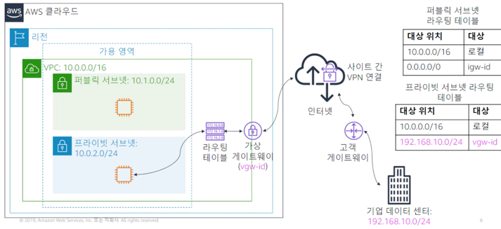  
기본적으로 Amazon VPC로 시작하는 인스턴스는 자체 원격 네트워크와 통신할 수 없다.
VPC에 가상 프라이빗 게이트웨이를 연결하고, 
사용자 지정 라우팅 테이블을 생성하고, 
보안 그룹 규칙을 업데이트하고, 
AWS 사이트 간 VPN 연결을 생성하고, 
연결에 트래픽을 전달하도록 라우팅을 구성하여 VPC에서 원격 네트워크에 액세스하도록 할 수 있다.

## AWS Direct Connect
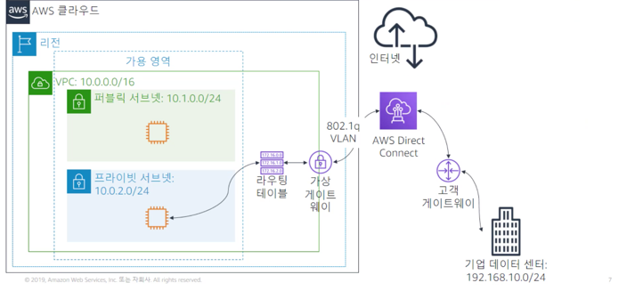  
네트워크 통신에서 중요한 문제 중 하나는 네트워크 성능이다. 데이터 센터가 AWS 리전에서 멀리 떨어져 있는 경우 성능에 부정적인 영향을
줄 수 있다. 이러한 상황을 해결하기 위해 AWS는 AWS Direct Connect를 제공한다.
AWS Direct Connect를 사용하면 네트워크와 Direct Connect 로케이션 중 하나 간에 전용 프라이빗 연결을 설절할 수 있다.
이 프라이빗 연결은 대역폭 처리량을 높이고 인터넷 기반 연결 또는 VPN 연결보다 더 일관된 네트워크 환경을 제공한다.
Direct Connect는 개방형 표준 802.1q 가상 로컬 영역 네트워크를 사용한다.  

## VPC 엔드포인트 (Endpoint)
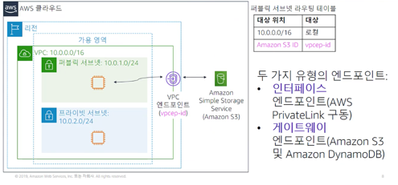  
경우에 따라 VPC 리소를 Amazon S3 및 DynamoDB와 같은 AWS 리전별 서비스에 연결해야 한다.
VPC 엔드포인트는 지원되는 AWS 서비스에 VPC를 비공개로 연결할 수 있는 **가상 디바이스**이다.
VPC 게이트웨이 엔드포인트는 Amazon S3 또는 Amazon DynamoDB로 전달되는 트래픽에 대한 라우팅 테이블에서 경로의 대상으로 지정하는 게이트웨이다.
VPC와 서비스 간의 트래픽은 Amazon 네트워크를 벗어나지 않으므로 비공개로 유지된다. 
최근에 AWS는 AWS PrivateLink를 도입했다. 이 서비스에는 VPC 인터페이스 엔드포인트가 필요하다.
AWS PrivateLink는 공용 인터넷에 데이터가 노출되지 않도록 하여 클라우드 기반 애플리케이션과 공유된 데이터 보안을 간소화한다.
AWS PrivateLink는 VPC, AWS 서비스 온프레미스 애플리케이션 간 비공개 연결을 제공한다.
모든 트래픽은 Amazon 네트워크에서 안전하게 전송된다. AWS PrivateLink를 사용하면 여러 계정과 VPC에 걸쳐 손쉽게 서비스에 연결하여 네트워크 아키텍처를 상당히 간소화할 수 있다.

## AWS Transit Gateway
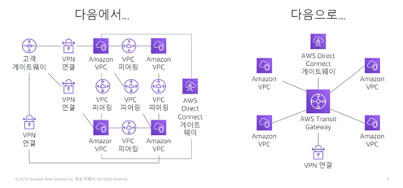  
앞서, 두 VPC를 연결하기 위한 VPC 피어링 개념을 언급했다. 수백 개의 VPC를 어떻게 서로 연결할지 생각해보자.
각 VPC 페어에는 전용 VPC 피어링 연결이 필요하다. 이런 경우 연결의 복잡성이 큰 부담이 될 수 있다.  

Transit Gateway는 VPC를 상호 연결하는 데 사용하는 네트워크 전송 허브이다. 온프레미스 네트워크를 연결할 수도 있다.
VPC, AWS Direct Connect 게이트웨이 또는 VPN 연결을 Transit Gateway에 연결할 수 있다.
토폴로지가 허브 앤 스포크 역할을 하므로 필요한 연결 수와 구현의 복잡성이 줄어들고, 유지 관리가 가능해진다.  
(허브 앤 스포크 : https://md2biz.tistory.com/465)

# VPC 보안
다양한 방법으로 VPC 아키텍처에 보안을 구축하여 수신 트래픽과 발신 트래픽 모드를 완벽하게 제어할 수 있다.
이번 섹션에서는 VPC를 보호하는데 사용할 수 있는 Amazon VPC 2가지 방화벽 옵션에 대해 알아본다.  

1. 보안 그룹 (Security Group)  
   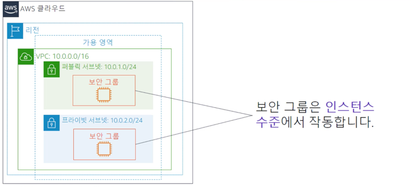
   보안 그룹은 **인스턴스에 대한** 인바운드 및 아웃바운드 트래픽을 제어하는 방화벽 역할을 한다.
   구체적으로 네트워크 인터페이스 카드가 여기에 해당한다. VPC의 각 인스턴스를 서로 다른 보안 그룹 세트에 할당할 수 있다.  
       
   보안 그룹은 EC2 인스턴스에 대한 방화벽과 같다. 기본 보안 그룹은 아웃바운드 트래픽은 모두 허용하지만, 모든 인바운드 트래픽은 거부한다. (밀폐성)
   보안 그룹은 상태를 저장한다.  
   보안 그룹은 **허용 규칙**만 지원한다.
   
   
2. 네트워크 액세스 제어 목록 (Network Access Control List) - **선택적**
   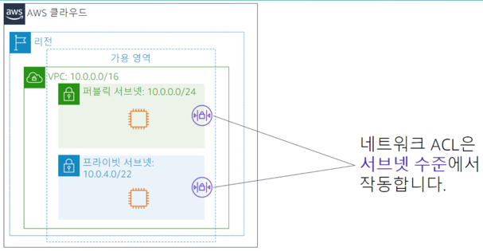  
   NACL은 서브넷 수준에서 작동하며 서브넷에서 송수신되는 트래픽을 제어한다. **포트 및 프로토콜**을 설정할 수 있다.  
   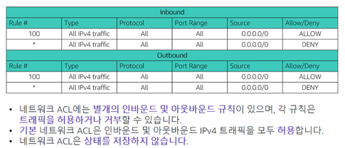  
   서브넷을 ACL에 명시적으로 연결하지 않은 경우 **기본 네트워크 ACL**(위의 표)이 사용된다. NACL은 **여러 서브넷에 연결될 수** 있다.
   반대로 서브넷은 하나의 ACL에만 연결할 수 있다. (N:1)  
   ACL은 상태를 저장하지 않는다. 즉, 요청이 처리된 후에는 요청에 대한 정보가 유지되지 않는다.  
   ACL을 사용하는 경우 개별 인바운드 및 아웃바운드 규칙을 구성해야 한다.  
   NACL은 **허용 규칙, 거부 규칙**을 지원한다.
   
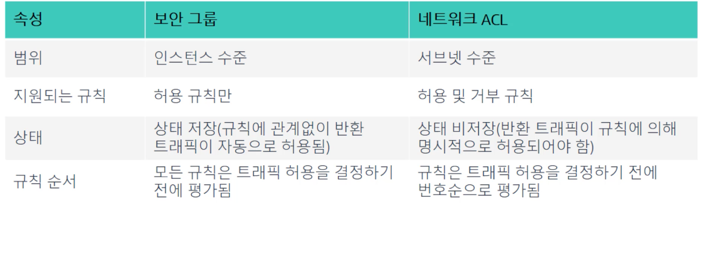  
보안 그룹의 경우 트래픽 허용을 결정하기 전에 모든 규칙이 평가된다.
NACL은 일치하는 항목이 발견되고 트래픽이 허용 또는 거부될 때까지 번호순으로 규칙이 평가된다.

# Amazon Route 53
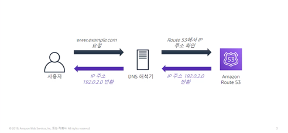  
DNS 해석은 내부 이름을 해당하는 IP 주소로 변환하는 프로세스다. DNS 프로토콜은 Domain Name System을 나타내며
전화번호부와 같은 기능을 한다. DNS는 인터넷 이름을 해당하는 머신의 IP 주소로 대체한다.  
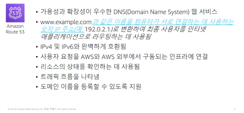  
Amazon Route 53는 yourcompany.com과 같은 도메인 이름을 등록하고 서비스를 통해 해당 도메인과 관련된 이름 및 호스트를 처리할 수 있는 기능을 제공한다.
Route 53는 확장 가능한 고가용성 서비스이며 IPv4 및 IPv6 주소와 완벽하게 호환된다.  

## Amazon Route 53 지원 라우팅
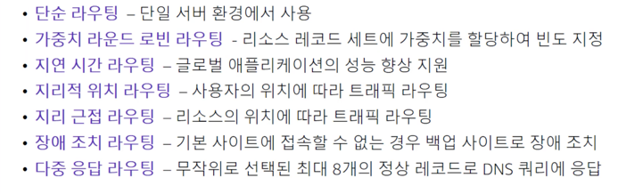  
Amazon Route 53는 여러 유형의 라우팅 정책을 지원한다. 라우팅 정책에 따라 서비스에서 이름 확인 쿼리에 응답하는 방식이 결정된다.  
**단순 라우팅**을 사용하는 경우 표준 DNS 레코드를 구성할 수 있다. 단순 라우팅에서는 웹 사이트의 웹 서버와 같은 단일 리소스로 트래픽을 라우팅한다.  
**가중치 기반 라우팅**에서는 리소스 레코드 세트에 가중치를 할당하여 각 응답이 처리되는 빈도를 지정할 수 있다. 블루/그린 배포라고도 하는 A/B 테스트를 수행하려는 경우에도 이 기능을 사용할 수 있다.
블루/그린 배포에서는 소프트웨어가 변경된 서버로 트래픽의 일부를 전송하여 모든 기능이 작동하는 지 확인하는 것이다.
예를 들어 트래픽의 99%를 시스템 A로 전송하고 프로덕션 배포 전에 약간의 수정이 구현된 시스템 B로 트래픽의 1%를 전송할 수 있다.  
최대한 빠른 방법으로 응답을 수신해야 하는 경우에는 **지연 시간 기반 라우팅**을 사용할 수 있다. Route 53는 가장 빠르게 응답을 전송할 수 있는 방법을 결정한다.
그러나 가장 짧은 경로가 항상 사용되는 것은 아니다. 이 최단 경로가 포화상태일 경우 속도가 느려지기 때문이다.  
**지리 위치 라우팅**을 사용하면 사용자의 지리적 위치에 따라 트래픽을 처리할 리소스를 선택할 수 있다. 지리 위치 라우팅은 지리적 위치의 관점에서 요청이 시작된 위치를 결정한 후 서비스에 가장 가까운 액세스 포인트의 주소를 사용하여 응답한다.
지리 위치 라우팅을 사용하는 경우 콘텐츠를 현지화하고 웹 사이트의 일부 또는 전체를 사용자가 있는 지리적 위치의 언어로 표시할 수 있다. 
또한 지리 위치 라우팅을 사용하면 배포 권한이 있는 지리적 위치에만 콘텐츠를 배포하도록 제한할 수 있다.  
웹 사이트 중단을 감지한 후 애플리케이션이 올바르게 작동되는 대체 위치로 사용자를 리디렉션해야 하는 경우라면 **장애 조치 라우팅** 또는 DNS 장애 조치를 사용할 수 있다.
장애 조치 라우팅을 사용하려면 상태 확인을 구성해야 한다. 상태 확인에 실패하는 경우 보조 주소가 배포된다. 다른 라우팅 옵션을 다중 값 응답으로 결합할 수도 있다.

## 사용 사례 : 다중 리전 배포
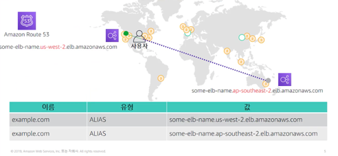  
여기에는 지리 위치를 사용한 다중 리전 배포의 예제가 나와 있다. Amazon Route 53를 사용하는 경우 사용자는 가장 가까운 Elastic Load Balancing 로드 밸런서로 자동으로 연결된다.
Route 53의 다중 리전 배포를 사용하는 경우, 지연 시간 기반 라우팅의 대상을 리전으로 설정하고 로드 밸런싱 라우팅의 대상을 다음 가용 영역으로 설정할 수 있다.

## Amazon Route 53 DNS 장애 조치
  
Amazon Routing 53 DNS 장애 조치를 사용하면 애플리케이션에 대한 백업 및 장애 조치 시나리오를 구성하여 AWS에서 실행되는 애플리케이션의 가용성을 개선할 수 있다. 
DNS 장애 조치를 사용하면 AWS에서 고가용성 다중 리전 아키텍처를 구현할 수 있다. 이 경우 웹 애플리케이션, 웹 서버 및 기타 리소스의 상태 및 성능을 모니터링해야 하므로 상태 확인이 필요하다.
지정된 리소스 (예: 웹 서버)의 상태, 다른 상태 확인의 상태 및 Amazon CloudWatch 경보의 상태 중 하나를 모니터링하는 상태 확인을 생성할 수 있다.

## 멀티 티어 웹 애플리케이션의 DNS 장애 조치
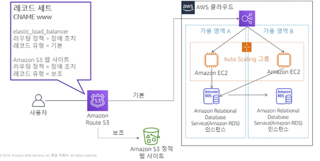  
여기에 멀티 티어 웹 애플리케이션을 위한 일반적인 아키텍처에서 DNS 장애 조치가 작동하는 방식이 나와 있다.
Route 53가 트래픽을 로드 밸런서로 전달하면 로드 밸런서가 EC2 인스턴스 플릿으로 트래픽을 분산한다.
고가용성을 보장해야 하는 경우 장애 조치 라우팅 정책을 사용하여 호스트 www에 대한 DNS 레코드 2개를 생성할 수 있다.  
첫 번째 레코드는 기본 레코드이며 웹 애플리케이션의 ELB 로드 밸런서를 가리킨다.  
두 번째 레코드는 보조 레코드이며 특정 Amazon S3 버킷에서 호스팅 되는 정적 웹 페이지를 가리킨다.  
이 버킷은 웹 사이트로 구성된다. Route 53 상태 확인은 기본 사이트의 가용성을 확인한다. 상태 확인에 실패하면 정적 스플레시 페이지가 배포된다.
이 정적 페이지는 고객에게 서비스를 복원 중임을 알린다.

# Amazon CloudFront
## 콘텐츠 전송 및 네트워크 (CDN) 지연 시간
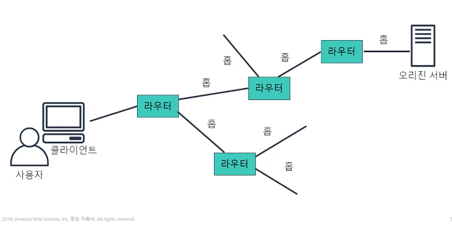  
네트워크 통신에서 중요한 문제 중 하나는 네트워크 성능이다. 사용자가 웹 사이트를 탐색할 때 사용자의 요청은 다양한 네트워크를 통해 라우팅된다.
오리진 서버에는 이미지, 노래 또는 동영상 같이 일반적으로 밀도가 높은 데이터의 원본 버전이 저장된다.
고객과 원본 데이터 서버 간의 거리는 재생 성능 및 사용자 경험에 큰 영향을 미친다.
또한 네트워크 지연 시간은 사용자의 지리적 위치에 따라 달라진다. 따라서 원활한 사용자 경험을 제공하려면
콘텐츠 전송 네트워크를 사용하는 것이 필수적이다. 

## Amazon CloudFront
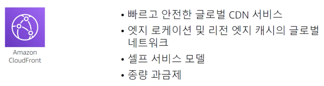  
Amazon CloudFront는 빠른 전송 속도로 안전하게 데이터를 전송하는 고속 콘텐츠 전송 서비스이다. 
이 서비스는 개발자 친화적인 환경을 제공한다. CloudFront는 엣지 로케이션의 글로벌 네트워크를 통해 사용자에게 파일을 전송한다.
이 서비스는 계약 협상, 높은 요금 또는 최소 요금 없이 고성능 콘텐츠 전송의 이점을 누릴 수 있다는 점에서 기존의 콘텐츠 전송 솔루션과 다르다.
다른 AWS 서비스와 마찬가지로 Amazon CloudFront는 사용한 만큼 요금을 지불하는 셀프 서비스로 제공된다.

## Amazon CloudFront 인프라
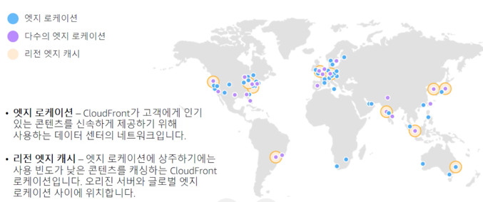  
Amazon CloudFront는 Route 53의 지리 위치 라우팅을 사용한다. 기본적으로 고객이 요청을 하면 Route 53가 전 세계에서 고객의 위치를 파악하고
해당 고객과 가장 가까운 에지 로케이션의 IP 주소로 응답한다. CloudFront는 데이터가 일반적으로 상주하는 위치에서 
데이터를 확보하여 엣지 로케이션에 복사한다. 그러면 고객의 사용자 경험이 시작된다.
오래된 데이터는 새 콘텐츠를 위한 공간을 확보하기 위해 엣지 로케이션의 캐시에서 제거된다.
고객은 TTL (Time-to-Live)을 사용하여 캐시 데이터의 만료 기간을 정의할 수 있다. TTL은 데이터 캐시가 유효한 상태로 유지되는 시간을 정의한다.

