# Amazon Elastic Block Store (Amazon EBS)
Amazon EBS는 Amazon EC2 인스턴스에서 사용할 수 있는 영구 블록 스토리지 볼륨을 제공한다.
영구 스토리지는 해당 디바이스의 전원이 차단된 후 데이터를 보존하는 데이터 스토리지 디바이스(비휘발성)이다.
각 Amazon EBS 볼륨은 **자동으로 가용 영역 내에 복제**되므로 구성 요소에 장애가 발생하더라도 안전하다. (내결함성)
Amazon EBS 볼륨은 워크로드 실행에 필요한 지연 시간이 짧고 일관된 성능을 제공한다.
Amazon EBS를 사용하면 몇 분 내에 사용량을 많게 또는 적게 확장할 수 있으며 프로비저닝한 부분에 대해서만 저렴한 비용을 지불한다.

## AWS 스토리지 옵션 : 블록 스토리지와 객체 스토리지 비교
  
스토리지 유형 간의 중요한 차이점 중 하나는 블록 수준 스토리지를 제공하는지 객체 스토리지를 제공하는지 여부이다.
블록 스토리지는 변경된 데이터만 업데이트 하는 장점이 있다. 일반적으로 블록 스토리지 솔루션은 더 빠르고 사용하는 대역폭은 적지만
객체 수준 스토리지보다 비용은 많이 드는 단점이 있다.  

## Amazon EBS
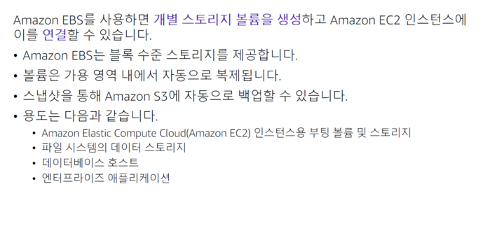  
Amazon EBS를 사용하면 개별 스토리지 볼륨을 생성하고 Amazon EC2 인스턴스에 연결할 수 있다.
Amazon EBS는 Amazon EC2 인스턴스를 위한 내구성이 뛰어난 분리 가능한 블록 수준 스토리지를 제공한다.
**볼륨이 인스턴스에 직접 연결되므로 데이터가 저장되고 사용되는 인스턴스의 지연 시간이 짧아진다. 고로 데이터베이스를 실행하기에 적합하다.**
Amazon EBS 볼륨의 백업을 **스냅샷**이라고 한다. 첫 번째 스냅샷을 **기준 스냅샷**이라고 하며 기준 스냅샷 이후의 다른 모든 스냅샷은 **이전 스냅샷과 다른 부분만 캡처**(블록 스토리지 방식)한다.
Amazon EBS 볼륨은 보통 EC2 인스턴스의 부트 볼륨 및 스토리지로 사용된다.  

## Amazon EBS 볼륨 유형
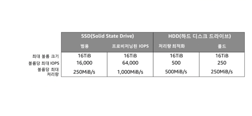  
워크로드에 가장 적합한 스토리지 유형을 선택하면 스토리지 비용을 줄일 수 있다. 
프로비저닝된 IOPS SSD 기반 Amazon EBS 볼륨은 최고의 성능을 제공할 수 있다.
하지만 애플리케이션에 높은 성능이 필요하지 않거나 이만큼 높은 성능을 사용하지 않는 경우라면 범용 SSD로 충분하다.
추가 스토리지로 사용하려는 경우 또는 부트 볼륨 외의 사용 사례에는 비용이 저렴한 옵션이 적합할 수 있다.
인스턴스의 시스템 드라이브 또는 데이터베이스 애플리케이션용 스토리지 등 자주 업데이트해야 하는 데이터의 경우 Amazon EBS 볼륨을 기본 스토리지로 사용할 수 있다.
또한 연속 디스크 스캔을 수행하는 처리량이 많은 애플리케이션에도 사용할 수 있다. EC2 인스턴스의 **부팅 볼륨으로는 SSD만** 사용될 수 있다.

## Amazon EBS 기능
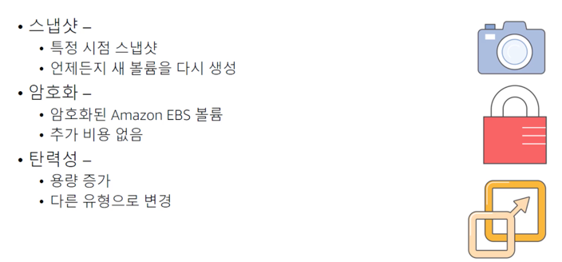  
Amazon EBS의 데이터 내구성을 훨씬 더 높은 수준으로 올리려면 볼륨의 특정 시점 스냅샷을 생성하고 스냅샷에서 언제든지 새 볼륨을 재생성할 수 있다.
또한 스냅샷을 공유하거나 **다른 AWS 리전으로 스냅샷을 복사**하면 재해 복구 보호를 한층 더 강화할 수 있다.
또한 추가 비용 없이 Amazon EBS 볼륨을 **암호화**할 수도 있다. 이렇게 하면 전송 중인 데이터가 암호화된다. 
EBS 볼륨의 용량을 동적으로 늘리고 다른 유형으로 변경 또한 가능하다. 즉, 하드 디스크 드라이브를 SSD로 변경하거나 50기가바이트 볼륨에서 16테라바이트 볼륨으로 늘릴 수 있다.
인스턴스를 중지할 필요 없이 크기 조정 작업을 동적으로 수행할 수 있다.  

## Amazon EBS : 볼륨, IOPS 및 요금
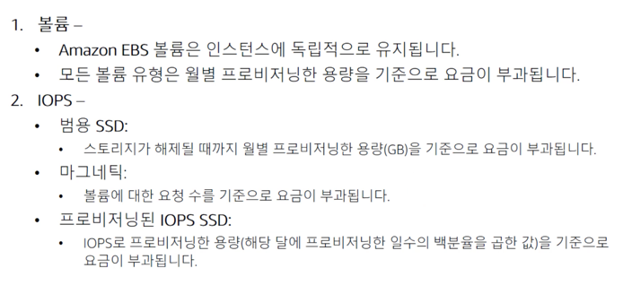  
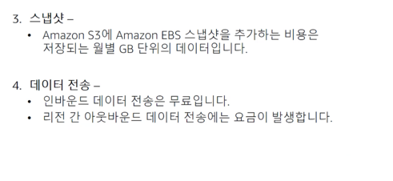  
여기에는 Amazon EBS 비용을 추정할 때 유의해야 할 며 가지 중요한 사항이 나와있다.
모든 EBS 볼륨 유형의 스토리지는 **스토리지 해제 시점까지 매월 프로비저닝 하는 용량(GB)을 기준**으로 요금이 청구된다.
범용 SSD 볼륨 요금에는 입/출력이 포함된다. 하지만 Amazon EBS 마그네틱 볼륨의 경우 **볼륨에 대한 요청 수**를 기준으로 I/O 요금이 부과된다.
프로비저닝된 IOPS SSD 볼륨의 경우 'IOPS에서 프로비저닝한 양'에 '해당 달에 프로비저닝한 일 수의 비율'을 곱한 만큼의 요금도 청구된다.
Amazon EBS 스냅샷을 선택하는 경우 스냅샷 요금은 **데이터가 저장된 각 월에 대해 기가바이트 단위로** 부과된다.
Amazon EBS 스냅샷을 복사하는 경우에는 **리전 간에 전송된 데이터에 대해 요금**이 부과된다.
스냅샷이 복사된 후에는 대상 리전의 스토리지에 표준 Amazon EBS 스냅샷 요금이 적용된다.

# Amazon Simple Storage Service (Amazon S3)  
Amazon S3는 **객체 수준**스토리지이다. 즉, 파일 일부를 변경하려면 파일을 변경한 다음 변경된 파일 전체를 다시 업로드 해야 한다.  
Amazon S3는 **버킷**이라고 하는 리소스 내 객체 단위(파일)로 저장된다. 기본적으로 Amazon S3의 데이터는 **여러 시설에 중복 저장**된다.  
Amazon S3에 저장되는 데이터는 특정 서버와 연결되지 않으므로 인프라를 직접 관리할 필요가 없다.  
**AWS Identity and Access Management 정책, Amazon S3 버킷 정책 및 객체별 액세스 제어 목록**을 사용하여 데이터에 액세스할 수 있는 사용자를 세부적으로 제어할 수 있다.
기본적으로 사용자 데이터는 공개적으로 공유되지 않는다. 서버 측 암호화를 활성화하면 전송중인 데이터와 유휴 데이터를 암호화할 수 있다.  
Amazon S3에는 이벤트 알림 기능이 포함되어 있다. 이 기능을 사용하면 버킷 객체가 업로드되거나 특정 버킷에서 객체가 삭제되는 등 특정 이벤트가 발생할 때 자동 알림을 보내도록 설정할 수 있다.
이러한 알림은 사용자에게 전송되거나 AWS Lambda 함수와 같은 **다른 프로세스를 트리거하는 데** 사용될 수도 있다.

## Amazon S3 스토리지 클래스  
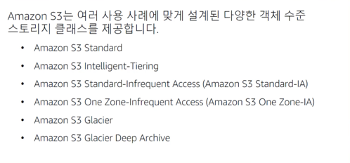  
Amazon S3는 여러 사용 사례에 맞게 설계된 다양한 객체 수준 스토리지 클래스를 제공한다.  
**Amazon S3 Standard** : 자주 액세스하는 데이터를 위한 고가용성, 높은 내구성 및 성능을 제공하도록 설계되어있다. 
Amazon S3 Standard는 짧은 지연 시간 및 높은 처리량을 제공하기 때문에 콘텐츠 배포 및 빅 데이터 분석과 같은 다양한 사용 사례에 적합하다.  
**Amazon S3 Standard-Infrequent Access** : 액세스 빈도가 낮지만 필요할 때 빠르게 액세스해야 하는 데이터를 위한 스토리지 클래스다. 
Standard의 탁월한 내구성, 높은 처리량 및 짧은 지연 시간을 저렴한 기가바이트당 스토리지 요금과 기가바이트당 검색 요금으로 제공하도록 설계되었다.
장기 스토리지 및 재해 복구 파일용 데이터 스토어에 적합하다.  
**Amazon S3 One Zone-Infrequent Access** : 액세스 빈도가 낮지만 필요할 때 빠르게 액세스해야 하는 데이터를 위한 스토리지 클래스다.  
최소 3개의 가용 영역에 데이터를 저장하는 다른 Amazon S3 스토리지 클래스와 다르게 Amazon S3 One Zone-Infrequent Access는 단일 가용 영역에 데이터를 저장한다.
그러므로 Standard-Infrequent Access보다 비용이 저렴하다. 보조 백업 사본을 저장하거나 이미지 카탈로그의 썸네일 버전과 같이 쉽게 재생성할 수 있는 데이터를 저장하기에 적합하다.  
**Amazon S3 Intelligent-Tiering** : 가장 비용 효과적인 액세스 계층으로 **데이터를 자동으로 이동하여** 비용을 최적화하도록 설계되었다.
Amazon S3는 소액의 객체별 월 요금으로 Amazon S3 Intelligent-Tiering에서 객체의 액세스 패턴을 모니터링하고 연속 30일 동안 액세스하지 않은 객체를 Infrequent-Access 계층으로 이동한다.
Infrequent-Access 계층의 객체에 액세스하면 이 객체는 자동으로 Standard Access 계층으로 다시 이동한다. 
Intelligent-Tiering 스토리지 클래스는 수명이 길고 액세스 패턴을 알 수 없거나 예측할 수 없는 데이터에 적합하다.  
**Amazon S3 Glacier** : 데이터 아카이빙을 위한 안전하고 내구력이 있으며 저렴한 스토리지 클래스다. Amazon S3 Glacier는 비용을 낮게 유지하는 동시에 변화하는 요구사항을 지원하기 위해 몇분에서 몇시간까지 소요되는 세 가지 검색 옵션을 제공한다.
Amazon S3 Glacier에 직접 객체를 업로드하거나 Amazon S3 수명 주기 정책을 사용하여 Amazon S3 스토리지와 Amazon S3 Glacier간에 데이터를 전송할 수 있다.  
**Amazon S3 Glacier Deep Archive** : 비용이 가장 저렴한 스토리지 클래스다. 일년에 한두번 액세스되는 데이터의 장기 보존 및 디지털 보존을 지원한다. 
규제가 엄격한 산업(금융, 의료 등)을 위해 설계되었다. 그 밖에도 백업 및 재해 복구 사용 사례에도 활용될 수 있다. 마그네틱 테이프 시스템 대신 사용할 수 있는 비용 효율적이고 관리하기 쉬운 대체 솔루션이다.  

## Amazon S3 버킷 URL
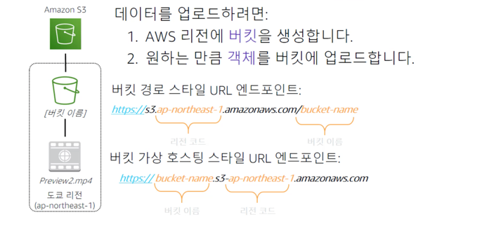  
S3 버킷에 대해 자세히 알아보자. 버킷은 객체를 위한 논리적 컨테이너이다. 계정에는 하나 이상의 버킷이 포함될 수 있다.
버킷의 객체를 생성, 삭제 및 나열할 수 있는 사용자는 고객이 제어한다. 고객은 버킷 및 객체에 대한 액세스 로그를 볼 수 있다.
또한 고객은 S3가 버킷과 버킷의 콘텐츠를 저장하는 지리적 리전을 선택할 수 있다. 이 예제에서는 Amazon S3를 사용하여 도쿄 리전에 버킷을 생성했다.
AWS 내에서 이 리전은 공식적으로 리전 코드 ap-northeast-1로 식별된다.  
경로 스타일 URL 엔드포인트는 일반적으로 객체에 액세스해야할 때 사용된다. 정적 데이터에 대한 웹 사이트로 사용할 때 사용된다.  
가상 호스팅 스타일 URL 엔드포인트는 버킷을 구조의 차이점에 유의하자. 이 예제에서 객체 Preview2.mp4는 버킷 내에 저장된다. 
파일의 URL에는 버킷 경로 스타일 엔드포인트의 끝에 객체 이름이 포함된다.

## 데이터가 리전에 중복으로 저장됨
  
Amazon S3에 버킷을 생성할 때 해당 버킷은 특정 AWS 리전에 연결된다. 
버킷에 데이터를 저장할 때 해당 데이터는 선택한 리전의 여러 AWS 시설에 중복 저장된다.
즉, 2개의 AWS 시설에서 동시에 데이터가 손실되는 경우에도 데이터가 안전하게 보호된다.  

## 원활한 확장을 고려한 설계
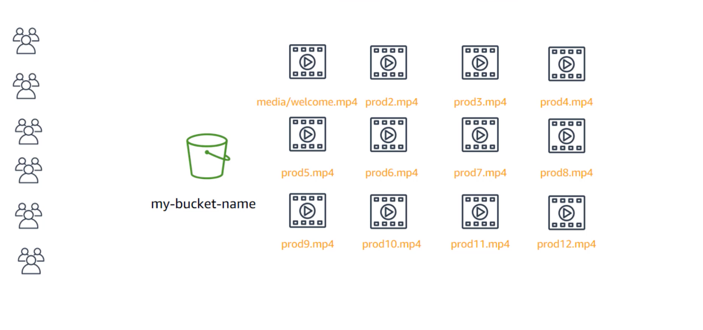  
Amazon S3는 데이터가 증가함에 따라 버킷의 스토리지를 자동으로 관리한다. 
스토리지나 처리량을 프로비저닝할 필요가 없으며 사용한 만큼만 비용이 부과된다.  

## 어디서나 데이터에 액세스
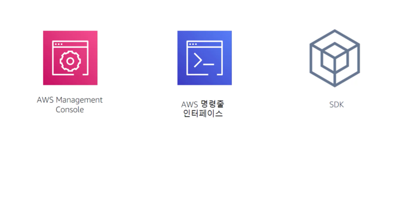  
콘솔, AWS Command Line Interface 또는 AWS SDK를 통해 Amazon S3에 액세스할 수 있다.
타사 백업 도구에서 버킷의 데이터에 직접 액세스할 수도 있다. 참고로, 이러한 유형의 액세스는 프로그래밍 방식의 액세스로 간주되며
타사 도구에 대한 키 페어를 프로비저닝해야 Amazon S3 서비스에 연결할 수 있다.  
HTTP 및 HTTP 액세스를 지원하는 엔드포인트는 글로벌로 고유해야 하며 DNS를 준수해야 한다.
즉, 버킷 이름은 모두 소문자여야 하며 문자, 숫자 및 대시의 조합만 포함해야 한다.  

## Amazon S3 일반 시나리오
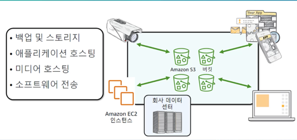  
사실상 무제한의 데이터를 저장하고 어디서나 해당 데이터에 액세스할 수 있는 유연성 덕분에 Amazon S3는 정적 웹 사이트 호스팅을 비롯한 다양한 시나리오에 적합하다.  
Amazon S3 버킷은 HTML, CSS, JS 및 기타 파일을 포함하여 웹 사이트의 정적 콘텐츠를 제공할 수 있다.  
S3의 가용성 및 재해 복구 기능을 강화하고 싶다면 교차 리전 복제를 지원하도록 구성하면 된다. 이렇게 하면 한 리전의 S3 버킷에 있는 데이터를 다른 S3 리전으로 자동 복제할 수 있다.

## Amazon S3 요금
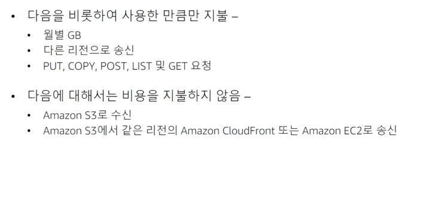  
S3의 요금은 리전과 수행한 특정 요청에 따라 달라진다. 
월별 기가바이트, 다른 리전으로 발신, PUT, COPY, POST, LIST 및 GET 요청을 비롯하여 사용한 한목에 대해서만 요금을 지불한다.
일반적으로 Amazon S3에서 수신하거나 S3에서 동일한 리전의 Amazon CloudFront 엣지 로케이션으로 발신한 데이터에는 요금이 부과되지 않는다.

## Amazon S3 : 스토리지 요금
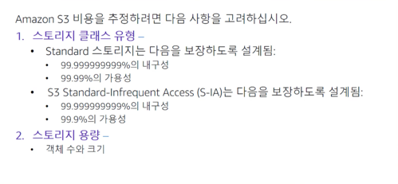  
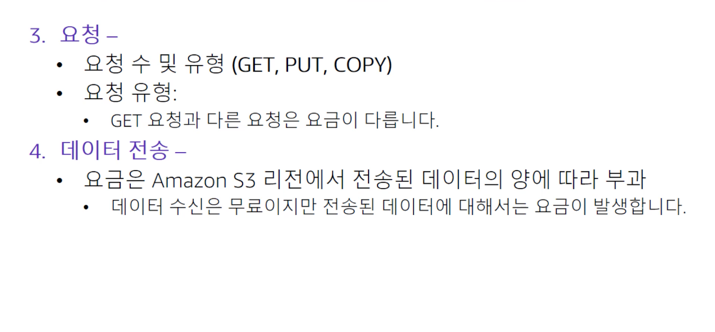  
스토리지 클래스 유형별로 요금이 다름, Amazon S3 버킷에 저장된 객체의 수와 크기에 따라 다름  
GET : 읽기 (버킷에 대한 쓰기 권한 필요)  
POST : 객체 추가 (버킷에 대한 쓰기 권한 필요)  
COPY : Amazon S3에 이미 저장된 객체의 복사본 (GET + POST 를 수행한 것과 같음)  
리전 밖으로만 전송되는 데이터에 대해 유료이다.

# Amazon Elastic File System (Amazon EFS)
Amazon EFS는 여러 가상 머신이 동시에 액세스할 수 있는 EC2 인스턴스용 스토리지를 구현한다. 이 스토리지는 NFS(Network File System)을 사용하는 공유 파일 시스템을 구현한다.
**블록 스토리지**

## Amazon EFS 기능
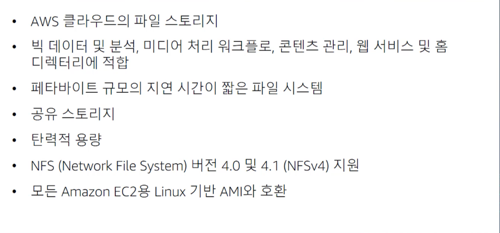  
Amazon EFS는 AWS 클라우드에서 파일 스토리지를 간편하게 설정하고 조정할 수 있는 완전 관리헝 서비스이다. 
파일 시스템 인터페이스를 통해 Amazon EC2 인스턴스가 액세스할 수 있는 파일 시스템을 구축할 수 있다.
이러한 파일 시스템은 일관성 및 파일 잠금과 같이 전체 파일 시스템 액세스 의미 체계를 지원한다.  

Amazon EFS 파일 시스템은 스토리지를 프로비저닝할 필요없이 자동으로 기가바이트에서 페타바이트 규모의 데이터로 확장할 수 있다.
수천 개의 Amazon EC2 인스턴스가 동시에 한 Amazon EFS 파일 시스템에 액세스할 수 있다. 
Amazon EFS는 각 EC2 인스턴스에 일관된 성능을 제공하며 탁월한 내구성과 고가용성을 제공하도록 설계되었다.
Amazon EFS에는 최소 비용이나 설정 비용이 없으며 사용한 스토리지에 대한 요금만 지불하면 된다.  

## Amazon EFS 아키텍처
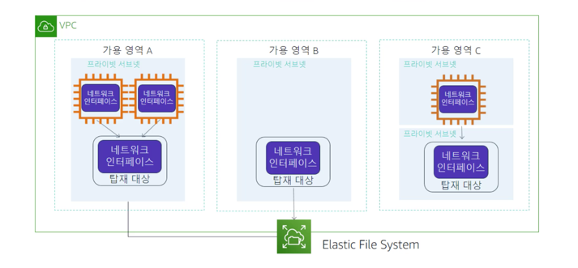  
Amazon EFS는 **클라우드의 파일 스토리지**와 같다. Amazon EFS를 사용하면 파일 시스템을 생성하고
**Amazon EC2 인스턴스에 파일 시스템을 탑재(Mount)한 다음** 해당 파일 시스템에서 데이터를 읽고 쓸 수 있다.
VPC에 Amazon EFS 파일 시스템을 탑재할 수 있다. Amazon EFS는 NFS 4.0, 4.1을 지원한다. 
VPC의 여러 EC2 인스턴스에서 동시에 Amazon EFS 파일 시스템에 액세스할 수 있다.  
위 다이어그램에는 세 개의 가용영역과 각 가용영역에는 탑재 대상이 하나씩 생성되어 있다. 
동일한 가용 영역 내의 탑재 대상에서 파일 시스템에 액세스하는 것이 좋다.
가용 영역 중 하나에는 2개의 서브넷이 있다. 그러나 탑재 대상은 서브넷 중 하나 내에만 생성된다.  

## Amazon EFS 구현
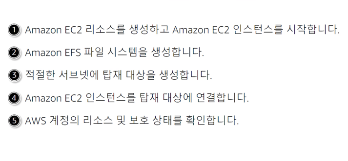  

## Amazon EFS 리소스
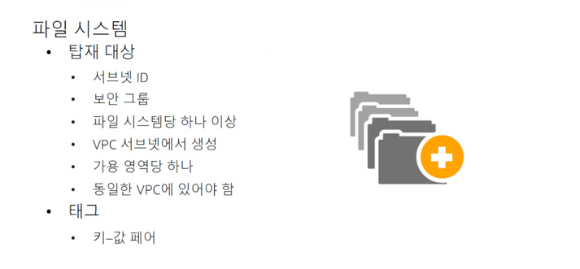  
Amazon EFS에서는 파일 시스템이 기본 리소스이다. 각 파일 시스템에는 ID 생성 토큰, 생성 시간 및 파일 시스템 크기와 같은 속성이 있다.
탑재 대상에도 탑재 대상 ID, 탑재 대상이 생성된 서브넷의 ID, 탑재 대상이 생성된 파일 시스템의 ID와 같은 속서이 있다.
각 파일 시스템에 고유한 메타데이터를 할당하면 파일 시스템을 쉽게 정리할 수 있다. 각 태그는 키-값 페어다. 
파일 시스템에 연결되지 않은 탑재 대상 및 태그는 존재하지 않는 하위 리소스와 같다.

# Amazon Simple Storage Service Glacier
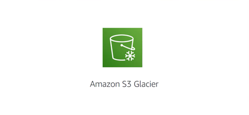  
Amazon S3 Giacier는 데이터 아카이빙 및 **장기 백업**을 위한 안전하고 안정적이며 비용이 매우 저렴한 클라우드 스토리지 서비스다.

## Amazon S3 glacier 검토
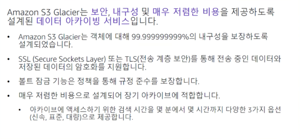  
Glacier를 사용하여 데이터를 아카이빙하면 S3에 비해 매우 저렴한 비용으로 데이터를 저장할 수 있다.
하지만 원할 때 즉시 데이터를 검색할 수는 없다. Glacier에 저장된 데이터를 검색하려면 몇 시간이 소요될 수 있기 때문에
이 서비스는 **아카이빙**에 적합하다. Glacier를 사용하는 경우 3개의 중요한 용어를 숙지해야 한다.
* **아카이브**는 Amazon S3 Glacier에 저장하는 사진, 동영상, 파일 또는 문서와 같은 객체를 의미한다. 아카이브는 스토리지의 기본 단위이다.
  각 아카이브에는 고유한 ID가 있으며 설명도 포함될 수 있다.
* **볼트**는 아카이브를 저장하는 컨테이너이다. 볼트를 생성할 때는 볼트 이름과 볼트가 위치할 리전을 지정한다.
볼트 액세스 정책은 볼륨에 저장된 데이터에 액세스할 수 있는 사용자와 액세스할 수 없는 사용자 및 수행할 수 있는 작업과 수행할 수 없는 작업을 결정한다.
  각 볼트에 대한 액세스 권한 정책을 생성할 수 있다. 또한 볼트 잠금 정책을 사용하여 볼트를 변경하지 못하도록 할 수 있다.
  각 볼트에는 하나의 볼트 액세스 정책과 하나의 볼트 잠금 정책이 연결될 수 있다.
  
## Amazon S3 Glacier
  
데이터 검색에는 세 가지 옵션이 있다.
* 신속검색 : 일반적으로 1~5분 이내에 사용할 수 있으며 비용이 가장 높다.
* 표준검색 : 일반적으로 3~5시간 이내에 완료되며 신속검색보다 비용이 저렴하지만 대량 검색보다 비용이 높다.
* 대량검색 : 일반적으로 5~12시간 이내에 완료되며 비용이 가장 저렴하다.

## Amazon S3 Glacier 사용사례
* 미디어 자산 아카이빙  
  동영상 및 뉴스 장면 같은 미디어 자산의 아카이빙
* 의료 정보 아카이빙  
  규제 요건을 충족하기 위해 병원 시스템은 저소득층 보조금 정보 또는 전자 건강 기록과 같은 페타바이트 규모의 환자 기록을 보존해야 한다.
* 규제 및 규정 준수를 위한 아카이빙  
  규제 및 규정 준수를 위한 아카이빙, 금융 서비스 및 의료 서비스의 경우와 같이 많은 엔터프라이즈에서는 규제 및 규정 준수를 위한 아키이브를 장기간 유지해야 한다.
Amazon S3 Glacier 볼트 잠금은 규정 준수 제어 기능을 설정하여 규정 준수 목표를 충족하는 데 도움이 될 수 있다.
* 과학 데이터 아카이빙  
  과학 데이터 아카이빙, 연구 기관에서는 방대한 양의 데이터를 생성, 분석 및 아카이빙한다.
* 디지털 보존  
  도서관 및 정부 기관의 디지털 보존, 기관에서는 디지털 보존 과정에서 발생하는 데이터 무결성 문제를 해결해야 한다.
  힘든 데이터 검증 및 수동 복구 작업이 필요할 수 있는 일반적인 시스템과 달리 Amazon S3 Glacier는 정기적이고 체계적인 데이터 무결성 검사를 수행하고 자가 복구 기능을 자동 실행하도록 설계되어 있다.
* 마그네틱 테이프 대체  
온프레미스 또는 오프사이트 테이브 라이브러리는 스토리지 비용은 절감할 수 있지만 전문 유지 관리를 위한 사전 투자 비용이 높을 수 있다.
  
Amazon S3 Glacier는 선결제 비용이 없으며 유지 관리에 대한 비용과 부담이 적다.

## Amazon S3 Glacier 사용
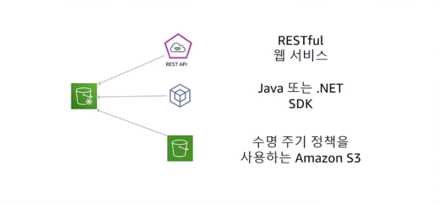  
Amazon S3 Glacier에 데이터를 저장하고 액세스하려면 AWS Management Console을 사용하면 된다.
하지만 볼트 생성 및 삭제 아카이브 정책 생성 및 관리와 같은 몇 가지 작업만 콘솔에서 수행할 수 있다.
다른 Amazon S3 Galcier 작업 및 상호 작용의 경우 Amazon S3 Glacier REST API, AWS Java 또는 .NET SDK 또는 AWS CLI를 사용해야 한다.
수명 주기 정책을 사용하여 Glacier에 데이터를 아카이빙할 수도 있다.

## 수명 주기 정책
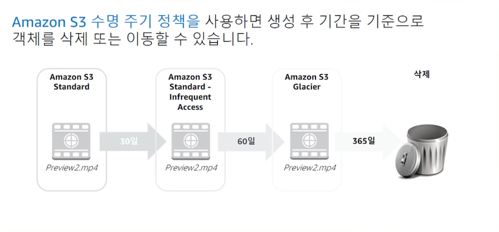  
이 경우 Amazon S3에 저장하는 데이터의 수명 주기를 자동화해야 한다. 
수명 주기 정책을 사용하면 다양한 Amazon S3 스토리지 유형 간에 데이터가 주기적으로 순환되도록 할 수 있다.
이 같은 자동화를 통해 시간이 지나면서 데이터의 중요도가 감소하면 비용을 더 적게 지불함으로써 전체 비용을 줄일 수 잇다.
객체별로 수명 주기 규칙을 설정할 수 있을 뿐 아니라 버킷별로 수명 주기 규칙을 설정할 수도 있다. 
데이터가 삭제되기 전에 Amazon S3 Standard에서 Amazon S3 Standard - Infrequent Access로 
그리고 최종적으로 Amazon S3 Glacier로 이동하는 수명 주기 정책의 예를 살펴보자. 
사용자가 동영사을 애플리케이션에 업로드하고 애플리케이션에서 동영상의 썸네일 미리 보기를 생성한다고 가정해 보자.
이 동영상 미리보기는 사용자가 즉시 액세스하려고 하기 때문에 Amazon S3 Standard에 저장된다. 
사용 데이터는 30일 후에 대부분의 썸네일 미리 보기에 액세스하지 못함을 나타낸다. 수명 주기 정책에 따라 이 미리보기가 적용되고 30일 후에는 Amazon S3 - Infrequent Access로 이동된다.
다시 30일이 경과한 후에는 미리보기에 다시 액세스할 가능성이 낮다. 그러면 미리보기가 Amazon S3 Glacier로 이동되며 거기에서 1년동안 유지된다. 1년 후에는 미리보기가 삭제된다.
수명 주기 정책이 이 모든 이동을 자동으로 관리한다.

## Amazon S3 스토리지 클래스
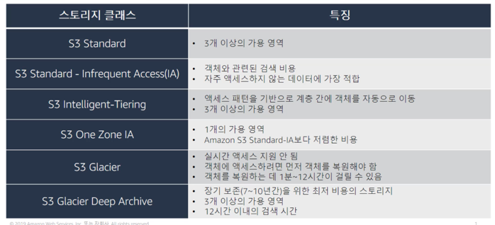

## 스토리지 비교
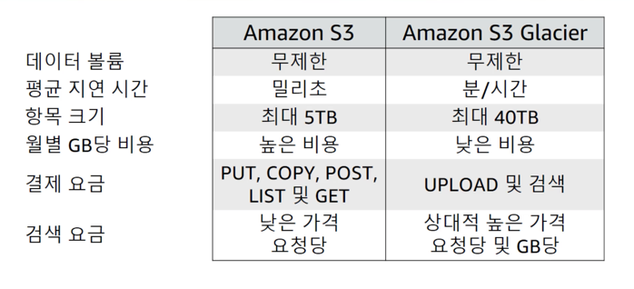
Amazon S3와 Amazon S3 Glacier는 모두 사실상 무제한의 데이털르 저장할 수 있는 객체 스토리지 솔루션이지만,
이들 솔루션에는 몇 가지 중요한 차이점이 있다. 이 차트에서는 이러한 차이점 중 일부를 간략하게 설명한다.  
첫째, 요구사항에 적합한 스토리지 솔루션을 결정할 때는 신중해야 한다. 이 두 서비스는 서로 매우 다른 스토리지 요구사항을 지원한다.
Amazon S3는 짧은 지연 시간으로 빈번하게 액세스해야 하는 데이터를 위해 설계되었다. 하지만 Amazon S3 Glacier는 자주 액세스하지 않는 데이터를 
저렴한 비용으로 장기간 저장할 수 있도록 설계되었다. S3 에서는 액세스 속도가 빠르므로 기가바이트당 스토리지 비용이 Glacier보다 높다.
둘째, Amazon S3의 최대 항목 크기는 5TB이다. 하지만 Amazon S3 Glacier에는 최대 40TB 크기의 항목을 저장할 수 있다.
두 서비스 모두 요청당 요금이 있지만 Amazon S3는 PUT, COPY, POST, LIST, GET 작업데 대한 요금을 부과한다.
반면, Amazon S3 Glacier는 업로드 및 검색 작업에 대한 요금을 부과한다. Amazon S3 Glacier는 데이터 액세스 빈도가 적기 때문에 Amazon S3보다 각 검색 요청에 더 많은 비용이 든다.

## 서버측 암호화
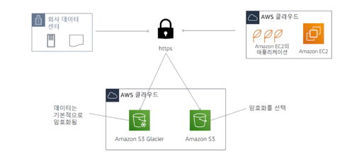  
Amazon S3와 Amazon S3 Glacier의 또 다른 중요한 차이점은 데이터가 암호화되는 방법이다.
서버 측 암호화는 유휴 데이터를 보호하는 데 중점을 둔다. 데이터를 전송할 때는 두 솔루션에서 모두 HTTPS를 통해 안전하게 전송할 수 있다.
Amazon Glacier에 아카이빙되는 모든 데이터는 **기본적으로 암호화된다.**
Amazon S3를 사용하면 **애플리케이션에서 서버 측 암호화를 시작해야 한다.**
Amazon S3에서 서버 측 암호화는 여러 가지 방법으로 수행할 수 있다.
먼저, Amazon S3 관리형 암호화 키 SSE S3로 서버 측 암호화를 사용할 수 있다. Amazon S3는 각 객체를 고유한 키로 암호화한다.
또한 추가적인 보안 조치로 주기적으로 교체되는 마스터 키를 사용하여 키를 암호화한다.
Amazon S3 서버 측 암호화는 가장 강력한 블록 암호 중 하나인 256 비트 Advanced Encryption Standard 또는 AES-256을 사용하여 데이터를 암호화한다.
그런 다음, 고객은 고객 제공 암호화 키로 SSE-C라고 하는 서버 측 암호화를 사용할 수 있다. 이 옵션을 사용하면 자체 암호화 키를 설정할 수 있다.
암호화 키를 요청의 일부로 포함하면 Amazon S3가 디스크에 기록되는 동안의 암호화와 고객이 객체에 액세스할 때의 암호화 해제를 모두 관리한다.
마지막으로, AWS Key Management Service 또는 AWS KMS로 서버 측 암호화를 사용할 수 있다. AWS KMS는 안전하고 가용성이 높은 하드웨어와 소프트웨어를 결합하여
클라우드 규모에 맞게 확장되는 키 관리 시스템을 제공하는 서비스다. AWS KMS는 고객 마스터 키를 사용하여 Amazon S3 객체를 암호화한다. KMS에는 IAM 콘솔의 [Encryption Keys(암호화 키)] 섹션을 통해 액세스할 수 있다.
또한 API를 통해 AWS KMS에 액세스하여 중앙 집중식으로 암호화 키를 생성하고, 키가 사용되는 방식을 제어하는 정책을 정의하고 키 사용을 감시하여 키가 올바로 사용되는지 검증할 수 있다. 

## Amazon S3 Glacier를 사용한 보안
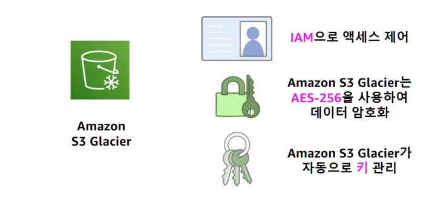  
기본적으로 사용자 본인만 자신의 데이터에 액세스할 수 있다. Glacier에는 두 가지 계층의 보안을 적용할 수 있다.
첫째, IAM을 사용하여 Amazon S3 Glacier의 데이터에 대한 액세스를 활성화하고 제어할 수 있다. 이 경우 사용자 액세스를 지정하는 IAM 정책을 설정한다. 
둘째, Glacier는 기본적으로 데이터를 암호화하므로 고객은 암호화된 데이터에 대한 키를 관리하는 방법을 선택할 수 있다.
