# Amazon Relational Database Service (Amazon RDS)
## 비관리형 서비스와 관리형 서비스 비교
  
AWS의 솔루션은 비관리형에 속하거나 관리형에 속한다.  
비관리형 서비스는 사용자가 지정하는 대로 개별적으로 프로비저닝된다. 
사용자는 서비스 소유자로써 **로드의 변화 오류 및 리소스를 사용할 수 없는 상황에서** 서비스의 응답 방법을 관리한다.
데이터베이스의 모든 부분을 제어하고 싶다면 Amazon EC2 인스턴스에 관계형 데이터베이스 관리 시스템(RDBMS)을 설치하면 된다.
이렇게 하면 사용자가 소유한 물리적 데이터 센터에서 데이터베이스를 실행하는 것과 매우 유사한 환경이 되는데 이것이 **비관리형 서비스**의 한 예이다.  
EC2 인스턴스에서 웹 서버를 시작했다고 가정해보자. Amazon EC2는 비관리형 솔루션이므로 크기 조정 솔루션을 사용하도록 지정하지 않는 한 웹 서버는 증가된 트래픽 로드를 처리하도록 확장되지도 않고 비정상 인스턴스를 정상 인슽언스로 대체하지도 않는다.
크기 조정 솔루션의 예로는 사용하는 Auto Scaling 서비스가 포함될 수 있다. 비관리형 서비스를 사용하는 데 따르는 이점은 솔루션에서 로드의 변화, 오류 및 리소스를 사용할 수 없게 되는 상황을 처리하는 방법을 더욱 **정교하게 제어**할 수 있다는 것이다.  
관리형 서비스를 위한 구성도 있다. 예를 들어 S3 버킷을 생성한 다음 버킷에 대한 권한을 설정할 수 있다. 그러나 관리형 서비스는 일반적으로 구성이 좀 더 간단하다. 
이제 독립적인 비관리형 관계형 데이터베이스를 실행할 때의 문제점을 살펴보자. 그런 다음 Amazon RDS가 이러한 문제를 어떻게 해결하는지 알아보자.  

## 관계형 데이터베이스의 문제점
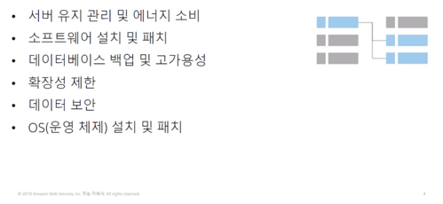  
자체 관계형 데이터베이스를 실행할 경우 서버 유지 관리, 에너지 소비, 소프트웨어, 설치 및 패치 적용, 데이터베이스 백업 등 여러 가지 관리 작업을 수행해야 한다.
또한 사용자는 고가용성을 보장하고 확장성, 데이터 보안, 운영 체제 설치 및 패치 적용을 계획할 책임이 있다. 이러한 모든 작업은 다른 업무에 투입해야 할 리소스를 소모하며 전문지식을 필요로 한다.  

## Amazon RDS
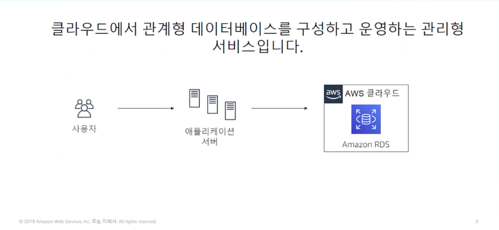  
비관리형, 독립형 관계형 데이터베이스를 실행할 때 문제점을 해결하기 위해 AWS는 지속적인 관리 없이 관계형 데이터베이스를 설정, 운영 및 확장하는 서비스인 RDS를 제공한다.
Amazon RDS를 사요하면 데이터 및 애플리케이션 최적화에 집중할 수 있다.  

## 관리형 서비스 책임
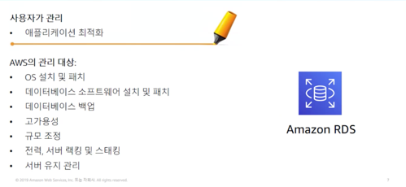  

## Amazon RDS DB 인스턴스
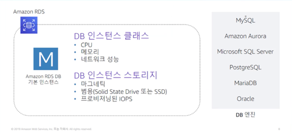  
Amazon RDS의 기본적인 구성 요소는 데이터베이스 인스턴스이다. 데이터베이스 인스턴스는 여러 사용자가 생성한 데이터베이스를 포함할 수 있는 **격리된 데이터베이스 환경**이다.
데이터베이스에는 독립 실행형 데이터베이스 인스턴스에서 사용하는 것과 동일한 도구 및 애플리케이션을 사용하여 액세스할 수 있다. 데이터베이스를 설정할 때 데이터베이스에 필요한 **인스턴스 클래스**와 **스토리지 유형**을 선택한다.
데이터베이스 인스턴스와 스토리지는 성능 특성과 가격에 있어서 다르다.  
데이터베이스 인스턴스를 생성하려면 실행할 **데이터베이스 엔진**을 지정해야 한다.  

## Virtual Private Cloud의 Amazon RDS
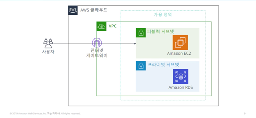  
RDS 구현을 구성하는 방법은 다양하다. 예를 들어 Amazon VPC에서 인스턴스를 실행할 수 있다.
VPC를 사용하면 가상 네트워크 환경을 완벽하게 제어할 수 있다. 자체 IP 주소 범위를 선택하고 서브넷을 생성하며 라우팅 및 액세스 제어 목록을 구성하여 데이터베이스에 대한 액세스를 제어할 수 있다.
Amazon RDS의 기본기능은 VPC에서 실행되는지 여부에 상관없이 동일하다. 일반적으로 **데이터베이스 인스턴스는 프라이빗 서브넷에 격리**되어 있으며 사용자가 선택한 애플리케이션에만 직접 액세스할 수 있다.  

## 다중 AZ 배포를 통한 고가용성
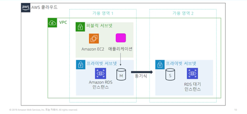
Amazon RDS의 가장 강력한 기능 중 하나는 **다중 AZ(Another Zone) 배포**를 사용하여 데이터베이스 인스턴스를 고가용성으로 구성할 수 있다는 것이다.
AZ 배포를 구성하기 위해 Amazon RDS가 동일한 VPC 내의 다른 가용 영역에 데이터베이스 인스턴스의 대기 복사본을 자동으로 생성한다. 
데이터베이스 복사본이 시드된 후에는 트랜잭션이 **대기 복사본으로 동기식으로 복제**된다.  
가용 영역 내에서 중단이 발생할 경우 데이터 인스턴스를 보호할 수 있다. 다중 AZ 배포에서 **기본 데이터베이스 인스턴스에 장애가 발생하면 Amazon RDS가 자동으로 대기 데이터베이스 인스턴스를 온라인 상태로 전환하여 새로운 기본 인스턴스로 만든다.**

## Amazon RDS 읽기 전용 복제본
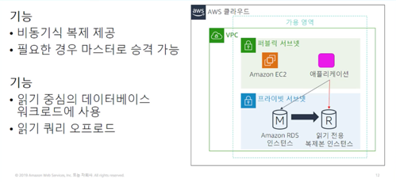  
Amazon RDS는 또한 MySQL, MariaDB, PstgreSQL 및 Amazon Aurora용 읽기 전용 복제본의 생성을 지원한다.
원본 데이터베이스 인스턴스에 적용된 업데이트는 읽기 전용 복제본 인스턴스에 비동기식으로 복사된다. 
애플리케이션의 읽기 쿼리를 읽기 전용 복제본으로 라우팅하면 원본 데이터베이스 인스턴스에 대한 로드를 줄일 수 있다.  
읽기 작업 수가 많은 애플리케이션이 있는 경우 이 구성을 선택하는 것이 좋다. (뷰 같은 느낌..?)

## Amazon RDS가 적합한 사례
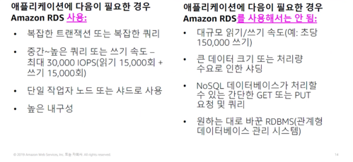

## Amazon RDS : 시간 단위 결제 및 데이터베이스 특성
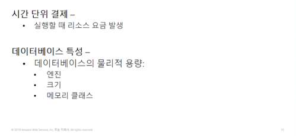  
Amazon RDS 비용을 추정할 때에는 **시간당 서비스 시간**을 고려하자. 이 서비스에서는 서비스가 실행된 시간을 기준으로 요금이 청구된다.
선택한 데이터베이스의 물리적 용량에 따라서도 부과되는 요금이 달라진다. 데이터베이스 엔진, 인스턴스 크기 및 메모리 클래스는 데이터베이스 RDS 인스턴스를 실행하는 비용에 영향을 미친다.

## Amazon RDS : DB 구매 유형 및 여러 DB 인스턴스
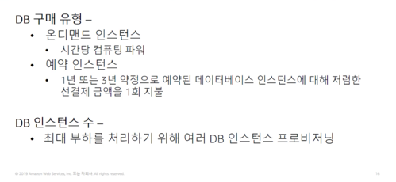  
데이터베이스 구매 유형도 비용에 영향을 미친다. 
온디맨드 인스턴스를 사용하는 경우에는 **데이터베이스 인스턴스가 실행되는 시간당 컴퓨팅 용량**에 대한 요금을 지불한다.
예약 인스턴스를 사용하면 1년 또는 3년 약정으로 예약하려는 각 데이터베이스 인스턴스에 대해 일회성 선결제 금액을 지불한다.
인스턴스 수 또한 비용에 영향을 미친다. 예를 들어 부하를 줄이기 위해 여러 데이터베이스 인스턴스를 프로비저닝할 수 있다.

## Amazon RDS : 스토리지
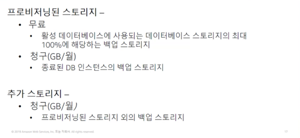  
최적의 스토리지를 구성하는 것도 비용에 영향을 미친다.
활성 데이터베이스 인스턴스에 대해 프로비저닝된 데이터베이스 스토리지의 최대 100% 까지는 백업 스토리지에 대한 추가 비용이 없다.
**데이터베이스 인스턴스가 종류된 후에는 백업 스토리지에 월별 GB당 요금이 청구된다.**

## Amazon RDS : 배포 유형 및 데이터 전송
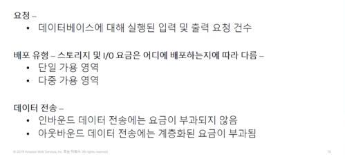  
마지막으로 데이터베이스에 수행할 입출력 요청 수와 데이터 전송을 고려해야 한다.
인바운드 데이터 전송은 무료이며 아웃바운드 데이터 전송 요금은 계층화되어 있다.
애플리케이션의 요구 사항에 따라 예약 인스턴스를 구매하면 비용을 최적화할 수 있다.

# Amazon DynamoDB
DynamoDB를 사용하면 **관계형 데이터베이스를 비관계형 데이터베이스로 전환**할 수 있다.  

## 관계형 데이터베이스와 비관계형 데이터베이스 비교
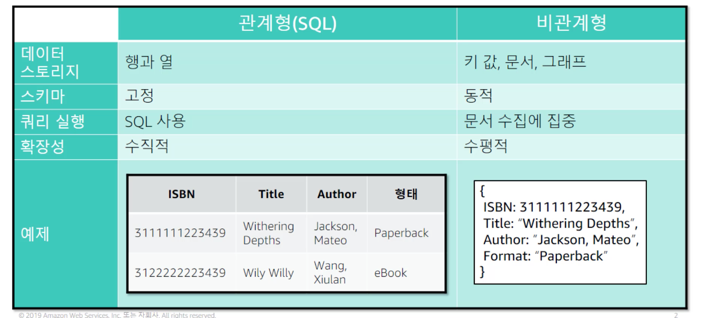  
관계형 데이터베이스  
- 테이블, 레코드(행), 필드(열)로 이루어진 정형화된 데이터베이스
- 테이블간에 관계가 형성되어 사용자는 쿼리를 사용하여 여러 테이블의 데이터를 가져올 수 있음  

비관계형 데이터베이스 (NoSQL DB)  
- 키-값 (key-value) 쌍으로 구성된 데이터베이스  
- JSON (JavaScript Object Notation)을 사용하여 스토리지 데이터를 문서화한다.

## Amazon DynamoDB란?
  
DynamoDB를 사용할 때는 테이블을 생성한 다음 테이블에 항목을 추가한다.
이 시스템은 데이터를 자동으로 분할한 후 매우 크고 휘발성이 높은 데이터 세트에 최적화된 테이블 스토리지에 저장한다.
테이블에 저장할 수 있는 항목의 수는 제한이 없다.  

NoSQL 데이터베이스의 장점 중 하나는 속성이 다른 항목을 동일한 테이블에 배치할 수 있다는 것이다.
따라서 애플리케이션이 변경될 때 속성을 유연하게 추가할 수 있다. 
스키마를 마이그레이션할 필요 없이 동일한 테이블에 이전 형식 항목과 나란히 최신 형식 항목을 저장할 수 있다.
기존 관계형 데이터베이스 서비스에서 스키마를 마이그레이션하면 변화하는 데이터 요구 사항에 신속하게 대응하는 능력이 저하된다.  

DynamoDB의 모든 데이터는 **SSD**(Solid State Drive)에 저장된다. 
또한 단순한 쿼리 언어를 사용하기 때문에 지연 시간이 짧은 쿼리 성능이 일관되게 유지된다.
고객은 DynamoDB의 조정이 가능한 스토리지에 더해 테이블에 필요한 읽기 또는 쓰기 처리량의 용량을 프로비저닝할 수 있다.
애플리케이션 사용자 수가 늘어나면 수동 프로비저닝을 통해 DynamoDB 테이블을 확장하여 증가된 수의 읽기/쓰기 요청을 처리할 수 있다.
**자동 조정을 활성화할 수도 있다.** 자동 조정을 활성화하면 DynamoDB가 테이블의 로드를 모니터링하고 프로비저닝된 처리량을 자동으로 늘리거나 줄인다.
DynamoDB의 다른 주요 기능 중에 **글로벌 테이블**이라는 기능이 있는데 이 기능을 사용하면 선택한 AWS 리전에 자동으로 복제할 수 있다.
또한 유휴 데이터를 암호화하고 특정 항목의 TTL을 설정할 수도 있다.  

## Amazon DynamoDB 핵심 구성 요소
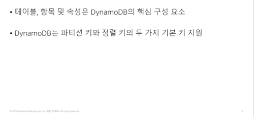  
DynamoDB의 핵심 구성 요소는 **테이블, 항목 및 속성**이다.
테이블은 데이터의 모음이다. 항목은 고유하게 식별 가능한 속성의 그룹이다.  

## 테이블의 항목에는 키가 있어야 함
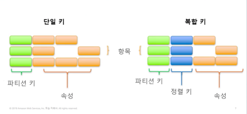  
테이블을 생성할 때는 테이블 이름과 더불어 테이블의 기본 키를 지정해야 한다. 
테이블의 항목을 추가, 업데이트 또는 삭제할 때는 해당 항목에 대한 기본 키 속성값을 지정해야 한다.
DynamoDB는 두 가지 종류의 기본 키를 지원한다.  
**단순 기본 키** 항목을 고유하게 식별하는 속성이다. 이 속성을 파티션 키라고 한다.  
**복합 기본 키** 2개의 속성으로 구성된다. 첫 번째 속성은 파티션 키이고, 두 번째 속성은 정렬 키이다.  
**기본키가 아닌 속성으로 검색하려면 스캔작업을 해야한다.**

# Amazon Redshift
Amazon Redshift는 표준 SQL과 기존 비즈니스 인텔리전스 도구를 사용하여 모든 데이터를 간편하고 비용 효율적으로 분석할 수 있는 완전관리형의 고속 **데이터 웨어하우스**다.

## Amazon Redshift 소개
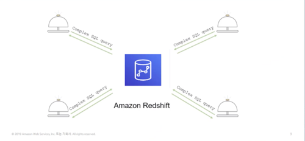
분석은 오늘날 비즈니스에 중요한 부분이지만 데이터 웨어하우스를 구축하기가 복잡하고 비용이 많이 든다.
데이터 웨어하우스를 설정하는 데 몇달이 걸리고 상당한 금전적 리소스가 소요될 수 있다.
Amazon Redshift는 단순하고 비용 효율적으로 설정하고 사용할 수 있는 빠르고 강력한 완전관리형 데이터 웨어하우스다.
확장 맟 축소 또한 단순하고 경제적이다.
Amazon Redshift를 사용하면 정교한 쿼리 최적화, 고성능 로컬 디스크의 열 형식 스토리지, 대량 병렬 쿼리 실행 기능을 사용하여 페타바이트 규모의 정형 데이터에 복잡한 분석 쿼리를 실행할 수 있다.
대부분의 결과는 몇 초 안에 반환된다.  

## 병렬 처리 아키텍처
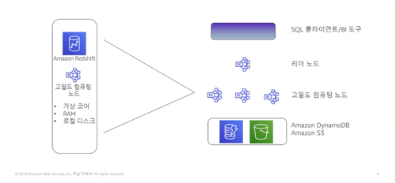  
Amazon Redshift 구현은 **리터 및 컴퓨팅 노드의 클러스터**로 구성된다.
리더 노드는 클라이언트 프로그램과의 통신 및 컴퓨팅 노드와의 모든 통신을 관리한다.
리더 노드는 복잡한 쿼리에서 결과를 얻는 데 필요한 일련의 단계를 수행하는 실행 계획을 분석하고 개발한다.
리더 노드는 실행 계획의 개별 요소에 대한 코드를 컴파일하여 각 컴퓨팅 노드에 해당 코드를 할당한다. 
컴퓨팅 노드는 컴파일된 코드를 실행한 후 최종 집계를 위해 중간 결과를 리더 노드로 다시 보낸다.
Amazon Redshift 또한 사용한 만큼만 비용을 지불한다.

## 자동화 및 조정
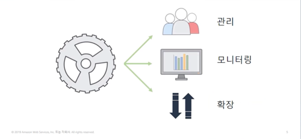  
Amazon Redshift 클러스터의 관리 모니터링 및 크기 조정에 필요한 대부분의 일반적인 관리 작업을 자동화할 수 있다.
자동화를 활용하면 데이터 및 비즈니스에 집중할 수 있다.
확장성은 Amazon Redshift에 내재되어 있다. 콘솔에서 클릭 몇 번으로 필요에 따라 클러스터를 확장하거나 축소할 수 있다.
AWS의 최우선 순위는 보안이다. Amazon Redshift는 보안을 기본적으로 보장하며 저장된 데이터와 전송 중인 데이터에 대해 강력한 암호화를 제공하도록 설계되었다.

## 호환성
  
Amazon Redshift는 기존의 익숙한 도구와 호환된다. Amazon Redshift는 표준 SQL을 지원한다. 
또한 고성능 Java 데이터베이스 연결 및 개방형 데이터베이스 연결 커넥터를 제공한다. 
따라서 원하는 SQL 클라이언트 및 비즈니스 인텔리전스 도구를 사용하여 Redshift 클러스터에 연결할 수 있다.
AWS 콜솔 또는 AWS CLI를 통해 Amazon Redshift 클러스터와 직접 상호 작용할 수도 있다.

## Amazon Redshift 사용 사례
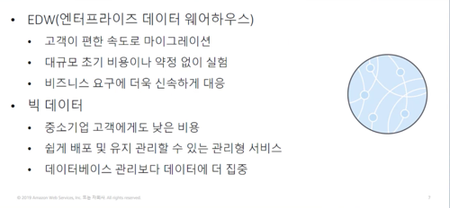  
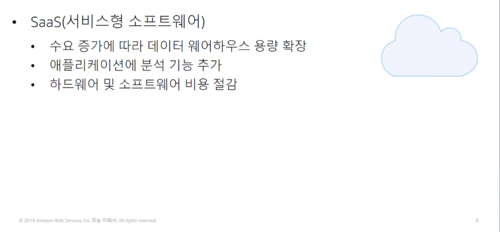  
서비스형 소프트웨어를 사용하는 고객은 Amazon Redshift가 제공하는 확장 가능하고 관리하기 쉬운 기능을 활용할 수 있다.
일부 고객은 Amazon Redshift를 사용하여 애플리케이션에 분석 기능을 제공하기도 한다.
고객별로 클러스터를 배포하고 태깅을 사용하여 서비스 수준 계약 및 결제를 간소화하고 관리하는 사용자도 있다.

# Amazon Aurora
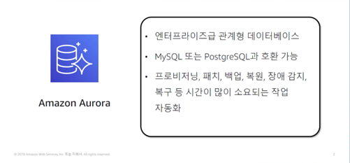  
Amazozn Aurora는 클라우드용으로 구축된 MySQL 및 PostgreSQL과 호환되는 관계형 데이터베이스로,
고성능 상용 데이터베이스의 속도와 가용성에 오픈 소스 데이터베이스의 간편함과 비용 효율성을 결합했다.
Amazon Aurora를 사용하면 데이터베이스 인스턴스의 비용을 절감하면서 데이터베이스의 안정성과 가용성을 개선할 수 있다.
완전관리형 서비스인 Aurora는 프로비저닝 패치 적용, 백업, 복구, 장애탐지, 복원 등 시간이 많이 소요되는 작업을 자동화하도록 설계되었다.

## 이점
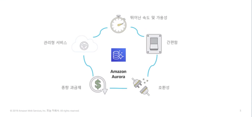  
Amazon Aurora는 고가용성을 제공하도록 설계되었다. Aurora 아키텍처가 기본적으로 고가용성을 제공하므로
고가용성을 위해 구성해야 할 항목이 없다. Aurora는 고속의 분산 스토리지 하위 시스템을 기반으로 구축되므로 
대규모 관계형 데이터베이스 세트에 적합하다. Amazon Aurora는 설정이 간단하며 표준 SQL을 지원한다. 
MySQL 및 PostgreSQL 데이터베이스 엔진과 즉시 호환되도록 설계되었기 때문에 거의 또는 전혀 변경하지 않고도 
기존 데이터베이스 도구를 대부분 사용할 수 있다.  
Amazon Aurora는 종량제 서비스이므로 사용한 서비스 및 기능에 대한 비용만 지불하면 된다. 
관리형 서비스이며 AWS Database Migration Service 및 AWS Schema Conversion Tool과 원활하게 통합된다.
이러한 도구를 활용하면 레거시 관계형 데이터베이스 관리 시스템의 데이터를 Amazon Aurora로 간편하게 이동할 수 있다. 

## 고가용성
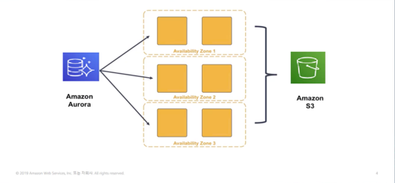  
Amazon Aurora가 다른 옵션보다 나은 몇 가지 이유가 있다.
주된 이유 중 하나는 고가용성과 복원력이 뛰어난 Amazon Aurora의 설계에 있다.
Amazon Aurora는 여러 가용 영역에 여러 데이터 복사본을 저장하여 고가용성을 실현한다.
데이터는 Amazon S3에 지속적으로 백업된다. 
Amazon Aurora에서는 최대 15개의 읽기 전용 복제본을 사용하여 읽기 작업이 많은 사용 사례의 성능을 크게 개선할 수 있다.
이렇게 하면 데이터가 손실될 가능성도 줄어든다. 

## 복원력이 뛰어난 설계
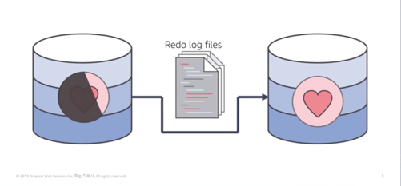  
Amazon Aurora는 기본 데이터베이스가 비정상인 경우 즉각적인 충돌 복구를 수행하도록 설계되었다.
데이터베이스 오류가 발생한 후 Amazon Aurora는 마지막 데이터베이스 체크포인트에서 다시 실행 로그를 재생할 필요가 없다.
대신 모든 읽기 작업에서 이 작업을 수행한다. 이렇게 하면 대부분의 경우 데이터베이스 오류가 발생한 후의 재시작 시간이 60초 미만으로 줄어든다.
Aurora 아키텍처는 데이터베이스 프로세스에서 버퍼 캐시를 제거하므로 재시작 직후에 버퍼를 사용할 수 있다.
즉, 충돌 후 캐시가 다시 채워질 때까지 기다리는 동안 액세스를 제한할 필요가 없다.
