# Amazon Cloud Architecture
## AWS Well-Architected Framework
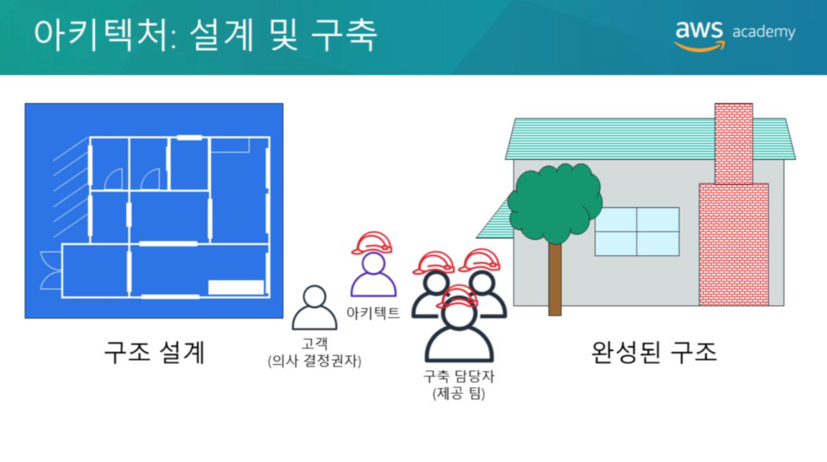  
아키텍처는 큰 구조물을 설계하고 구축하는 예술이자 과학입니다. 
대규모 시스템의 아키텍트는 시스템의 규모와 복잡성을 관리해야 합니다. 
클라우드 아키텍트는 다음과 같은 일을 합니다.  
* 의사결정권자와 협력하여 비즈니스 목표와 개선이 필요한 기능을 식별합니다.
* 솔루션의 기술결과물이 비즈니스 목표와 일치하는지 확인합니다.
* 솔루션을 구현하는 제공팀과 협력하여 기술의 기능이 적절한지 확인합니다.   

Well-Architected 시스템을 갖추면 비즈니스 성공의 가능성이 크게 높아집니다.

  
AWS Well-Architected 프레임워크는 클라우드 애플리케이션 및 워크로드를 위한 최고수준의 보안, 고성능, 복원력 및 효율성을 갖춘 인프라를 구축하는데 도움이 되는 안내서입니다. 
이 프레임워크는 클라우드 아키텍처를 평가하고 구현하는데 도움이 될수 있는 기본적인 질문과 모범사례세트를 제공합니다. 
AWS는 수많은 고객의 AWS 기반 아키텍처를 검토한 끝에 Well-Architected 프레임워크를 개발했습니다.

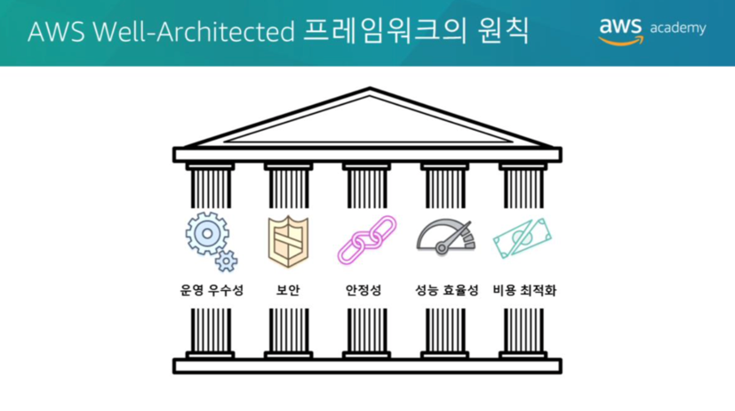  
AWS Well-Architected 프레임워크는 **운영우수성, 보안성, 안정성, 성능효율성, 비용최적화** 등 다섯가지 원칙으로 구성됩니다.

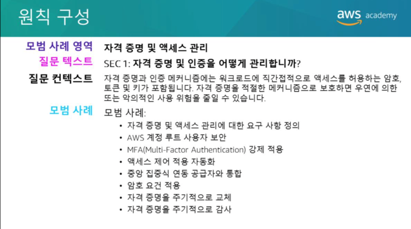  
각 원칙에는 **설계원칙과 모범사례영역**이 포함되어 있습니다. 
기본질문세트는 각 모범사례영역에 있습니다. 
각 질문에는 약간의 컨텍스트와 모범사례목록이 제공됩니다.

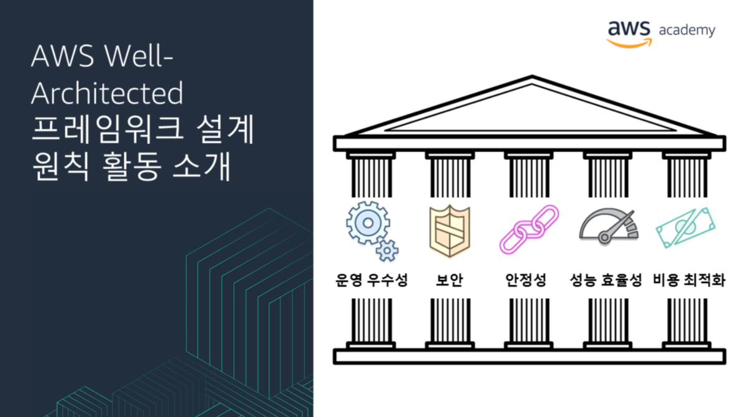  
이 모듈의 나머지 섹션에서는 각 원칙에 대한 AWS Well-Architected 프레임워크 설계원칙을 기준으로 가상회사의 아키텍처를 검토합니다.

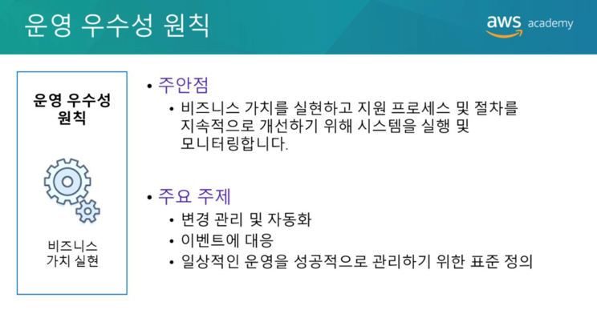  
운영 우수성 원칙에는 비즈니스 가치를 실현하고 지원 프로세스 및 절차를 지속적으로 개선하기 위해 시스템을 실행 및 모니터링 하는 기능이 포함됩니다. 
변경 관리 및 자동화, 이벤트 응답, 일일 운영 관리를 위한 표준 정의와 같은 주제를 주로 다룹니다.

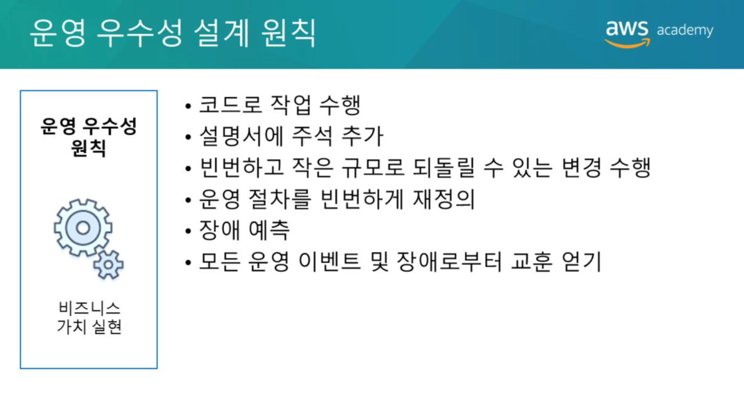  
클라우드에서 운영 우수성을 달성할 수 있는 6가지 설계원칙은 다음과 같습니다.
* 코드로 작업수행  
  – 전체 워크로드(즉, 애플리케이션 및 인프라)를 코드로 정의하고 코드로 업데이트 합니다. 
  작업절차를 코드로 구현하고 이벤트에 대한 응답으로 자동 트리거 되도록 구성합니다. 
  코드로 작업을 수행하면 인적오류를 제한하고 이벤트에 일관되게 응답할 수 있습니다.
  
* 설명서 주석달기  
  – 빌드가 나올때 마다 주석이 추가된 설명서를 자동으로 생성합니다. 
  주석이 추가된 시스템은 사람과 시스템이 사용할 수 있습니다. 
  주석을 작업코드에 대한 입력으로 사용할 수 있습니다.
  
* 작은 규모의 취소 가능한 변경을 빈번하게 수행  
  – 구성요소의 주기적 업데이트가 가능하도록 워크로드를 설계합니다. 
  실패할 경우 되돌릴 수 있는 작은 단위로 변경을 수행합니다(가능한 경우 고객에게 영향을 주지않아야함).
  
* 작업 절차를 자주 개선  
  – 작업 절차를 개선할 수 있는 기회를 찾습니다. 
  워크로드 변화에 따라 절차를 적절히 변경합니다. 
  정기적인 게임 데이를 설정하여 모든 절차를 검토하고, 절차의 효과를 검증하며, 팀이 절차를 제대로 숙지하고 있는지 확인합니다.
  
* 실패예상  
  – 가능한 실패 원인을 식별하여 사전에 제거하거나 완화합니다. 
  실패 시나리오를 테스트하고 각 시나리오의 영향을 이해하고 있는지 확인합니다. 
  대응절차를 테스트하여 절차가 효과적이고 팀이 제대로 이행할 수 있는지 확인합니다. 
  정기적인 게임 데이를 설정하여 워크로드를 테스트하고 시뮬레이션된 이벤트에 대한 팀의 대응을 테스트합니다.
  
* 모든 운영 실패를 교훈으로 삼기  
  – 모든 운영 이벤트 및 실패에서 얻은 교훈을 통해 개선을 주도합니다. 
  배운 내용을 팀과 전체 조직에서 공유합니다.
  
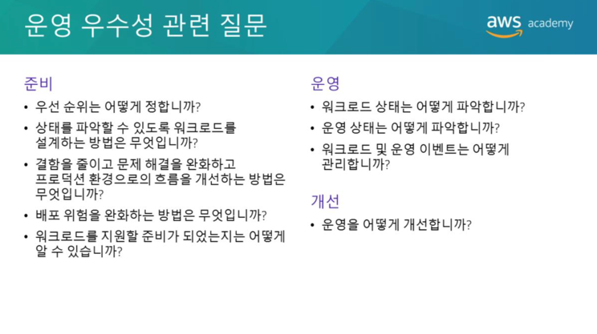  
운영 우수성에 대한 기본적인 질문은 **준비, 운영 및 개선**이라는 3가지 모범사례영역과 관련됩니다. 
운영팀에서 효과적이고 효율적으로 비즈니스 결과를 지원하려면 비즈니스 및 고객의 요구를 이해해야 합니다. 
운영팀은 운영 이벤트에 대응하는 절차를 만들고 사용하며 절차가 효과적으로 비즈니스 요구사항을 지원하는지 검증합니다. 
운영팀은 원하는 비즈니스 결과의 달성여부를 측정하는데 사용할 지표를 수집합니다. 
비즈니스 상황, 비즈니스 우선순위 및 고객의 요구사항은 시간에 따라 달라집니다. 
따라서 변화에 따라 개선이 가능한 운영절차를 설계하고 절차를 수행한 후 얻은 교훈을 절차에 포함하는 것이 중요합니다.

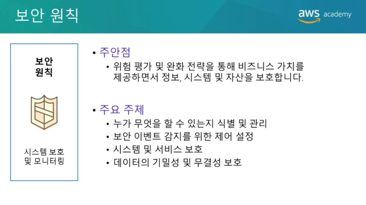  
보안 원칙에서는 정보, 시스템 및 자산을 보호하면서 위험평가 및 완화 전략을 통해 비즈니스 가치를 실현하는 역량에 중점을 둡니다.
데이터의 기밀성 및 무결성 보호, 사용자가 수행할 수 있는 작업 식별 및 관리(또는권한관리), 시스템 보호 및 보안 이벤트 탐지 제어 설정과 같은 주제를 주로 다룹니다.

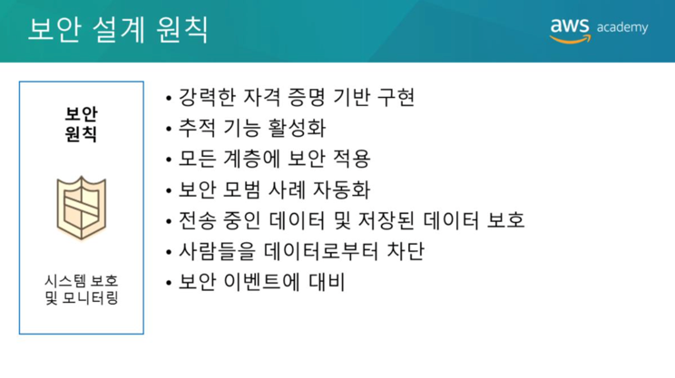  
보안을 강화할 수 있는 7가지 설계 원칙은 다음과 같습니다.
* 자격 증명을 위한 강력한 기반 구현  
  – 최소 권한의 원칙을 구현하고 직무분리를 시행합니다. 
  AWS 리소스와의 모든 상호작용에 적절한 권한을 부여합니다. 
  권한 관리를 중앙 집중화하여 장기 자격 증명에 대한 의존을 줄이거나 제거합니다.
  
* 추적 기능 활성화  
  – 환경에서 수행되는 작업과 변경사항에 대한 실시간 모니터링, 알림 및 감사기능을 사용합니다. 
  로그와 지표를 시스템에 통합하여 자동으로 대응하고 조치를 취합니다.
  
* 모든 계층에서 보안 적용  
  – 심층 방어를 적용하고 아키텍처의 모든계층(예: 엣지 네트워크, 가상 프라이빗 클라우드, 서브넷 및 로드밸런서, 모든 인스턴스, 운영체제 및 애플리케이션)에 보안 제어를 적용합니다.
  
* 보안 모범 사례 자동화  
  – 보안 메커니즘을 자동화하여 확장 및 축소를 신속하고 경제적이며 안전하게 수행하는 기능을 개선합니다. 
  안전한 아키텍처를 생성하고, 버전이 관리되는 템플릿에서 코드로 정의되고 관리되는 제어기능을 구현합니다.
  
* 전송 데이터 및 유휴 데이터 보호  
  – 데이터를 민감도에 따라 분류하고 암호화, 토큰화 및 액세스 제어와 같은 메커니즘을 적절히 사용합니다.
  
* 데이터 액세스 차단  
  – 데이터에 직접 액세스 하거나 데이터를 수동으로 처리해야 하는 필요성을 줄이거나 이러한 필요를 없애는 메커니즘과 도구를 만듭니다.
  
* 보안 이벤트 대비  
  – 조직의 요구사항에 적합한 인시던트 관리 프로세스를 마련합니다. 
  인시던트 대응 시뮬레이션을 실행하고 자동화를 포함한 도구를 사용하여 탐지, 조사 및 복구속도를 높입니다.
  
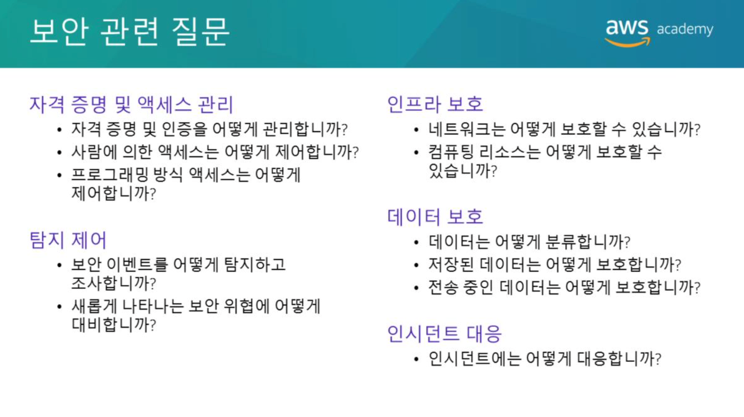  
보안에 대한 기본적인 질문은 **자격 증명 및 액세스 관리, 탐지 제어, 인프라 보호, 데이터 보호, 인시던트 대응**의 5가지 모범 사례 영역과 관련됩니다.
시스템을 설계하기 전에 보안사례를 설정해야 합니다. 
누가 무엇을 할 수 있는지 제어할 수 있어야 합니다. 
또한 보안 인시던트를 식별하고, 시스템과 서비스를 보호하며, 데이터 보호를 통해 데이터의 기밀성과 무결성을 유지할 수 있어야 합니다. 
올바르게 정의되고 시행되는 보안 인시던트 대응 프로세스가 있어야 합니다. 
이러한 도구와 기술은 재정적 손실을 방지하거나 규제의무를 준수하는 등의 목표를 지원한다는 점에서 중요한 역할을 합니다.

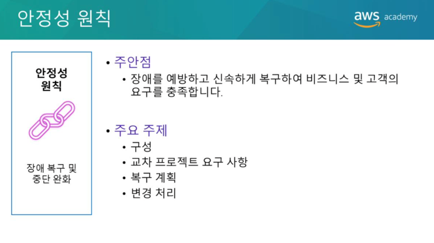  
안정성 원칙은 인프라 또는 서비스 장애로부터 복구하고, 
수요에 맞춰 컴퓨팅 리소스를 동적으로 확보하며,
잘못된 구성이나 일시적인 네트워크 문제와 같은 중단을 완화하는 시스템의 기능에 중점을 둡니다.
**설정, 교차 프로젝트 요구사항, 복구 계획 및 변경 처리**와 같은 주제를 주로 다룹니다.

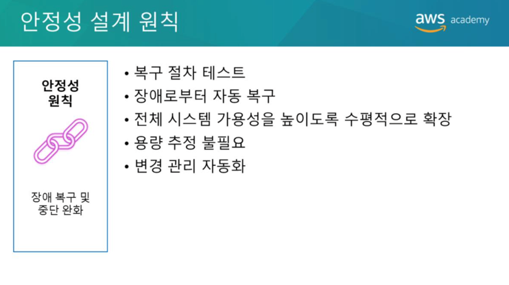  
안정성을 높일 수 있는 5가지 설계 원칙은 다음과 같습니다.
* 복구 절차 테스트  
  – 시스템 장애를 테스트하고 복구 절차를 검증합니다. 자동화를 사용하여 다양한 장애를 시뮬레이션하거나 이전에 장애로 이어졌던 시나리오를 재현합니다. 
  이렇게 하면 장애 경로를 파악하여 실제 장애 시나리오가 발생하기 전에 테스트하고 교정할 수 있습니다.
  
* 장애시 자동복구  
  – 시스템의 주요 성능 지표를 모니터링하고 임계값 위반시 자동복구를 트리거 하도록 시스템을 구성합니다. 
  이 방법을 사용하면 자동 알림 및 장애 추적 기능을 활성화하고 장애를 해결하거나 복구하는 자동 복구 프로세스를 지원할 수 있습니다.
  
* 수평적 확장을 통한 전체 시스템 가용성 증대  
  – 단일의 대규모 리소스를 다수의 소규모 리소스로 대체하고 이러한 소규모 리소스에 요청을 분산하여 단일 지점의 장애가 전체시스템에 미치는 영향을 줄입니다. 
  
* 용량을 추정하지 말것  
  – 수요 및 시스템 사용량을 모니터링하고 리소스 추가 또는 제거를 자동화하여 수요를 충족하는 최적의 수준을 유지합니다.
  
* 자동화 기능의 변경관리  
  – 자동화를 사용하여 인프라 변경을 수행하고 자동화 기능의 변경을 관리합니다.
  
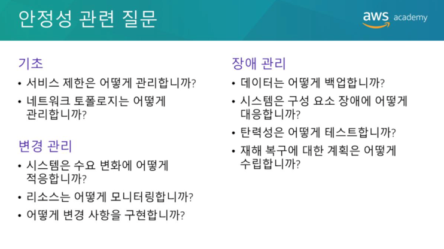  
안정성에 대한 기본적인 질문은 기반, 변경 관리 및 장애관리의 3가지 모범사례 영역과 관련됩니다.
안정성을 달성하려면 시스템에 제대로 계획된 기반과 모니터링 기능이 있어야 합니다. 
수요 또는 요구사항의 변경을 처리하는 메커니즘이 있어야 합니다. 
시스템은 장애를 감지하고 자동으로 자가 복구를 수행하도록 설계되어야 합니다.

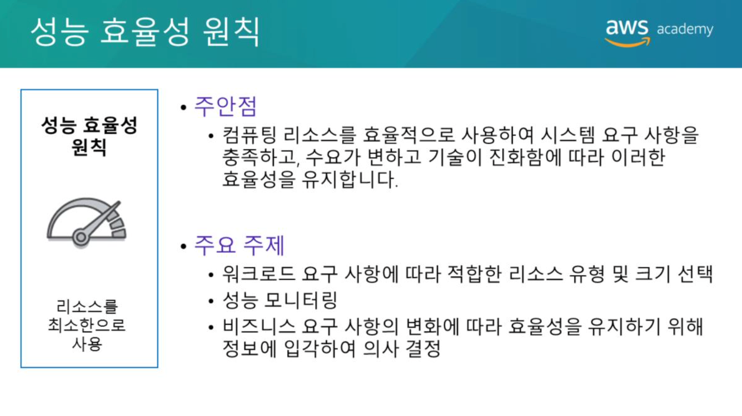  
성능 효율성 원칙은 IT 및 컴퓨팅 리소스를 효율적으로 사용하여 시스템 요구사항을 충족하고, 수요 변화 또는 기술 개선에 따라 이러한 효율성을 유지하는 역량에 중점에 둡니다. 
워크로드 요구사항에 적합한 리소스 유형 및 크기를 선택하는 방법, 성능을 모니터링하는 방법 및 정보 기반 의사결정을 통해 변화하는 비즈니스 환경에서 효율성을 유지하는 방법 등을 주로 다룹니다.

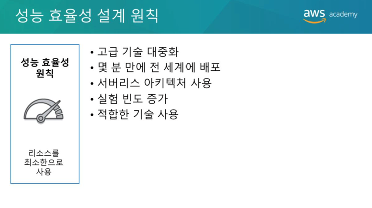  
성능 효율성을 개선할 수 있는 5가지 설계원칙은 다음과 같습니다.
* 고급 기술의 민주화  
  – 기술을 서비스 형태로 소비합니다. 예를들어 NoSQL 데이터베이스, 미디어트랜스코딩, 기계학습같은 기술은 기술 커뮤니티에서 쉽게 찾을 수 없는 전문성이 요구되는 기술입니다. 
  클라우드에서는 이러한 기술을 서비스로 사용할 수 있습니다. 기술을 소비함으로써 팀은 리소스 프로비저닝 및 관리 대신 제품 개발에 집중할 수 있습니다.
  
* 신속한 글로벌 배포  
  – 여러 AWS 리전에 시스템을 배포하여 지연시간을 줄이고 최소한의 비용으로 고객 경험을 개선합니다.
  
* 서버리스 아키텍처 사용  
  – 서버리스 아키텍처에서는 서버 실행 및 유지 관리로 인한 운영 부담없이 기존의 컴퓨팅 활동을 수행할 수 있습니다. 
  관리형 서비스는 대규모로 운영되기 때문에 서버리스 아키텍처에서는 트랜잭션 비용도 절감됩니다.
  
* 자주 실험  
  – 다양한 유형의 인스턴스, 스토리지 또는 구성을 비교하는 테스트를 수행합니다.
  
* 적합한 기술을 파악  
  – 목표를 달성하기에 가장 적합한 기술접근방식을 사용합니다. 
  예를들어 데이터베이스 또는 스토리지에 대한 접근방식을 선택할 때는 데이터 액세스 패턴을 고려합니다.
  
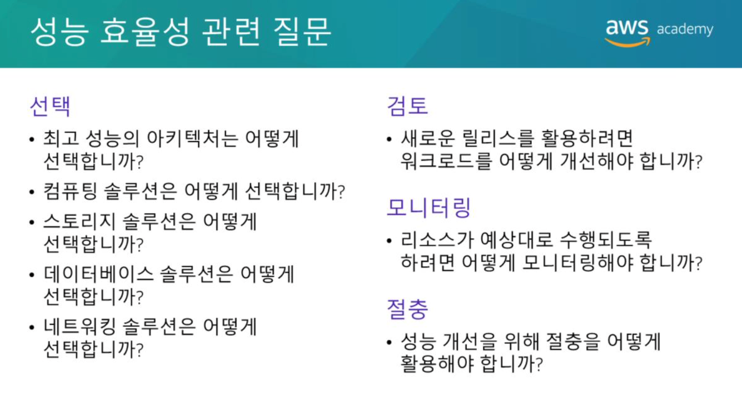  
성능 효율성에 대한 기본적인 질문은 선택, 검토, 모니터링 및 절충의 4가지 모범 사례 영역과 관련됩니다.
데이터를 사용하여 고성능 아키텍처를 설계하고 구축합니다. 
설계 개요부터 리소스 유형의 선택 및 구성까지 아키텍처의 모든 측면에 관한 데이터를 수집합니다. 
선택 사항을 주기적으로 검토하여 새로운 AWS 서비스를 활용하고 있는지 확인합니다. 
모니터링을 수행하여 예상 성능과의 차이를 파악하고 즉각적인 조치를 통해 문제를 해결합니다. 
마지막으로 아키텍처 설계시 여러 측면을 절충하여 성능을 개선합니다. 
예를들어 압축을 사용하거나, 캐싱을 사용하거나, 일관성 요구사항을 완화합니다.

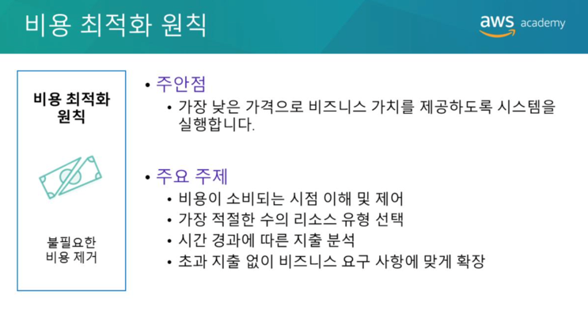  
비용 최적화 원칙은 최소한의 시스템 실행비용으로 비즈니스가치를 실현하는 역량에 중점을 둡니다. 
지출 영역 파악 및 제어, 가장 적절하고 적합한 수의 리소스 유형 선택, 시간대별 지출 분석과 초과 지출없이 비즈니스 요구사항에 맞춘 크기 조정같은 항목을 주로 다룹니다.  

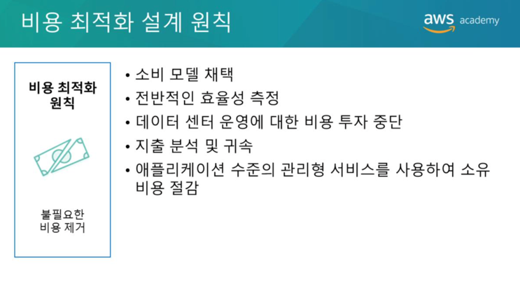  
비용을 최적화할 수 있는 5가지 설계원칙은 다음과 같습니다.
* 소비 모델 도입  
  – 필요한 컴퓨팅 리소스에 대해서만 비용을 지불합니다. 정교한 예측을 사용하는 대신 비즈니스 요구사항에 따라 사용량을 늘리거나 줄입니다.
  
* 전체 효율성 측정  
  – 워크로드의 비즈니스 결과를 측정하고 이 결과를 실현하는 것과 관련된 비용을 측정합니다. 
  이 측정을 사용하여 결과를 늘리고 비용을 줄여 얻을 수 있는 이점을 파악합니다.
  
* 데이터 센터 운영에 대한 비용 지출 중단  
  – AWS는 서버를 랙에 설치하고, 스태킹하고, 전원을 공급하는 등의 작업 부담을 덜어줍니다. 
  따라서 IT 인프라가 아니라 고객과 비즈니스 프로젝트에 집중할 수 있습니다.
  
* 비용 분석 및 속성파악  
  – 클라우드에서는 손쉽게 시스템 사용량과 비용을 정확히 파악하고 IT 비용을 개별 워크로드 소유자에게 알릴 수 있습니다.
  이 기능을 통해 ROI(투자수익률)을 측정할 수 있으며 워크로드 소유자에게는 리소스를 최적화하고 비용을 줄이는 기회가 제공됩니다.
  
* 애플리케이션 수준의 관리형 서비스를 사용하여 소유비용절감  
  – 애플리케이션 수준의 관리형 서비스는 이메일 전송 또는 데이터베이스 관리와 같은 작업을 지원할 서버를 유지관리하는 운영부담을 줄여줍니다.
  관리형 서비스는 클라우드 규모에서 운영되기 때문에 클라우드 서비스 공급자가 더 저렴한 트랜잭션 또는 서비스당 비용을 제공할 수 있습니다.

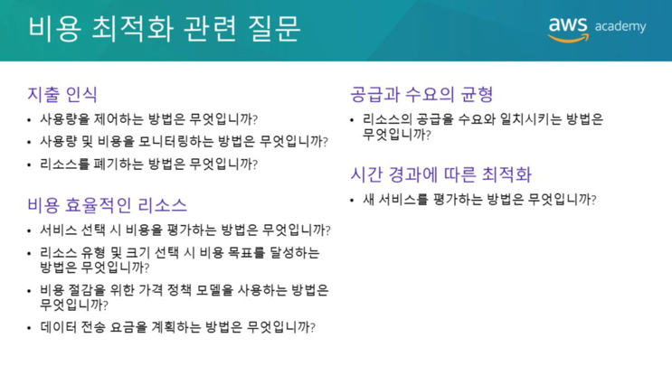  
비용 최적화에 대한 기본질문은 **비용인식, 비용효율적인 리소스, 공급과 수요의 균형, 시간경과에 따른 최적화**라는 네 가지 모범사례영역으로 분류할 수 있습니다.
다른 원칙과 마찬가지로 비용을 평가할 때 고려해야할 장단점이 있습니다. 
예를들어 선결제방식의 비용최적화 서비스에 투자하는 대신 빠른 시장출시, 새로운 기능제공, 마감기한 충족 등 속도를 최우선으로 할 수 있습니다. 
또 다른 예로, 더 높은 수준의 가용성을 보장하는 애플리케이션을 설계하려면 일반적으로 비용이 더 많이듭니다. 
실제 애플리케이션 요구사항을 파악하고 경험적 데이터를 이용하여 아키텍처 설계결정을 알려야 합니다. 
벤치마킹을 수행하여 시간경과에 따라 워크로드의 비용이 최적화되도록 합니다. 

## 안정성 및 가용성 (Stability and Availability)
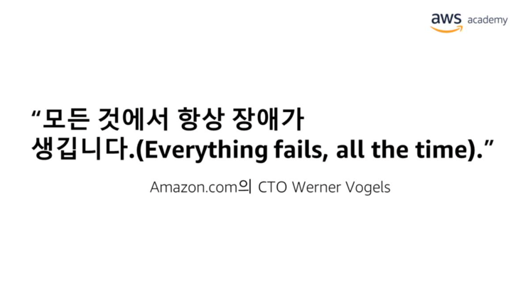  
Amazon의 CTO인 Werner Vogels는 "모든것에서 항상 장애가 발생한다"고 말합니다. 
AWS Well-Architected 프레임워크에서 제시하는 모범사례 중 하나는 장애(또는 애플리케이션/워크로드 가동 중지)에 대비한 계획을 수립하는 것 입니다.
이를 위한 한 가지 방법은 장애를 견디도록 애플리케이션과 워크로드를 설계하는 것입니다. 
클라우드 아키텍트가 장애를 견디도록 아키텍처를 설계할 때 고려하는 두 가지 중요한 요소는 **안정성 과 가용성**입니다.

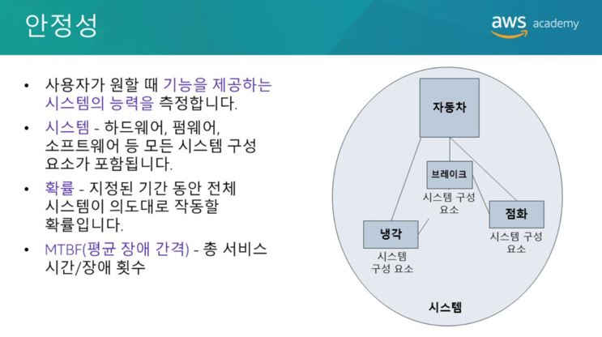  
안정성은 **사용자가 원하는 경우 기능을 제공할 수 있는 시스템의 능력을 측정하는 척도**입니다. 
"모든것에서 항상 장애가발생"하므로 **통계적 방식**으로 안정성을 생각해야 합니다. 
안정성은 **일정기간동안 전체 시스템이 정상적으로 작동할 확률**입니다. 
시스템에는 하드웨어, 펌웨어 및 소프트웨어와 같은 여러 시스템 구성요소가 포함되어 있습니다. 
이러한 시스템 구성요소의 장애는 시스템의 가용성에 영향을 미칩니다. 
친숙한 자동차를 예로 설명하면 안정성을 쉽게 이해할 수 있습니다. 
자동차는 **시스템**에 해당합니다. 
자동차의 각 부품(예: 냉각, 점화및브레이크)가 유기적으로 작동해야 자동차가 제대로 작동합니다. 
자동차의 시동을 걸때 점화가 실패하면 어디로도 운전해 갈 수 없습니다. 즉, 자동차가 **가용상태가 아닙니다**. 
점화가 반복적으로 실패하면 자동차는 **안정성이 낮은것으로 간주**됩니다.
안정성을 측정하는 일반적인 방법은 **MTBF(평균장애간격)와 같은 통계측정값**을 사용하는 것 입니다. 
MTBF는 여러건의 장애에 걸친 총 서비스 시간입니다.

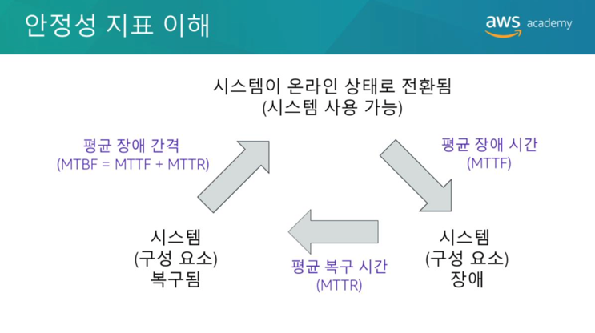  
월요일 정오에 온라인 상태로 전환되는 애플리케이션이 있다고 가정해 보겠습니다. 
이 애플리케이션은 가용상태라고 할 수 있습니다. 금요일 정오에 장애가 발생할때까지 정상적으로 작동합니다. 
이 경우 장애시간(또는 애플리케이션을 사용할 수 있는 시간)은 96시간(월 12:00 ~ 금 12:00)입니다. 
금요일 정오부터 월요일 정오까지(72시간) 애플리케이션에서 장애가 발생한 이유를 진단하여 복구합니다. 
그러면 애플리케이션이 다시 온라인 상태로 전환됩니다. 따라서 복구시간은 72시간 입니다.
그런데 장애가 다시 발생합니다. 금요일 정오에 애플리케이션에서 장애가 발생하고, 
금요일 정오부터 월요일 정오까지 복구작업을 진행한 끝에 월요일 정오에 온라인으로 전환됩니다. 
이 장애–복구–복원주기가 매주 발생한다고 가정해보겠습니다. 
이제 이들 수치의 평균을 계산할 수 있습니다. 
이 예에서 MTTF(평균장애시간)는 96시간이고 MTTR(평균복구시간)은 72시간입니다. 
MTBF(평균장애간격)는 168시간(또는1주)이며, 이는 **MTTF와 MTTR의 합계**입니다.  

MTBF(Mean Time Between Failure) : 평균 고장 시간 간격  
MTTF(Mean Time to Failure) : 평균 고장 시간  
MTTR(Mean Time To Repair) : 평균 수리 시간  

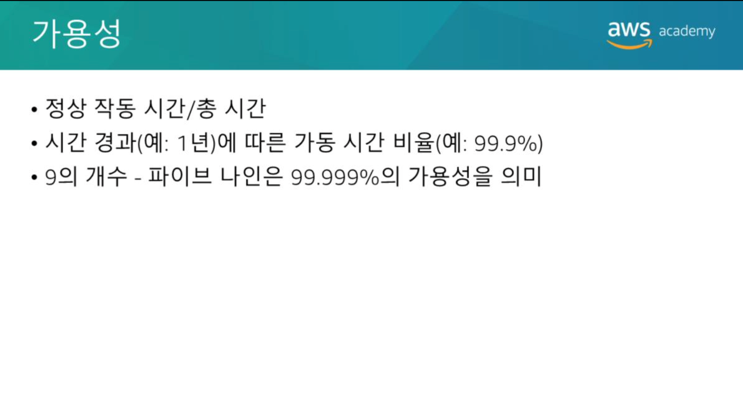  
방금 배웠듯이 시스템 구성요소의 장애는 시스템의 가용성에 영향을 미칩니다.
공식적으로, 가용성은 시스템이 정상적으로 작동하거나 예상되는 작업을 올바르게 수행하는 시간의 비율(또는총시간대비정상작동시간)입니다. 
예정된 중단과 예정되지 않은 중단을 포함하여 애플리케이션이 정상적으로 작동하지 않을 때마다 가용성이 저하됩니다.
가용성은 **일정기간(일반적으로 1년) 동안의 가동시간 비율(즉, 장애간에 시스템이 온라인 상태로 유지되는 시간)으로 정의**됩니다.
가용성을 언급할 때 일반적으로 사용하는 수단은 9의 수 입니다. 
예를 들어 파이브나인은 99.999%의 가용성을 의미합니다.

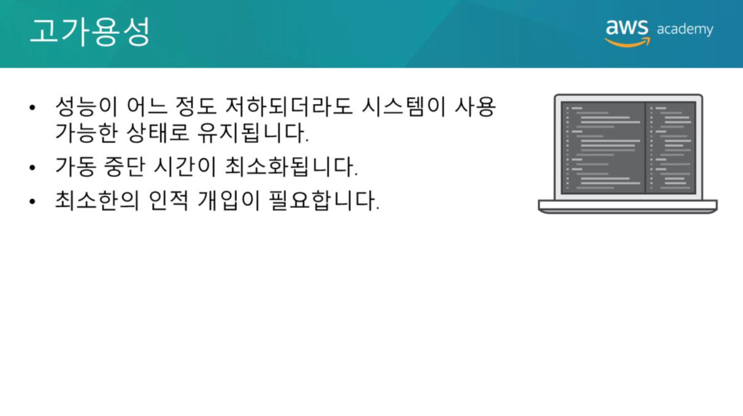  
고가용성 시스템이란 **성능이 어느정도 저하되더라도 시스템이 사용가능한 상태로 유지되는 시스템**을 말합니다. 
고가용성 시스템에서는 가동 중지 시간이 최소화되고 사람의 개입이 거의 필요하지 않습니다. 
고가용성 시스템은 서로 유기적으로 작동하면서 필수 서비스를 보장하는 시스템 전체의 공유 리소스 집합이라고 할 수 있습니다. 
고가용성은 소프트웨어를 개방형 표준 하드웨어와 결합하여 시스템, 구성요소 또는 애플리케이션이 실패할 때 필수서비스를 신속하게 복원함으로써 가동중단시간을 최소화 합니다. 
서비스는 대개 1분 이내에 신속하게 복원됩니다.

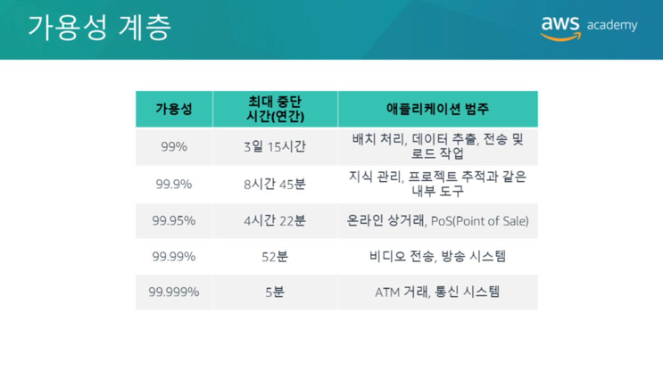  
가용성 요구사항은 고객마다 다릅니다. 
허용되는 중단기간은 애플리케이션 유형에 따라 다릅니다.
다음은 일반적인 애플리케이션 가용성 설계 목표와 1년 동안 허용되는 최대 중단기간을 보여주는 표 입니다. 
이 표에는 각 가용성계층에서 자주 볼 수 있는 애플리케이션 유형의 예제가 나와있습니다.

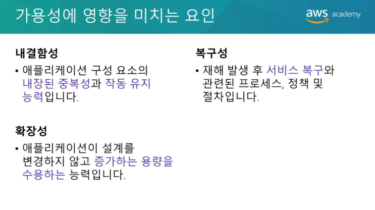  
애플리케이션의 가용성을 저해할 수 있는 이벤트를 항상 예측할 수는 없지만, 아키텍처 설계에서 가용성을 구축할 수 있습니다. 
애플리케이션의 전반적인 가용성을 결정하는 세 가지 요인이 있습니다.
* **내결함성은 애플리케이션 구성요소의 기본이 중화기능과 일부 구성 요소에 장애가 발생하더라도 애플리케이션이 작동상태를 유지하는 능력을 말합니다.** 
  내결함성은 특수 하드웨어를 사용하여 시스템 구성요소(예: 프로세서, 메모리보드, 전원공급장치, I/O 하위시스템 또는 스토리지 하위 시스템)의 장애를 탐지하고 동시에 이중화 하드웨어 구성요소로 전환합니다. 
  내결함성 모델은 소프트웨어 장애를 해결하지 못하며, 이것은 가동중단 시간이 발생하는 가장 일반적인 이유입니다. 
  
* **확장성은 요구 용량 증가에 대비하고, 가용성을 유지하고, 요구되는 표준 내에서 성능을 보장하는 애플리케이션의 능력을 말합니다.** 
  확장성이 가용성을 보장하지는 않지만 애플리케이션의 가용성에 영향을 미칩니다.
  
* **복구성은 재해로 인해 구성요소가 사용불능상태가 되거나 데이터가 파괴될 경우 데이터 손실없이 서비스를 신속하게 복원하는 능력을 말합니다.**  
  
일반적으로 가용성을 개선하면 비용이 증가한다는 점에 유의하십시오. 
환경의 가용성을 높일 방법을 고려할때, 개선비용과 사용자에게 돌아가는 혜택 간에 균형을 맞추는 것이 중요합니다. 
애플리케이션이 항상 활성상태이거나 연결가능한 상태로 유지되도록 하시겠습니까? 아니면 허용가능한 성능 수준내에서 요청을 서비스하도록 하시겠습니까?

# AWS Trusted Advisor
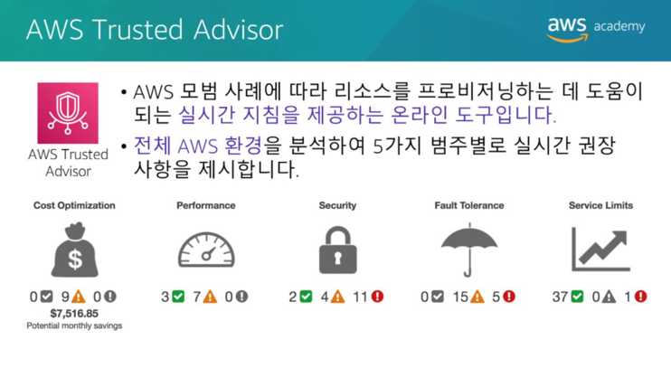  
AWS Trusted Advisor는 AWS 모범사례에 따라 리소스를 프로비저닝 하는데 도움이 되도록 실시간 지침을 제공하는 온라인 도구 입니다. 
AWS Trusted Advisor는 전체 AWS 환경을 분석하여 5가지 범주별로 권장사항을 제시합니다.  
* 비용최적화  
  – AWS Trusted Advisor는 리소스 사용량을 분석하고, 사용하지 않는 유휴 리소스를 제거하거나 예약용량을 약정하여 비용을 최적화할 수 있도록 권장사항을 제시합니다.
  
* 성능  
  – 서비스 한도를 점검하고, 프로비저닝된 처리량을 활용하는지 확인하며, 초과 사용되는 인스턴스를 모니터링하여 서비스 성능을 개선하십시오.
  
* 보안  
  – 결함을 없애고, 다양한 AWS 보안기능을 사용하며, 권한을 점검하여 애플리케이션 보안을 개선하십시오.
  
* 내결함성  
  – 자동조정, 상태확인, 다중 AZ 배포, 백업기능을 활용하여 AWS 애플리케이션의 가용성과 이중화를 개선하십시오.
  
* 서비스제한  
  – AWS Trusted Advisor는 서비스 한도의 80%가 넘는 서비스 사용량이 있는지 점검합니다. 
  값은 **스냅샷**을 기반으로 하므로 현재 사용량과 다를 수 있습니다. 
  한도 및 사용량에 변경사항이 반영되는데 최대 24시간이 걸릴 수 있습니다.

https://aws.amazon.com/ko/premiumsupport/technology/trusted-advisor/best-practice-checklist/
