# AI (Artificial Intelligence : Definition)
the simulation of human intelligence processes by machines(computer system).  
인간의 지능을 컴퓨터시스템을 통해 시뮬레이션  

## Categorization
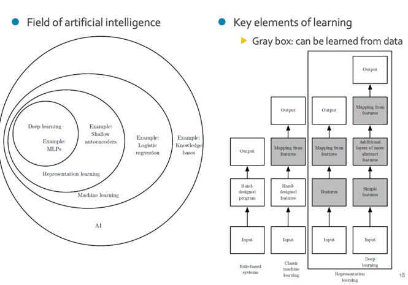  
Machine learning은 크게 두 분류로 나눌 수 있다.  
1. Classic ML  
데이터의 특징(feature)를 사람이 손수 설계해줘야함.  
ex) SVM, Random Forest  
   
2. Representation Learning  
데이터의 특징(feature)을 **시스템이 직접 도출**해낼 수 있음.  
Deep learning은 hidden layer를 통해 더 깊은 층으로 복잡한 target distribution을 도출해낼 수 있다.

## Categories of AI problem
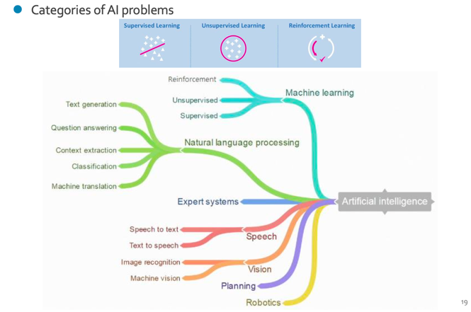  
* Supervised Learning  
학습 데이터의 라벨(정답)을 같이 학습시킨다. 주로 회귀(regression)나 분류(classification)문제를 해결하는데 적합하다.
  
* Unsupervised Learning  
라벨이 주어지지 않는다. 모델이 직접 데이터의 feature를 도출하여 clustering과 같은 과정을 겪어야 한다. 단점은 성능이 떨어진다는 점, 군집의 이름이 정해져 있지 않다.  
그러나 실제로 모든 데이터에 라벨링을 해주는 것은 불가능하므로 Self supervised learning이 연구되고 있는 추세이다.  
  참고 : https://velog.io/@tobigs-gm1/Self-Supervised-Learning
  
* Reinforcement Learning  
라벨이 주어진다. 하지만, 학습 방식에 Reward와 Punishment가 존재한다. 반복되는 학습을 통해 좋은 성과를 냈을 경우 Reward를 받는다.

## Deep learning
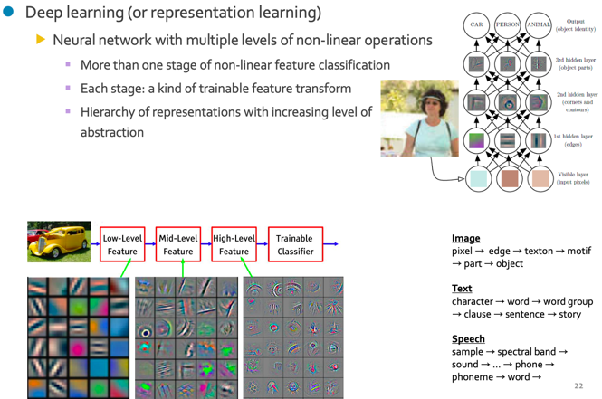  
비선형연산 기반의 다중 뉴럴 네트워크. 레이어를 거듭할 수록 데이터의 특징(feature)를 조합하여 객체를 찾아나간다.  

## Hot topics
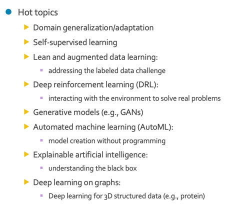

# Supervised learning
# Unsupervised learning
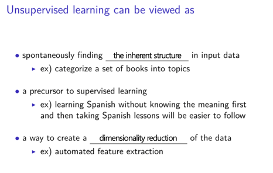  
* approaches to unsupervised learning
- clustering(k-means, mixture models, hierarchical)
- hidden Markov models(HMMs)
- feature extraction(PCA, ICA, SVD)

# Reinforcement learning
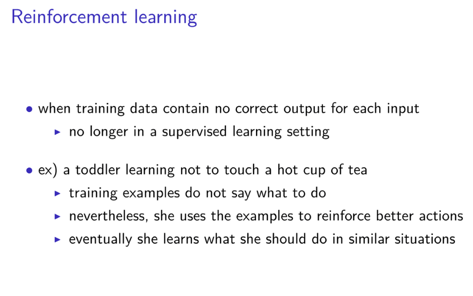  
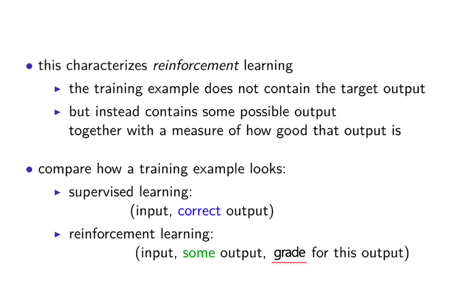  
상대적인 결과를 도출한다. 특정 상황에서는 A가 정답일 수 있지만, 다른 상황에서는 A가 정답이라는 보장이 없다. 
그래서 강화학습을 통해 상황에 따른 최선의 경우(그리디)를 학습한다.

# 표기 정리
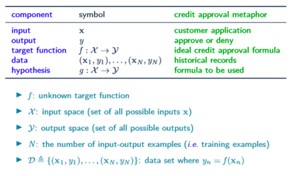  

# Perceptron
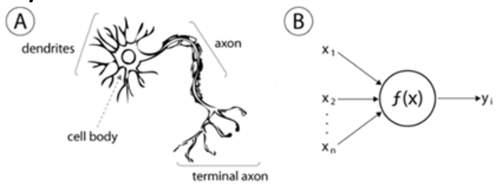  
딥러닝의 발상은 인간의 두뇌를 모방하자 라는 아이디어에서 나왔다. 뇌는 신경세포(뉴런)의 집합으로써
뉴런을 programmable하게 대체하는 수단이 perceptron이다. perceptron은 linear transform과 non-linear transform의 조합이다.
linear transform은 가중치 matrix를 의미하고, non-linear transform은 activation function(sigmoid, ReLu, softmax ..)을 의미한다.  

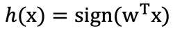  
가중치 matrix의 transpose와 inputs를 dot product(내적)을 수행한 값에 
비선형함수인 activation function의 parameter로 대입하면 activation function의 임계치가 넘어갈 경우 신호가 발생하는 구조이다.
이는 뉴런과 매우 흡사하다.  

여담으로 내적은 두 **벡터의 유사도**를 파악하는 것이다. 즉, x벡터를 w^T 벡터를 축으로 삼아 projection하여
x벡터가 w^T벡터와 유사한 정도를 파악하는 것이다.

# Multiple Layer Perceptron (MLP)
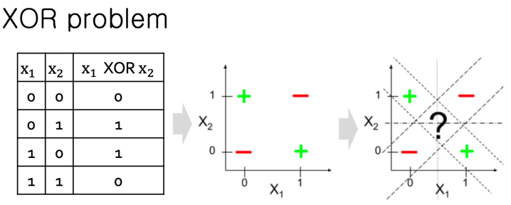  
논리연산 XOR를 하나의 perceptron으로는 구현할 수 없다는 문제가 발생했다. 인간의 뇌도 그러하듯이
뉴런이 다수개로 뇌가 구성된다. 사람들은 perceptron을 병렬적으로 구성하여 이를 해결하고자 했다.
perceptron의 출력값을 매개로 새로은 perceptron의 input으로 대입하여 위와같은 문제를 해결했다.  

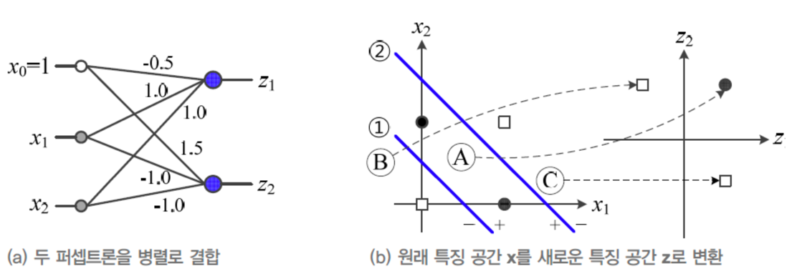  
z1에 연결된 perceptron을 p1, z2에 연결된 perceptron을 p2라고 칭하겠다.  
p1은 OR 게이트 역할을 하여 (b)그림에서 1번 선형함수의 윗면적을 의미한다.  
p2는 NAND 게이트 역할을 하여 2번 선형함수의 아래면적을 의미한다.  
그리고 p1, p2의 AND 게이트를 할 경우 XOR를 구현할 수 있다.  

여기서 중요한점은 p1에 input에 대한 가중치 matrix는 (-0.5, 1.0, 1.0)
p2의 가중치 matrix는 (1.5, -1.0, -1.0)이다. 그리고 (b)그림을 보면 x1, x2축의 좌표계를
z1, z2축으로 변환하여 고차원의 데이터를 단순하게 추상화한 것이다. 여기서 불필요한 정보는 빠지기 마련이다.

# Backpropagation (역전파)
DNN (Deep Neural Network)는 은닉층을 거쳐가며 output을 조합 혹은 활성화시켜 결과를 도출해낸다. (이 과정을 propagation라고 한다.)
하지만 이 결과가 언제나 옳을 수 없기 때문에 역전파 과정을 통해 각 input이 Loss function에 미치는 영향을 파악한다.
우리는 input과 Loss function 사이의 관계를 파악하여 이를 조정하고 모델의 성능을 높여야한다. 이 과정은 **편미분**을 통해 이전 계층의 퍼셉트론으로부터
다음 계층의 퍼셉트론으로 끼치는 영향을 파악하는 것이 목적이다.
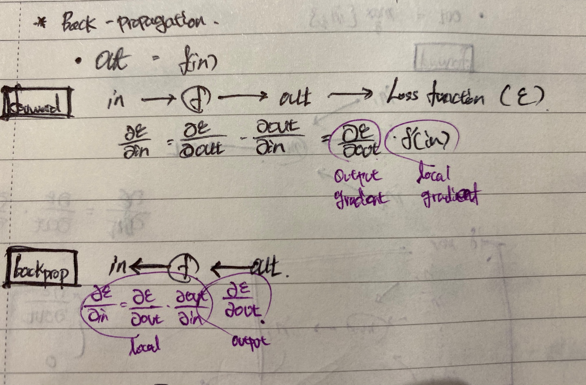 
우리가 알고싶은 것은 input이 Loss function에 미치는 영향이다. 이 과정을 편미분을 통해 수식화 하면 다음과 같다.  
local gradient는 input이 output에 미치는 영향이고, output gradient는 도출된 결과가 Loss function에 미치는 영향을 의미한다. 

지금부터 backpropagation의 연산을 하나씩 살펴볼 것이다.

* Fanout Operation
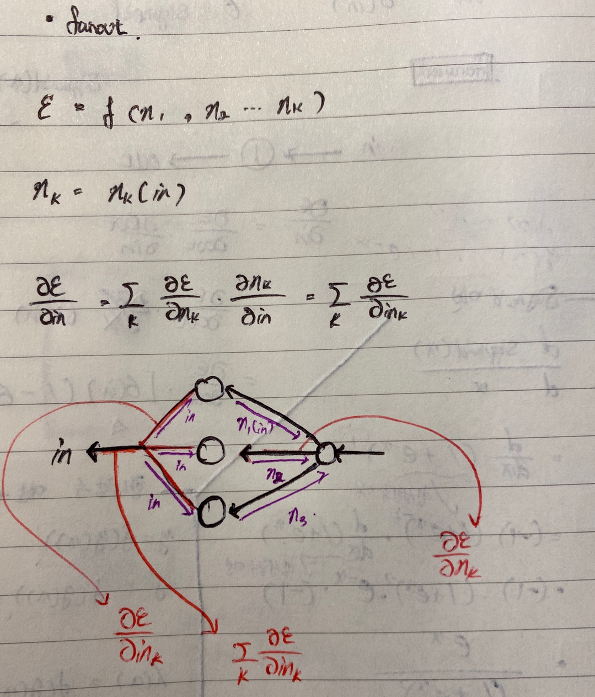  
  Add Operation과 상반되는 효과가 있다. 역으로 전파될 때 역전파들이 합쳐지는 효과가 있다.
  

* Add Operation
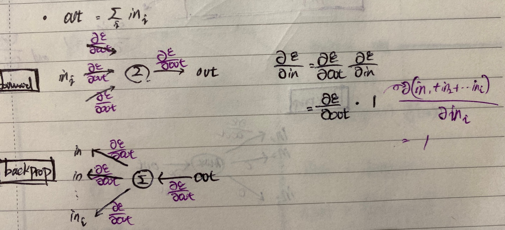  
  덧셈 연산은 해당 input 이외에 다른 input들은 편미분에 의해 상수로 취급되어 소거되므로 최종적으로 local gradient는 1이 된다.
  local gradient * output gradient = output gradient 의 전파가 역으로 전달된다. (브로드 캐스팅의 효)
  

* Multiply Operation
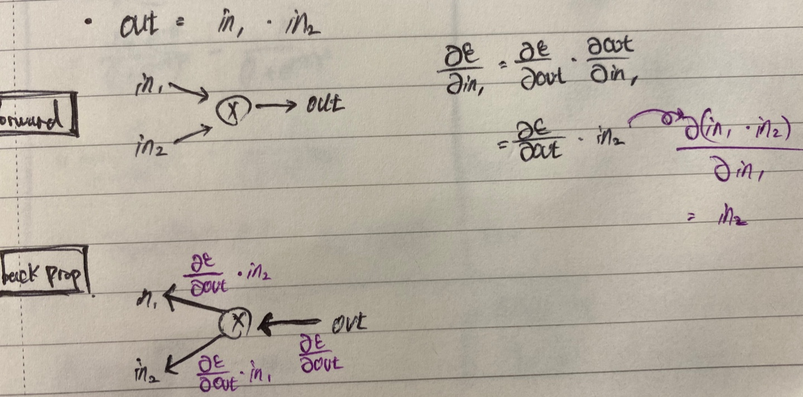  
곱셈 연산은 해당 input으로 편미분하면 계수만 남아 다른 input만 남게된다.  
고로, output gradient * 다른 input의 결과가 역으로 전달된다.

* Max Operation
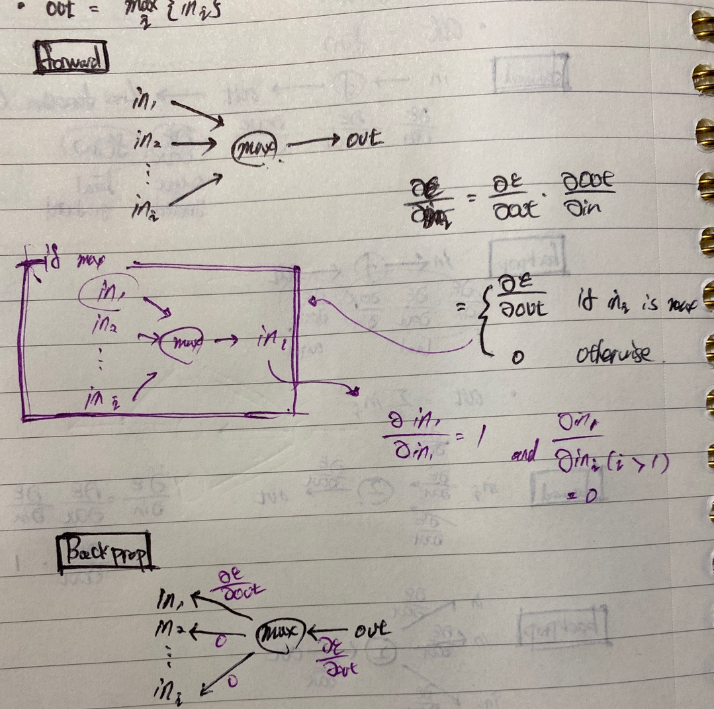  
  예를들어 in1이 최대값이라면 output은 in1일 것이다. in1로 미분하면 local gradient는 1이 될 것이지만, 
  다른 in으로 미분하면 상수취급 하여 0이 될것이다. 고로 최대값으로부터 온 퍼셉트론의 신호만 output gradient * 1의 결과를 도출하고,
  나머지 신호들은 0이 될 것이다.
  

* Sigmoid Operation
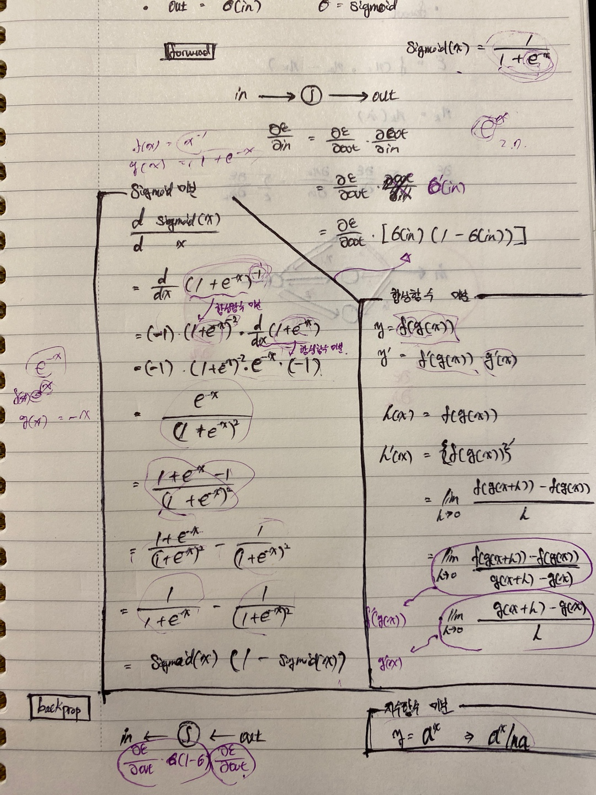  
  합성함수 미분이 키포인트이다. 
  

* 예시
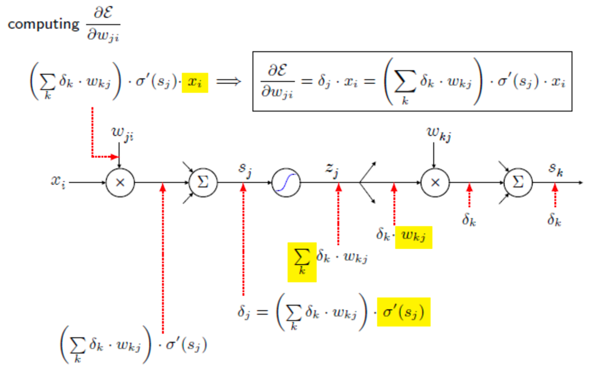
  첫 번째 연산인 Add Operation에 의해 브로드 캐스팅 효과가 일어난다.  
  두 번째 연산인 Multiply Operation에 의해 다른 input이 local gradient로써 output gradient에 곱해져서 전달된다.  
  세 번째 연산인 Fanout Operation에 의해 Sigma로 모여진다.  
  네 번째 연산인 Sigmoid에 의해 Sigmoid function의 미분함수가 local gradient로써 곱해진다.

# CNN (Convolutional Neural Network)
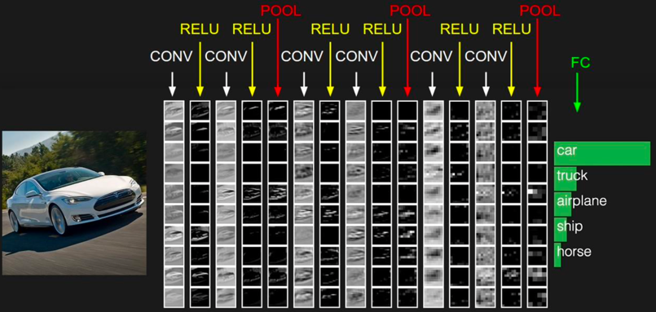  
기존의 MLP (Multi Layer Perceptron) 신경망은 퍼셉트론 사이에 완전 연결된 Fully-connected 형태를 띄고 있었다.
이런 구조의 단점은 레이어가 깊어질수록 발생되는 신호가 **기하급수적으로 늘어나** 학습해야할 가중치가 늘어나는 단점이 존재한다.
그래서 학습 데이터를 강하게 학습하는 효과가 나타나 오버피팅 현상이 존재한다. 이를 방지하기 위해 CNN 에서는 **Dropout 기법을 통해
임의의 연결을 랜덤하게 끊어서 학습하고 추론과정에서 다시 Fully-connected 상태에서 오버피팅을 방지**한다.  

CNN의 구조에 대해 알아보겠다. 기본적으로 CNN은 **선형함수인 Convolution과 비선형함수인 Activation function으로 이루어진 Convolution Layer**와
특징을 부각 및 압축시키기 위한 Pooling Layer (Max pooling, ..)가 존재한다.  

## Convolution
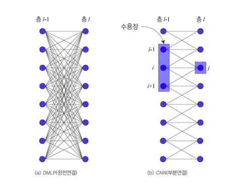  
Convolution은 이전의 MLP와 다르게 완전 내적(다음 레이어의 퍼셉트론이 이전 레이어의 퍼셉트론으부터 모든 신호를 내적)이 아닌
부분 내적(연결된 신호만 내적)을 수행한다. 이는 속도와 오버피팅 문제를 해결할 수 있다. 그리고, 사진이나 동영상같은 Grid structure 데이터는
지역성(locality)가 존재하기 때문에 가능한 것이다. 여기서 말하는 지역성은 인접한 픽셀사이의 연관 관계가 있을 가능성이 큰 것을 의미한다.  

## Activation function
활성함수는 퍼셉트론의 신호 입력으로부터 출력 신호를 결정하기 위한 임계치 함수이다. 활성함수의 종류는 Sigmoid, ReLU, tanh, leaky ReLU 등 다양하다.
Sigmoid의 단점을 설명하자면, propagation 관점에서 sigmoid function은 값이 1에 도달하지 않고 1에 수렴하는 값이므로 레이어를 거쳐갈때마다 신호가 약해져서 
신호가 결국 사라지는 현상이 발생한다. backpropagation 관점에서 보면 input gradient는 local gradient * output gradient 이다.
activation function이 sigmoid function일 때 local function은 sigmoid의 미분 값인데 ..  
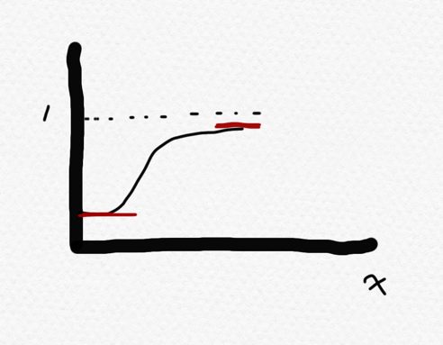  
sigmoid function의 기울기가 0에 수렴하므로 local gradient가 사라지는 현상이 발생한다. 고로 backpropagation도 결국에는 의미가 없어진다. 이를 해결하기 위해
ReLU function을 사용한다.  
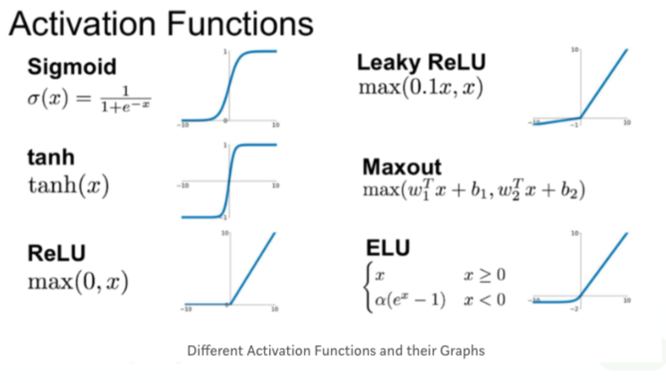  
ReLU function은 발산하는 형태를 띄므로 0에 수렴하는 일도 없고 기울기 또한 Sigmoid 처럼 0에 갈 일이 없기 때문에 많이 사용된다.

## CNN의 차별성
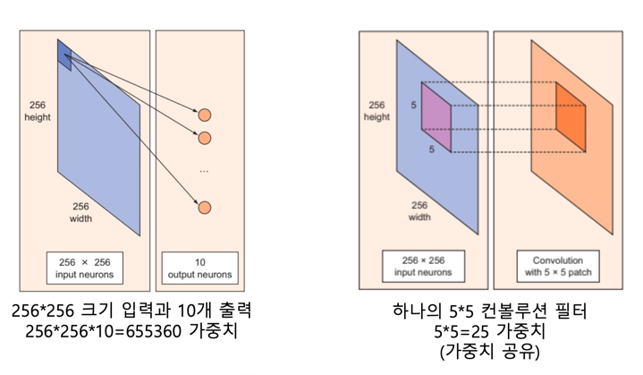  
왼쪽은 MLP의 경우이다. 지역성을 고려하지 않고 모든 픽셀을 보며 각 클래스별로 256 * 256 = 65536 개의 가중치가 나온다.
반면애 CNN은 **필터**라는 개념을 사용하여 가중치가 기하급수적으로 늘어나는 현상을 방지할 수 있다. 

## 컨볼루션 연산
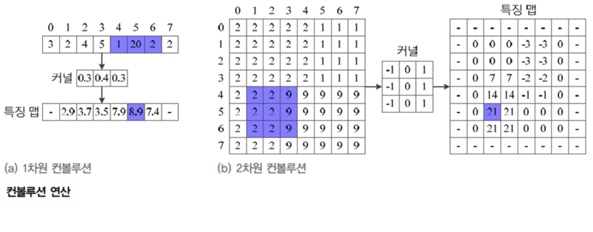  
컨볼루션 연산은 **합성곱**을 의미한다. **커널(kernel)은 가중치의 집합이다.** 
커널과 동일한 사이즈의 데이터를 합성곱 연산을 수행한 결과를 **특징맵(feature map)** 에 기록한 뒤, 
**보폭(stride)** 만큼 이동하는 과정을 반복한다.
이 과정을 통해 얻을 수 있는 것은 어떤 부분이 추출하고자 하는 특징과 관련이 있는지 알 수 있다는 것이다.
2차원 특징맵을 보면 알다시피 21이 커널을 통해 추출하고자 하는 특징과 가장 연관성이 높은 것을 알 수 있다.
그리고, 합성곱 연산을 수행하면 특징맵의 크기가 작아지는 것을 확인할 수 있는데 입출력의 크기를 유지하기 위해
무의미한 값 (이를테면 0)을 채워넣는 것을 **패딩(padding)** 이라고 한다.  

여담으로, 커널은 원래 사람이 design했지만 딥러닝은 이를 모델이 직접 design하는 것이 목표이다.
역전파를 이용해 적절한 필터를 찾아가는 과정을 거친다. (가중치 조정)

3차원 컨볼루션 연산의 예)  
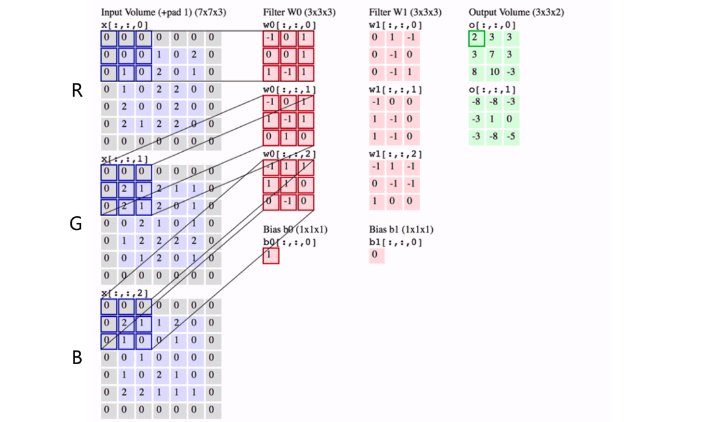  

가로, 세로 영역 추출의 예)  
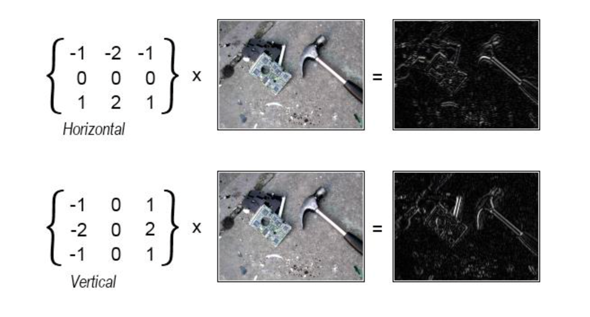  

### 가중치 공유
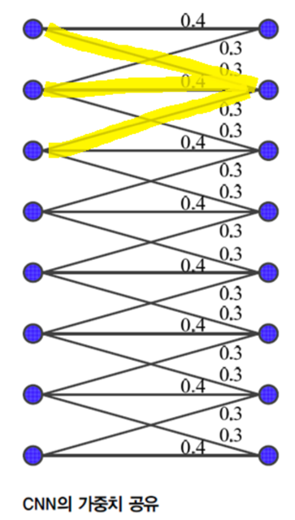  
CNN은 커널(가중치)이 모든 노드를 순회하기 때문에 부분마다 같은 가중치를 공유한다. 
이는 MLP에 비해 모델의 복잡도가 낮다.  

### 병렬분산 구조
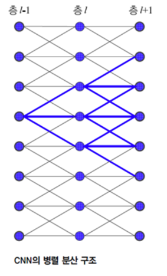  
이전 레이어에서 추출된 정보들의 조합으로 다음 레이어의 특징이 추출된다. (계층적 추상화)

### 다중 특징맵 추출
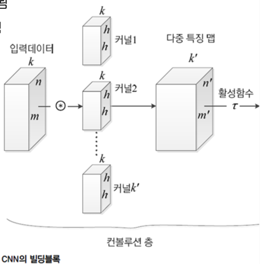  
하나의 필터(커널)만 사용하는 것보다 여러 필터를 사용하는 것이 특징을 다양하게 추출한다. 
다중 특징맵의 두께(k : 차원)은 **커널의 갯수**다. 

## 풀링 연산
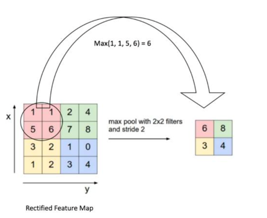  
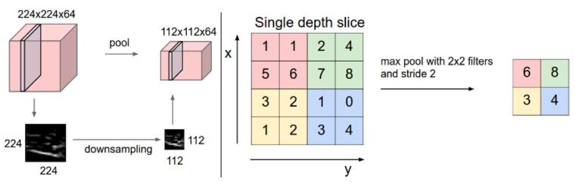  
풀링 연산의 목적은 **요약 및 압축**이다. 컨볼루션 연산을 통해 나온 특징맵의 값을 전부 유지하고 있으면 매우 모델의 복잡도가 크다.
그래서 보폭을 정하여 해당 영역에서 대표되는 값만 추출하는 것이다. 풀링 연산에는 Max pooling, Mean pooling, Weight mean pooling 등이 있다.  
보폭을 크게하면 다운샘플링 효과가 있다. (https://codedragon.tistory.com/9861) 고로, 크기(m, n)가 작아지는 효과가 있다.

# 참고
## 경사하강법 (Gradient Descent)
Loss function을 weight로 미분한 값은 w가 움직이는 양에 비례 혹은 반비례하게 L이 움직이는 값이다.
