# 컴퓨터 비전
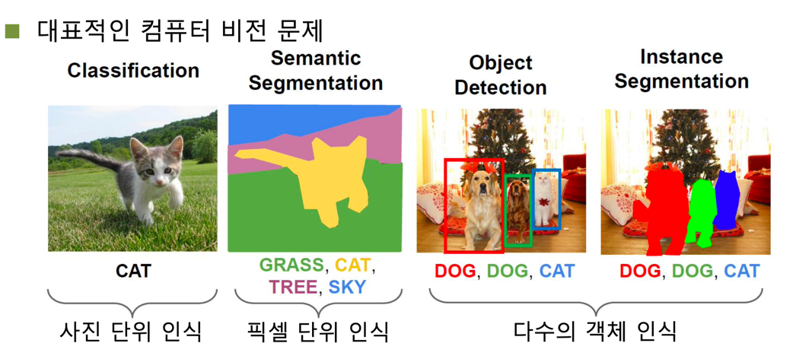  
* Classification  
  사진 한장으로부터 하나의 객체를 분류 및 인식하는 문제이다.
* Semantic Segmentation  
  Semantic Image Segmentation의 목적은 사진에 있는 **모든 픽셀을 해당하는 (미리 지정된 개수의) class로 분류**하는 것이다. 
  이미지에 있는 모든 픽셀에 대한 예측을 하는 것이기 때문에 dense prediction 이라고도 불린다. 
  여기서 주의해야하는 점은 semantic image segmentation은 같은 class의 instance 를 구별하지 않는다.
* Object Detection  
  Object Detection은 이미지로부터 다수의 인스턴스를 인식하고 해당 위치에 bounding box를 그린다.
  즉, 단순 classification뿐만 아니라 위치 정보도 포함하고 있다.
* Instance Segmentation  
  Semantic Segmentation은 모든 픽셀에 대해 클래스로써 분리할 뿐, 같은 같은 클래스에 속한 인스턴스에 대해서는 구분짓지 않는다.
  위 그림을 보면 같은 개(Dog)더라도 빨간색과 초록색으로 구분된 것을 확인할 수 있다.

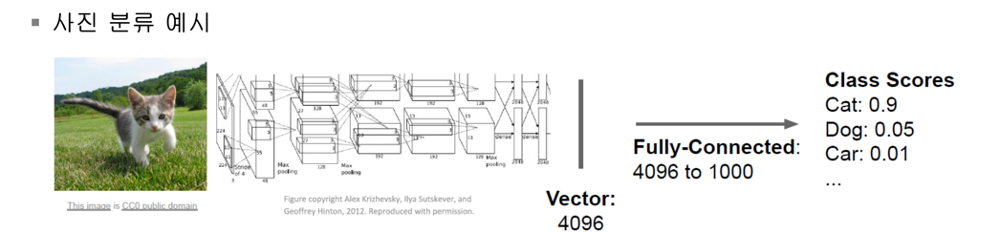  
위 그림은 AlexNet을 예시로 들었다. 이미지 한장에 대해 신경망을 거치고, 최종적으로 flatten과정을 통해 4096차원의 특징을 추출해냈다.
이 4096차원의 특징을 통해 1000개의 클래스별로 confidence score를 측정했다.  

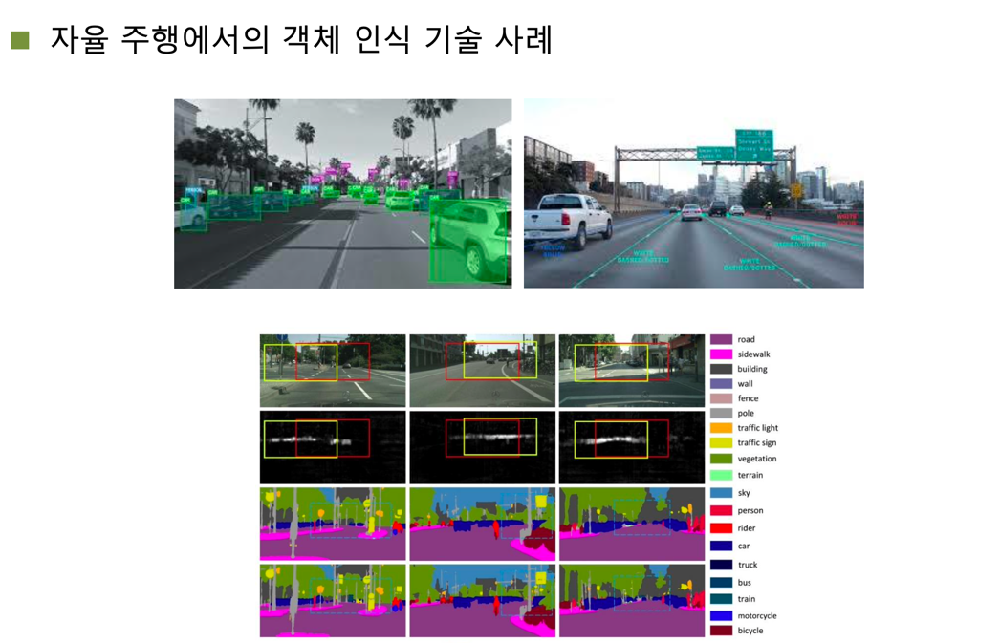  
위와 같은 비전 기술들은 자율 주행 기술에도 적용되고는 한다.  

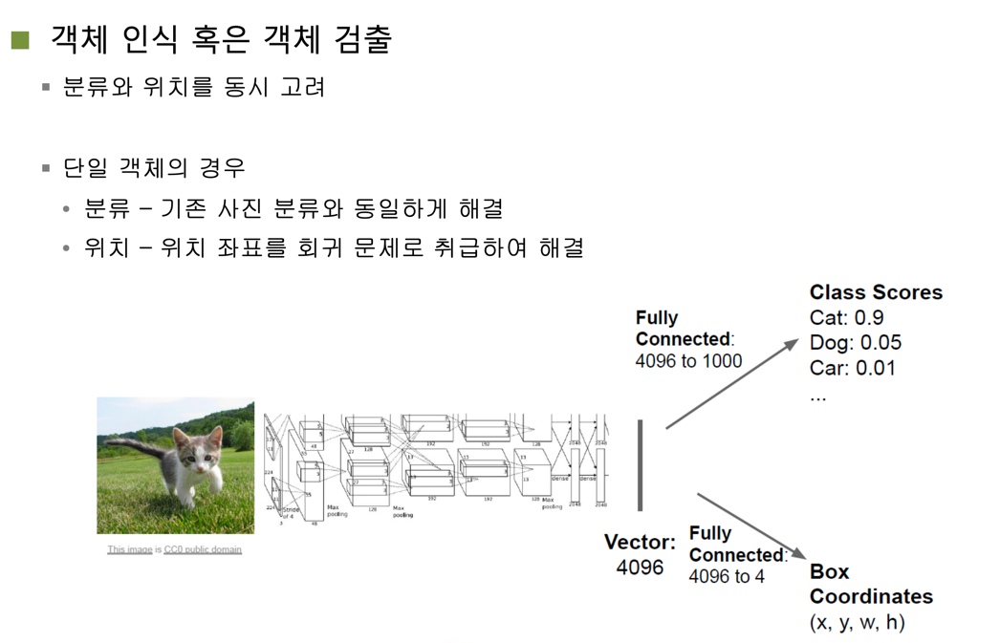  
위에서도 언급했듯이 Object Detection은 단순한 classification 뿐만 아니라 인스턴스의 위치정보도 고려해야 하기 때문에
Class Scores 이외에도 bounding box 좌표정보도 예측해야 한다.  

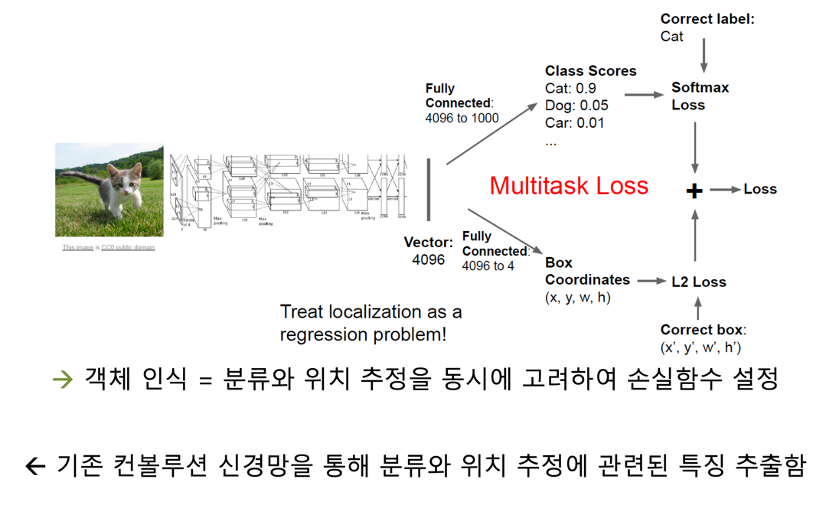  
Class Scores의 오차는 Softmax를 거쳐 나온 결과의 Cross-Entropy와 같은 손실함수를 적용한 것이고,
L2 Loss는 bounding box의 예측값과 실제값의 차이의 제곱의 합을 의미한다.  
참고 : https://mirae-kim.tistory.com/7  

Object Detection에서는 두 Loss function을 Multitask Loss라고 부르며 이를 최적화해나가는 방향으로 파라미터를 튜닝한다.  

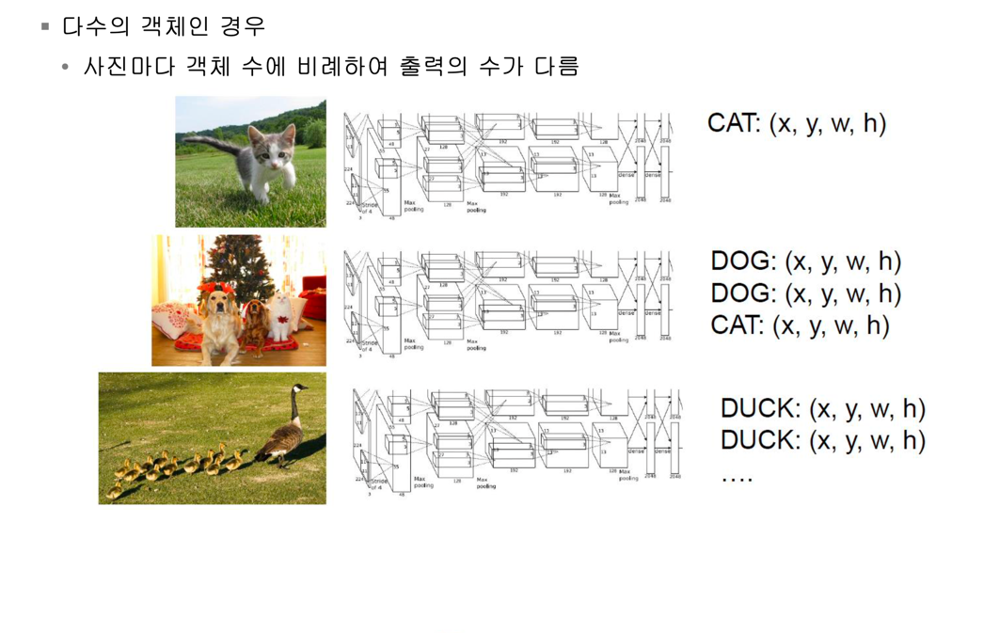  
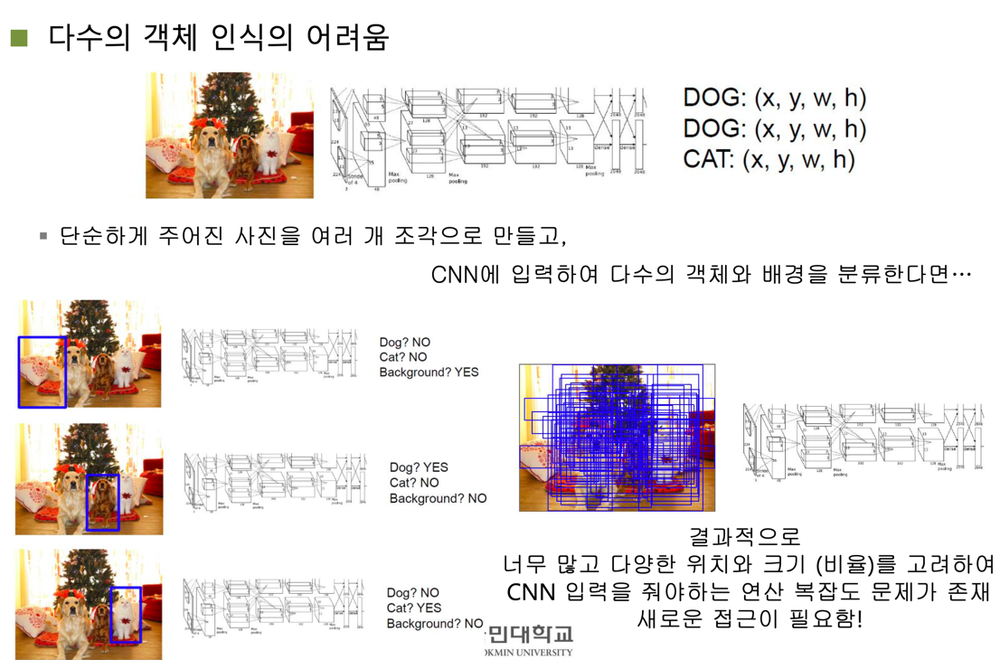  
그러나 다수의 객체를 인식하기 어려운 이유는 인스턴스에 걸리는 위치에 bounding box를 그리기 위해
사진의 영역들을 여러개로 분할하여 찾아야 하는데 일반적인 CNN의 경우 인스턴스의 위치를 고려하지 않고
무차별적으로 bounding box를 그려나가기 때문에 무한히 많은 경우의 수가 생기고 연산의 복잡도가 생긴다.  

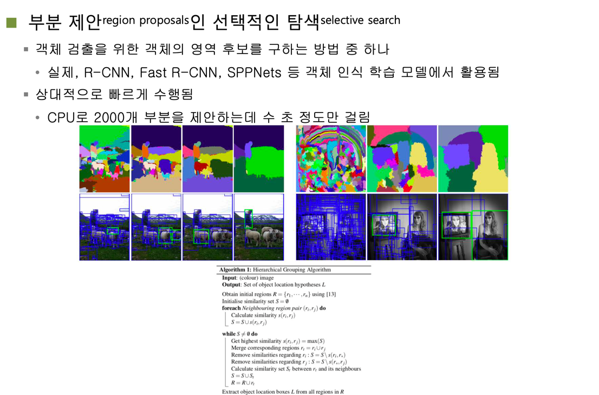  
그래서 무한히 많은 경우의 수를 유한하게 바꾸고자 인스턴스의 위치가 있을 만한 곳을 예측하여 제안하는
부분 제안(region proposals)인 선택적인 탐색(selective search) 방법이 적용되었다.
선택적으로 인스턴스를 탐색할 경우 무작정 모든 영역을 분할하여 보는게 아닌 선별하여 탐색하기 때문에
무수히 많은 경우는 생기지 않는다.  
선택적 탐색 알고리즘은 임의의 영역에 다른 색깔로 칠해놓은 다음 이들을 동일한 인스턴스라고 추정되는
영역들끼리 병합(merge)해나간다. (그리디 알고리즘 적용)

# R-CNN (Regions with CNN features)
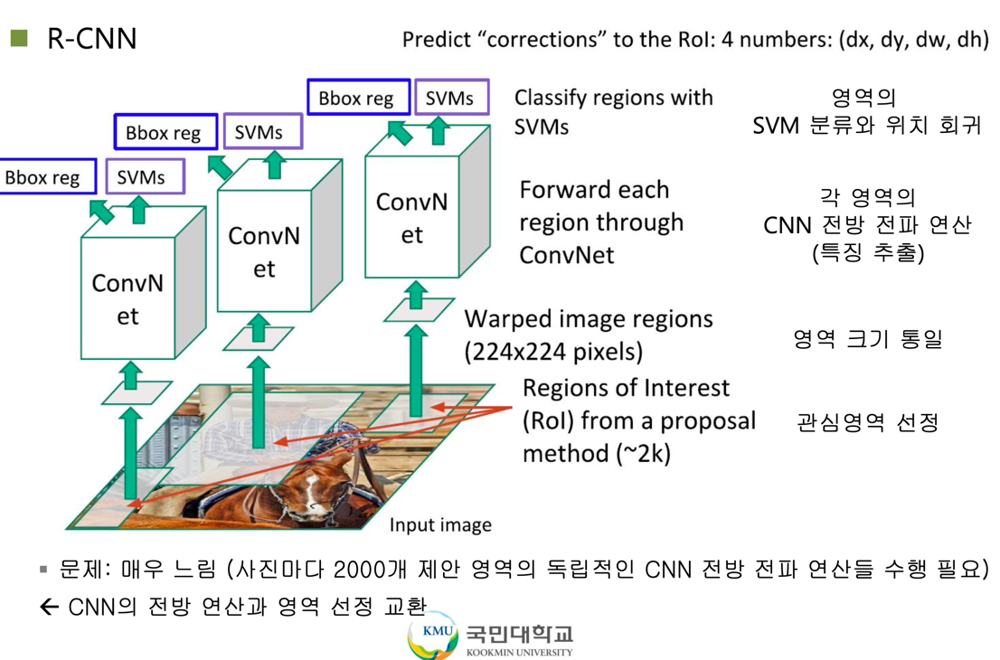  
R-CNN에 사용된 3가지 모듈  
- Region Proposal : "Object가 있을법한 영역"을 찾는 모듈 (기존의 Sliding window방식의 비효율성 극복)
- CNN : 각각의 영역으로부터 고정된 크기의 Feature Vector를 뽑아낸다.
(고정된 크기의 output을 얻기위해 warp 작업을 통해 크기를 찌그러뜨려서 동일 input size로 만들고 CNN에 넣는다.)
- SVM : Classification을 위한 선형 지도학습 모델 
(* 왜 Classifier로 Softmax를 쓰지 않고 SVM을 사용했을까? : CNN fine-tuning을 위한 학습 데이터가 시기상 많지 않아서 Softmax를 적용시키면 오히려 성능이 낮아져서 SVM을 사용했다.)  
  
선택적 탐색알고리즘을 통해 이미지의 관심영역(ROI, Region of Interest)를 추출한다.
그리고, ROI 풀링을 통해 관심영역을 백본 CNN 네트워크에 입력값으로써 동일한 크기를 갖도록 변형(Wrap)한다.
백본망(AlexNet)을 거쳐서 나온 결과값은 regressor(Bbox reg와 SVMs)를 통해가 도출된다.  
- Bbox reg : bounding box의 위치 분류기  
- SVM : Support Vector Machine, classification에 대한 분류기

참고 : https://ganghee-lee.tistory.com/35

## Feature Extraction

Selective Search를 통해서 찾아낸 2천개의 박스 영역은 227 x 227 크기로 리사이즈 된다. (warp)
그리고 Image Classification으로 미리 학습되어 있는 CNN 모델을 통과하여 4096 크기의 특징 벡터를 추출한다.
 
저자들은 이미지넷 데이터(ILSVRC2012 classification)로 미리 학습된 CNN 모델을 가져온 다음, fine tune하는 방식을 취했다.
fine tune 시에는 실제 Object Detection을 적용할 데이터 셋에서 ground truth에 해당하는 이미지들을 가져와 학습시켰다. 
그리고 Classification의 마지막 레이어를 Object Detection의 클래스 수 N과 아무 물체도 없는 배경까지 포함한 N+1로 맞춰주었다.  

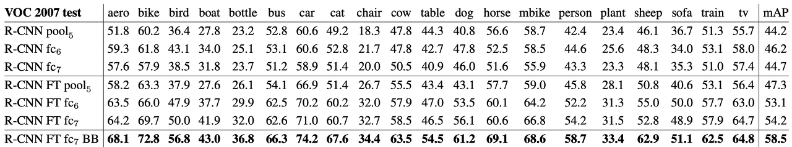  
FT는 fine tune의 약자이며, 각 CNN 레이어 층에서 추출된 벡터로 SVM Classifier를 학습시켜서 얻은 mAP를 비교한 것이다.
mAP는 Object Detection 분야에서 많이 사용되는 정확도 측정 지표이다. (https://better-today.tistory.com/3)  
전반적으로 fine tuning을 거친 것들이 성능이 더 좋음을 확인할 수 있다. 그리고 마지막에 BB로 적힌 것은 Bounding Box Regression을 적용한 것이다.  

정리하자면, 미리 이미지 넷으로 학습된 CNN을 가져와서, Object Detection용 데이터 셋으로 fine tuning 한 뒤,
selective search 결과로 뽑힌 이미지들로부터 특징 벡터를 추출한다.

## Classification
CNN을 통해 추출한 벡터를 가지고 각각의 클래스 별로 SVM Classifier를 학습시킨다.
주어진 벡터를 놓고 이것이 해당 물체가 맞는지 아닌지를 구분하는 Classifier 모델을 학습시키는 것이다.
이미 학습되어 있는 CNN Classifier를 두고 왜 SVM을 별도로 학습시키는 것일까?
 
"그냥 CNN Classifier를 쓰는 것이 SVM을 썼을 때보다 mAP 성능이 4% 정도 낮아졌다.
이는 아마도 fine tuning 과정에서 물체의 위치 정보가 유실되고 무작위로 추출된 샘플을 학습하여 발생한 것으로 보인다."

## Non-Maximum Suppression
SVM을 통과하여 이제 각각의 박스들은 어떤 물체일 확률 값 (Score) 값을 가지게 되었다.
그런데 2천개 박스가 모두 필요한 것일까?
동일한 물체에 여러 개의 박스가 쳐져있는 것이라면,  가장 스코어가 높은 박스만 남기고 나머지는 제거해야 한다.
이 과정을 Non-Maximum Supperssion이라 한다.

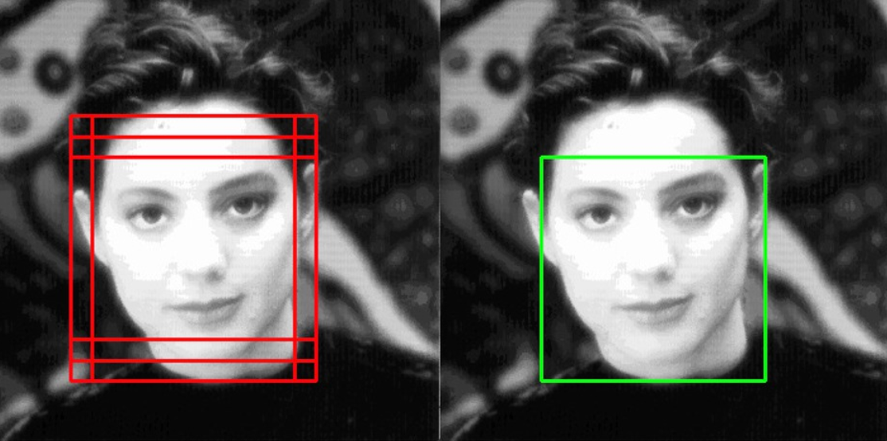  

서로 다른 두 박스가 동일한 물체에 쳐져 있다고 어떻게 판별할 수 있을까?
여기서 IoU (Intersection over Union) 개념이 적용된다.
쉽게 말하면 두 박스의 교집합을 합집합으로 나눠준 값이다.
두 박스가 일치할 수록 1에 가까운 값이 나오게 된다.  

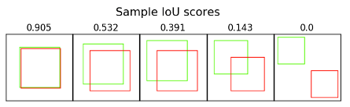  
논문에서는 IoU가 0.5 보다 크면 동일한 물체를 대상으로 한 박스로 판단하고 Non-Maximum Suppression을 적용한다.

## Bounding Box Regression
지금까지 물체가 있을 법한 위치를 찾았고, 해당 물체의 종류를 판별할 수 있는 클래시피케이션 모델을 학습시켰다.
하지만 Selective Search를 통해서 찾은 박스 위치는 상당히 부정확하다.
따라서 성능을 끌어올리기 위해서 이 박스 위치를 교정해주는 부분을 Bounding Box Regression이라 한다.
 
먼저 하나의 박스를 다음과 같이 표기할 수 있다.
여기서 x, y는 이미지의 중심점, w, h는 각각 너비와 높이다.  
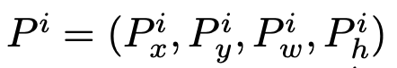  

Ground Truth에 해당하는 박스도 다음과 같이 표기할 수 있다.  
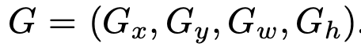  

우리의 목표는 P에 해당하는 박스를 최대한 G에 가깝도록 이동시키는 함수를 학습시키는 것이다.
박스가 인풋으로 들어왔을 때, x, y, w, h를 각각 이동 시켜주는 함수들을 표현해보면 다음과 같다.  
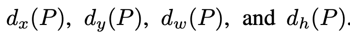  

이 때, x, y는 점이기 때문에 이미지의 크기에 상관없이 위치만 이동시켜주면 된다.
반면에 너비와 높이는 이미지의 크기에 비례하여 조정을 시켜주어야 한다.
이러한 특성을 반영하여 P를 이동시키는 함수의 식을 짜보면 다음과 같다.  
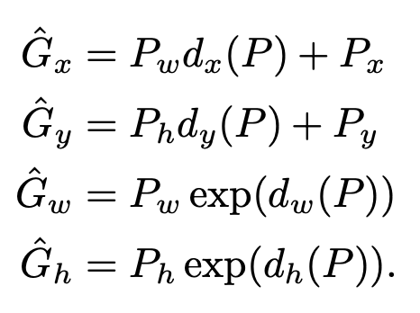  

우리가 학습을 통해서 얻고자 하는 함수는 저 d 함수이다.
저자들은 이 d 함수를 구하기 위해서 앞서 CNN을 통과할 때 pool5 레이어에서 얻어낸 특징 벡터를 사용한다. 
그리고 함수에 학습 가능한 웨이트 벡터를 주어 계산한다. 이를 식으로 나타내면 아래와 같다.  
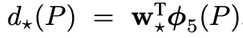  
참고 : https://light-tree.tistory.com/125  

이제 웨이트를 학습시킬 로스 펑션을 세워보면 다음과 같다.
일반적인 MSE 에러 함수에 L2 normalization을 추가한 형태이다.
저자들은 람다를 1000으로 설정했다.  
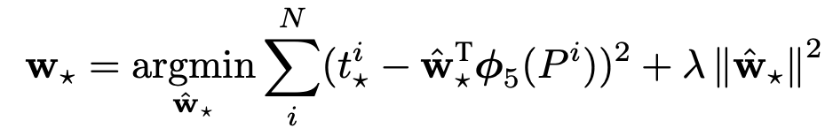  
φ(Pi)는 VGG넷의 pool5를 거친 피쳐맵  
여기서 t는 P를 G로 이동시키기 위해서 필요한 이동량을 의미하며 식으로 나타내면 아래와 같다.  
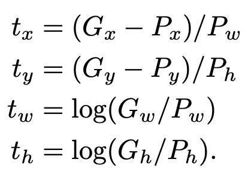  
정리를 해보면 CNN을 통과하여 추출된 벡터와 x, y, w, h를 조정하는 함수의 웨이트를 곱해서
바운딩 박스를 조정해주는 선형 회귀를 학습시키는 것이다.

## Loss Function

참고 : https://yeomko.tistory.com/13

# Fast R-CNN
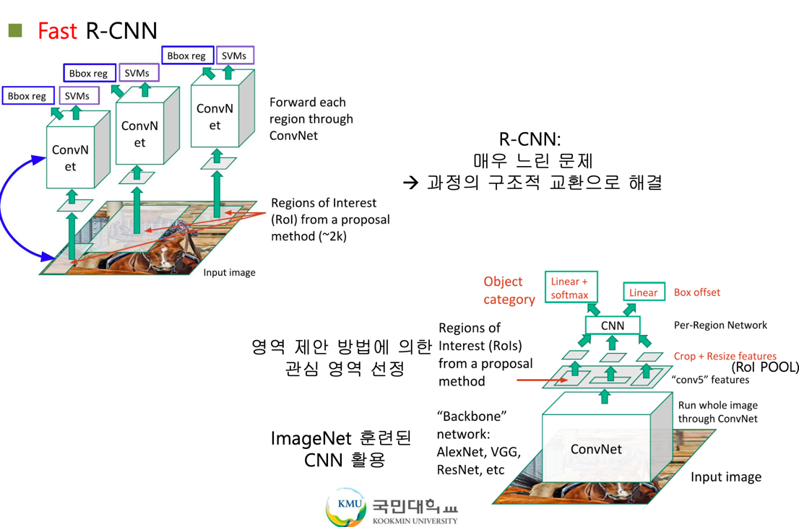  
R-CNN의 속도를 개선하기 위해 Fast R-CNN이 나왔다.
기존의 R-CNN은 각 관심영역별로 공통되는 레이어 마저도 각각 수행을 했다.
하지만, Fast R-CNN은 공통되는 CNN 백본망의 앞단 레이어(feature extraction, classification, bounding box regression)를 한번만 수행하도록 묶었다.
그리고, ROI Pooling을 통해 각 Region Proposals를 CNN의 input으로 대입하기 위해 크기를 동일시 했다.  

참고 : https://ganghee-lee.tistory.com/36

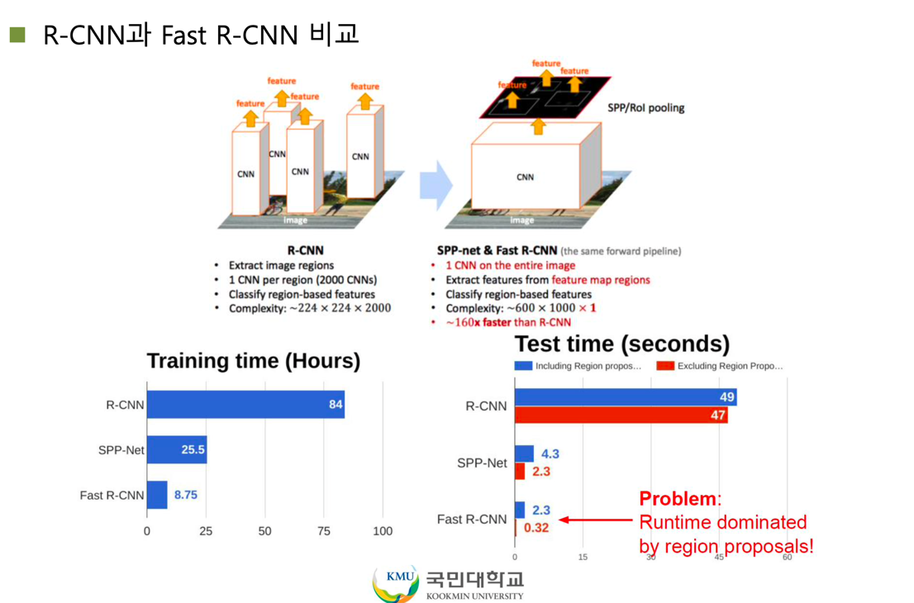

## Loss Function
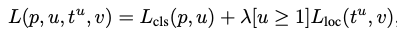  
(ROI pooling 이후)  
bounding box의 조절값에 대한 loss function과 classification에 대한 loss function을 조합하여 이를 통해
모델을 학습시켜야 한다.  

p : 클래스별 예측 확률값 (예측 라벨값)  
u : 실제 라벨값  
tu : 예측 bounding box 조절값  
v : 실제 bounding box 조절값

참고 : https://yeomko.tistory.com/15?category=888201

# Faster R-CNN
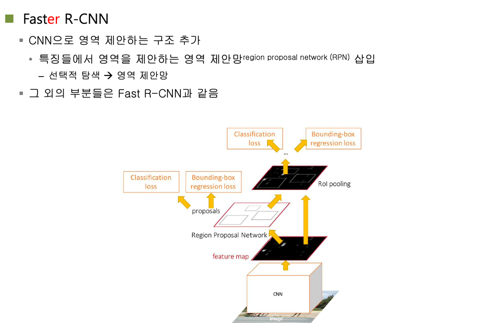  
물론 Fast R-CNN을 통해 관심영역을 추출해내는 것도 좋은 방법이지만, 여전히 2초라는 딜레이가 존재했다.
이는 Region Proposal 단계가 아직 Selective Search 알고리즘에 의존하기 때문이다. (Selective Search는 CPU에서 수행된다.)  
즉, 신경망의 하나의 과정이 아닌 외부의 알고리즘 모듈이기 때문에 병목현상이 발생하는 것이다. 
그래서 Region Proposal 과정을 RPN(Region Proposal Network)로 따로 분류하여 GPU 연산을 통해 시간을 단축시켰다.
물론 RPN도 신경망이기 때문에 학습이 되었다는 전재하에서 이루어진다.  

참고 : https://ganghee-lee.tistory.com/37  
참고 : http://incredible.ai/deep-learning/2018/03/17/Faster-R-CNN/

## Region Proposal Network
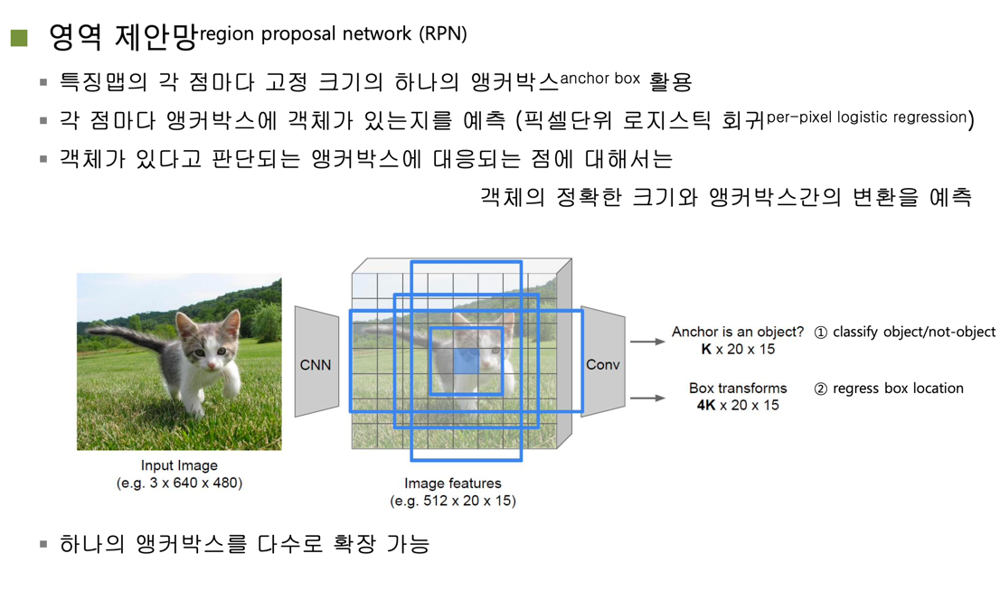  
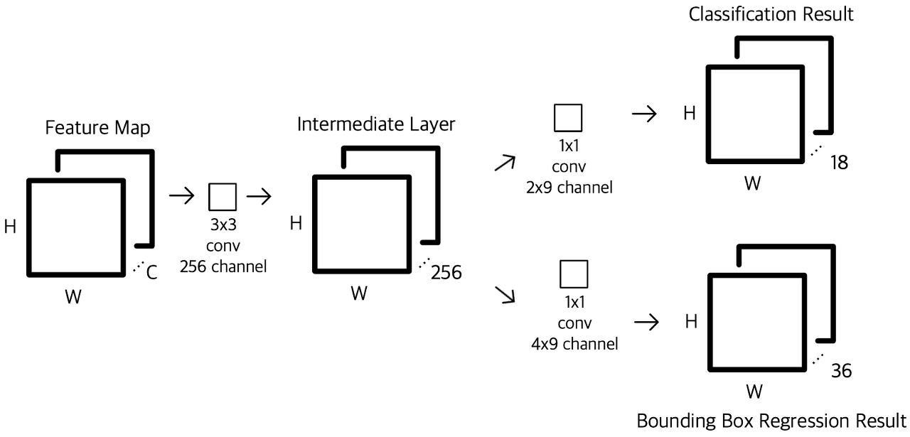  
참고 : https://yeomko.tistory.com/17?category=888201

### Anchor
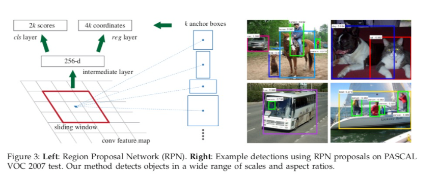  
이미지를 격자 형태로 나누어 각 사각형마다 중심점(Anchor)을 찍는다. 
각각의 Anchor별로 sliding window를 실행하며, 해당 anchor에 대해 3가지 scale과 3가지 aspect ratios가 있다면
9가지 region proposal이 존재하는 것이다.  

K가 Anchor별로 최대로 존재할 수 있는 Region Proposal의 수라고 했을 때,   
reg layer는 4K의 좌표값들이 존재한다. (x, y, w, h) * k  
cls layer는 2K의 점수들이 존재한다. (isinstance? or isbackground?) * k  

참고 : https://leechamin.tistory.com/221

## Loss Function
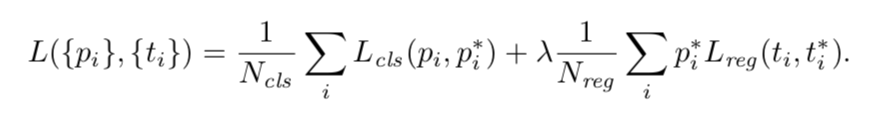  
i : 하나의 앵커  
pi : classsification을 통해서 얻은 해당 엥커가 오브젝트일 확률
ti : bounding box regression을 통해서 얻은 박스 조정 값 벡터 
pi* 와 ti* : ground truth 라벨  

특이한 점은 각각 Ncls와 Nreg 나누어 주는 부분이 있다. 
이는 특별한 의미를 갖는 것은 아니고 Ncls는 minibatch 사이즈이며 논문에서는 256이다. 
Nreg는 엥커 개수에 해당하며 약 2400개 (256 x 9)에 해당한다. 
람다는 Classifiaction Loss와 Regression Loss 사이에 가중치를 조절해주는 부분, 사실상 두 로스는 동일하게 가중치가 매겨진다.
