아래 두 모델은 기존 Faster R-CNN의 2스텝을 1스텝으로 변형한 모델들이다.
2스텝은 RPN을 통헤 영역을 제안하고, 클래스를 분류하는 단계를 의미한다.

# YOLO (You Only Look Once)  
(출처 : https://bkshin.tistory.com/entry/%EB%85%BC%EB%AC%B8-%EB%A6%AC%EB%B7%B0-YOLOYou-Only-Look-Once)  

* YOLO 연구진은 객체 검출(object detection)에 새로운 접근방식을 적용했습니다.
* 기존의 multi-task 문제를 **하나의 회귀(regression) 문제**로 재정의했습니다.
* YOLO는 이미지 전체에 대해서 하나의 신경망(a single neural network)이 **한 번의 계산만으로 bounding box와 클래스 확률(class probability)을 예측**합니다.  
-> bounding box란 객체의 위치를 알려주기 위해 객체의 둘레를 감싼 직사각형 박스를 말합니다. 클래스 확률이란 bounding box로 둘러싸인 객체가 어떤 클래스에 해당하는지에 관한 확률을 의미합니다.
* 객체 검출 파이프라인이 하나의 신경망으로 구성되어 있으므로 **end-to-end 형식**입니다.
* YOLO의 통합된 모델을 굉장히 빠릅니다. (1초에 45 프레임 처리, Fast YOLO는 1초에 155 프레임 처리)

## Introduction
YOLO 연구진은 객체 검출을 하나의 회귀 문제로 보고 절차를 개선했다.
이미지의 픽셀로부터 bounding box의 위치(coordinates), 클래스 확률(class probabilities)를 구하는 과정을 하나의 회귀로 재정의한 것이다.

1. **YOLO는 빠르다.**
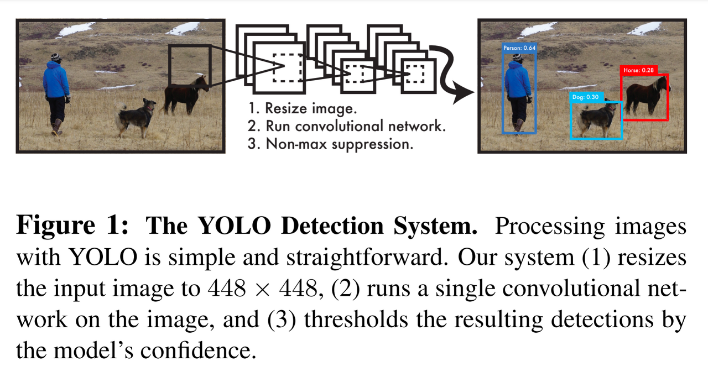  
   복잡한 검출 프로세스를 하나의 회귀 문제로 바꾸었다. 고로, 복잡한 파이프라인이 필요하지 않다.
   YOLO의 기본 네트워크는 Titan X GPU에서 배치 처리 없이 1초에 45 프레임을 처리한다.
   Fast YOLO에서는 1초에 150프레임까지 처리할 수 있다.  
   
2. **YOLO는 예측할 때 이미지 전체를 본다.**  
슬라이딩 윈도(sliding window)나 region proposal 방식과 달리, 훈련과 테스트 단계에서 이미지 전체를 본다.
   그리하여 클래스의 모양에 대한 정보 뿐만 아니라 **주변 정보까지 학습하여 처리**한다.
   반면, Fast R-CNN은 region proposal로 인해 제안된 영역만 보기 때문에 주변 정보까지는 처리하지 못한다.
   그래서 아무 물체가 없는 배경에 반점이나 노이즈가 있으면 그것을 물체로 인식한다. 이를 **background error**라고 한다.
   YOLO는 이미지 전체를 처리하기 때문에 background error가 Fast R-CNN비해 훨씬 적다. (대략 1/2)  
   
3. **YOLO는 물체의 일반적인 부분을 학습한다.**  
일반적인 부분을 학습하기 때문에 자연 이미지를 학습하여 그림 이미지로 테스트할 때, DPM(Deformable Parts Model)이나 R-CNN보다 성능이 뛰어나다.
   따라서 훈련 단계에서 보지 못한 새로운 이미지에 대해서도 더 강건(robust)하다.  
   하지만, 최신 객체 검출 모델에 비해 정확도가 다소 떨어진다. **속도와 정확성은 trade-off 관계**이다.
 
## Unified Detection
YOLO는 객체 검출의 개별 요소를 단일 신경망(single nn)으로 통합한 모델이다.
YOLO는 각각의 bounding box를 예측하기 위해 이미지 전체의 특징을 활용한다.
이러한 YOLO의 디자인 덕분에 높은 정확성을 유지하면서 end-to-end 학습과 실시간 객체 검출이 가능하다.  

YOLO는 입력 이미지를 **S x S 그리드**로 나눈다. 만약 어떤 객체의 중심이 특정 그리드 셀 안에 위치한다면, 그 그리드 셀이 해당 객체를 검출해야 한다.  

각각의 그리드 셀은 B개의 **bounding box coordinates**와 그 bounding box에 대한 **confidence score**를 예측한다.  

* confidence score
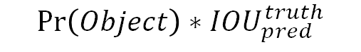  
confidence score는 다음과 같이 정의된다.  
Pr(Object)는 그리드 셀에 객체가 존재할 확률을 의미한다.  
IOU는 Intersection Over Union의 약자로, 실제 bounding box와 예측 bounding box의 겹치는 영역의 비율 (합집합의 교차 영역)이다.  

* bounding box coordinates
각각의 bounding box는 5개의 예측치가 있다. 이는 좌표(x, y, w, h)와 confidence이다.
참고로 여기서 좌표는 절대좌표가 아닌 **상대좌표**이다. 즉, **그리드 내의 상대위치**를 의미한다.
예를 들어, bounding box가 특정 그리드 셀의 중앙에서부터 시작한다고 가정하면 x = 0.5, y = 0.5이다.
w, h는 전체 이미지의 너비와 높이를 1이라고 가정하므로, 0~1 사이의 값을 갖는다.  

그리고, 각각의 그리드 셀은 **conditional class probabilities(C)** (조건부 클래스 확률 - 객체가 존재하다는 가정 하에 특정 클래스일 확률)예측한다.  
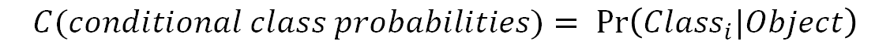  
그리드 셀에 몇 개의 bounding box가 있는지와는 무관하게 **하나의 그리드 셀에는 오직 하나의 클래스에 대한 확률 값만을 구한다.**  

테스트 단계에서는 **conditional class probability(C)(개별 그리드 셀 클래스 확률)와 개별 bounding box의 confidence score를 곱한다.**  
이를 **각 bounding box에 대한 class-specific confidence score**라고 한다.  
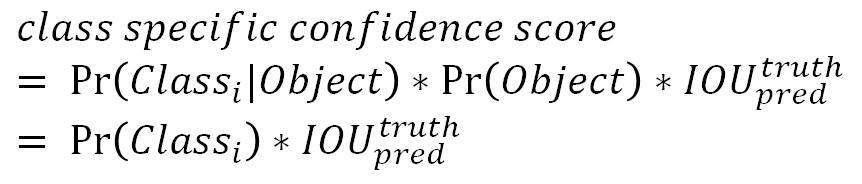  
이 score는 **bounding box에 특정 클래스의 객체가 나타날 확률**(Pr(class_i))과 **예측된 bounding box가 실제 클래스의 객체에 얼마나 잘 들어맞는지**(IOU)를 나타낸다.  

  
YOLO 연구진은 Pascal VOC 데이터 세트로 실험을 진행했다. S는 7, B는 2로 세팅하고, Pascal VOC는 총 20개의 라벨링된 클래스가 있으므로 C는 20으로 설정했다.
S가 7이므로 입력된 이미지는 7 x 7 그리드로 나뉜다. B가 2이면 하나의 그리드 셀에서 2개의 bounding box를 예측하겠다는 의미이다.
이렇게 했을 때 최종 예측 텐서의 dimension은 S x S (B*5 + C) (=(7 x 7 x 30))이다.  

### Network Design  
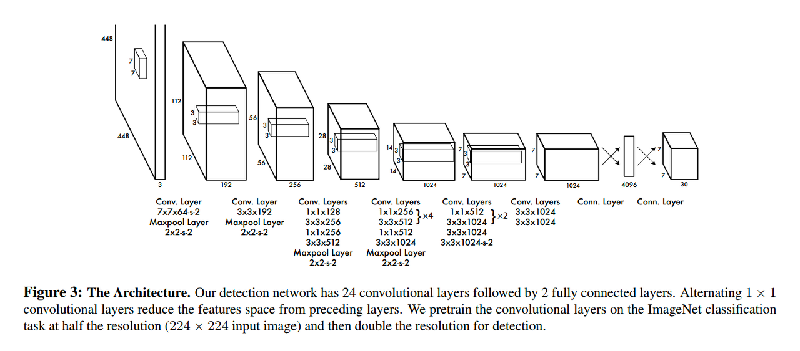  
YOLO 신경망은 24개의 convolution layers, 2개의 fully-connected layers로 이루어져 있다.  
GoogLeNet에서도 사용된 1 x 1 conv layer가 YOLO에서도 파라미터를 줄이기 위한 용도로 사용되고 있다.  

### Training
YOLO의 학습은 Darknet Framework(by Joseph Redmon)가 사용되었다.
ImageNet은 classification(분류)을 위한 데이터셋이다. 따라서 사전 훈련된 분류 모델을 객체 검출(object detection) 모델로 바꾸어야 한다.
연구진들은 사전 훈련된 20개의 convolution layers 뒤에 4개의 convolution layers, 2개의 fully-connected layers를 추가하여 성능을 향상시켰다.
또한 이 계층들의 가중치는 임의로 초기화 했다. 또, 객체 검출을 위해서는 이미지의 해상도가 높아야 하므로 입력 이미지의 해상도를 224 x 224에서 448 x 448로 높였다.  

이 신경망의 최종 예측값은 클래스 확률(class probabilities)과 bounding box 상대 좌표 (coordinates)이다.
w, h, x, y는 모두 0~1 사이의 값으로 정규화했다.  

* **Activation Function**  
YOLO 신경망의 마지막 계층에는 선형 활성화 함수 (linear activation function)을 적용했고, 나머지 계층에는 leaky ReLU를 적용했다.  
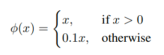
  
* **Loss Function**  
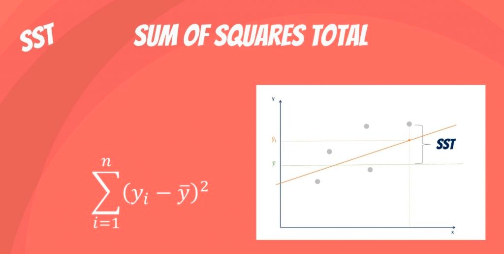  
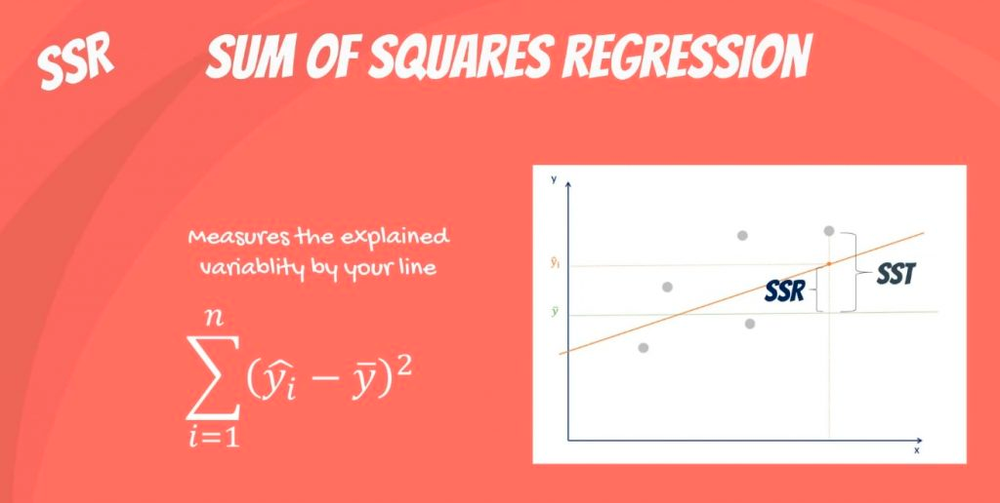  
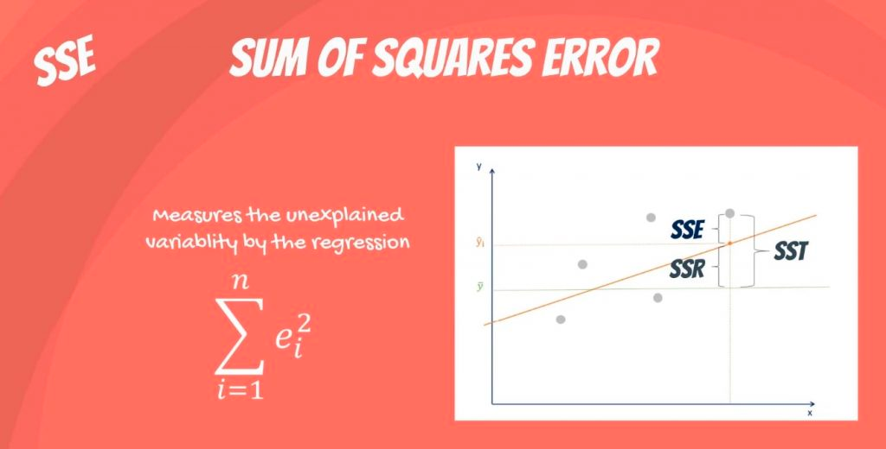  
  
1. **localization, classification loss 를 동일시 하는 문제**  
YOLO의 Loss는 SSE를 기반으로 한다. 따라서 최종 아웃풋의 SSE를 최적화해야 한다.  
YOLO에는 두 가지의 Loss가 있다. 첫 번째는 bounding box의 위치를 얼마자 잘 예측했는지에 대한 localization loss,
두 번째는 클래스를 얼마나 잘 예측했는지에 대한 classification loss가 있다.  
두 loss에 대한 가중치를 동일하게 두고 학습시키는 것은 좋은 방법이 아니다. 하지만 SSE를 최적화하는 방식은 이 두 loss의 가중치를 동일하게 취급하는 문제가 있다.  
  
2. **그리드 셀에 객체가 존재하지 않을 경우 문제**  
또 다른 문제가 있다. 이미지 내 대부분의 그리드 셀에는 객체가 없다. 배경 영역이 전경 영역이보다 더 크기 때문이다.
그리드 셀에 객체가 없으면 Pr(Object)=0 이므로 confidence score=0 이다.
따라서 대부분의 그리드 셀의 confidence score=0이 되도록 학습할 수 밖에 없으므로 이는 모델의 불균형을 초래한다.  

이를 개선하기 위해 객체가 존재하는 bounding box 좌표에 대한 loss의 가중치를 증가시키고,
객체가 존재하지 않는 bounding box의 confidence loss에 대한 가중치는 감소시켰다.
이는 localization loss와 classification loss 중 localizatio loss의 가중치를 증가시키고, 
객체가 없는 그리드 셀의 confidence loss보다 객체가 있는 그리드 셀의 confidence loss의 가중치를 증가시킨다는 의미이다.  
이를 위해 **lambda_coord**(5)와 **lambda_noobj**(0.5) 가중치 파라미터를 사용했다.

3. **SSE의 문제점 - bounding box의 민감도**
SSE는 큰 bounding box와 작은 bounding box에 대해 모두 동일한 가중치로 loss를 계산한다.
   하지만, 작은 bounding box가 큰 bounding box보다 민감하다.
   왜냐하면, 큰 박스는 조금 움직여도 객체를 잘 감싸지만, 작은 박스는 객체를 벗어날 수 있기 때문이다.  
   
   이를 개선하기 위해 bounding box의 **높낮이에 루트**를 취해주었다.  

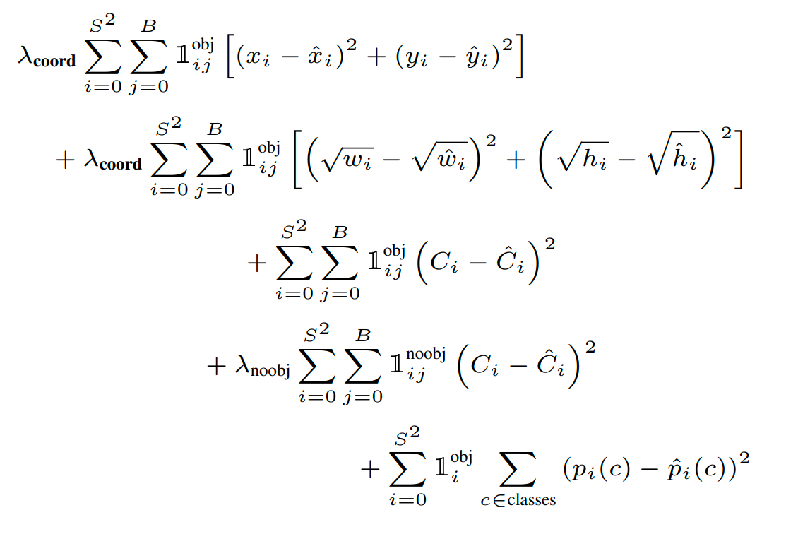  
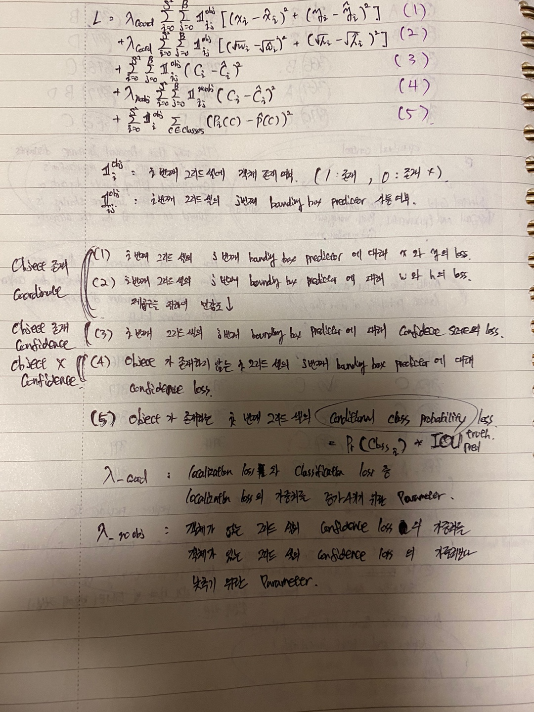  

### Inference
훈련 단계와 마찬가지로, 추론 단계에서도 테스트 이미지로부터 객체를 검출하는 데에는 하나의 신경망 계산만 하면 된다.
Pascal VOC 데이터 셋에 대해서 YOLO는 한 이미지 당 98개의 bounding box를 예측해주고, 그 bounding box마다 클래스 확률을 구해준다.  

하지만, YOLO의 그리드 디자인은 한 가지 단점이 있다. **하나의 객체를 여러 그리드 셀이 동시에 검출하는 경우가 있다.**
객체의 크기가 크거나 객체가 그리드 셀 경계에 인접해 있는 경우, 그 객체에 대한 bounding box가 여러 개 생길 수 있다.
이를 **다중 검출(multiple detections)** 문제라고 한다. 이러한 문제는 **비 최대 억제 (non-maximal suppression)** 를 통해 개선할 수 있다.  

* **NMS (Non-Maximal Suppression)**  
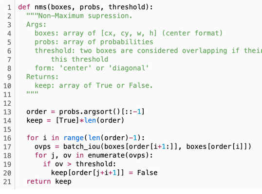  
  코드를 보면 알다시피, 박스의 IOU가 임계치를 넘지 않으면 False를 반환한다.
  즉, 예측한 bounding box가 실제 영역과 매칭되는 영역의 면적이 일정 수준을 넘지 않으면
  없애는 효과를 보여준다.  
  
### Limitation of YOLO  
1. **Spatial Constraints**  
YOLO는 B가 2일 때, 하나의 그리드 셀마다 두 개의 bounding box를 예측한다.
그리고 하나의 그리드 셀마다 오직 하나의 객체만 검출할 수 있다. 이는 **공간적 제약(spatial constraints)**을 야기한다.  
쉽게 얘기해서 '하나의 그리드 셀은 오직 하나의 객체만 검출하므로 하나의 객체에 두 개 이상의 객체가 붙어 있다면 이를 잘 검출하지 못하는 문제'이다.  

2. **부정확한 localization 문제**  
큰 bounding box와 작은 bounding box의 loss에 대해 동일한 가중치를 둔다는 문제가 있다.
큰 bounding box에 비해 작은 bounding box가 위치 변화에 따른 IOU 변화가 더 심하기 때문이다.

# RetinaNet