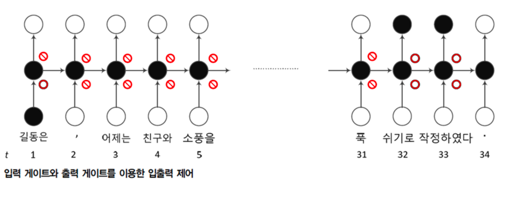
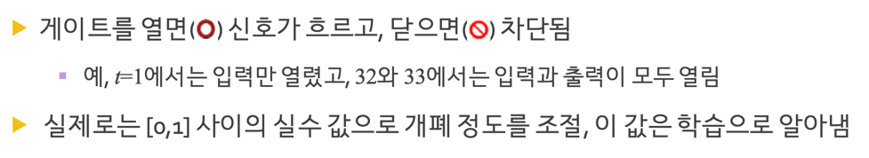
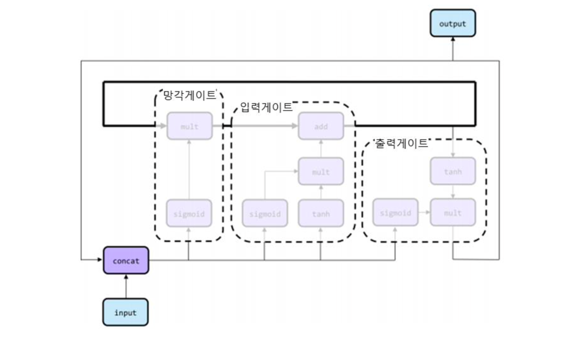
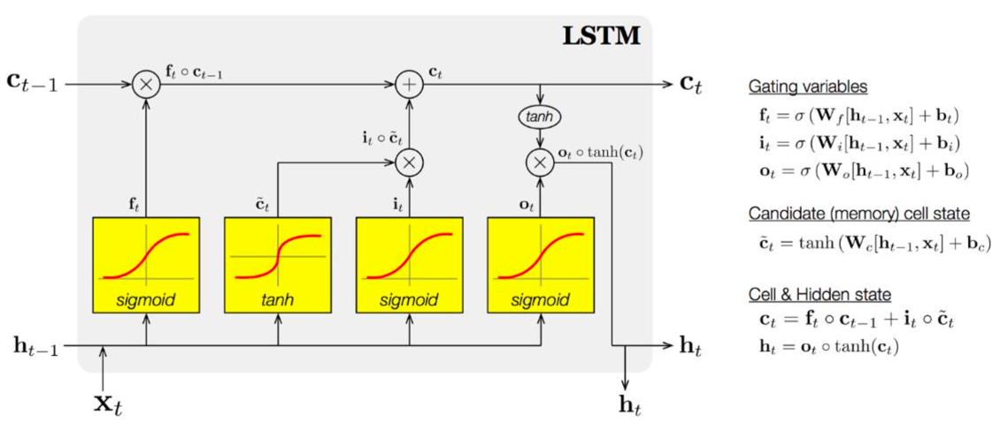
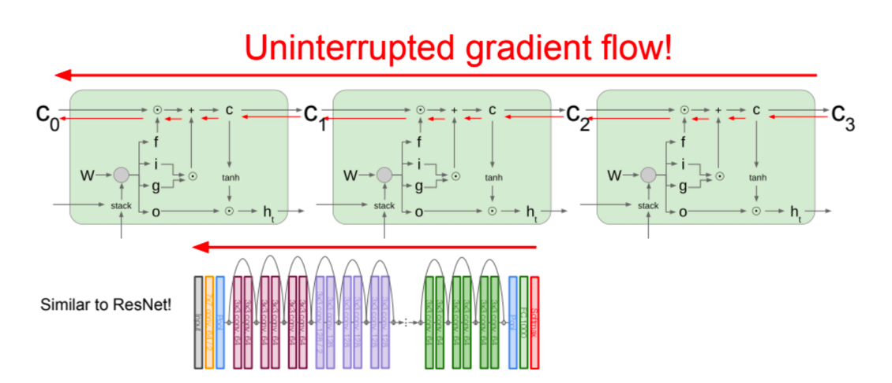
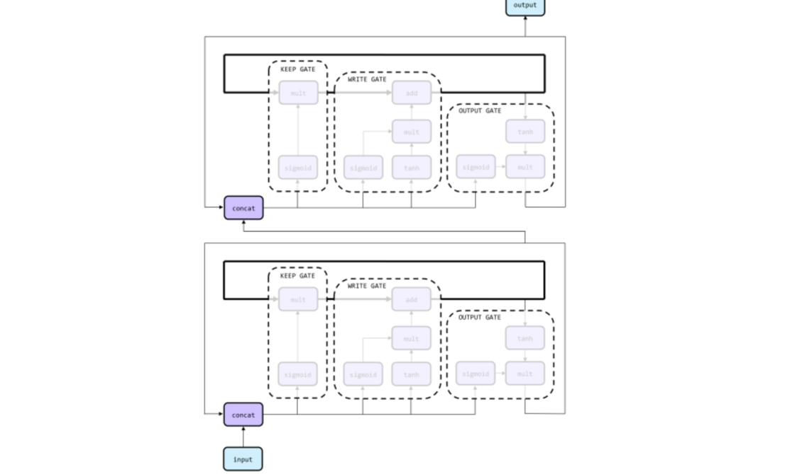
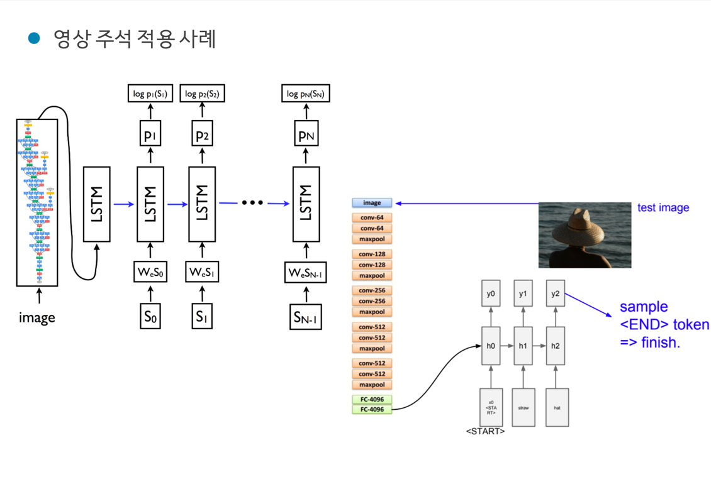
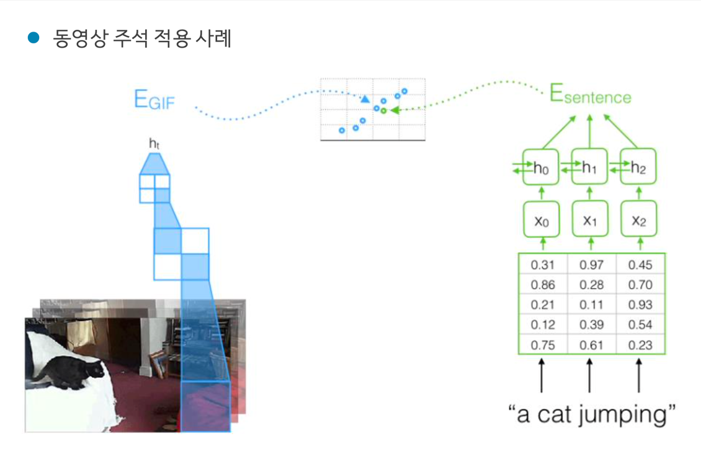
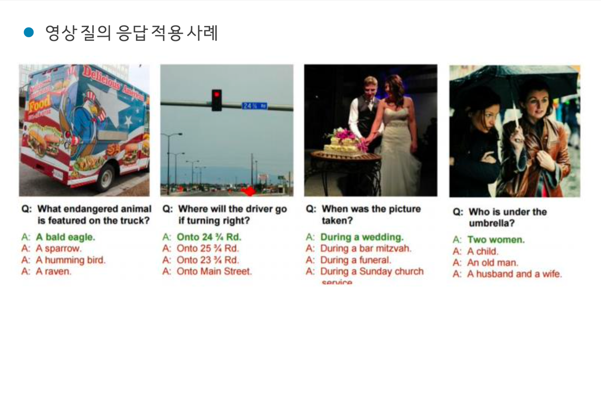

# LSTM (Long-Term Short Memory)
  
RNN의 장기 문맥 의존성을 해결하기 위한 모델이다. 각 시점별 output에 대해 개폐공을 연결하여
신호가 밖으로 새어나가는 것을 방지하여 더 오래 상태를 기억할 수 있는 역할을 한다고 이해하면 쉽다.  

## LSTM 구조  
  
LSTM은 기존 RNN의 구조에 **셀**이라는 개념이 추가 되었고,
**망각, 입력, 출력 게이트**로 이루어져 있다.  

  
  

## LSTM 역전파  
  
기존의 RNN의 역전파는 시그모이드 연산에 대한 편미분을 수행하므로 복잡했지만,
그에 반해 LSTM은 셀의 상태에 대한 역전파를 수행하므로 덧셈과 곱셈에 대한 간단한 편미분만 진행하면 되므로,
훨씬 간단하다. 이는 ResNet의 skip connection과 같은 효과를 지닌다.  

## LSTM 응용  
  
LSTM 모델을 쌓는 방식으로 구성할 수도 있다.  

## 순환신경망 응용사례
  
  
  
  
  
