# BOW (Bag-Of-Words) assumption
* 왜 bag 이라고 할까??  
  - set은 중복을 허용하지 않는다. 하지만, bag은 중복을 허용한다.  
    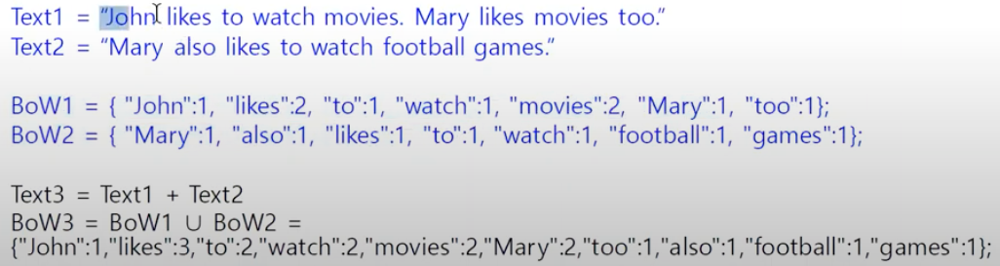  
    BoW는 해당 Text에서 각 단어를 key, 단어의 빈도수를 value로 갖는다.  
    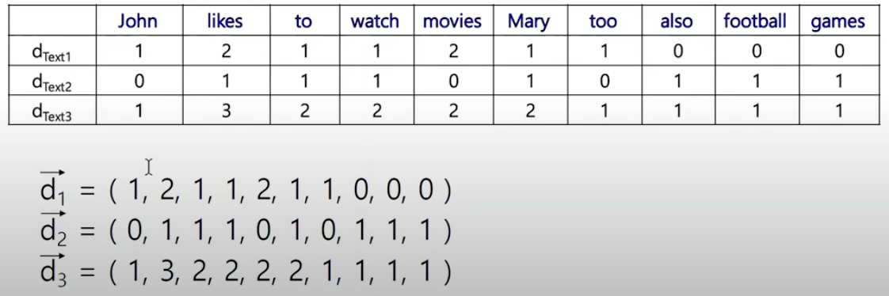  
    BoW는 N(단어의 갯수) dimension vector로 표현이 가능하다. 각 요소는 단어의 빈도수를 의미한다.  
    
# n-gram model  
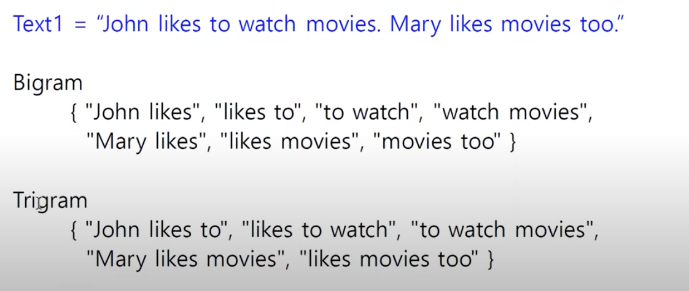  
위에서 본 BoW는 1개의 단어를 간격으로 빈도수를 파악한 것이다. 그러나 Bigram이나 Trigram처럼
n개의 단어 단위로 빈도수를 파악할 수도 있다. 다만 마침표를 걸쳐서 단어를 그루핑하면 안된다.

# Similarity, Dissimilarity or Distance  
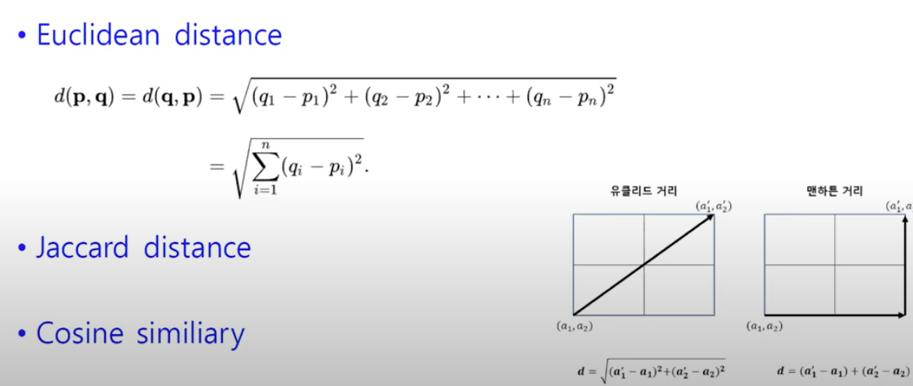  
* Euclidean distance  
  각 차원의 요소값들의 차이 제곱의 합에 루트를 씌운다. (기하학적 거리)  
  
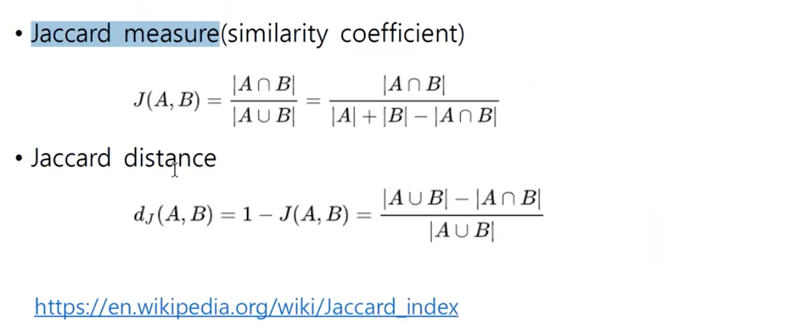  
* Jaccard distance  
  jaccaard distance = 1 - jaccard measure
  
# 집합과 관련된 계수들  
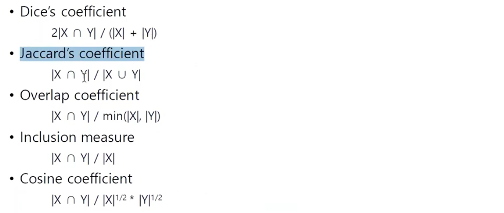  
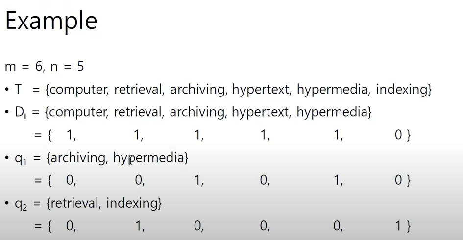  

* Dice's coefficient
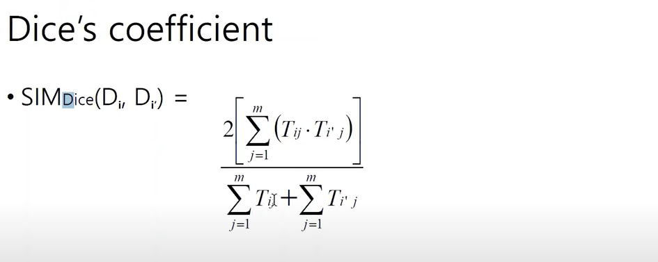  
  Tij는 Di의 요소(가중치), Ti'j는 Di'의 요소
  
* Jaccard's coefficient
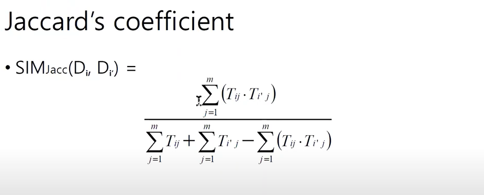

* Inclusion measure
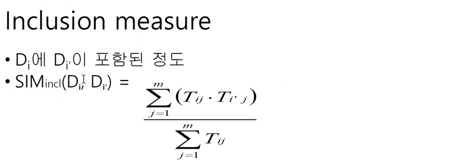

* Overlap coefficient
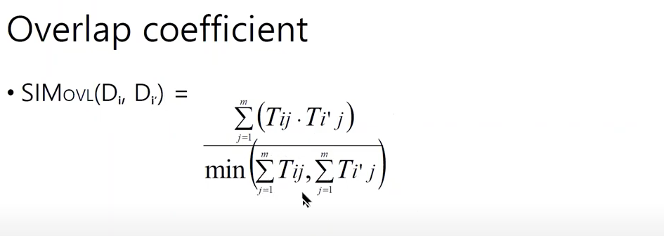

* Cosine measure
  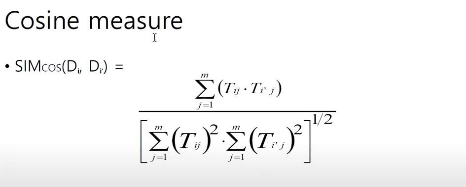