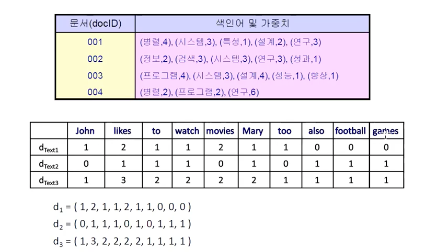
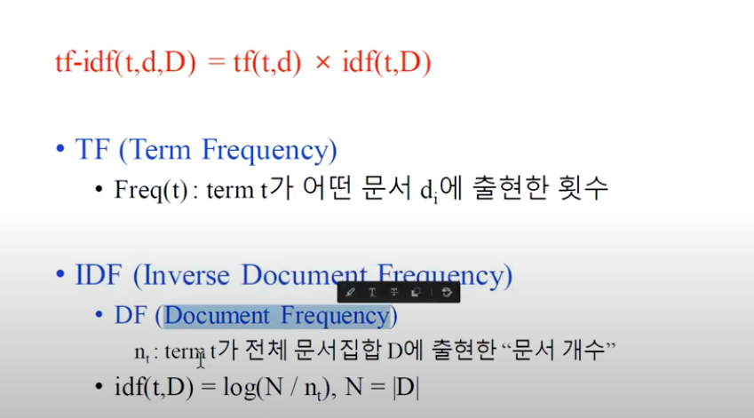
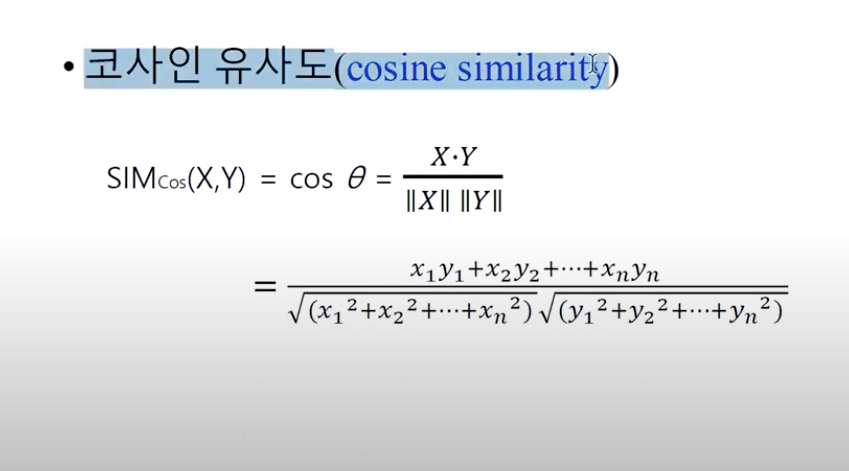
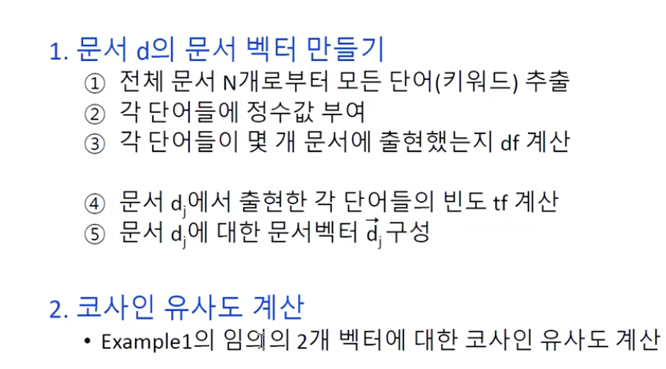

# Document-Term Matrix

문서별로 출현된 단어들의 가중치를 forward indexing을 통해 첫 번째 표처럼 나타낼 수 있다.
두 번째 표는 출현한 모든 텍스트들을 컬럼으로 나열하여 각 텍스트별로 각 단어의 출현빈도를 기반으로 벡터를 형성할 수 있다.
문서(Document)와 단어(Term)사이의 Matrix를 형성한 것이다.

# TF-IDF
  
각 Term들에 대한 가중치를 표현할 때, TF-IDF를 사용.  
* TF : Term Frequency
* IDF : log(전체문서갯수/term t가 출현한 문서갯수)

# Cosine similarity
  
  
정수값 : 각 단어마다 ID를 부여  

```python
from sklearn.metrics.pairwise import cosine_similarity

vec_a = [1, 2, 3, 4, 5]
vec_b = [1, 3, 5, 7, 9]

dot = sum(a*b for a, b in zip(vec_a, vec_b))
norm_a = sum(a*a for a in vec_a) ** 0.5
norm_b = sum(b*b for b in vec_b) ** 0.5
cos_sim = dot / (norm_a * norm_b)

print(cos_sim)
print(cosine_similarity([vec_a], [vec_b]))
```

# Scikit-learn을 통한 문서벡터 생성
* CountVectorizer : 빈도 계산 
* TfidfTransformer : tf-idf 계산
* TfidfVectorizer : CountVectorizer() + TfidfTransformer()  

Methods
* fit()
* transform()
* fit_transform()  

# CountVectorizer
```python
from sklearn.feature_extraction.text import CountVectorizer

corpus = [
    'This is the first document.',
    'This document is the second document.',
    'And this is the third one,',
    'Is this the first document?'
]
vectorizer = CountVectorizer()
X = vectorizer.fit_transform(corpus)

print(vectorizer.get_feature_names())  # ['and', 'document', 'first', 'is', 'one', 'second', 'the', 'third', 'this']
print(X.toarray())  # [[0, 1, 1, 0, 0, 1, 0, 1], [0, 2, 0, 1, 0, 1, 0, 1], ..]

# 두 단어씩 문서 벡터 구성
vertorizer = CountVectorizer(analyzer='word', ngram_range=(2, 2))  # word bigram
X = vectorizer.fit_transform(corpus)
print(vectorizer.get_feature_names())  # ['and this', 'document is', 'first document', 'is the', 'is this', 'second document', 'the first', 'the second', 'the third', 'third one', 'this document', 'this is', 'this the']
print(X.toarray())
"""
array([[0, 0, 1, 1, 0, 0, 1, 0, 0, 0, 0, 1, 0],
       [0, 1, 0, 1, 0, 1, 0, 1, 0, 0, 1, 0, 0],
       [1, 0, 0, 1, 0, 0, 0, 0, 1, 1, 0, 1, 0],
       [0, 0, 1, 0, 1, 0, 1, 0, 0, 0, 0, 0, 1]])
"""
```
각 문서별 term의 빈도수를 벡터화한다.

# TfidfTransformer
```python
from sklearn.feature_extraction.text import CountVectorizer
from sklearn.feature_extraction.text import TfidfTransformer

corpus = [
    'This is the first document.',
    'This document is the second document.',
    'And this is the third one,',
    'Is this the first document?'
]
vectorizer = CountVectorizer()
X = vectorizer.fit_transform(corpus)

tfidf_trans = TfidfTransformer()
v = tfidf_trans.fit_transform(X).toarray()
print(v)

# TF-IDF matrix
"""
array([[0.        , 0.46979139, 0.58028582, 0.38408524, 0.        ,
        0.        , 0.38408524, 0.        , 0.38408524],
       [0.        , 0.6876236 , 0.        , 0.28108867, 0.        ,
        0.53864762, 0.28108867, 0.        , 0.28108867],
       [0.51184851, 0.        , 0.        , 0.26710379, 0.51184851,
        0.        , 0.26710379, 0.51184851, 0.26710379],
       [0.        , 0.46979139, 0.58028582, 0.38408524, 0.        ,
"""
```

# Cosine similarity
```python
from sklearn.metrics.pairwise import cosine_similarity

sim = cosine_similarity([v[0]], [v[1]])
print(sim)  # array([[0.64692568]])
```

# TfidfVectorizer
```python
from sklearn.feature_extraction.text import TfidfVectorizer

corpus = [
    'This is the first document.',
    'This document is the second document.',
    'And this is the third one,',
    'Is this the first document?'
]
vectorizer = TfidfVectorizer()
X = vectorizer.fit_transform(corpus)

print(vectorizer.get_feature_names())
print(X.shape)
print(X.toarray())
```
TfidfVectorizer = CountVectorizer + TfidfTransformer