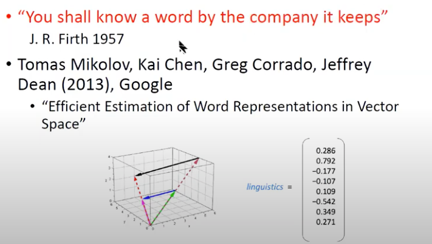
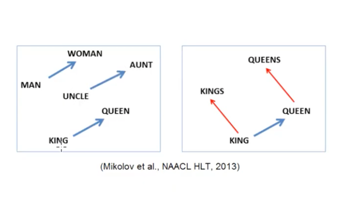
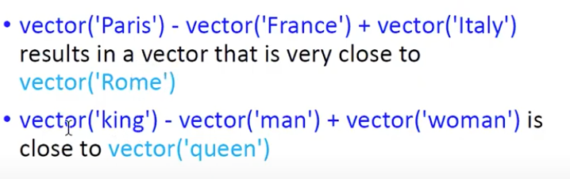
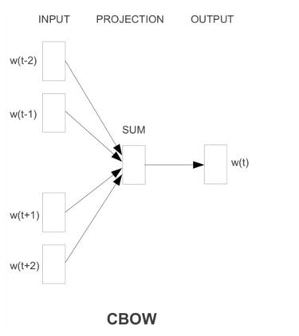
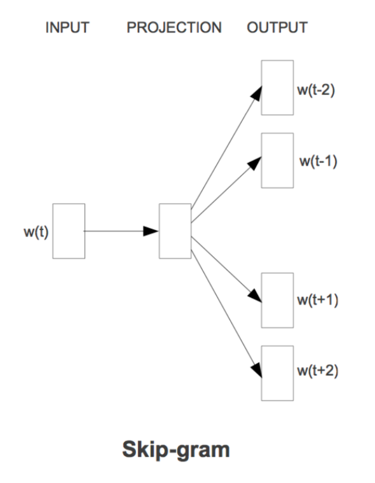

# Word embedding
**워드 벡터를 생성**하는 것을 의미한다. 특정 단어의 의미를 파악하기 위함이다.
이전에는 문서를 CountVectorizer 혹은 TfidfVectorizer로 시켰다. 
하지만, 각 워드 마다 워드 벡터를 형성하여 문장 또는 문서 벡터를 워드 벡터로 구성할 수 있다.  

  
어떻게 단어를 벡터화 시킬 것인가? 정답은 company (companion : 동료)  
즉, 특정 단어의 주변 단어들(문맥)을 파악하여 벡터를 형성한다.  

  
  
단어들을 벡터 공간에 투영시켰더니, 단어 사이들의 관계에 따라 비슷한 방향성을 보였다.  
ex) 상반관계, 단수/복수관계  

# Two main learning algorithms in word2vec
## CBOW (Continuous Bag-Of-Words)  
  
구글의 pagerank 알고리즘과 유사하다. 
특정 단어의 주변 단어들에 대한 워드 벡터가 존재하면, 해당 단어 벡터는 좌측의 단어(w(t-2), w(t-1))와 우측의 단어(w(t_1), w(t+2))의 합으로 이루어진다. 

## Coutinuous skip-gram
  
주변 단어들의 벡터를 기준이 되는 단어 벡터를 통해 구한다.  

