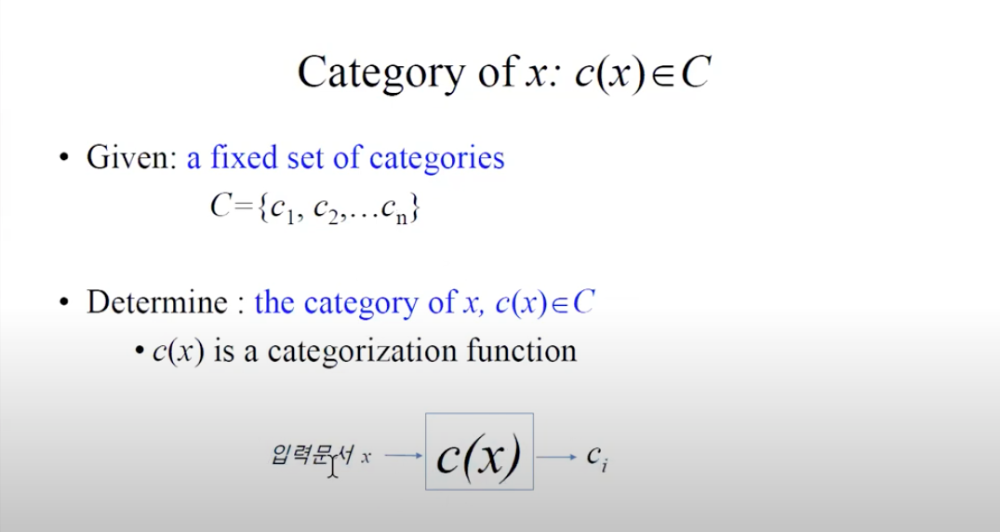
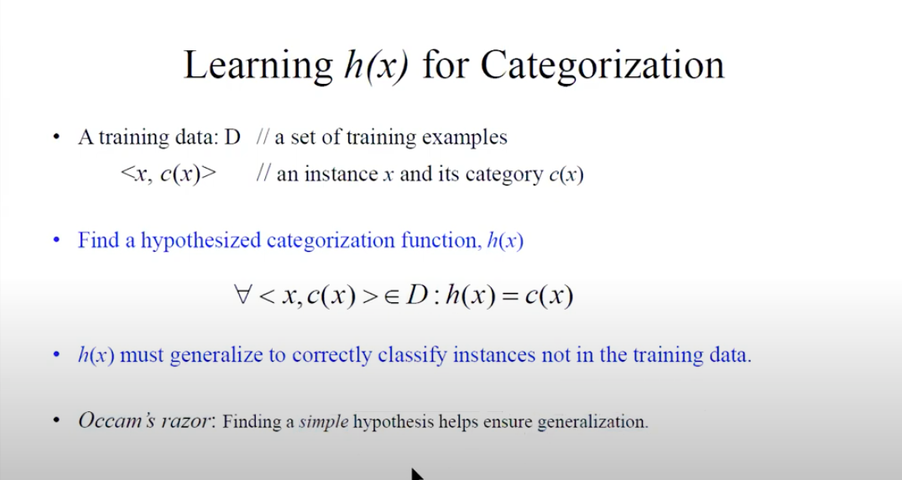
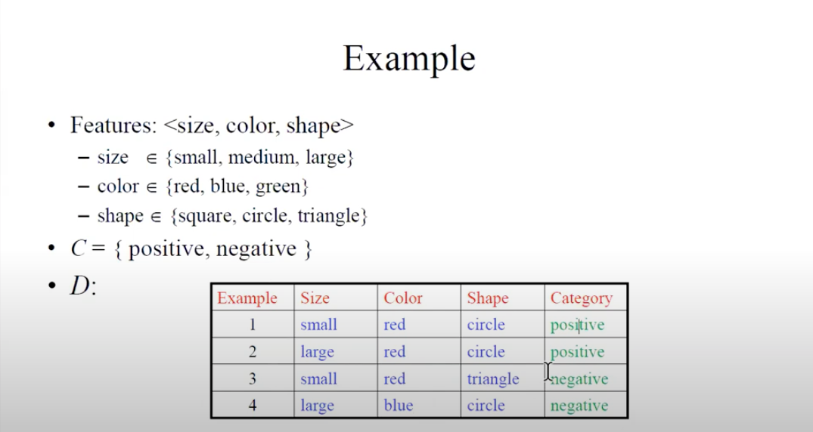
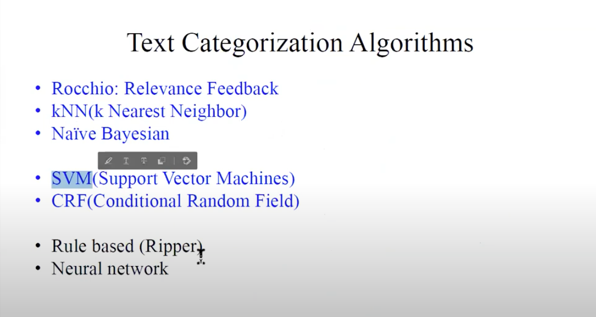
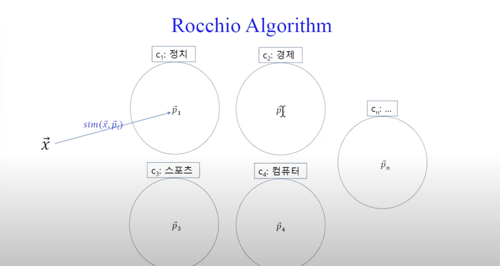
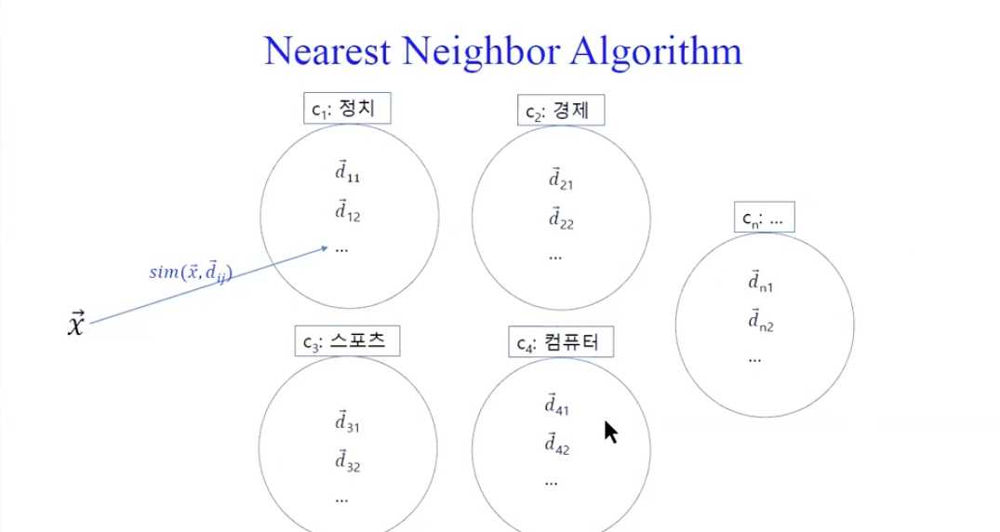

# Text Categorization

## 알아야할 개념
* Classification vs Regression (Classification과 Regression의 차이)
* Binary classification vs Multi-class classification
  - Multi-class classification은 Multi-label classification과 다르다. (Multi-label classification은 하나의 오브젝트에 여러 개의 레이블을 다는 것을 의미.)
* Linear classification vs Non-linear classification  
* Classifier
  - kNN, SVM, Naive Bayes, Decision tree, Random forest, LDA, ..
    
## 이론적 이해
  
c1~cn까지 n개의 클래스를 정의한 후, 학습을 통해 생성된 모델 파일을 통해 데이터 x가 어느 카테고리(ci)에 속하는지 예측(c(x)).

## 학습과정
  
학습 데이터는 라벨(c(x))과 함꼐 주어져야 한다. 예측(h(x))과 정답(c(x))가 일치해지도록 학습을 진행해야 한다.  
* Occam's razor : 일반화를 위해서는 너무 복잡한 피처보다 단순한 피처가 용이하다.

## 예시
  

## 알고리즘 종류

* Rocchio Algorithm
  
  각 클래스에 속하는 문서들의 벡터들을 합하여 **프로토타입 벡터**(Clusster's centroid vector)를 생성한다.
  그 후, 입력벡터 x와 n개의 프로토타입 벡터들 사이의 유사도를 계산하여 가장 유사도가 높은 클래스로 입력벡터 x를 분류하면 된다.
  
위 그림과 같이 입력 벡터(검은색 벡터)를 파란색 클래스로 분류하는 것이 적합함에도 불구하고, 
  빨간색 클래스의 프로토타입 벡터에 더 근접하여 잘못 분류하는 경우가 나타난다.

* Nearest Neighbor Algorithm
  
  각 군집의 프로토타입 벡터를 구하지 않고, 입력 벡터와 모든 벡터 사이의 유사도를 계산한 후, 가장 근접한 벡터의 클래스로 판정한다.
  가장 근접한 벡터 하나만 가지고 판단하는 것은 신뢰도가 낮기 때문에 k개의 벡터를 통해 판정한다.  
  k는 홀수이다. 왜냐하면, 2개의 근접한 벡터가 존재할 때 각각의 벡터가 클래스 A, B에 속해있을때 입력벡터를 어느 벡터로 분류할지 모르기 떄문이다.
