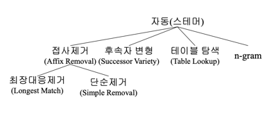
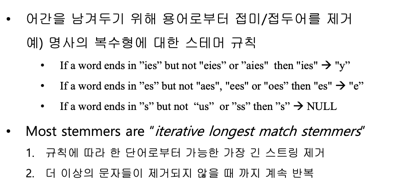
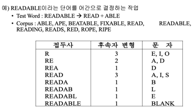
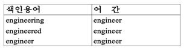
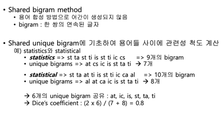
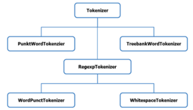

# Stemmer
스테머는 Stem(줄기)를 어원으로 가지고 있으며 말그대로 단어로부터
어근을 추출하는 것을 의미한다.  

대표적으로 Porter Stemmer가 있다.  
Porter Stemming은 영어 사전을 사용하는 것이 아닌 "단순히 접미사의 목록"들만을 가지고 "3가지 조건"들에 의해 어간을 분리한다.
3가지 조건 - Stem conditions, Suffix conditions, Rule conditions

## Stemming의 필요성
스테밍을 하는 이유는 여러가지가 있다. 단어 대신에 단어이 어간(Stem)만 저장하여 색인 파일의 크기를 압축할 수도 있다.
그 밖에도 단어의 원형을 통해 검색하기 위한 목적도 있다.  

## Stemming 방법
  
* 접사 제거 : 하나의 어간을 남기기 위해 용어들의 접두어와 접미어 제거  
    
  
* 후속자 변형 : 본문 내의 글자가 연속으로 나타나는 빈도를 사용  
    
  
* 테이블 검색 : 용어와 어간을 테이블에 저장하여 테이블을 탐색  
    
  
* n-gram : 용어가 공유할 수 있는 도표나 n-gram 수에 기초한 용어들의 합성  

  
# Tokenizer
  
  
* TreebankWordTokenizer
  - 마침표 분리
  - ca / n't 분리

* WordPunctTokenizer
  - 마침표 분리
  - can / ' / t 분리

* PunktWordTokenizer
  - 마침표 분리 x
  - can / 't 분리

* WhitespaceTokenizer
  - 마침표 분리 x
  - can't 분리 x

# Stopwords  
https://en.wikipedia.org/wiki/Stop_word  
중지 단어는 자연어 데이터 처리 전후에 필터링된 중지 목록의 모든 단어이다.  

# Thesaurus  
시소러스는 **동의어 사전**이라고 생각할 수 있다. / "용어들 간의 관계"  
정보 검색에서의 시소러스는 전부 다 같은 동의어가 아닌 "분야에 따라" 다른 시소러스를 사용할 수 있다.  
NT (Narrower Term) : 좁은 의미의 용어 ex) 컴퓨터 -> 노트북, 서버컴퓨터  
BT (Broader Term) : 넓은 의미의 용어 ex) 노트북, 서버컴퓨터 -> 컴퓨터  
RT (Related Term) : 연관된 의미의 용어 ex) 모니터, 키보드, 프린터  
"질의", "색인", "랭킹"할 경우에 활용될 수 있음