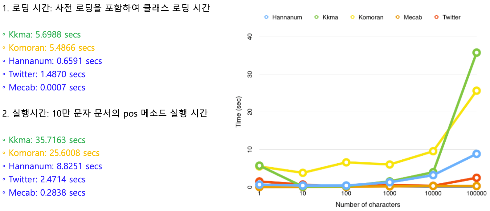

# KoNLPy 형태소 분석기
## 형태소 분석기 종류
* 한나눔 (Hannanum)
* 꼬꼬마 (Kkma)
* 코모란 (Komoran)
* Okt (Open Korea Text) -> 구 Twitter 형태소 분석기
* Mecab
* soynlp
* khaiii

형태소 분석기마다 **공통 메소드 3가지**가 존재한다.
* morphs  
  -> 형태소 반환
* nouns  
  -> 명사 반환
* pos  
  -> 품사 태깅
  
## 형태소 분석기 성능 비교
