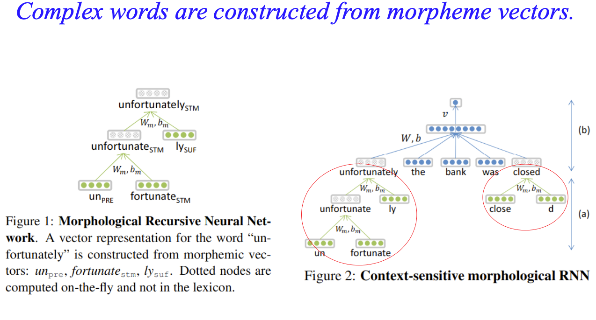
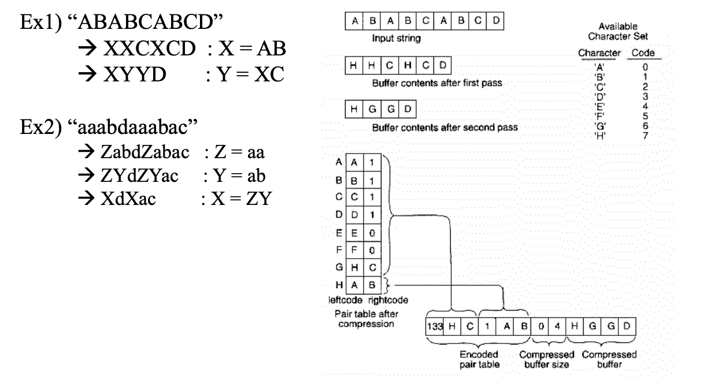
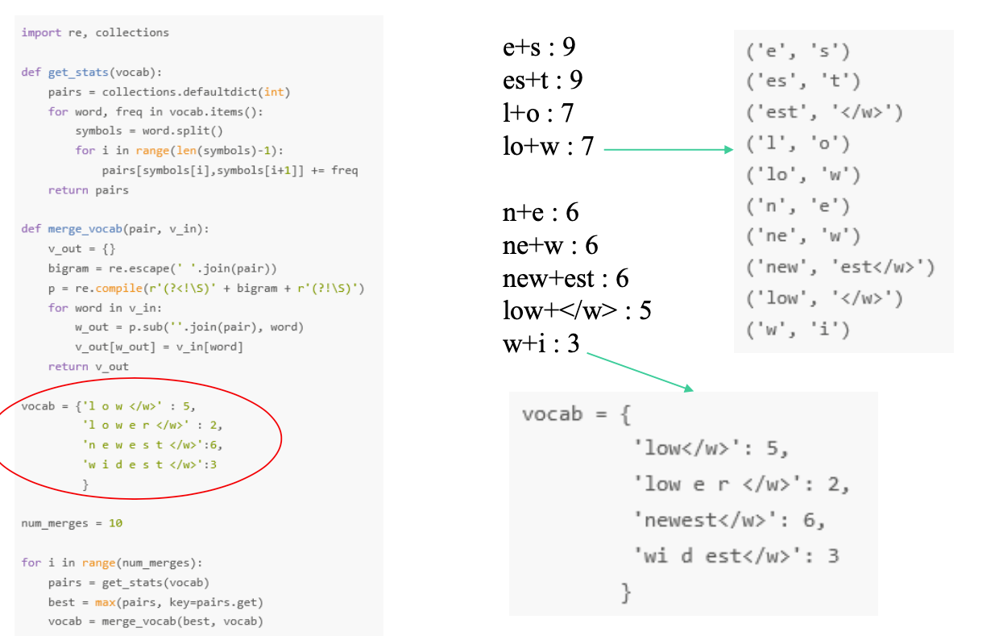
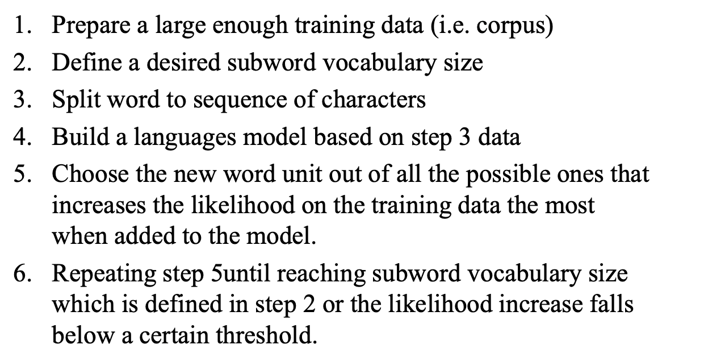

# SentencePiece Tokenizer

## OOV (Out Of Vocabulary) problem
* Rare words and unseen words
* How to solve this problem?
  - Subword - 단어를 서브워드로 쪼개기
    
## Subword Model : Morphological RNN
  
복잡한 단어들은 morpheme vector로부터 구성되었다고 가정.  
Unfortunately -> un + fortunate + ly

## BPE (Byte Pair Encoding)
* Data compression method by Philip Gage (1994)  
  압축 알고리즘으로써 제안됨  
* Most often byte pair -> replaced by a byte  
  자주 사용되는 바이트의 쌍(2 바이트)를 1 바이트로 치환  
  
  
## WPM : WordPiece Model  
단어 단위로 서브워드 토큰나이즈
* Problem : BOW(Bag Of Words) model (https://wikidocs.net/22650)
  - High dimensionality -> too many words
  - Ignore low freq words -> OOV problem
    
* Solution : Word representation by "subword units"

ex)  
Word : **Jet makers feud over seat width with big orders at stake**  
Wordpieces : **_J et_makers_fe ud_over_seat_width_with_big_orders_at_stake**  

언더바(_)는 공백을 의미하며, Jet과 feud가 J+et, fe+ud 서브워드로 분해. (특별한 의미에 의해 분해된 것이 아닌 사용되는 빈도수로 분해됨)  

  
low 5회, lower 2회, newest 6회, widest 3회가 입력단어로 들어온 경우, 가장 많은 빈도수를 가진 두 바이트(두 개의 문자)를 한 바이트로 치환한다.
e+s가 newest에서 6회 widest에서 3회 총 9회가 들어왔으므로 가장 많은 빈도수를 차지한다. e+s를 한 바이트인 es로 치환한다.
다음으로 es+t가 newest에서 9회, widest에서 3회 총 9회가 들어왔으므로 es+t를 est 한 바이트로 치환한다. 이와 같은 과정들을 반복하여 subwords를 생성한다.  

## WPM algorithm
